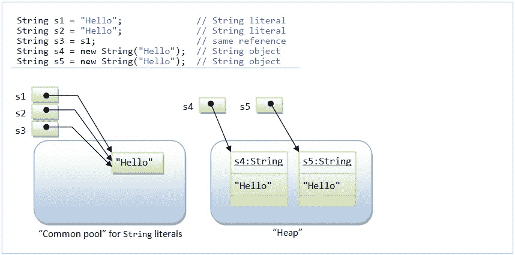
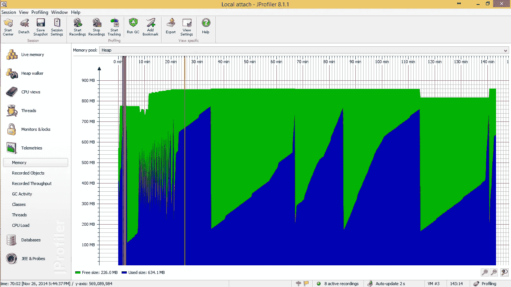

# Java 技巧和窍门

> 原文：<https://medium.com/javarevisited/java-tips-tricks-4b188e70e170?source=collection_archive---------1----------------------->

## 在你进入这个大游戏之前知道这些


照片由[拉杜·弗罗林](https://unsplash.com/@raduflorin?utm_source=medium&utm_medium=referral)在 [Unsplash](https://unsplash.com?utm_source=medium&utm_medium=referral) 上拍摄

Java…所以，所有阅读这篇文章的人都知道，它是世界上最流行的编程语言之一，被设计成可以在任何平台上不间断地运行。无论是 Windows 应用程序、Web 应用程序、移动应用程序、网络应用程序、消费电子产品，Java 无处不在。几十年来，Java 见证了其编程效率的持续发展，并且没有显示出受欢迎程度下降的迹象，因此，对于任何希望作为开发人员拥有稳定未来的人来说，Java 都是值得学习的。无论你是 Java 专家还是新手，熟悉好的编程实践都会节省大量时间。因此，让我们来看看一些 java 技巧和提示，以节省时间，优化和提高代码质量。

## **1。** **字符串优化**

*String* 对象在 Java 中是不可变的，这意味着 *String* 内容一旦创建就不可更改。*字符串*可以由:

*   **将一个*字符串*直接赋值给一个*字符串*引用**
*   **由建造师**

```
String str1 = "I am a string";
String str2 = new String("I am a string via a constructor");
```

第一种方法是创建*字符串*的更好方法。使用构造函数创建*字符串*会浪费大量内存空间，因为对象不共享存储空间，即使对于相同的内容也是如此，而第一个方法确实共享相同内容的存储空间。



字符串文字与字符串对象示例—图片来自 [NTU](https://www.ntu.edu.sg/home/ehchua/programming/java/J3d_String.html)

特别是，避免在循环中使用第二种方法，因为到现在为止，你都可以理解在每次迭代中会创建新的不必要的对象，浪费大量的存储空间。

> 如果*字符串*的内容被频繁修改，请使用 *StringBuffer* 或 *StringBuilder* 类，因为这些类支持可变的*字符串*。

## **2。字符串串联**

在这种情况下，您会看到*字符串连接，*我知道使用'+'运算符连接字符串是大多数人首先想到的事情。但是你知道吗，这并不是做这项工作的最佳和唯一的方法。对此有 4 种方法。

*   **使用'+'运算符**

这是连接多个*字符串*的最简单的方法，但是会占用额外的内存并降低程序的性能。尤其是当你在一个循环中串联多个*字符串*的时候。但这并不意味着你应该避免这种方法。您仍然可以使用它在一条语句中连接*字符串*。

```
String name = "S"+"a"+"m";
```

*   **使用 *concat()* 方法**

这种方法很少使用。性能比使用“+”操作符要好，但仍然较慢。

*   **使用 StringBuffer**

这种方法比上面两种快多了。StringBuffer 对于多线程操作是同步的，这意味着这个方法是线程安全的。由于同步方法，这比 *StringBuilder* 慢。

*   **StringBuilder 类的 Append 方法**

这类似于 *StringBuffer* ，除了 *StringBuilder* 对于多线程操作是不同步的。如果使用 for 循环连接多个字符串，那么应该使用 *StringBuilder* 。

```
String name = 
new StringBuilder().append("S").append("a").append("m").toString();
```

现在，如果我为你总结一下，当从部件创建*字符串*时，使用 *StringBuilder* (单线程)或 *StringBuffer* (多线程)。对于使用 For 循环的*字符串串联*，使用 *StringBuilder* ，对于单语句*字符串串联* *可以使用'+'运算符。*

## **3。** **字符串中单引号和双引号的使用**

简而言之，单引号用于字面 c *hars* ，而双引号用于字面*字符串*。在下面的代码片段中，字母“M”和“Y”将是相应的输出。

```
System.out.println("M");
System.out.println('Y');
```

现在，你觉得下面的代码怎么样？

```
System.out.println("M" +"Y");
System.out.println('M'+'Y');
```

正如你所猜测的，第一个输出是我的，但是第二个输出不是我的，而是 166。添加两个*字符*将返回一个 *int* 。这里，两个*字符*的 ASCII 值将被相加，以返回一个 *int* 。

如果您想知道如何将*字符*连接成*字符串*，有几种方法可以做到。

```
System.out.println('M'+""+'Y');
System.out.println(""+'M'+'Y');
```

以上两种方法都会返回*字符串* MY。此外，还有更多的方法，比如上一节提到的 *StringBuffer* 和 *StringBuilder* 。

## **4。** **浮点 vs 双精度**

这两种数据类型都用来表示浮点数，并且众所周知， *double* 更精确。

强烈建议使用*双*超过*浮动*，特别是如果你不能保证你的数字在*浮动*指定的范围内。

但是注意*双*是有代价的；它很贵，因为它占用的内存空间是浮点型的两倍。

## **5。最好避免大小数和大整数**

也可以用 *BigDecimal* 和***big integer***来表示，这是表示数字的确切方式。****

****如果您正在处理不同精度的浮点数，或者如果您正在处理要求精度的货币，那么 *BigDecimal* 可能是您的选择。但它需要更多的内存，编程算法有点困难，并且比使用双大大降低了所有计算的速度。****

****所以强烈建议避免使用 *BigDecimal* 和*BigInteger* ，只有在没有其他办法的情况下才使用它们。****

## ******6。尽可能使用原语******

****包装类对于将原始数据类型转换成对象有很大的帮助。然而，原语简单、更快，并且是避免开销的简单方法。因此，最好用 *int* 代替 *Integer* 或 *float* 代替 *Float* 。****

```
**//using primitive data type
int num = 5;//using wrapper class
Integer wrapNum = 5;**
```

****此外，由于*包装类*处理对象，比较它们不会像处理原语那样给出想要的结果。这样做的原因是，它最终将比较对象，而不是这些对象中的内容。****

```
**int num1 = 5;
int num2 = 5;Integer wrapNum1 = 3;
Integer wrapNum2 = 3;System.out.println(num1 == num2);
System.out.println(wrapNum1 == wrapNum2);**
```

****第一次打印将是*真*，但是第二次打印将是*假*，因为在那里比较的是对象，而不是值。****

## ******7。** **处理空指针异常******

*****空指针异常*是一个运行时异常，当应用程序试图使用带有空值的对象引用时抛出。****

```
**String fruit;
spellChecker(fruit);**
```

****这里，一个空引用变量作为一个方法的参数被传递。****

```
**positionLocator(null);**
```

****在上面的代码片段中，null 被直接传递给一个函数。在这两种情况下，很有可能抛出 *NullPointerException* 。****

****这个异常可以通过使用 *if-else 条件*来修复。****

```
**public class NullPointerExceptionExample{
    public static void main(String args[]){
        String fruit = "apple";
        positionLocator(null);
}//Using an if-else condition
    static void positionLocator(String fruit){
        if(fruit != null){
           System.out.println("Second character: "+fruit.charAt(0));
        }
        else {
           System.out.println("NullPointerException thrown");
        }
    }}**
```

## ******8。使用分析器优化你的代码******

****编写代码并编译它以获得所需的输出是不够的。我们必须尽可能以最佳性能编写代码。为了实现这一点，最好有一种方法来检查代码背后发生了什么，比如，内存是如何分配的，需要改进的地方，以及使用一种编码方法对另一种编码方法的影响。为此，我们可以使用 *Java Profilers* **。******

*****Java Profiler* 是一个在 JVM 级别监控 Java 字节码结构和操作的工具。使用这些分析器，我们可以找出程序中的性能、内存使用、内存泄漏等，然后我们可以很容易地找出代码中需要更改、优化或删除的内容。****

****有许多可用的剖析器，如 *JProfiler、XRebel、*和 *New Relic* ，但这些剖析器都有独特的特征，更适合性能调试的某个方面。因此，应该根据所需的分析级别来选择分析器，为了获得更好的结果，可以组合使用多个分析器。****

********

****应用程序的内存分配—来自[堆栈溢出](https://stackoverflow.com/questions/27150682/jprofile-how-to-indentify-why-this-memory-in-application-keep-incresing-in-its)的图像****

****你可以在找到更多关于 *Java Profilers* [的信息。](https://stackify.com/java-profilers-3-types/)****

## ******9。数组与数组列表******

****这两者的主要区别是*数组*是固定大小的，所以一旦你创建了*数组*你就不能改变它，但是*数组列表*不是固定大小的。您可以创建*数组列表*的实例，而无需指定其大小。因此，如果你创建一个 *ArrayList* 的实例而没有指定它的大小，Java 将创建一个默认大小的 *ArrayList* 的实例。****

****一旦一个*数组列表*满了，它会调整自己的大小。事实上， *ArrayList* 是由数组内部支持的。因此，当调整一个*数组列表*的大小时，它会稍微降低性能，因为旧的*数组*的内容必须被复制到新的*数组*中。****

****同时，在创建一个*数组*时，必须直接或间接地指定它的大小。另外*数组*可以存储原语和对象，而*数组列表*只能存储对象。****

****我希望这篇文章对你有所帮助。希望尽快带来更多文章。感谢您的阅读。****

## ****资源****

*   ****[*Java 性能调优自 Stackify*](https://stackify.com/java-performance-tuning/)****
*   ****[*Java 编程最佳实践和技巧来自 JavaCodeGeeks*](https://www.javacodegeeks.com/2015/06/java-programming-tips-best-practices-beginners.html)****
*   ****[*Java 字符串是从*](https://www.ntu.edu.sg/home/ehchua/programming/java/J3d_String.html)*[*【NTU】*](https://www.ntu.edu.sg/home/ehchua/programming/java/J3d_String.html)*****
*   *****[*如何解决 edpresso 的 NullPointerException*](https://www.educative.io/edpresso/how-to-resolve-the-javalangnullpointerexception)*****
*   *****[*Java 中串接字符串的 4 种方法来自 Java67*](https://www.java67.com/2015/05/4-ways-to-concatenate-strings-in-java.html)*****