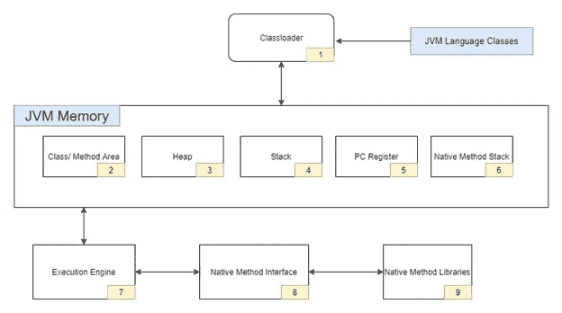
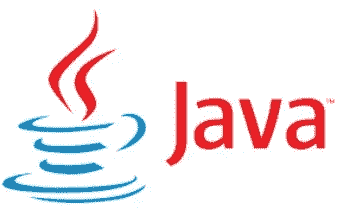

# Java 虚拟机及其体系结构

> 原文：<https://medium.com/javarevisited/java-virtual-machine-and-its-architecture-2d8de5599500?source=collection_archive---------3----------------------->

## Java 虚拟机

JVM 可以简单地称为为 Java 及其应用程序提供运行时环境的引擎。JVM 被认为是 JRE (Java 运行时环境)的一部分。它以将 java 代码转换成字节码，然后将字节码解释成机器语言的过程而闻名。

然而，java 编译器遵循将在虚拟机中使用的代码，该虚拟机也称为 [Java 虚拟机](https://www.java67.com/2013/02/difference-between-jit-and-jvm-in-java.html)，不像其他编程语言，编译器为特定系统产生机器代码。

Java 应用程序也称为“一次编写，随处运行”，因为 Java 代码可以在一个系统中编写，并且能够在许多支持 Java 的系统中运行，而无需借助 JVM 进行任何更改。

Java JVM 是平台相关的(Mac JVM、Linux JVM、Windows JVM)，而 Java 代码是平台无关的。

## JVM 架构

JVM 的内部架构可以分为 3 个主要部分，

[类装载器](https://javarevisited.blogspot.com/2021/05/java-classloader-interview.html)

存储区

执行引擎

## 类加载器

这被认为是 [JVM](/javarevisited/7-best-courses-to-learn-jvm-garbage-collection-and-performance-tuning-for-experienced-java-331705180686) 的一个子系统，它负责在程序运行时加载类文件。

Java 中有三个内置的类加载器，

引导类装入器

扩展类加载器

系统/应用程序类加载器

这些执行三个主要功能。

**装载**

类加载器读取*。类*文件，并生成所需的二进制数据，这些数据存储在方法区中。它还存储详细信息，

加载的类及其直接父类的完全限定名。

如果生成了[。类文件](https://javarevisited.blogspot.com/2012/05/10-points-about-class-file-in-java.html)是一个类、接口或枚举

变量、修饰符和方法信息。

加载*后。class*file JVM 创建一个 Class 类型的对象来表示堆[中的这个文件](https://javarevisited.blogspot.com/2013/01/difference-between-stack-and-heap-java.html)。

**链接**

所有的验证、准备和决议都在这里完成。验证过程确保了文件的正确性。

准备是 JVM 为类变量分配内存并在内存中分配默认值的过程。

解析是将符号引用转换为直接引用的过程。这是通过遍历方法区域来定位被引用的实体来完成的。但是，该功能是可选的

**初始化**

这里所有的静态变量和块都被赋予代码中提到的值。该代码从上到下分层执行。

## JVM 内存

JVM 内存主要由以下扇区组成，

方法区域

[堆](https://javarevisited.blogspot.com/2011/05/java-heap-space-memory-size-jvm.html#axzz5SDsAfcC8)

[书库](https://www.java67.com/2016/10/difference-between-heap-and-stack-memory-in-java-JVM.html)

PC 寄存器

本机方法堆栈

**方法区**

在这里可以找到所有的类级别信息(类名、[类变量](https://www.java67.com/2016/05/difference-between-static-and-nonstatic-member-variable-in-java.html)、直接父类名等)。).值得注意的是，每个 JVM 只有一个方法区域，因此它被认为是内存中的共享资源。

**堆**

所有与对象相关的信息都存储在这里。这种内存也是公用的，因此在多个线程之间共享。

**堆栈**

这个商店的[局部变量](https://javarevisited.blogspot.com/2012/02/difference-between-instance-class-and.html)和部分结果。每个线程在创建时都有自己的运行时堆栈。每当调用一个方法时，就会创建一个新的框架，并且该方法的所有局部变量都存储在相应的框架中。当方法调用完成时，这将被删除。这不是共享资源。

**PC 寄存器**

也称为程序计数寄存器，保存当前正在执行的 JVM 指令的当前地址。

**本机方法堆栈**

这包含了应用程序中使用的所有本机方法，正如名称所暗示的那样。

## 执行引擎

这将执行*。类*文件通过逐行读取字节码，利用其数据和信息存在于各个内存区域，并执行指令。它可以进一步分解为 3 个部分，

**解释器**

这种方法逐行解释代码并执行，但是，如果一个方法被调用多次，它需要再次解释，这被认为是它的一个缺点。

**实时编译器**

这被用作对上述问题的补救，其中这通过编译整个字节码并将其改变为本机码来提高解释器的效率，因此当存在重复方法调用时，JIT 编译器将提供该部分的本机码，从而不需要重新解释。

**垃圾收集器**

这用于销毁或清除未引用的对象。

## Java 本地接口

JNI 是一个框架，它提供了与用其他语言编写的其他应用程序进行通信的接口。它允许运行在 JVM 中的 [Java 代码](https://www.java67.com/2020/03/how-to-write-clean-code-using-java-8.html)被库和本地应用程序调用。

