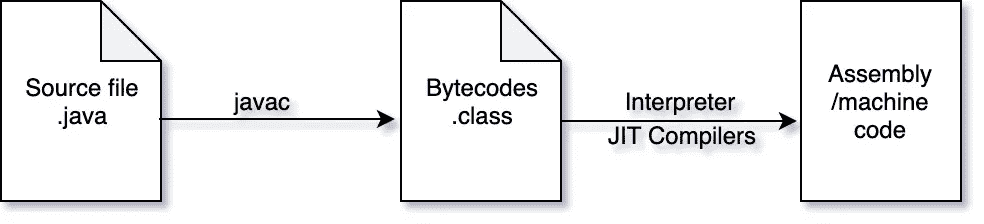

# Java 虚拟机(JVM)内部机制，第 2 部分—类文件格式

> 原文：<https://medium.com/javarevisited/java-virtual-machine-jvm-internals-part-2-class-file-format-7752e5f7dbbe?source=collection_archive---------0----------------------->

在这一系列文章中，我将讨论 Java 虚拟机是如何工作的。在第 1 部分中，我们看了 Java 虚拟机的类加载器子系统。在这篇文章中，我们将讨论类文件格式。

我们已经知道，所有用 Java 编程语言编写的源代码都是先用 Java 开发工具包中提供的 *javac* 编译器编译成[字节码](https://en.wikipedia.org/wiki/Java_bytecode)(Java 虚拟机的指令)。字节码以二进制文件格式保存，称为*类*文件格式。这些类文件(字节码)然后由 Java 虚拟机的类加载器组件动态地(仅在需要时)加载到内存中。在简单的*解释器*模式下，Java 执行引擎在主机 CPU 上逐个执行这些字节码。



Java 源代码编译

> **每个文件都带有。java 扩展编译成至少一个。类文件。有一个。源代码中定义的每个类、接口和模块的类文件。这也适用于嵌套类或接口。**

**注**:为简单起见，文件带有。类扩展在这里叫做类文件。

让我们写一个简单的程序

在这个文件上运行 *javac* 会产生以下文件。

```
ClassOne$StaticNestedClass.class
ClassOne.class
ClassTwo.class
InterfaceOne.class
```

如您所见，为源文件中定义的每个类、接口创建了一个类文件。

# 类文件里面有什么？

类文件是二进制文件格式。信息通常被写到类文件中，在连续的信息段之间没有空格或填充，所有内容都在字节边界上对齐。所有 16 位和 32 位量都是通过分别读取两个和四个连续的 8 位字节来构造的。

类文件包含以下信息

***幻数*** :每个类文件的前四个字节总是 0xCAFEBABE。这四个字节将类文件格式与其他文件格式区分开来。

***主版本和次版本*** :类文件的第二个四字节包含主版本号和次版本号。主版本号和次版本号共同决定了类文件格式的版本。如果一个类文件有主版本号 M 和次版本号 M，我们把它的类文件格式的版本表示为 M.m。

每个 JVM 都有一个可以加载的最大版本，JVM 会拒绝更高版本的类文件。例如，Java 11 支持从 45 到 55 的主要版本，而 Java 12 支持主要版本 45..56

***常量池*** :表示字符串常量、类和接口名、字段名、方法名以及类文件结构及其子结构中引用的其他常量的结构表(异构)。这个常量池的每个元素都以一个单字节标记开始，该标记指定了表中该位置的常量类型。根据常量的类型，下一个字节可以是常量值或对池中另一个元素的引用。

***访问标志*** :标志列表，告诉这个类或接口是公共的还是私有的访问，这个类是最终的还是允许扩展的。JVM 规范文档中定义了各种标志，如 ACC_PUBLIC、ACC_FINAL、ACC_INTERFACE、ACC_ENUM 等。

***该类*** :指常量池中的条目。

***超类*** :指常量池中的条目。

***接口*** :统计该类实现的接口数。

***字段计数*** :统计该类或接口中字段的个数。

***字段*** :字段计数后是一个变长结构表，每个字段一个，描述字段类型和名称(引用常量池条目)

***方法计数*** :统计类或接口中方法的数量。此计数仅包括由该类显式定义的方法，不包括任何可能从超类继承的方法。

***方法*** :跟随方法计数的是方法本身。每个方法的结构包含关于该方法的几条信息，包括方法描述符(其返回类型和参数列表)、方法局部变量所需的字数、方法操作数堆栈所需的最大堆栈字数、方法捕获的异常表、字节码序列和行号表。

***属性计数*** :统计该类或接口或模块中的属性个数。,

***属性*** :属性计数之后是描述每个属性的表格或变长结构。例如，一个属性是源代码属性；它显示了编译这个类文件的源文件的名称。

虽然类文件格式不是直接可读的，但是 **JDK 提供了一个名为 *javap*** 的工具，它可以反汇编类文件并以可读格式输出其内容。

让我们写一个简单的 Java 程序，如下所示

让我们使用将产生 HelloWorld.class 文件的 *javac* 命令来编译这个程序，然后使用 *javap* 工具来分解这个 HelloWorld.class 文件。在 HelloWorld.class 上使用带有-v (verbose)的 *javap* 会产生以下输出

在这里你可以看到这个类是可公开访问的，它的常量池有 37 个条目，有一个属性(底部的源文件)，实现了两个接口(Serializable，Cloneable)，有 0 个字段和 2 个方法。

您可能想知道源代码中只有一个静态 main 方法，但是类文件却说有两个方法。嗯，记住 Java 编程语言中的默认构造函数，它是由 *javac* 编译器添加的无参数构造函数，其字节码在输出中也是可见的。构造函数被视为方法。

你可以在这里阅读更多关于 ***javap*** 工具[。](https://docs.oracle.com/en/java/javase/12/tools/javap.html)

> 提示:您可以使用 *javap* 工具来看看 lambdas 与匿名内部类有什么不同。

在本系列的下一部分，我将讨论运行 JVM 实例的内存布局。

学习 Java 的其他**有用资源**你可能喜欢的
[学习 JVM 内部的前 5 门课程](https://javarevisited.blogspot.com/2019/04/top-5-courses-to-learn-jvm-internals.html)
[从头开始学习 Java 的 10 门免费课程](http://www.java67.com/2018/08/top-10-free-java-courses-for-beginners-experienced-developers.html)
[深入学习 Java 的 10 本书](https://medium.freecodecamp.org/must-read-books-to-learn-java-programming-327a3768ea2f)
[10 个工具每个 Java 开发者都应该知道的](http://www.java67.com/2018/04/10-tools-java-developers-should-learn.html)
[学习 Java 编程语言的 10 个理由](http://javarevisited.blogspot.sg/2013/04/10-reasons-to-learn-java-programming.html)
[2019 年 Java 和 Web 开发者应该学习的 10 个框架](http://javarevisited.blogspot.sg/2018/01/10-frameworks-java-and-web-developers-should-learn.html)【 2019 年更好的 Java 开发者
[2019 年要学习的 5 大 Java 框架](http://javarevisited.blogspot.sg/2018/04/top-5-java-frameworks-to-learn-in-2018_27.html)
[每个 Java 开发者都应该知道的 10 个测试库](https://javarevisited.blogspot.sg/2018/01/10-unit-testing-and-integration-tools-for-java-programmers.html)