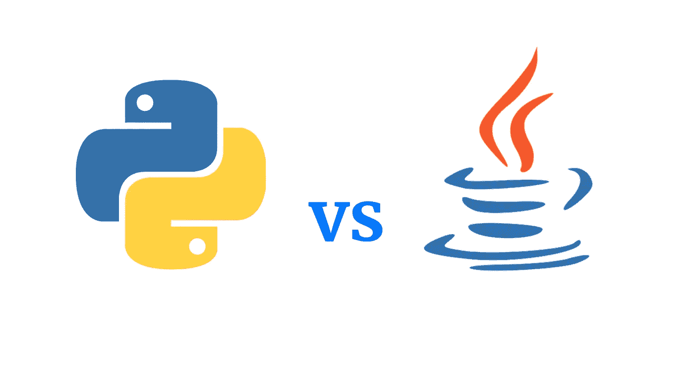

# Java vs Python:2023 年的关键区别是什么？

> 原文：<https://medium.com/javarevisited/java-vs-python-what-are-the-key-differences-in-2023-6eeea01a5a2f?source=collection_archive---------3----------------------->

Python 和 Java 是两种最古老和最受尊敬的编程语言。这两种语言已经在 web 开发行业存在了超过 25 年，随着时间的推移，它们都为开发人员提供了创建时尚网站和智能应用程序的工具。

由于它们的目的性和功能性，它们已经开拓了自己的市场，并且越来越受欢迎。但是语言的战争又一次迫使我们只能选择一种语言。问题是，这两种语言都足以满足现代网络行业的多样化需求，这使得选择过程更加艰难。

但是通过了解架构框架、语法、安全性和其他技术方面的差异，开发人员将能够做出实际的选择，最大限度地满足他们和利益相关者的目的。

所以我们在这里帮助你，给你关于这两种语言的基本而重要的信息，这样你可以自己做决定。

# **Java 是什么？**

[Java](/javarevisited/10-best-places-to-learn-java-online-for-free-ce5e713ab5b2) 是一种基于类的通用高级编程语言，由詹姆斯·高斯林创建。它的语法与 [C 和 C++](/javarevisited/10-advanced-c-books-and-courses-for-experienced-programmers-a90c3942471a) 有很大的相似性，但是包含更少的低级工具。该语言独立于平台，这意味着开发人员可以在任何平台上运行编译后的 Java 代码，而无需重新编译。

这种平台独立性赋予了 Java 著名的 WORA 特性，即一次编写，随处运行。它支持多种编程范例，包括命令式、并发式和反射式。

Java 最大的优势之一是在运行时提供动态功能，如代码修改和反射，这是传统编译语言所没有的。

# **Python 是什么？**

像 Java 一样， [Python](/javarevisited/7-best-python-online-courses-for-beginners-to-learn-programming-abe12cecb1ad) 也是一种通用的高级编程语言，它也支持不同的编程原则，包括基于类的、过程的和函数的。Python 的优势在于编码简单。人们常说 [Python](https://javinpaul.medium.com/best-python-books-a93d1a0d842d) 的代码像英语一样易读。

Python 为开发人员提供了一个广泛的标准库，使得开发人员可以更容易地编写和实现程序和算法，而不会有很多麻烦。也许这就是为什么它经常被认为是人工智能最理想的语言之一的原因。

除了代码的可读性， [Python](/javarevisited/how-to-learn-python-in-2022-books-online-courses-and-projects-4a854ab5694e) 还因其缩进、引用计数和列表理解而闻名，这些都有助于清晰和逻辑的编码。

# **Java 与 Python 的主要区别**

现在我们对这两种语言有了基本的了解，让我们来看看两者之间的主要区别。

## **#1 语法**

与 Java 相比，Python 的语法不那么复杂和容易理解，而且易于记忆和应用。其简单的语法使得代码可读性更好。尽管缩进很重要。Java 的语法更严格。这意味着你不能忘记哪怕是最小的事情。例如，如果你放错了花括号或者忘记了标点符号，那么你的代码就会抛出错误。

## **#2 打字**

Java 的类型规则是安全的、静态的和指定的，而 Python 有一个动态的、强大的和渐进的类型规则。

## **#3 编码**

与 Java 相比，Python 因其较少的代码行而受到开发人员的喜爱，因此在这一点上 Python 无疑是引人注目的。例如，对于一个简单的显示消息， [Python](/swlh/5-free-python-courses-for-beginners-to-learn-online-e1ca90687caf) 只有一行代码，而 Java 有四行代码。

## **#4 框架的可用性**

在这个特性中，Java 有更好的基础，因为它有更多的框架可以使用，最受欢迎的是 [Grails](/javarevisited/6-best-resources-to-learn-groovy-and-grails-for-java-developers-18c04e88fa8a) 、 [Spring](/javarevisited/top-10-free-courses-to-learn-spring-framework-for-java-developers-639db9348d25) 、Play 和 [Hibernate](/javarevisited/top-5-hibernate-online-training-courses-for-beginners-and-advance-java-programmers-469460596b2b?source=---------9------------------) 。另一方面，Python 提供给开发者的框架更少。最流行的 Python 框架是 Dash、 [Django](/javarevisited/7-free-courses-to-learn-django-framework-in-python-bd50acc8484) 、 [Flask](/javarevisited/5-best-python-flask-courses-for-beginners-2f262f8e23da) 和 Falcon。

## **#5 申报**

Java 需要开发人员声明数据类型，而 Python 不需要任何类型的变量声明，因为它是动态类型的。这种打字也称为鸭式打字。

## **#6 数据库连接**

Java 在这一点上击败了 Python，因为它的名为 [JDBC](/javarevisited/top-5-courses-to-learn-jdbc-and-database-connectivity-for-java-developers-free-and-best-of-lot-7945156fcc3?source=---------9------------------) (Java 数据库连接)的 API 被广泛用于连接数据库系统。Python 的数据库可访问性比 Java 弱。这可能是为什么大型企业通常更喜欢 Java 而不是 Python 的原因。

## **#7 速度**

就速度而言，Java 恰好比 [Python](/javarevisited/10-best-python-3-courses-on-udemy-ddd4e3ec5dbf) 快。这是因为 Python 使用了解释器，数据类型通常在运行时确定，从而降低了代码的执行速度。

## **#8 实用灵巧**

实际灵活性指的是这两种编程语言的足智多谋。Python 总是设法让自己跟上即将到来的趋势和技术，这导致了它的流行。例如，它一直在灌输 DevOps 运动，以快速开发应用程序。

另一方面，Java 由于其静态类型、自内存管理以及对不同 ide 和安全系统的巨大支持，一直享有重构支持。所有这些都使 Java 成为一个更可靠的工作平台。

## **#9 便携性**

就可移植性而言，Java 比 Python 更好，因为它很容易移植，因为 JVM 可以跨所有平台获得。

## **#10 学习曲线**

很明显，掌握 Java 比 Python 更难，因为前者有更严格的语法和静态类型。为了成为一名 Java 专业人员，开发人员当然需要记住所有的细节，否则就会直接导致语法错误。

然而，Python 更容易学习，但是掌握它也需要实际的训练和经验。

## **最后的想法**

看完所有的点，得出 Python 和 Java 各有利弊的结论不会错。虽然 Java 因其快速、安全和可移植性而成为首选，但 Python 因其简单明了而备受青睐。

这两种语言都预示着美好的未来，但是尽管 Java 因其出色的特性而站稳了脚跟，Python 也因其可伸缩性和灵活性而加快了步伐。但是如果一个人必须在 Java 和 [Python 开发服务](https://www.hiddenbrains.com/python-web-development-company.html)之间做出选择，那么这真的取决于所讨论的软件或应用程序。