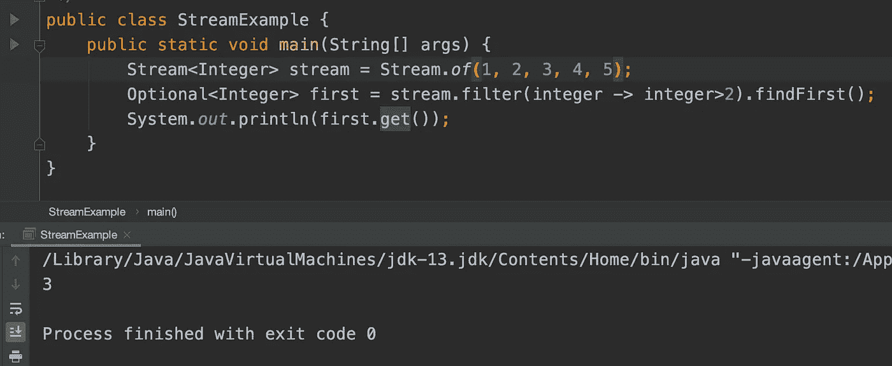
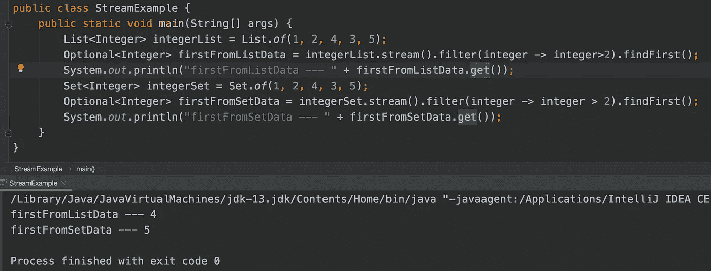
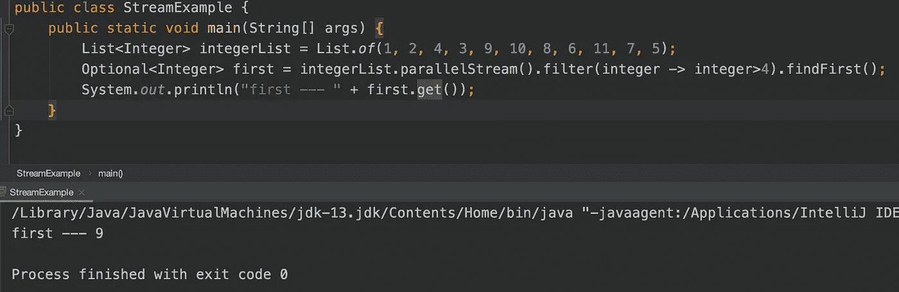
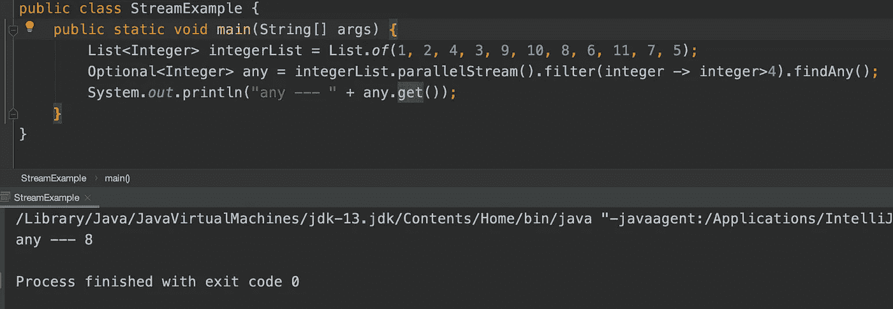
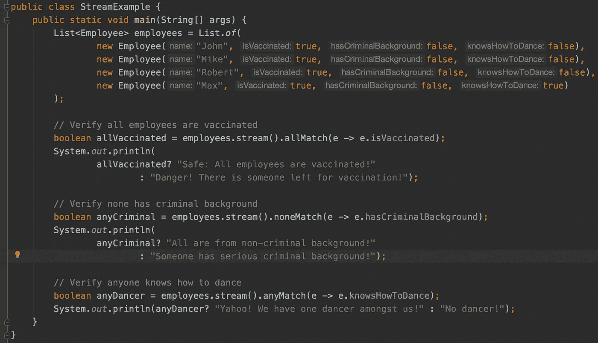

# Java8 流的一些有用的方法

> 原文：<https://medium.com/javarevisited/java8-streams-some-useful-methods-fa377104a775?source=collection_archive---------3----------------------->

读者你好，

今天我写的是 Java 8 stream 的一些有用的操作。用这些方法处理数据可能是有效的。顾名思义，它们非常容易理解，不言自明。

第一种类型的方法可用于从流中获取第一个或任何元素，该元素匹配以谓词形式提供的要求。例如，如果一个人有一个雇员名单，并想找到第一个工资超过 50000 英镑的雇员，或者找到任何来自 XYZ 市的雇员，那么这些方法可能是有用的(请在阅读本文后，尝试自己为这种情况编写一个程序，这可能是一个很好的家庭作业:P)。

1.  **findFirst()方法**

此方法将从流中返回包装在可选中的第一个对象。从下面的例子可以很容易理解。

注意，在使用上述方法时，应该注意数据源的类型，无论它是否是有序的。如下例所示(为了更好地演示，我改变了元素的顺序；) )，firstFromListData 将始终为 4，而在 firstFromSetData 的情况下可能会有所不同，因为 Set 是无序的。在代码下面运行多次将为无序数据源生成不同的输出。

因此，当数据源是有序的(例如，列表)时，可以预期确定性行为。创建的流是顺序的还是并行的无关紧要。

**2。findAny()方法**

这个方法类似于 findFirst，但是它可以从流中返回任何元素，这里当元素的顺序不那么重要并且只是从数据中寻找任何元素时，应该使用这个方法。下面的示例生成了 8 作为输出，但是它可能会根据您机器上的内核而有所不同。

第二种类型的方法是当人们想要对数据进行验证或确认时使用的。基于以谓词形式提供的一组指令，它将总是以布尔值 true/false 返回。例如，一个人有一份雇员名单，他想知道所有人都登记了社会安全号码，所有人都接种了疫苗，没有一个人有犯罪背景，或者想知道任何雇员知道如何跳舞！在这种情况下，下面的方法会很有用。让我们看看代码视图。

我们有一个非常简单的员工 POJO，请随时更新并亲自尝试。

有四名员工都接种了疫苗，没有犯罪背景，马克斯知道如何跳舞。

**1。allMatch()方法**

顾名思义，它将验证所有元素的条件都匹配，在我们的示例疫苗接种标志中。如果任何元素与条件不匹配，那么它将返回 false。

**2。noneMatch()方法**

这与上面的方法相反，这里没有一个元素应该与条件匹配，在我们的例子中是犯罪背景标志。如果有任何元素符合条件，那么它将返回 false。

**3。anyMatch()方法**

最后，我们只是想随机检查任何元素匹配提供的条件，例如这里谁知道跳舞。如果有任何元素符合条件，那么它将返回 true。

下面是基于数据的样例输出，自己试着修改检查！

作为参考，这里是完整的 java 程序。

 [## Java-examples/stream example . Java at main harshalmistry/Java-examples

### 在 GitHub 上创建一个帐户，为 harshalmistry/java-examples 开发做贡献。

github.com](https://github.com/harshalmistry/java-examples/blob/main/src/main/java/StreamExample.java) 

这个话题到此为止。

我感谢你的时间和快乐的学习！

您的评论对我来说非常有价值，如果您观察到了任何改进或任何虚假信息，请提出建议。如果你喜欢我的工作，我会很高兴有你的以下要求:)