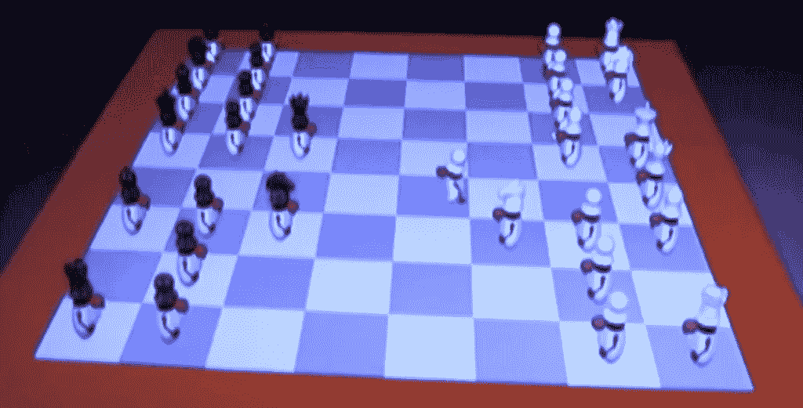
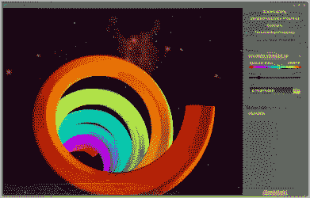
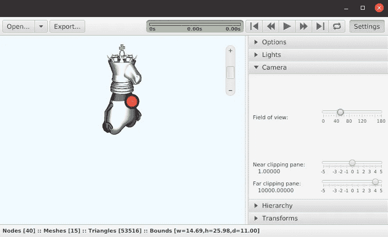
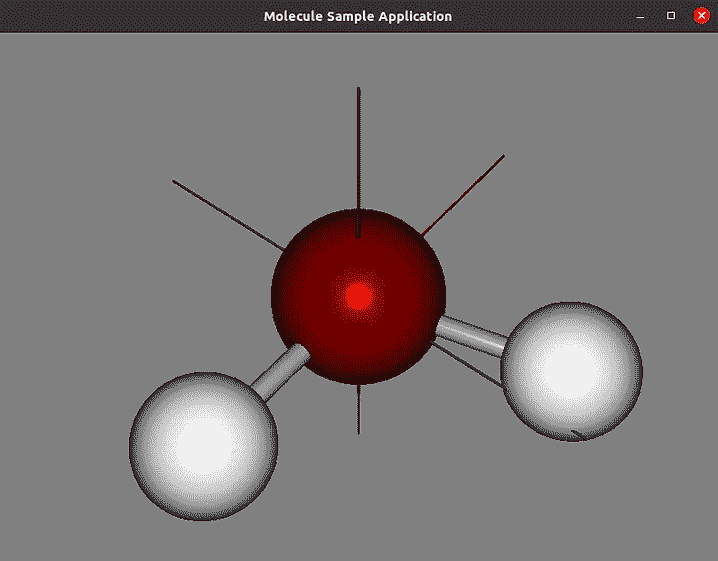

# JavaFX 3D:历史回顾和一些实验

> 原文：<https://medium.com/javarevisited/javafx-3d-a-look-back-through-history-some-experiments-foojay-3dad4dc8fc20?source=collection_archive---------1----------------------->

在我的虚拟会议演讲[“Java 和 JavaFX 在 Raspberry Pi 上”](https://webtechie.be/post/2020-10-21-apacouc-java-and-javafx-on-raspberry-pi/)之后，我与一些过去从事 JavaFX 3D 工作的人取得了联系，我很好奇他们在 Raspberry Pi 上会有什么表现。

只有一个办法可以知道！让我们在历史书上搜索和实验吧！

> *本帖最初分享于* [***foojay.io、***](https://foojay.io/blog/javafx-3d-a-look-back-in-history-and-some-experiments/) ***“一个 OpenJDK 的朋友的地方”*** *。更多 Java 相关新闻请关注 Twitter 上的*[*@ foojay 2020*](https://twitter.com/foojay2020)*。*

# JavaFX 3D 的历史

JavaFX 是用于富客户端应用程序的下一代开源 Java 库。JavaFX 从关注 2D UI 元素开始。

但是到了 JavaFX 8，显然某些用例需要 3D 图形。例如，Oracle 的一个客户需要 3D 图形来可视化其运输集装箱的三维布局:

JavaFX 中 3D 图形功能的工作进展到了可以用 [JavaFX](/javarevisited/6-free-courses-to-learn-servlet-jsp-and-java-fx-in-2020-best-of-lot-720201c84f63) 制作 3D 角色动画的地步。在 JavaOne 大会 2013 的主题演示中，展示了一个带有动画公爵棋子的棋盘。这个动画演示是与一个机械臂一起展示的，这个机械臂控制着这些杜克国际象棋棋子的 3D 打印版本，从同一个服务器控制。



在接下来的 2014 年的展示中，你可以看到杜克大学的幕后故事。

正如美国宇航局的这个很酷的视频所显示的，甚至还有“在太空中”的 JavaFX。这是 DevNexus 2018 上展示的“JavaFX 深空轨迹浏览器”的演示。

当 JavaFX 在 2018 年被 Oracle 用于版本 11 时被带出 JDK，[glouhq](https://gluonhq.com/)成为在 [OpenJFX 项目](https://openjfx.io/)内进一步开发它的主要贡献者之一。从那以后，他们不断发布新版本，发布周期与 OpenJDK 相同，都是 6 个月。每个版本都带来了新的特性、改进以及错误和安全修复。JavaFX 3D 仍然受支持，并且随着框架的不断改进，Java FX 3D 变得更加强大。

对于即将到来的 open jfx 16 版本，正在开发对运行在 ARM 处理器上的嵌入式设备(如 Raspberry Pi)的更好支持，更好地集成了[直接渲染管理器(DRM)](https://en.wikipedia.org/wiki/Direct_Rendering_Manager) 。

JavaFX 3D 的另一个有价值的资源可从 [GitHub 项目“fxyz 3D”](https://github.com/FXyz/FXyz)获得。这允许您创建许多不同的 3D 自定义形状，甚至有一个 GUI 应用程序，允许您可视化所有的样本和不同的选项。



# 我们来实验一下！

# 代码

在这篇文章中，我收集了这个 [GitHub JavaFX3D 项目](https://github.com/FDelporte/JavaFX3D/)中的一些现有资料。我没有使用原来的库，而是对它们进行了一些修改，以使用 Maven，所以你可以很容易地开始。

## 公爵

在 [GithHub OpenJDK 项目](https://github.com/openjdk)中，你不仅可以找到 JDK 的源码，还可以找到[多种不同格式的公爵](https://github.com/openjdk/duke)！

对于这个实验，我从“象棋公爵”目录中复制了文件，因为这里有多个 3D 图像。

## 分子样本应用程序

这个应用程序在 JavaFX 3D 中渲染一个水分子。

## 3DViewer

这个应用程序可以加载不同的 3D 图像文件格式，并将其可视化。



# 在 PC 上构建和运行

让我们试试这一切是否能在装有 OpenJDK 11 的 Linux PC 上运行。我们将结合目前 Gluon 提供的最新 JavaFX 来使用这个。

*   从 https://gluonhq.com/download/javafx-16-ea-sdk-linux/[下载 Java FX JDK](https://gluonhq.com/download/javafx-16-ea-sdk-linux/)
*   将 zip 文件解压缩到例如/home/{ YOUR _ NAME }/Java FX-SDK-16/
*   移动到一个 [Maven 项目](/javarevisited/top-10-free-courses-to-learn-maven-jenkins-and-docker-for-java-developers-51fa7a1e66f6?source=collection_home---4------3-----------------------)的目录下，用 Maven 和`mvn clean package`构建成一个 JAR
*   使用`java -jar ...`和我们刚刚下载的 javafx 模块运行

请参阅下面每个应用程序的详细信息。

## 构建和运行 MoleculeSampleApp

```
$ cd MoleculeSampleApp 
$ mvn clean package 
$ java --module-path /home/frank/javafx-sdk-16/lib --add-modules=javafx.controls -jar target/moleculesampleapp-0.0.1-jar-with-dependencies.jar
```

哦，是的，它跑了！正如我们可以从 Java 对向后兼容性的承诺中期待的那样，这个在 2013 年为 Java 版本创建的演示，多年后仍然可以在更高版本的 JDK 上运行。

## 构建和运行 3DViewer

```
$ cd 3DViewer 
$ mvn clean package 
$ java --module-path /home/frank/javafx-sdk-16/lib --add-modules=javafx.controls,javafx.fxml -jar target/Jfx3dViewerApp-0.0.1-jar-with-dependencies.jar
```

当应用程序启动后，我从 Duke Chess 目录中打开了 Duke 图像“all stacked _ solid colors _ w 0005 _ loweredpawnhat . ma”。观察器提供多个选项来改变 3D 可视化、照明等。

# 树莓 Pi 上的 JavaFX 3D

## 一些例子

JavaFX 3D 对于嵌入式来说仍然是一个实验性的功能，但是如果你回到 Java 8，你就可以让它工作起来，正如 [@javafx3d](https://twitter.com/javafx3d) 的这条推文所示:

前一段时间， [PiDome](https://pidome.org/) 已经展示了一个实际的用例，这是一个专门为 [Raspberry P](https://www.youtube.com/watch?v=QVkSSeoW8QI) i 开发的开源完整家庭自动化平台。这是一个强大的平台，为非技术用户提供了易用性，并提供了高级用户所期望的可能性。

## 窗口管理器与帧缓冲区

关于 JavaFX on embedded，关于如何使用，有大量可能的配置。对于 Pi，有两种方法需要自己的配置:

1.  在窗口管理器中运行您的应用程序(例如带有 Raspberry Pi 操作系统的 X11)。在这种情况下，应用程序将在桌面窗口中运行。
2.  将应用程序直接运行到帧缓冲区，控制整个屏幕。这就是 DRM 方法所允许的([直接渲染管理器](https://en.wikipedia.org/wiki/Direct_Rendering_Manager))。

对于这两种配置，JavaFX 都可以通过硬件加速或软件渲染来运行。从 Java 开发人员的角度来看，没有区别，代码是一样的。对于行业的适用性，存在重要的差异。在开发环境中，窗口管理器是首选，但在嵌入式硬件中，全屏解决方案通常是首选，因为您不希望最终用户打开任何其他应用程序。

正如 José Pereda 的这条推文所示，可以在树莓派上实现流畅的 3D 动画！

# 结论

**JavaFX 3D 真的是一颗隐藏的宝石**！我已经使用 JavaFX 很长时间了，但是并不知道这些 3D 特性…这里展示的演示给我留下了深刻的印象。

我自己还没有设法在 Raspberry Pi 上得到一个运行示例，但我希望在不久的将来花一些时间在这上面，并将其与一些电子产品结合起来，与 3D 环境进行交互。**未完待续……**😉

*原载于 2020 年 10 月 27 日*[*https://foojay . io*](https://foojay.io/blog/javafx-3d-a-look-back-in-history-and-some-experiments/)*。*