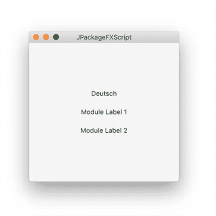

# 桌面应用程序的 JavaFX 模板

> 原文：<https://medium.com/javarevisited/javafx-templates-for-desktop-applications-58f626e05f2e?source=collection_archive---------0----------------------->

在 [foojay.io](https://foojay.io) 上，我们已经讨论过 JavaFX 编写一次随处运行的应用程序，以及如何在 GitHub 上用 Gluon 和 GraalVM 创建它们:

*   Gail Anderson 用 JavaFX 创建移动应用
*   Bruno Lowagie 的跨平台 Java 开发
*   [我自己通过 Gluon Mobile 和 GitHub 操作从单个 JavaFX 项目中为多个设备提供本地应用](https://foojay.io/today/native-applications-for-multiple-devices-from-a-single-javafx-project-with-gluon-mobile-and-github-actions/)

在这篇文章中，我们将看看其他不同的方法。

# Gerrit 格伦瓦德的模块化 JavaFX 模板

[这是 GitHub 上的一个小项目](https://github.com/HanSolo/fxmodules)可以作为模块化 JavaFX 项目的模板，基于 JDK17。您可以将`build.gradle`文件作为项目导入到您的 [IDE](/javarevisited/7-best-courses-to-learn-intellij-idea-for-beginners-and-experienced-java-programmers-2e9aa9bb0c05?source=---------16------------------) 中，并从命令行或 IDE 中使用`gradlew Main`启动应用程序。

[](https://javarevisited.blogspot.com/2020/06/top-5-courses-to-learn-java-fx-in-2020.html)

您会发现三个脚本文件

*   build_app_windows.bat
*   build_app_macos.sh
*   build_app_linux.sh

…可用于在您选择的平台上构建本机软件包和安装程序。如果您想在 macOS 上构建一个本地包，您需要执行以下步骤:

```
./gradlew clean build bash build_app_macos.sh
```

脚本完成后，你会在文件夹中找到 dmg、pkg 和 app 文件

```
fxmodules/build/installer
```

此外，该项目在文件夹中还附带了一个 github 动作

```
fxmodules/.github/workflows
```

在每次推送项目后，`ci.yml`文件将为 GitHub 上的每个平台构建原生包。工件将被附加到构建中，以便您可以从那里下载它。

# JPackageScriptFX 作者[德克·莱默尔曼](https://twitter.com/dlemmermann/status/1446045501577641986)和[迈克尔·鲍斯](https://twitter.com/MichaelPaus)

[这个项目最初是由 Michael Paus 创建的，后来变成了 Dirk Lemmermann](https://github.com/dlemmermann/JPackageScriptFX) 的模板项目。它演示了项目如何通过`jdeps`、`jlink`和`jpackage`工具使用脚本来构建独立的、特定于平台的可执行文件和 JavaFX 应用程序的安装程序。包括两个脚本，用于在 Mac/Linux 和 Windows 上运行构建。从版本 14 开始，`jpackage`工具与 JDK 捆绑在一起。

这个存储库中的项目使用多模块 Maven 设置，其中一个父模块包含三个子模块。这些子模块中的一个是“主”模块，因为它包含主类。

该模块还包含构建脚本，其目标目录将包含构建结果。JavaFX 应用程序由一个显示三个标签的窗口组成。第一个显示了当前配置的区域设置，另外两个标签分别从模块 1 和模块 2 导入。

[](https://www.java67.com/2018/02/5-free-servlet-jsp-and-jdbc-online-courses-for-java-developers.html)

特定于平台的版本是用 [Maven](https://javarevisited.blogspot.com/2017/06/10-maven-tips-java-developer-should-know.html) 创建的，这整个过程在 GitHub 项目的自述文件[中有很好的解释。](https://github.com/dlemmermann/JPackageScriptFX/blob/master/README.md)

# maven-jpackage-template by[Will Iverson](https://twitter.com/wiverson)

甚至还有一个 Maven 模板项目[我们可以在这里分享！它为 JavaFX 应用程序生成一个定制的 JVM 和安装程序包。它可以很容易地适应 Swing。](https://github.com/wiverson/maven-jpackage-template)

生成的安装程序大约有 30-40MB。项目中的示例源代码包括几个本机桌面功能的演示——例如，从 Finder/Explorer 拖放，以及几个 macOS Dock 集成示例。删除代码和演示依赖项可以使“Hello World”的构建大小接近 30MB。

# 用 GitHub 动作构建

这三个项目都通过 GitHub 动作产生了承诺的特定于平台的运行时。

*   Gerrit 的 Gradle-project 使用[单个动作产生 Linux、Windows 和 Mac 版本](https://github.com/HanSolo/fxmodules/actions/runs/1315436370)。
*   对于每个平台版本，Maven 项目都有一个动作文件:参见 [JPackageScriptFX](https://github.com/dlemmermann/JPackageScriptFX/actions) 和 [maven-jpackage-templates](https://github.com/wiverson/maven-jpackage-template/actions) 中的动作

# 结论

对于 Maven 和 Gradle 爱好者来说，构建 Java 可执行文件有不同的可能性，GitHub 提供了免费的工具。

感谢 Gerrit、Michael、Dirk、Will 和其他贡献者——他们分享了这些类型的模板——开始使用 JavaFX for desktop applications 变得更加容易了！

*原载于 2021 年 10 月 15 日*[*https://foojay . io*](https://foojay.io/today/javafx-templates-for-desktop-applications/)*。*