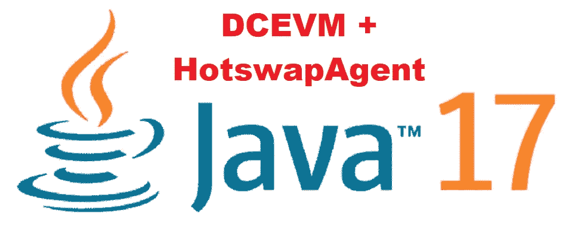

# 带有 DCEVM 和热交换代理的 JDK 17

> 原文：<https://medium.com/javarevisited/jdk-17-with-dcevm-and-hotswapagent-4fee7095617a?source=collection_archive---------2----------------------->

DCVEM 官方网站( [https://dcevm.github.io](https://dcevm.github.io/) )尚未发布任何关于 JDK 17 版本的信息，也没有 Trava OpenJDK 的 JDK 17 版本(截至撰写本文时)。

由于许多开发人员都依赖 DCEVM 和 HotswapAgent 来使用 Spring 这样的框架进行开发，所以我想提供一个简短的指南，介绍如何使用 DCEVM 和 HotswapAgent 创建自己的 JDK 17。

# 1.下载包含 DCEVM 的 JDK 17

我能找到的唯一包含 DCEVM 的版本是 JetBrains 提供的版本。去 GitHub Repo 下载包括 DCEVM 在内的最新版本:【https://github.com/JetBrains/JetBrainsRuntime/releases

对于 Windows，它的命名是这样的:*jbr _ DCE VM-17 _ 0 _ 1-Windows-x64-b 164.4 . tar . gz*

下载完成后，打开 JDK，把它放到你喜欢的地方。

# 2.下载 HotswapAgent Jar

去 HotswapAgent GitHub Repo 下载最新发布的 jar:
[https://github.com/HotswapProjects/HotswapAgent/releases](https://github.com/HotswapProjects/HotswapAgent/releases)

将 jar 重命名为 *hotswap-agent.jar* ，并将其放在 *lib/hotswap* 下的 JetBrains JDK 文件夹中(如果该文件夹不存在，则创建该文件夹)。

# 3.开始你的程序

在您的 IDE 或环境中，配置使用 JetBrains JDK，并使用以下标志启动您的程序:*-XX:HotswapAgent = fat jar*

# 4.享受快速编码的乐趣

请务必不时更新 JDK 和 HotswapAgent，因为在撰写本文时仍有一些已知的错误。

另外，如果有包含 dcevm 和 HotswapAgent 的官方版本，请随时查看 https://dcevm.github.io 。