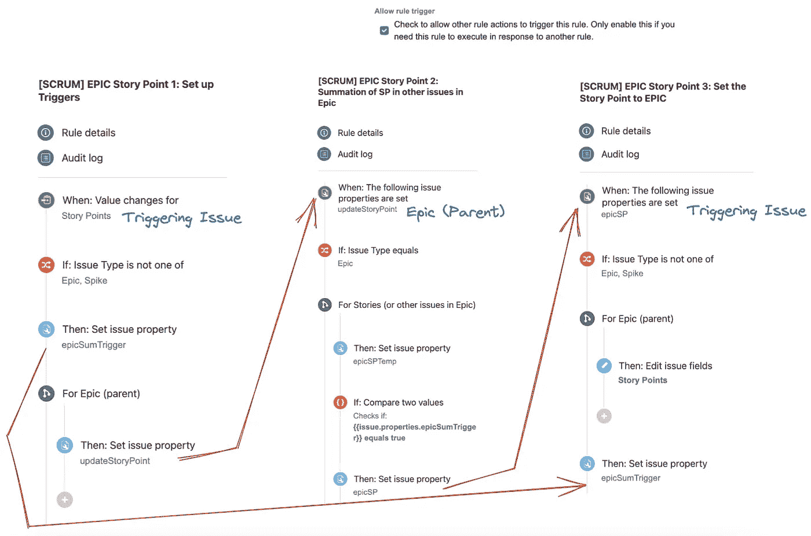

# 吉拉自动化:史诗中的故事点总和

> 原文：<https://medium.com/javarevisited/jira-automation-sum-story-points-in-epic-9626b8c1c23c?source=collection_archive---------0----------------------->

该解决方案适合使用吉拉数据中心(服务器)的客户。如果您使用的是吉拉云版本，您可能会在这里找到一个更简单的解决方案，其中*查找问题操作*可用。

除了*查找问题行动*之外，还可以使用吉拉端点在 Epic 中查找问题。但是，这需要您使用令牌。你可以通过吉拉论坛的这个[帖子了解更多关于这个解决方案的信息。](https://community.atlassian.com/t5/Automation-questions/How-to-automate-the-sum-of-story-points-for-all-issues-under-the/qaq-p/1607809#M1087)

本文将分享我们如何在不需要使用 *lookup issue action* 或*个人访问令牌*的情况下总结史诗故事要点。

一般来说，这个解决方案需要 3 个自动化规则。

1.  为步骤 2 和 3 设置触发器
2.  对史诗中问题的故事点做总结
3.  将总和设置为史诗故事点字段

所有 3 个自动化规则的概述

开始吧！

# **规则 1:设置触发器**

这是第一个自动化规则，只要任何票证中的“故事点”字段发生更改，就会触发该规则。它主要用于设置将用于的属性

*   **当**
    -字段值改变时:故事点
*   **出库字段条件**
    -字段:出库类型
    -条件:不是
    之一-值:史诗，尖峰
*   **设置实体属性** ( *这在规则#2 中用作指示符，表明这是 Epic* )
    -实体类型:问题
    -属性键:epicSumTrigger
    -属性值:true ( *注意:实际值并不重要，即您可以设置任何其他值，但它必须与规则#2* 中某个步骤的验证相匹配
*   **分支规则/相关问题** ( *这是用来触发规则#2，这样我们就可以使用另一个分支规则找到 Epic 的所有任务，得到故事点的总和* )
    -相关问题的类型:Epic (parent)
    -批量处理该触发器产生的所有问题:☑️
    -然后， 设置**实体属性**
    —实体类型:发布
    —属性键:更新故事点
    —属性值:真(*注意:该值无关紧要，它用于触发规则#2，我们不验证该值*)

# 规则 2:故事点的总结

这将由规则#1 触发。我们需要这个中间步骤，因为我们无法在使用分支规则(Stories，或 Epic 中的其他问题)进行求和后直接设置 Epic 的故事点。

**规则详情**

* ☑️检查以允许其他规则操作触发此规则。仅当您需要此规则执行以响应另一个规则时，才启用此选项。

*   **当**
    -发布属性更新:updateStoryPoint
*   **出库字段条件**
    -字段:出库类型
    -条件:等于
    -值:史诗
*   **分支规则/相关问题**
    -相关问题的类型:故事(或 Epic 中的其他问题)
    -批量处理此触发器产生的所有问题:☑️
    - ( *我们只需要任务的 1 来获得更新并触发规则#3。但是，由于 Epic 中的所有任务都会受到该分支规则的影响，因此每当属性被设置为 Epic 中的每个任务时，规则#3 将被多次触发[反复重置相同值的 Epic 故事点]，我们必须分成 2 个步骤:
    — a .将总和设置为所有任务的临时属性
    — b .如果“this”问题是最初的触发问题，则将总和设置为将触发规则# 3*)
    —然后，1。**设置实体属性** ( *步骤 a* )
    —实体类型:问题
    —属性键:epicSPTemp
    —属性值:{ {问题。Story Points.sum}}
    - 2。**高级比较条件** ( *步骤 b.1* )
    —第一个值:{ { issue . properties . epicsumtrigger } }
    —条件:等于
    —第二个值:真(*这与我们在规则#1* )
    - 3 中设置的相匹配。**设置实体属性** ( *步骤 b.2* )
    —实体类型:发行
    —属性键:epicSP
    —属性值:{ { Issue . properties . epicsptemp } }

# 规则 3:将总和设置为 Epic

这是使用原始触发问题中的属性设置史诗故事点字段的最终规则。

**规则详情**

* ☑️检查以允许其他规则操作触发此规则。仅当您需要此规则执行以响应另一个规则时，才启用此选项。

*   **当**
    -问题属性更新:epicSP
*   **出库字段条件**
    -字段:出库类型
    -条件:不是
    之一-值:Epic，Spike
*   **分支规则/相关问题**
    -相关问题类型:Epic (Parent)
    -批量处理该触发器产生的所有问题:☑️
    -然后编辑问题
    -故事点:{ { triggerissue . properties . epicsp } }
*   **设置实体属性** ( *重置属性，以便规则#2 在下一次出现时不受影响* )
    -实体类型:问题
    -属性关键字:epicSumTrigger
    -属性值:false

这就对了！每次我们添加新票或更新任何史诗任务的故事点时，您都不再需要手动求和。😏

感谢您的阅读！如果你对[吉拉](/javarevisited/6-best-online-courses-to-learn-jira-for-beginners-and-experienced-it-professionals-4a21fb014520)服务器中的查找发布动作感兴趣，你可以查看这张[票](https://medium.com/r?url=https%3A%2F%2Fjira.atlassian.com%2Fbrowse%2FJIRAAUTOSERVER-53)。

如果你还不是中等会员，点击[这里加入](/@mariochiadev/membership)！

 [## 李嘉云-中型

### 在媒介上阅读云的作品。刚从大学毕业的学生。总是对新技术和……

medium.com](/@mariochiadev/membership)