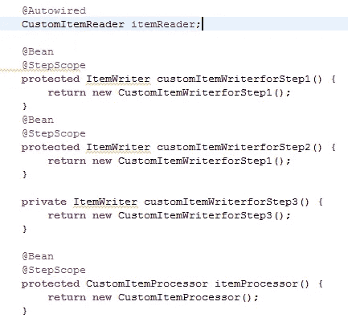
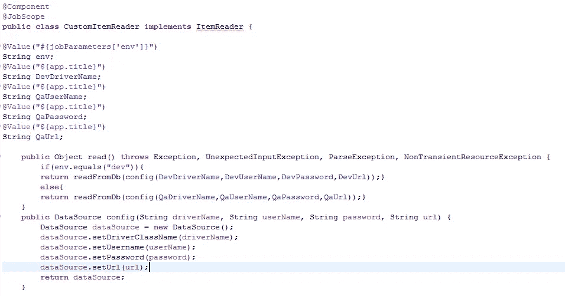
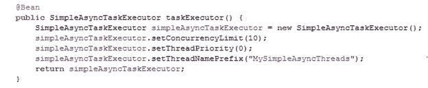
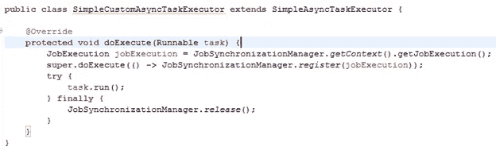

# Spring 批处理中作业范围的 Beans

> 原文：<https://medium.com/javarevisited/job-scoped-beans-in-spring-batch-3fe1dde47531?source=collection_archive---------2----------------------->

正如本文前面所讨论的[https://medium . com/Java re visited/step-scoped-beans-in-a-spring-batch-job-570 a 09184 fa 5](/javarevisited/step-scoped-beans-in-a-spring-batch-job-570a09184fa5)关于 spring 批处理作业的边界和生命范围，我们有几个作用域，使得在 spring 批处理应用程序中定义和重用 bean 更加容易。

工作范围就是这样一个由 [spring 框架](/javarevisited/10-best-online-courses-to-learn-spring-framework-in-2020-f7f73599c2fd)定义的范围。它使我们能够定义生命周期与活动作业实例相关联的 beans。该 bean 是在第一次调用作业时创建的，并在作业终止时销毁。

换句话说，作业范围 bean 的生命周期与活动作业实例的存在相关联。

让我们考虑下面的例子

我们有一个从数据库中读取数据、处理数据并将处理后的数据写入文件的任务。

每一步都从数据库中读取数据，并写入不同的文件。我们对所有步骤使用相同的读取器(customItemReader)，对每个步骤使用不同的写入器(`customItemWriterforStep1`、customItemWriterforStep2、customItemWriterforStep3)

.

让我们考虑一个场景，其中我们有几个数据库配置，要从中检索数据的数据库是在运行时指定的。

项目阅读器的配置对于确保从正确的数据库中检索数据至关重要。

基于作业参数 env 中的参数集，确定用于该作业运行的数据库配置。由于这种配置在整个作业中保持不变，因此在各个步骤之间共享一个实例是有意义的。

这个作业范围通过确保每次调用作业时都有一个新的实例，并且在各个步骤之间共享同一个实例，使我们的生活变得更加轻松。

上面分享的例子是一个简单的单线程顺序作业。但是当我们配置一个多线程作业并试图使用一个作业范围的 bean 时，我们会遇到下面的错误。

`Caused by: java.lang.IllegalStateException: No context holder available for job scope`

原因是多线程作业使用任务执行器来管理线程。该作业上下文信息存储在[线程本地](https://javarevisited.blogspot.com/2012/05/how-to-use-threadlocal-in-java-benefits.html)中，并且不是由默认任务执行器在工作线程中隐式配置的。

处理这个问题的一种方法是定制任务执行器，在每次创建新线程时，在每个线程上显式配置作业上下文信息。

使用 JobSynchronisation 允许我们在多线程 spring 作业中使用作业范围的 beans。

这就是我们如何使应用程序能够保留作业范围 beans 的信息，方法是让执行器知道作业执行上下文，这反过来又确保所有创建来运行异步任务的线程知道作业执行上下文，并知道作业范围信息的意图。