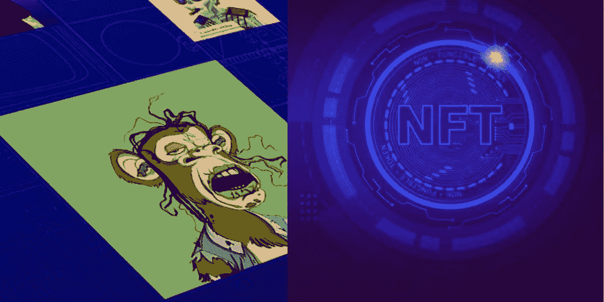
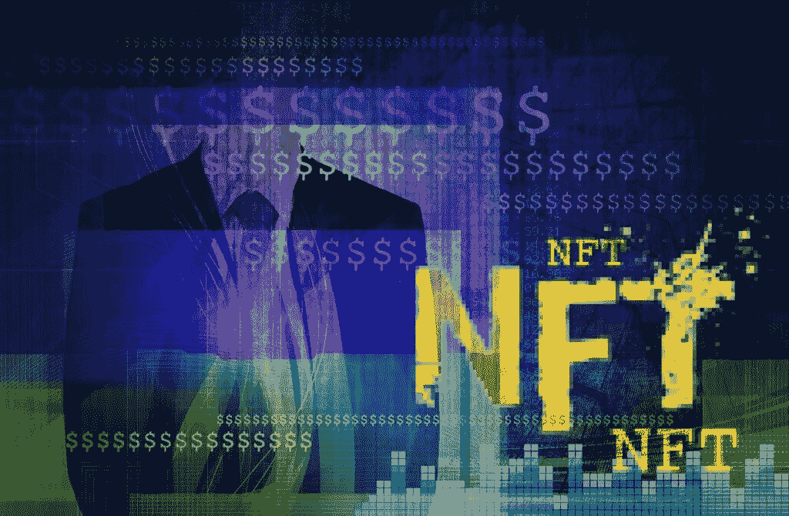

# 草草写下了 NFT 市场的蓝图

> 原文：<https://medium.com/javarevisited/jotted-down-the-blueprint-for-the-white-label-nft-marketplace-d81d271af9c?source=collection_archive---------2----------------------->

白色标签 NFT 市场

在 [NFT 市场](https://finance.yahoo.com/news/refinable-partners-9gag-bring-memeland-100100969.html?guccounter=1&guce_referrer=aHR0cHM6Ly93d3cuZ29vZ2xlLmNvbS8&guce_referrer_sig=AQAAACdTWZMtC-5o5bm8B_2-eCKqvCEYYy4fJQczqlYo1vUxqxE5WBwDTu8bMbKfqwWzaybodp-EjYJxe9NXr9eUol3IHQU_NbbiGjjKAO9ysCY22xXB03Fo3QRxrCo-SWFUKQ9oOSKQxHmMrBFoE3UGv-yyao7UUTG3R1XS4IB5RWlI)制造更多令人瞠目结舌的东西并带来大量狂热将会吸引全世界的用户。但与此同时，它可能会产生一种恐惧的想法，即它需要大量的金钱和时间的投入。为了消除这些想法，出现了新技术——白标解决方案。这个[白色标签的 NFT 市场](https://www.businessworld.in/article/Seracle-Launches-Web3-NFT-Infrastructure-For-Brands-To-Help-Boost-Marketing-Activities-With-Customised-NFT-Marketplaces-/13-07-2022-436922/)是创建市场的传统方法的替代方案。无缝功能和改变我们渴望的 NFT 市场的能力是一个福音。

称之为密码空间现象可能更为恰当，因为它具有令人惊讶和强大的功能。你可以跃进尝试搜索这个星球上的 [**顶级白色标签 NFT 市场平台**](https://bit.ly/3cDeZPj) 公司。通过获取巨额利润来争取你的业务核心。没有这样的进步可以点燃你的好奇心，让你向你的同龄人宣布你的成功。

白色标签 NFT 平台是一个虚拟平台，其成功案例如下。快速抓住势头，坐在前台看你的利润。

积累您在这里找到的所有积分！！！

🔥**白色标签 NFT 市场——一个利润丰厚、功能惊人的平台**

[白标 NFT 市场](https://readwrite.com/how-did-white-label-nft-marketplace-development-hype-start/)是一个虚拟平台，类似于其他市场的特性和功能。该平台方便了 [NFTs](/javarevisited/10-best-nfts-courses-and-certifications-for-beginners-to-learn-non-fungible-tokens-in-2022-3f36a4374ba) 的交易和竞价。它是现成的，100%可定制的，在功能方面是可靠的，并且是预配置的软件。该软件由技术代码组成，允许开发商进行修改，以重现和振兴壮观的 NFT 市场。

🔥**为什么需要白色标签解决方案？**

白标 NFT 市场是一个可定制的平台，可以进行修改以产生想要的平台。接触这个市场有理由感到疑惑。其中一些主要的是:

📌从零开始创建一个 NFT 市场并不容易。因为要实现它需要大量的软件知识和资源。因此至少需要 6 个月到 1 年的时间来进行新的积累。

📌此外，它还涉及时间以外的巨额资金投入。从零开始发展 NFT 市场的成本涉及巨额资金。

🔥**克隆脚本开发——启动 NFT 市场的终极解决方案**

白牌 NFT 平台开发

> 从今以后，最终找到一个解决方案可以让开发者和企业家的工作和压力得到释放。 ***有克隆脚本，作为现有 NFT 市场的副本。因此，现在令人惊讶的是，有可能减少您的预算来获得这个壮观的平台。克隆脚本是可以是任何垂直的软件。这包括艺术、迷因、视频、音乐、游戏和体育。这些脚本是 NFT 平台应该具备的特性和功能的最佳参考。***

🔥**了解白色标签 NFT 平台的优点**

⚫ **安全性:**白标平台有多重安全层，不允许欺诈活动的痕迹。安全的自由克隆脚本增强了用户心中的可信度。

⚫ **透明度:**全球所有用户都可以访问交易信息。凭借唯一的互联网设施，任何人都可以访问区块链的数据。

⚫ **去中心化:**你很幸运拥有一个去中心化的平台，因为它不允许任何第三方的介入。此外，没有权限也能培养信任。与任何其他银行或中央机构不同，它不可能干预交易过程。

⚫ **智能合约:**以代码的形式控制流程是最好的协议。你无法想象一个没有智能合同的 [**NFT 市场**](https://bit.ly/3cDeZPj) 。因为它是自动化的，但是仍然只在卖方和买方之间有相互协议时才允许功能。例如，DAO 是一个智能合约，但任何修改都需要在线社区的响应和决策。

⚫ **定制:**NFT 市场在功能上是完全可定制的。有一些共同的固有特性和功能可以被操作。

🔥**白色标签 NFT 市场还有什么值得探索的？**

📌**店面:**店面是探索 NFT 市场时出现的第一个站点。这个登陆页面必须引人注目，令人难以置信，这样才能让用户着迷。你可以通过获取访问者的频率来估计成功的概率。

📌列表:这是一个网站，创作者将在这里收集可供交易的 NFT 收藏品。如果用户想要[创建他们选择的任何 NFT](https://savingsfunda.blogspot.com/2022/05/how-to-create-and-sell-nft-non-fungible.html)，他们甚至可以上传包含信息的文件。

📌**竞价:**竞价软件将有助于 NFTs 的竞价销售。当用户愿意以一些不固定的费率来获取这些非功能性测试时，就会发生这种情况。

📌这里是 NFT 市场的中心。在这里，钱包储存交易资金。钱包可以是内置的，也可以是另一种配置。

📌**搜索和过滤:**搜索引擎将使用户能够导航到他们想看的网站。另一方面，过滤器将揭示分类以帮助用户挑选出他们想要的 NFT。

📌 **NFT 排名:**NFT 排名选项定期显示[NFT](https://www.java67.com/2022/03/top-5-free-courses-to-learn-nft-non-fun.html)的最高级别。排名根据价格、销售历史和所有者的详细信息来分配每辆 [NFT](https://javarevisited.blogspot.com/2022/07/free-nft-non-fungible-tokens-courses.html) 的价值。

📌**收藏夹:**收藏夹选项将允许用户添加他们想要的 NFT，以便将来观看。它只是在用户中创造了一个感觉良好的因素。

🔥**关闭**

所以，随着思路的关闭，我也将对此附上我的一些看法。盛行的是顶级的 [**白标 NFT 市场发展公司**](https://bit.ly/3cDeZPj) 来支持你。不要跳过这里的黄金点，抓住它们给你启示。你有一个很好的机会来扩大你的商业宣传，获得巨大的收入。

获得利润丰厚的专家和训练有素的专业人士的存在和支持，以超越您的 NFT 市场的信誉。扩大您的市场，并利用您的 NFT 收集在短时间内与巨大的红利。