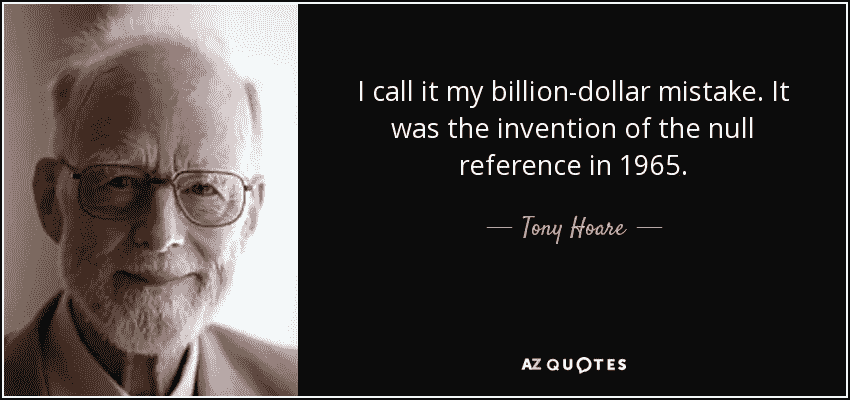

# 只是不要返回 null！

> 原文：<https://medium.com/javarevisited/just-dont-return-null-dcdf5d77128f?source=collection_archive---------2----------------------->

在我的文章避免 [*显式空值检查*](/javarevisited/avoid-verbose-null-checks-b3f11afbfcc9) 中，我谈到了处理*空值*的替代方法，这种方法不涉及显式执行*空值*检查。

写完那篇文章后，我仍然觉得我需要更多地强调说明，如果我们不返回空值，那么这些方法都是不必要的！首先。返回 null 是一个问题的诱因，它只是在调用代码中丢失了一个 null 检查，混乱就发生了。

如果你的代码产生一个空值，我们需要以某种方式抑制它，而不是返回它。对此我们可以做一些事情，我们需要习惯于应用这些选项中的一个，因为如果我们不这样做，那么处理那个 *null* 将成为调用者的责任。

> 返回 null 是一种懒惰的坏习惯，会给应用程序增加不必要的风险。

现在让我们来看看一些代码。

在上面的例子中，在对可用性进行一些检查之后，一个商品被标记为已售，然后被退回。该方法使用了*项目*返回类型，这意味着即使项目不可用也需要返回一些东西。返回一个空引用很有诱惑力，但是这可能会给调用者带来问题。如果调用者(或多个调用者)未能执行 [*null* 检查](https://javarevisited.blogspot.com/2016/01/how-to-check-if-string-is-not-null-and-empty-in-java-example.html)，那么如果使用了来自 item 对象的某个值，可能会导致抛出[*NullPointerException*](https://www.java67.com/2021/05/how-to-solve-nullpointerexception-in-java.html)。或者更糟的是， *null* 项可能会被进一步发送到最终用户或其他系统，并造成大量损害。

现在让我们看看我们能做些什么，而不是返回空值。

抛出异常我们可以抛出一个运行时异常。可能是一个名为*可用性异常*的自定义异常，包含一个*信息*日志消息

甚至不需要自定义异常，我们可以只使用一个 *IllegalArgumentException。抛出一个异常比返回 *null 要好。*也许有人会认为使用[异常](https://javarevisited.blogspot.com/2013/06/10-java-exception-and-error-interview-questions-answers-programming.html#axzz6kGEVKsf7)来控制正常的业务流程不是一个好的做法。好吧，很公平，我同意。然后让我们看看我们还能做些什么。*

**返回一个“特例”对象** 特例对象是我们返回的东西，而不是返回 *null。*有一种模式叫做 *null* value object，我已经在另一篇文章中[解释过了，所以我不打算在这里再解释了，取而代之的是，我将使用](/javarevisited/avoid-verbose-null-checks-b3f11afbfcc9)[Java 8*optional . empty()*](https://javarevisited.blogspot.com/2017/04/10-examples-of-optional-in-java-8.html)，它只是 Java 对该模式的实现。

使用 *Optional.empty()* 是一个特例对象，它将保护调用者免受[*NullPointerException*](https://javarevisited.blogspot.com/2012/06/common-cause-of-javalangnullpointerexce.html)的影响。是我最喜欢的方法，而不是返回空值，我个人经常使用。

类似特例对象的另一个常见例子是*collections . empty List()*，它将返回一个[空的*列表*](https://javarevisited.blogspot.com/2014/07/java-optimization-empty-arraylist-and-Hashmap-cost-less-memory-jdk-17040-update.html) ，这在类似的情况下非常有用，我们不想返回*空的*，但是需要一个*列表*。

不幸的是，有很多很多开发者认为，仅仅因为 Java 允许 *null* ，就可以返回它。但是从干净编码和软件工艺的角度来看，我们需要承担责任，不要让 null 离开我们编写的方法。也许最好是我们一起停止使用空引用。

我希望你喜欢这篇文章，如果你喜欢，请鼓掌👏和/或在社交媒体上与朋友分享。