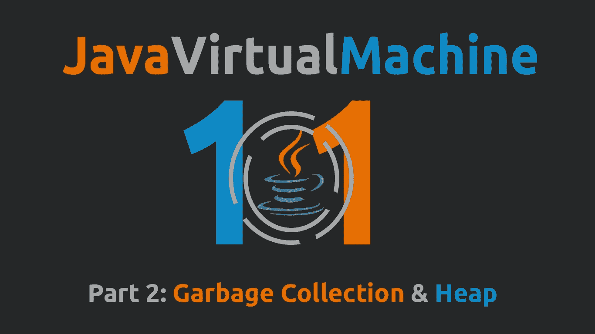
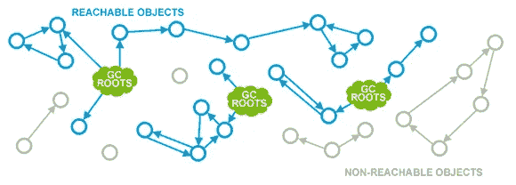
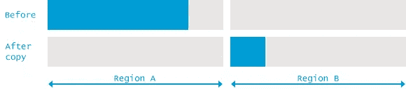
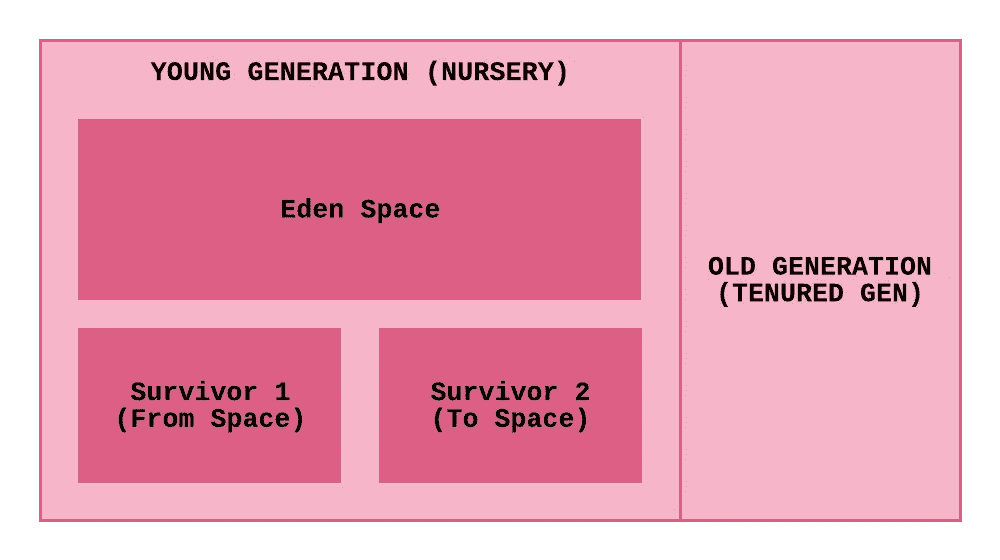
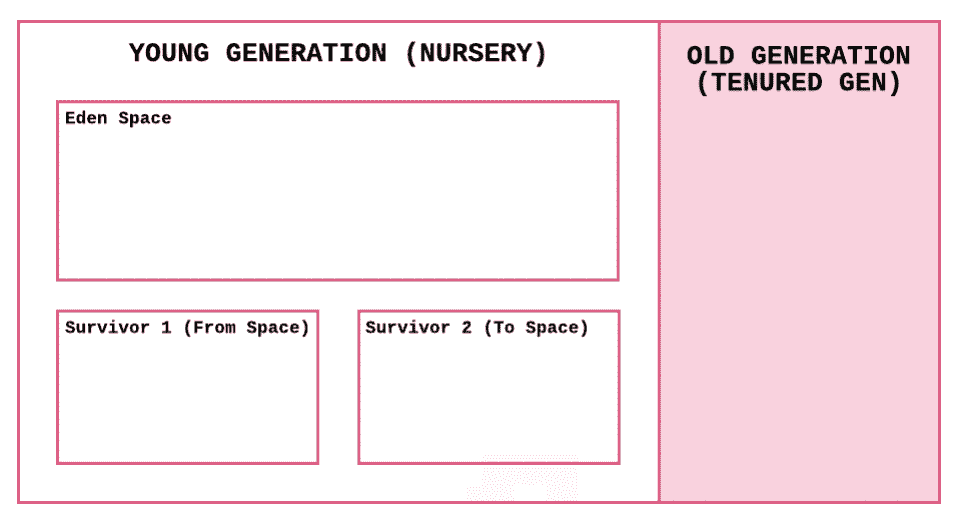
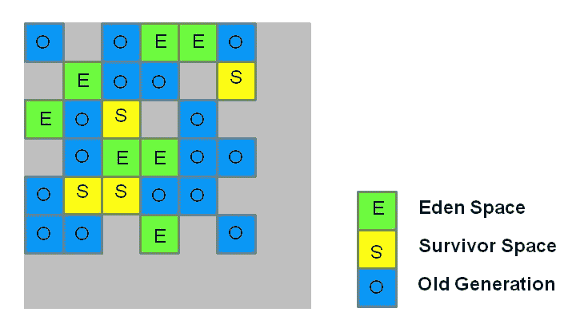

# JVM 101:垃圾收集和堆(第 2 部分)

> 原文：<https://medium.com/javarevisited/jvm-101-garbage-collection-and-heap-part-2-dc36b710638d?source=collection_archive---------1----------------------->

读者们好！欢迎回来。

今天我们要谈谈 JVM (Java 虚拟机)的另一个有趣的方面。这是这个系列的第二篇文章，所以如果你还没有看完第一部分的话，一定要看完。

垃圾收集和堆是 [JVM](/javarevisited/7-best-courses-to-learn-jvm-garbage-collection-and-performance-tuning-for-experienced-java-331705180686) 中最有趣的部分(在我看来)，我真的很喜欢谈论它。这就是我们今天要学的内容。

1.  内存损坏错误的类型
2.  什么是垃圾收集器？
3.  谁有资格被收垃圾？
4.  垃圾收集算法
5.  堆结构及其工作原理

# 内存损坏错误的类型

就像我们在[第一部分](/javarevisited/jvm-101-introduction-classloader-sub-system-jit-compiler-part-1-9e5a6782fa3e)中提到的，当一个 Java 程序被执行时，一个 JVM 的运行时实例在机器的内存中被创建。换句话说，因为 JVM 也是一个进程，所以它从机器中获得自己的内存份额。

谈到与 JVM 相关的内存，主要有两种类型的错误。

1.  ***内存泄漏*** :当内存中有未使用的对象时，就会发生这种情况。他们获得了一些内存，即使他们没有被使用，也没有被释放。
2.  ***悬空引用*** :指向解除分配位置的引用。例如，假设有两个引用(A 和 B)引用同一个对象。引用 A 完成了它的工作并删除了该对象。参考 B 不知道这个。那么被释放的内存位置将被分配给一个新的对象。认为它是前一个对象，引用 B 访问内存位置。但是，它指的是新对象，而不是旧对象。

# 什么是垃圾收集器？

垃圾收集器是守护线程(一个在后台运行以执行特定任务的低优先级线程)，负责 [JVM](https://javarevisited.blogspot.com/2019/04/top-5-courses-to-learn-jvm-internals.html) 中的自动内存管理。

垃圾收集器有几种类型。

1.  **串行收集器**:单线程进程，实时运行并执行垃圾收集
2.  **并发收集器(低延迟收集器)** : GC 线程与应用并行运行，在应用运行的同时执行清扫阶段。但是，对于标记阶段，它将停止应用程序。如果机器具有高内存和 CPU 资源，则更适合。适合要求更短暂停时间(即低延迟)的应用。
3.  **并行收集器**:这个收集器运行多线程。但是，不会与应用程序同时运行(非并发)。它等待时间阈值被触发，并以多线程的方式执行垃圾收集，因此速度很快。如果机器的内存和 CPU 资源较低，则更适合。适合要求高吞吐量的应用。
4.  **G1(垃圾优先)收集器**:一个服务器风格的垃圾收集器，目标是拥有*大内存*的多处理器机器。它很有可能满足垃圾收集(GC)暂停时间目标，同时实现高吞吐量。Oracle JDK 7 update 4 和更高版本完全支持 G1 垃圾收集器，并且在 [Java 9](/javarevisited/5-courses-to-learn-java-9-features-in-depth-373f7afcf9fa) 中成为默认设置。这个收集器需要不同的堆结构和完全不同的垃圾收集方法。

垃圾收集器的类型(来源:[Youtube-ran jith Ramachandran](https://www.youtube.com/watch?v=UnaNQgzw4zY))

# 谁有资格被收垃圾？

当一个对象被放弃时，它就有资格被垃圾回收。单词“已放弃”指的是没有活动引用的对象。一个对象可能由于三个主要原因而被放弃。

1.  **对象超出作用域** :
    我们知道我们使用的变量有局部、全局等作用域。所以当程序退出对象的作用域时，这个对象就不再需要了。因此，被遗弃了。
2.  **引用被分配给一个新对象** :
    假设变量“A”正在引用对象“A”。后来，如果变量“A”被重新分配给对象“B ”,那么对象“A”就没有对它的活动引用。因此被遗弃了。
3.  **引用被赋值为空** :
    与上面的场景类似，变量“a”没有被赋值给新的对象，而是被重新赋值为“空”。那么物体 A 就被抛弃了。

还要注意，如果一个类对象(我们在第 1 部分中讨论过)没有任何活动引用，它也有资格被垃圾收集。

# 垃圾收集算法

垃圾收集算法负责识别死对象，并回收这些死对象占用的内存。对于这个，有几个著名的算法是由 [Java](/javarevisited/top-5-java-online-courses-for-beginners-best-of-lot-1e1e240a758) 推出的。

1.  标记-扫描
2.  标记-扫描-压缩
3.  标记和复制
4.  并发标记-清除

所有这些垃圾收集算法都会在整个应用程序中造成某种暂停。于是被称为“**停止世界**的活动。为什么它需要暂停应用程序，这将是你想到的下一个问题。比如这样想，你在做死亡物体鉴定的时候，可能需要时间。当你完成标记时，一个被你标记为“活的”的物体将实际上被抛弃。因此，为了消除这些歧义，需要暂停应用程序。关键是尽量减少这种停顿。

让我们分别看一下这些 GC 算法:

## 标记扫描算法

顾名思义，标记-扫描算法有两个阶段；**标记**和**扫描**。

所有 1-4 算法的标记阶段实际上负责相同的事情。即识别 ***活体*** 。是的，你没有听错；它负责识别活的物体，而不是死的。这是通过找到 ***GC 根*** 并遍历对象图以找出哪些对象是可达的来完成的。

GC 根或垃圾收集根是垃圾收集器专用的对象。这些根总是在对象图的开始。GC 根主要有 7 种。一个 GC 根也可以属于这些类型中的一种或几种。

*   **类—** 由系统类加载器加载的类。如果类是由自定义类加载器加载的，它不会被认为是 GC 根，除非那个`java.lang.Class`实例属于下面提到的其他类型之一。
*   **螺纹** —活螺纹
*   **栈局部**—Java 方法的局部变量或参数
*   **JNI 局部**——JNI 方法的局部变量或参数
*   **JNI 环球** —环球 JNI 参考
*   **使用的监视器** —用作同步监视器的对象
*   **由 JVM 持有** —由 JVM 出于其目的持有的对象

标记阶段(图片来源: [GC 算法:基础| Plumbr，2020](https://plumbr.io/handbook/garbage-collection-algorithms) )

在通过识别活体对象完成标记阶段之后，标记-扫描算法的下一阶段是扫描。

在扫描阶段，算法的重点是删除死对象并回收它们占用的内存。

标记-扫描算法(图片来源: [GC 算法:基础| Plumbr，2020](https://plumbr.io/handbook/garbage-collection-algorithms) )

你从上面的图片中看出什么问题了吗？我想你知道。当回收死对象占用的内存时，如果死对象分散在内存中(这是常见的情况)，它们在删除时会导致内存碎片。(即，它们将导致占用位置之间的空位置。)因为这种碎片化的记忆，我们就算有记忆也会遇到`[java.lang.OutOfMemoryError](http://javarevisited.blogspot.sg/2011/09/javalangoutofmemoryerror-permgen-space.html#axzz5DmwFLA1K)`。例如，想想如果我们有一个相对较大的物体叫做 A。它将无法放入任何空的内存孔中(检查上图中灰色的空间)。但是如果我们把所有被占用的内存移到一边，去掉碎片，就能有足够的空间给对象 a。

另一个缺点是需要维护一个自由列表来跟踪内存中的空位置及其大小。

为了克服这些问题，引入了下一个算法，标记-扫描-压缩。

## 标记-扫描-压缩算法

在该算法中，前两个阶段类似于标记扫描算法。作为第三阶段，紧凑阶段到来。

压缩阶段通过将所有活动对象移动到内存的一侧来消除碎片。

标记-扫描-压缩算法(图片来源: [GC 算法:基础| Plumbr，2020](https://plumbr.io/handbook/garbage-collection-algorithms) )

所以这解决了我们的问题，对吗？它确实解决了一个问题，但又产生了另一个问题。也就是说，它增加了应用程序的暂停时间。

为了解决这个问题，引入了另一种算法。这就是标记和复制算法。

## 标记和复制算法

这种方法也压缩被占用的内存，但是使用不同的机制。

这里，存储器被分成两个区域。假设 A 和 b，当前所有的物体都在 A 区(活的和死的都有)。标记阶段与上述两种算法的标记阶段相同。该特性来自复制阶段，它将标记为“活动”的对象复制到区域 b。由于标记和复制阶段可以**同时发生**，它减少了总暂停时间。

标记和复制算法(图片来源: [GC 算法:基础| Plumbr，2020](https://plumbr.io/handbook/garbage-collection-algorithms) )

## 并发标记-清除

并发标记-扫描几乎类似于标记-扫描算法。然而，CMS 比标记-清除有优势，因为它几乎与应用程序并发运行，从而减少了暂停时间。注意，我提到的是“差不多”。这是因为它实际上停止了应用程序大约两次，一次在开始，另一次在进程的中间。(实际上，这个算法的正式名称是“大部分并发标记-清除”)另一方面，并发是有代价的。我们应该有足够的资源来负担，因为我们必须在应用程序运行时与垃圾收集器共享处理器。如果一个应用程序有一大组长期存在的对象，并且运行在有两个或更多处理器的机器上，CMS 可以给它们带来很大的好处。但是，对于需要低 GC 暂停时间的应用程序，最好考虑使用 CMS。

现在让我们看看这些算法是如何与 [JVM](http://javarevisited.blogspot.sg/2011/11/hotspot-jvm-options-java-examples.html#axzz54oJiRW8k) 的堆结构协同工作的。

# 堆结构及其工作原理

说到垃圾收集，不仅 GC 算法起着巨大的作用，堆结构也是如此。除了 G1 收集器之外，所有其他收集器都有一个通用的堆结构。然而，G1 的情况不同。

## 除 G1 以外的收集器的堆结构

除 G1 以外的所有收集器的堆结构

在应用程序执行期间创建的许多对象都有较短的生命周期。然而，有些物体寿命更长，或者永远不会死。如果整个堆是一个没有任何分区的巨大空间，那么垃圾收集器将遍历所有对象来检查它们是否是活动的。即使它在每次遍历中会遇到一组新的对象，也会连续遇到一组长寿的活对象。但是，如果 GC 可以跳过重复遍历这些长期存在的线程，我们可以进一步减少暂停时间。这就是为什么引入了年轻一代和老一代的概念。顾名思义，老一代包含寿命更长的对象，反之亦然。

当一个对象被初始化时，它将在年轻的一代中被创建。在经历了一定数量的垃圾收集周期后，它将被提升到老一代。默认情况下，一个对象应该存活 15 个周期才能升级到旧版本。但是，我们可以通过使用 Java 命令行参数: **-XX:MaxTenuringThreshold** 来更改它

实际上，年轻一代就像你房间里的垃圾箱，而老一代就像你街上的垃圾箱。你定期清理你房间的垃圾箱，市政会每周清理街道的垃圾箱。类似地，年轻一代比老一代更频繁地发生 GC 循环。清理老一代也比年轻一代花费更多的时间。

年轻一代再次被分成三个部分以促进标记和复制算法的有效实现。

当一个对象最初被创建时，它将在年轻一代的 Eden 空间中被创建。一段时间后，当 Eden 空间变满或及时时，GC 循环将在年轻一代中被触发。这个 GC 周期被称为“ ***”未成年 GC*** ”或“ ***青年集合*** ”。它将查看伊甸园空间(和 From 空间)中的所有对象，并标记活动的对象，同时将它们复制到“to 空间”。在标记&复制完成后，所有在循环中幸存下来的现在在“到空间”的物体将被移动到“从空间”。如果有任何对象在等于保有阈值的周期数内存活，那么这些对象在复制阶段被移动到旧 gen，而不是移动到“To space”。

垃圾收集的工作原理。(假设:MaxTenuringThreshold=2)

但是，如果 To 空间没有任何空间来容纳在 GC 周期中幸存下来的更大的对象，那么它将被直接移动到旧的 gen，即使它不满足 MaxTenuringThreshold。

在一些小的 GC 周期后，会有一个“ ***满 GC*** ”被触发。在这个 GC 循环中，年轻的一代，老一代，甚至元空间(保存静态成员、类定义等的空间)。即元数据)将被垃圾收集。

这种将堆分成代并进行垃圾收集的方法在 Java 世界中被称为“ ***分代收集*** ”。

尽管在基于 G1 收集器的堆结构中仍然有年轻、年老和幸存的概念，但它与上面的结构相比有很大的不同。让我们也快速浏览一下:

## G1 收集器的堆结构

G1 堆结构(来源: [Oracle 文档](https://www.oracle.com/technetwork/tutorials/tutorials-1876574.html)

在 G1 堆结构中，堆区域被分成大小相等(默认为 2MB)、数量较多的分区，这些分区充当伊甸园空间、幸存者空间、旧代空间或未分配空间。由于分区较小，它允许 G1 收集器比其他堆结构更快地清空分区。

当 GC 被触发时，它会查看垃圾量较高的区域。这就是为什么它被称为垃圾优先收集器。它快速抓取幸存的对象，并将它们复制到一个未分配的区域。如果收集的区域是伊甸园空间，则复制的未分配区域成为生存空间。这里的特点是，如果有一个区域没有幸存者，那么这个区域可以直接成为一个未分配的区域，而不需要任何进一步的工作。

由于这种特殊的结构，G1 收集器总是可以通过选择有大量垃圾的区域来优化收集过程，因为这使得清空这些区域所需的工作最少。对真实世界的 Java 应用程序的研究表明，超过 90%的对象无法在第一次垃圾收集中存活下来，因此经常会发现这些小分区几乎被垃圾填满，因此清理需要的工作量最小。Dynatrace 博客文章对这一现象进行了深入的描述，如果你想深入了解 G1，可以阅读这篇文章。

我想这是一篇有趣的文章，谈论的是你没有太注意的事情。希望它不会拖得太久，并且你喜欢阅读。

不管怎样，别忘了在下面留言评论。非常欢迎批评，因为这有助于我下次写得更好。😇

让我们一起来看看第三部分。在那之前，祝阅读愉快！！❤️

也要注意安全，❤️

编辑:我很抱歉没有第三部分的长时间延迟。我目前不怎么使用 Java，所以有点失去了联系。我不想仅仅发表一些东西，这就是为什么我仍然没有发表第 3 部分。希望你能理解(日期:2021/06/03)