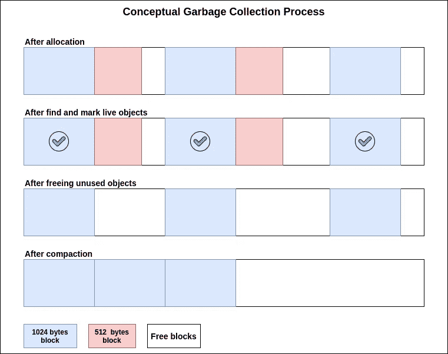
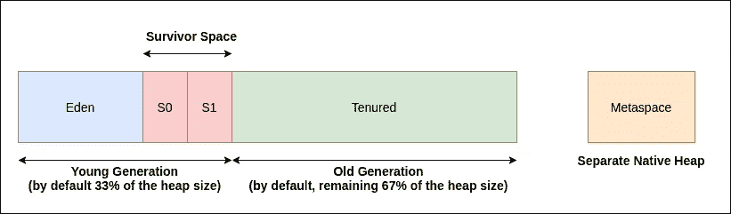
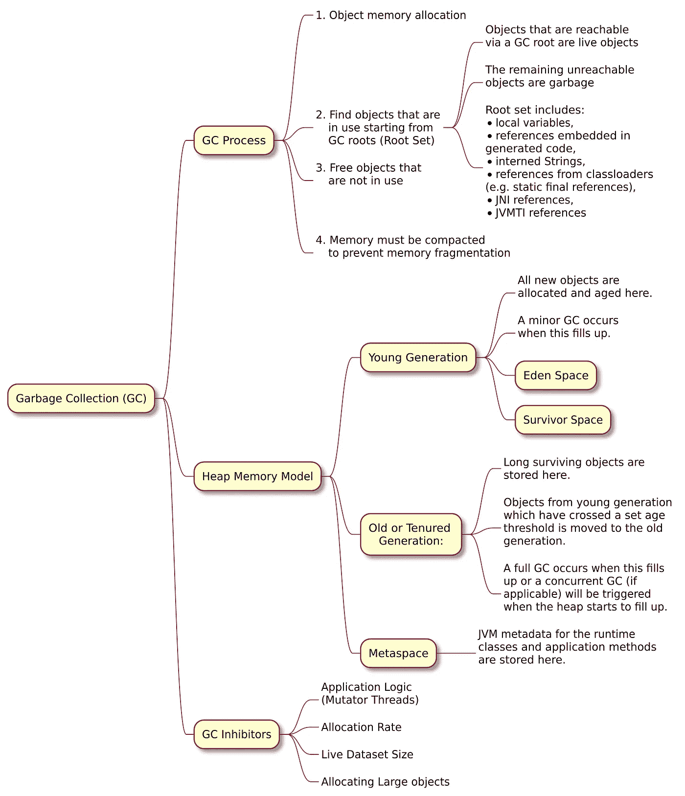
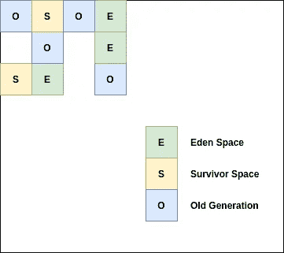
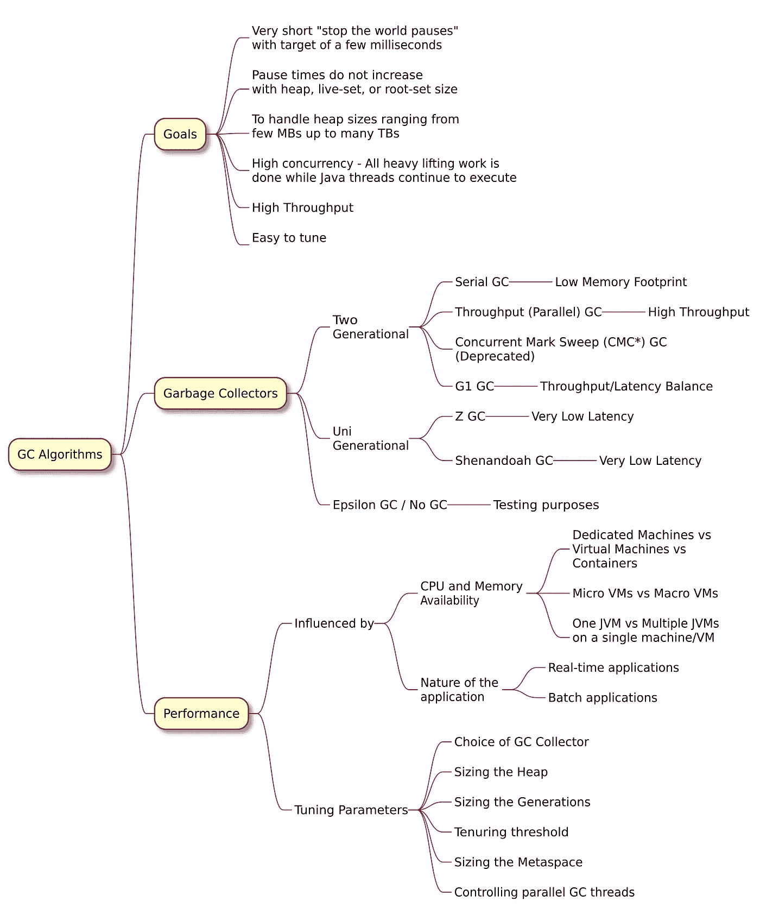

# JVM 垃圾收集基础知识

> 原文：<https://medium.com/javarevisited/jvm-garbage-collection-basics-edce6791ae98?source=collection_archive---------2----------------------->

[Unsplash](https://unsplash.com/@prasad_jayakumar/likes?utm_source=unsplash&utm_medium=referral&utm_content=creditCopyText) 上 [Arteum.ro](https://unsplash.com/@arteum?utm_source=unsplash&utm_medium=referral&utm_content=creditCopyText) 拍摄的照片

学习 JVM 垃圾收集和每种收集器算法背后的机制与学习 Java 语言特性一样重要。算法的高级细节提供了关于对象生命周期、可能的故障(如内存不足异常、内存泄漏等)的观点。，)以及如何避免失败。

# **垃圾收集**

垃圾收集是自动内存管理的一种形式。任何垃圾收集器的基本操作都是

*   对象内存分配
*   从 GC 根开始查找正在使用的对象— **标记**
*   不使用的自由对象— **清扫**
*   压缩内存以防止内存碎片— **压缩**

## **堆内存模型**

让我们重温经典，然后再看看闪亮的最新款

JVM 堆的概念视图

> 永久生成在 JDK 8 中已经完全删除。这项工作已经在 [bug](https://bugs.openjdk.java.net/browse/JDK-6964458) 下完成。选项 PermSize 和 MaxPermSize 在 JDK 8 中也被删除—来源:[Poonam Parhar 的博客](https://blogs.oracle.com/poonam/about-g1-garbage-collector,-permanent-generation-and-metaspace)

🙇*来源:《* [*Java 性能:深度》作者 Scott Oaks —第二版*](https://www.java67.com/2019/08/best-books-to-learn-java-virtual-machine-in-depth.html)

**年轻一代**

***伊甸园***

*   对象是在 eden 中分配的(包含了绝大多数年轻一代)。
*   当年轻代在收集期间被清除时，Eden 中的所有对象要么被移动，要么被丢弃:不在使用中的对象可以被丢弃，而在使用中的对象被移动到幸存者空间之一或旧代。
*   由于所有幸存的对象都被移动，年轻代在被收集时会被自动压缩:在收集结束时，Eden 和一个幸存空间是空的，年轻代中剩余的对象被压缩到另一个幸存空间中。

***幸存者空间***

*   幸存者空间被设计成允许对象(尤其是刚刚分配的对象)在年轻一代中保留几个 GC 周期。这增加了对象在提升到旧代之前被释放的可能性。
*   如果幸存者空间太小，对象将直接提升到老一代，这又会导致更多的旧 GC 周期。
*   处理这种情况的最好方法是增加堆的大小(或者至少是年轻一代),并允许 JVM 处理幸存者空间。
*   在极少数情况下，调整保有阈值或幸存空间大小可以防止对象升级到旧代。

**老(或终身)一代**

*   随着对象被转移到老一代，最终它也会被填满，JVM 需要找到老一代中不再使用的对象并丢弃它们。

**元空间**

*   当 [JVM 加载类](http://javarevisited.blogspot.sg/2012/07/when-class-loading-initialization-java-example.html#axzz4uMIMWleJ)时，它必须跟踪关于这些类的某些元数据。这占用了一个单独的堆空间，称为元空间。
*   元空间中的信息仅由编译器和 JVM 运行时使用，它保存的数据被称为类元数据。

💡元空间不保存类的实际实例(类对象)，或反射对象(例如，方法对象)；这些被保存在常规堆中。

碎片帐集

**GC 抑制剂**

> 繁忙的咖啡店里的咖啡师不会抱怨顾客排起的长队和永无止境的服务。相反，他们会对这项业务感到“高兴”。

类似地，[垃圾收集](https://www.java67.com/2020/02/50-garbage-collection-interview-questions-answers-java.html)也存在，因为应用程序做了一些“重要”的事情，而 GC 想要确保应用程序的生命延续。下面列出的抑制剂可能会降低 GC 的工作效率。

*   ***应用程序逻辑(Mutator 线程):*** 当 GC 线程跟踪对象引用或在内存中移动对象时，它们必须确保应用程序线程没有使用那些对象。当 GC 四处移动对象时尤其如此:对象的内存位置在操作过程中会发生变化，因此没有应用程序线程可以访问该对象。
*   **分配率:**创建需要更多内存分配的新对象的速率
*   **实时数据集大小:**对象存活时间不长的可能性会导致整体堆大小的消耗增加。
*   **分配大对象:**在堆受限的情况下，大对象会导致频繁的压缩需求。

# **垃圾收集器算法**

## **目标**

垃圾收集器通常有以下目标(说起来容易做起来难)

*   非常短的“停止世界暂停”，目标是几毫秒
*   暂停时间不会随着堆、活动集或根集的大小而增加
*   处理从几 MB 到几 TB 的堆大小
*   高并发性——所有繁重的工作都在 [Java 线程](/javarevisited/8-best-multithreading-and-concurrency-courses-for-experienced-java-developers-8acfd3b25094)继续执行的同时完成
*   高流通量
*   易于调整

## **垃圾收集器**

> 堆中的数据被划分为多个分配区域(或层代)，这些区域根据对象年龄(即幸存的 GC 迭代次数)保持独立。虽然有些收集器是单代的，但其他收集器使用两代:(1)年轻一代(进一步分为伊甸园和两个幸存者区域)和(2)老(或终身)一代。
> 来源:[伊努特·巴洛辛的博客](https://ionutbalosin.com/2019/12/jvm-garbage-collectors-benchmarks-report-19-12/)

**两代收藏家:**

**串行 GC** —该算法使用单线程来执行所有垃圾收集工作，这使得它相对高效，因为线程之间没有通信开销。它最适合单处理器机器，因为它不能利用多处理器硬件。

**吞吐量(并行)GC —** 该算法在年轻一代中使用标记复制，在老一代中使用标记扫描压缩。新旧收集都会触发 stop-the-world 事件，停止所有应用程序线程来执行垃圾收集。两个收集器都使用多线程运行标记和复制/压缩阶段，因此得名“并行”。

并行垃圾收集器适用于多核机器，如果你的**的主要目标是增加吞吐量**。由于更有效地利用系统资源，实现了更高的吞吐量:

*   在收集过程中，所有内核并行清理垃圾，从而缩短暂停时间
*   在垃圾收集周期之间，两个收集器都不消耗任何资源

**垃圾优先(G1) GC —** 这个收集器是一个服务器风格的垃圾收集器，面向具有大内存的多处理器机器。它以很高的概率满足垃圾收集(GC)暂停时间目标，同时实现高吞吐量。

*   G1 收集器在堆内存模型方面采用了不同的方法。**[**堆**](https://javarevisited.blogspot.com/2013/01/difference-between-stack-and-heap-java.html) **被分割成一组大小相等的堆区域**，每个堆区域都是一个连续的虚拟内存范围。**
*   **某些区域集被分配了与旧收集器相同的角色(eden、survivor、old ),但是它们没有固定的大小。**
*   **区域大小由 JVM 在启动时选择。JVM 一般以大约 2000 个区域为目标，大小从 1mb 到 32Mb 不等。G1 收藏家采取了不同的方法**

**有关更多详细信息，请参考[G1 气相色谱仪入门](https://www.oracle.com/technetwork/tutorials/tutorials-1876574.html)**

****

**G1 堆分配**

*****单代收藏家:*****

****Shenandoah GC—**Shenandoah 是一个低暂停时间垃圾收集器，它通过与正在运行的 Java 程序同时执行更多垃圾收集工作来减少 GC 暂停时间。Shenandoah **大部分 GC 是并发工作的，包括并发压缩**，这意味着它的暂停时间不再与堆的大小成正比。200 GB 堆或 2 GB 堆的垃圾收集应该具有类似的低暂停行为。**

**更多详情，请参考维基中的[实施细节](https://wiki.openjdk.java.net/display/shenandoah/Main)**

****Z GC —** ZGC 是一个并发的、单代的、基于区域的、NUMA 感知的压缩收集器。停止阶段仅限于根扫描，因此 GC 暂停时间不会随着堆或活动集的大小而增加。**

**欲了解更多详情，请参考 YouTube 上佩尔·利登关于 ZGC 的[会议](https://www.youtube.com/watch?v=88E86quLmQA)**

**最后，**

**[**Epsilon GC**](https://openjdk.java.net/jeps/318) (实验)——一个处理内存分配但 ***不实现任何实际内存回收机制*** 的 GC。一旦可用的 Java 堆耗尽， [JVM](https://javarevisited.blogspot.com/2019/04/top-5-courses-to-learn-jvm-internals.html) 就会关闭。设计用于内部 JDK 测试，但可以想象在两种情况下有用**

*   **非常短命的程序**
*   **精心编写的程序重用内存，从不执行新的分配**

****

**垃圾收集算法**

**出于实际目的，我将只分享与以下三个 [Java 版本](https://en.wikipedia.org/wiki/Java_version_history)相关的细节**

*   **Java SE 8 — LTS**
*   **Java SE 11 — LTS**
*   **Java SE 15**

**有两种可能 Java 用户(我猜)**

1.  ****荒野探险者**谁想要探索和使用所有可能的新特性，并跟上 Java 的最新更新(无论是开发还是生产)。**
2.  ****希望平台稳定可靠的企业用户**。他们通常更喜欢 LTS 版本。**

**我希望，有一个 Java 的巴别塔😄可以连接两个世界的桥梁。当然，我们可以使用 Kotlin(改天再写博客)。**

****

**相对于 JDK 版本的 GC 算法状态**

**在我的下一篇博客中，我将详细介绍 GC 算法，并亲自动手操作 GC 工具，为性能和健康设置 JVM 选项[。](https://www.java67.com/2016/08/10-jvm-options-for-java-production-application.html)**

**如果你喜欢我的写作风格，请将博客分享/转发给你的开发伙伴😆**

****参考文献****

*   **[“Java 性能:深度”作者 Scott Oaks —第二版](https://www.oreilly.com/library/view/java-performance-2nd/9781492056102/)**
*   **[Java 垃圾收集手册](https://plumbr.io/java-garbage-collection-handbook)**
*   **[G1 垃圾收集器入门](https://www.oracle.com/technetwork/tutorials/tutorials-1876574.html)**
*   **[Java 垃圾收集基础知识](https://www.oracle.com/webfolder/technetwork/tutorials/obe/java/gc01/index.html)**
*   **[关于 G1 垃圾收集器、永久生成和元空间](https://blogs.oracle.com/poonam/about-g1-garbage-collector,-permanent-generation-and-metaspace)**
*   **JVM 垃圾收集器基准报告 19.12**