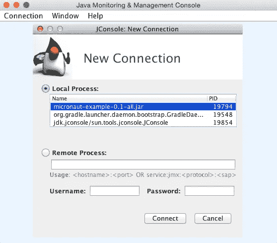
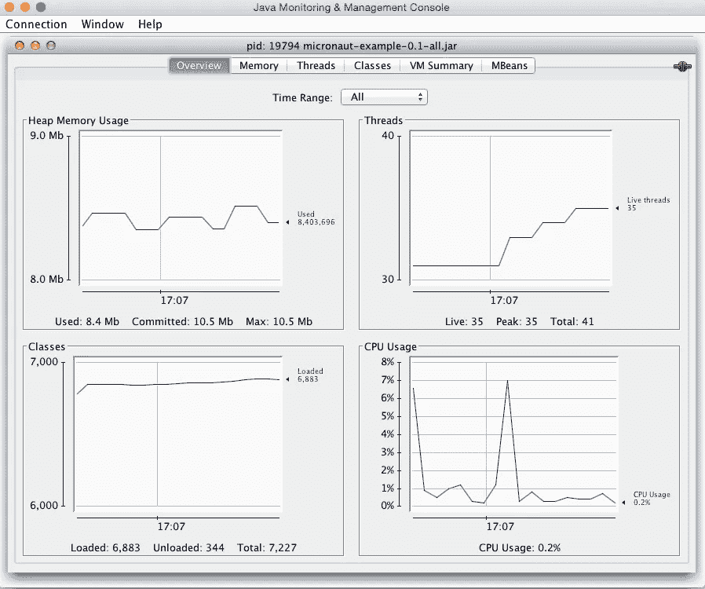

# 10MB 的 JVM WebService？- Micronaut 微服务示例

> 原文：<https://medium.com/javarevisited/jvm-webservice-in-10mb-micronaut-microservice-example-749755976680?source=collection_archive---------0----------------------->

*如果你正在使用 Spring Boot 开发微服务，你应该知道每次 JVM 启动需要多少时间。在这个无服务器技术的新时代，人们正在谈论在几毫秒甚至更短的时间内产生新的服务器，让我们看看如何利用 Micronaut 及其 CLI 来创建运行在< 10MB 内存中的高效微服务。*


[Micronaut](https://micronaut.io) —是由 Graeme Rocher 和他的团队【OCI[的团队构建了 Grails 框架】创建的开源框架](https://objectcomputing.com)

# 证明文件

我花更多的时间阅读文档，而不是查看实际的实现代码。Micronaut 文档对于一个非常新的框架来说是非常优秀的，它有大量的文档，其中还内置了反馈。虽然大多数特性几乎与 Spring Boot 的[相似，但 Micronaut 直接使用 JSR 的规范作为其实现模式。](http://www.java67.com/2019/01/top-5-spring-boot-annotations-java-programmers-should-know.html)

# 准时到提前

Micronaut 与当前版本的 Spring Boot(撰写本文时为 2.1+版本)的不同之处在于更快的启动时间。大多数不再使用 JVM 语言的开发人员抱怨内存占用和体系结构会大大降低 JVM 的性能。

Android 平台通过利用提前编译(AOC 参考—[InfoQ](https://www.infoq.com/news/2014/07/ahead-of-time-compiler-os)2014 年 7 月)解决了更快的启动时间，这为他们的应用程序实现超级快速的启动时间铺平了道路。

Micronaut 使用 AOC，这为无服务器的未来创造了使用 Java 框架的新的有效方法。

# 命令行界面(CLI)

更不用说来自`grails-cli`的灵感了，`micronaut-cli`提供了丰富的特性来创建控制器、beans 和模型类，以及它们对应的自动生成测试代码的测试类——几乎解决了大多数框架遗漏的测试代码生成问题。

## 装置

如果您使用的是 Mac，请遵循此处[的步骤](https://docs.micronaut.io/latest/guide/index.html#installHomebrew)
如果您使用的是基于 Unix 的系统，请遵循此处[的步骤](https://docs.micronaut.io/latest/guide/index.html#installSdkman)。
如果您使用的是 Windows，请从[开始执行步骤](https://docs.micronaut.io/latest/guide/index.html#installWindows)
一旦安装完毕，`cli` 就可以作为`mn`引用

## 用法(mn 帮助)

```
create-app — Creates an application
create-cli-app — Creates a command line application
create-federation — Creates a federation of services
create-function — Creates a serverless function application
create-profile — Creates a profile
```

# 创建我们的第一个微机器人服务

使用`micronaut cli`，让我们开始创建第一个`micronaut` 应用程序。

`mn create-app micronaut-example`

您可以看到一个名为`micronaut-example`的新文件夹，其结构如下:

```
[micronaut-example](/Users/apple/Downloads/micronaut-example)
├── [Dockerfile](/Users/apple/Downloads/micronaut-example/Dockerfile)
├── [build.gradle](/Users/apple/Downloads/micronaut-example/build.gradle)
├── [gradle](/Users/apple/Downloads/micronaut-example/gradle/)
│   └── [wrapper](/Users/apple/Downloads/micronaut-example/gradle/wrapper/)
│       ├── [gradle-wrapper.jar](/Users/apple/Downloads/micronaut-example/gradle/wrapper/gradle-wrapper.jar)
│       └── [gradle-wrapper.properties](/Users/apple/Downloads/micronaut-example/gradle/wrapper/gradle-wrapper.properties)
├── [gradlew](/Users/apple/Downloads/micronaut-example/gradlew)
├── [gradlew.bat](/Users/apple/Downloads/micronaut-example/gradlew.bat)
├── [micronaut-cli.yml](/Users/apple/Downloads/micronaut-example/micronaut-cli.yml)
└── [src](/Users/apple/Downloads/micronaut-example/src/)
    ├── [main](/Users/apple/Downloads/micronaut-example/src/main/)
    │   ├── [java](/Users/apple/Downloads/micronaut-example/src/main/java/)
    │   │   └── [micronaut](/Users/apple/Downloads/micronaut-example/src/main/java/micronaut/)
    │   │       └── [example](/Users/apple/Downloads/micronaut-example/src/main/java/micronaut/example/)
    │   │           └── [Application.java](/Users/apple/Downloads/micronaut-example/src/main/java/micronaut/example/Application.java)
    │   └── [resources](/Users/apple/Downloads/micronaut-example/src/main/resources/)
    │       ├── [application.yml](/Users/apple/Downloads/micronaut-example/src/main/resources/application.yml)
    │       └── [logback.xml](/Users/apple/Downloads/micronaut-example/src/main/resources/logback.xml)
    └── [test](/Users/apple/Downloads/micronaut-example/src/test/)
        └── [java](/Users/apple/Downloads/micronaut-example/src/test/java/)
            └── [micronaut](/Users/apple/Downloads/micronaut-example/src/test/java/micronaut/)
                └── [example](/Users/apple/Downloads/micronaut-example/src/test/java/micronaut/example/)
```

默认情况下 cli 使用 [Gradle](http://www.java67.com/2018/04/10-tools-java-developers-should-learn.html) ，如果你想使用 [Maven](http://www.java67.com/2018/02/6-free-maven-and-jenkins-online-courses-for-java-developers.html) 作为构建工具，你可以使用`mn create-app micronaut-example --build maven`

一旦您进入项目目录，cli 就会变成 micronaut 项目特定的 cli，并提供不同的选项(`mn help`或`mn --help`):

```
create-bean - Creates a singleton bean
create-job - Creates a job with scheduled method
create-client - Creates a client interface
create-controller - Creates a controller and associated test
create-websocket-client - Creates a Websocket client
create-websocket-server - Creates a Websocket server
```

让我们创建一个新的控制器来公开一个 Hello REST 端点

`mn create-controller HelloController`

请注意，创建了 2 个类

```
src/main/java/micronaut/example/HelloController.java
src/test/java/micronaut/example/HelloControllerTest.java
```

`HelloController.java`和`HelloControllerTest.java`的内容如下:

```
package micronaut.example;import io.micronaut.http.annotation.Controller;
import io.micronaut.http.annotation.Get;
import io.micronaut.http.HttpStatus;@Controller(“/hello”)
public class HelloController {@Get(“/”)
public HttpStatus index() {
   return HttpStatus.OK;
  }
}
```

```
package micronaut.example;import io.micronaut.context.ApplicationContext;
import io.micronaut.http.HttpStatus;
import io.micronaut.http.client.RxHttpClient;
import io.micronaut.runtime.server.EmbeddedServer;
import org.junit.Test;import static org.junit.Assert.assertEquals;public class HelloControllerTest { @Test
   public void testIndex() throws Exception {
     try(EmbeddedServer server = ApplicationContext.run(EmbeddedServer.class)) {
         try(RxHttpClient client = server.getApplicationContext().createBean(RxHttpClient.class, server.getURL())) { assertEquals(HttpStatus.OK, client.toBlocking().exchange("/hello").status()); }
     }
   }
}
```

类似于 [Spring Boot](http://www.java67.com/2018/06/5-best-courses-to-learn-spring-boot-in.html) ，我们可以通过简单地使用`./gradlew clean build`构建项目来创建 fat jars。在构建目录下，您可以找到 2 个不同的 jar。

```
[micronaut-example/build/libs](/Users/apple/Downloads/micronaut-example/build/libs)
├── [micronaut-example-0.1-all.jar](/Users/apple/Downloads/micronaut-example/build/libs/micronaut-example-0.1-all.jar)
└── [micronaut-example-0.1.jar](/Users/apple/Downloads/micronaut-example/build/libs/micronaut-example-0.1.jar)
```

`micronaut-example-0.1-all.jar`具备启动示例服务器所需的所有条件。

使用下面的命令
`java -Xmx10M -jar micronaut-example-0.1-all.jar`启动内存为 10MB 的 JVM

您可以看到服务器在`[http://localhost:8080/](http://localhost:8080/.)`启动并运行。如果要使用不同的端口，请使用属性对其进行配置。

# 使用 JConsole 的虚拟机图

使用 JConsole，让我们连接到 Micronaut JVM，先睹为快堆的大小。`jconsole`与 OpenJDK 打包在一起，可以直接从`java/bin`文件夹启动。

在 JConsole 启动期间，我们需要选择需要连接的 JVM 进程。在我们的例子中，选择 micronaut JVM。



JConsole 启动屏幕

一旦连接上，我们可以看到 [JVM](http://www.java67.com/2016/08/10-jvm-options-for-java-production-application.html) 的堆图的大小——它的内存不到 9Mb！



Micronaut JVM 的堆大小

# 将来的

有了 Spring 社区创建的强大生态系统，很难用这些新框架来颠覆企业世界。我对微型机器人的未来充满希望。我正在等待其他框架(尤其是 Spring)采用提前编译来减少启动时间。

*本文根据我在*[*tech primers*](https://www.youtube.com/TechPrimers)中同一主题的 [*youtube 视频*](https://www.youtube.com/watch?v=YYvY9pc3Shw)