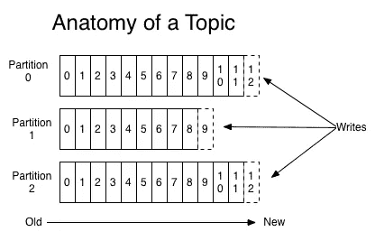
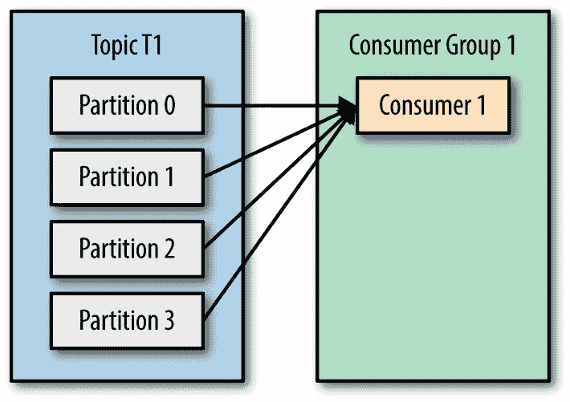
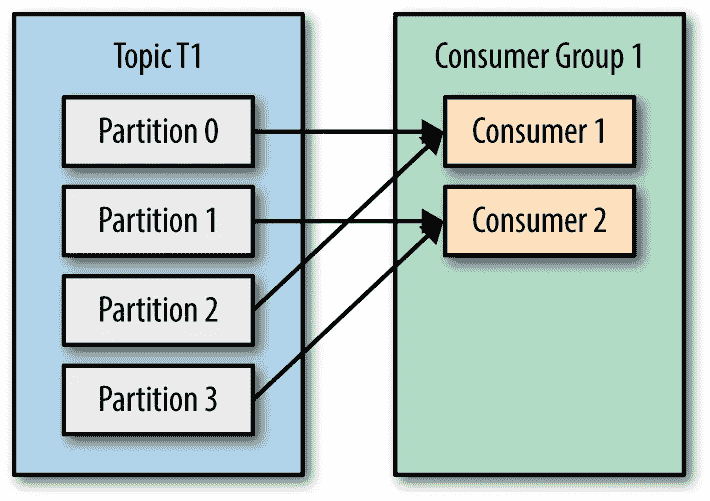
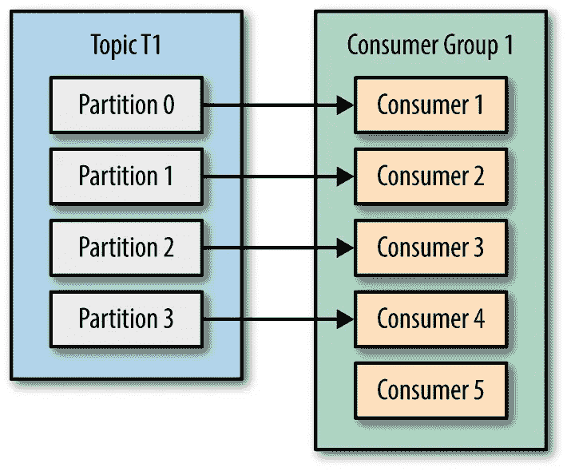

# 6 分钟内卡夫卡分区和消费群

> 原文：<https://medium.com/javarevisited/kafka-partitions-and-consumer-groups-in-6-mins-9e0e336c6c00?source=collection_archive---------0----------------------->

在我之前的文章中，我们已经讨论了卡夫卡是如何工作的，并且浏览了一些基本的卡夫卡术语。在本文中，我们将回顾一下 [**【卡夫卡】**](/javarevisited/top-10-apache-kafka-online-training-courses-and-certifications-621f3c13b38c) 中的分区和消费群是如何工作的。

如果你没有读过我的前一篇文章，或者你不熟悉卡夫卡，我建议你读一读，因为它会帮助你对卡夫卡的作品有一个基本的了解。

# 那么，什么是隔断呢？

在谈论分区之前，我们需要理解什么是主题。在 Kafka 中，主题基本上是一个存储单元，生产者发送的所有消息都存储在这个存储单元中。通常，相似的数据存储在单独的主题中。例如，您可以有一个名为“用户”的主题，其中仅存储用户的详细信息，或者您可以有一个名为“付款”的主题，其中仅存储所有与付款相关的详细信息。一个主题可以进一步细分为多个存储单元，主题的这些细分称为**分区**。

默认情况下，创建的主题只有一个分区，发布到该主题的任何消息都存储在该分区中。如果您将一个主题配置为具有多个分区，那么生产者发送的消息将存储在这些分区中，这样就不会有两个分区具有相同的消息/事件。

一个主题中的所有分区也有它们自己的**偏移量**(如果你不知道什么是偏移量，我推荐你查看我讨论过的[这篇文章](/@ahmedgulabkhan/a-basic-introduction-to-kafka-a7d10a7776e6)

例如，一个生产者向一个包含 3 个分区的 Kafka 主题发送消息，如下所示:

# 那么，什么是消费群体呢？

一群消费者可以组成一个组，以便合作和消费来自一组主题的消息。这个消费者分组被称为**消费者组**。如果两个消费者订阅了同一个主题，并且出现在同一个消费者组中，那么这两个消费者将被分配不同的分区集，并且这两个消费者都不会接收到相同的消息。

*注意:如果多个消费者从同一个主题消费，消费群可以帮助获得更高的消费率。*

现在，让我们通过几个场景来更好地理解上述概念

**场景 1** :假设我们有一个主题，有 4 个分区和一个消费者组，其中只有一个消费者。消费者已经订阅了主题 1，并被分配使用所有分区中的内容。下图描述了这种情况:

**场景 2** :现在让我们考虑一下我们的消费群体中有两个消费者。这两个消费者将被分配从不同的分区读取数据—消费者 1 被分配从分区 0、2 读取数据；和被分配从分区 1、3 读取的消费者 2。

*注:卡夫卡将一个主题的分区分配给一个消费群中的消费者，这样每个分区正好被消费群中的一个消费者消费。Kafka 保证一条消息只被消费者群体中的一个消费者阅读。*

由于存储在同一主题的各个分区中的消息是不同的，所以两个使用者永远不会读取同一条消息，从而避免了在使用者端多次使用相同的消息。下图描述了这种情况:

**但是，如果一个消费群中的消费者数量多于分区数量呢？查看场景 3**

**场景 3** :假设消费者组中有 5 个消费者，多于主题 1 的分区数量，那么每个消费者将被分配一个分区，剩下的消费者(消费者 5)将被闲置。下图描述了这种情况:

**好吧，那么如果您希望多个消费者从同一个分区读取数据呢？查看场景 4**

**场景 4** :如果您想要分配多个消费者从同一个分区中读取数据，那么您可以将这些消费者添加到不同的消费者组中，并让这两个消费者组都订阅主题 1。这里，来自 TopicT1 的 Partition0 的消息由 ConsumerGroup1 的 Consumer1 和 ConsumerGroup2 的 Consumer1 读取。下图描述了这种情况:

## 所有这些似乎都没问题，但是什么时候应该将消费者添加到同一个消费者组，什么时候应该将消费者添加到不同的消费者组呢？

*   如果您的目标是获得更高的吞吐量或增加特定主题的消耗率，那么在同一个消费者组中添加多个消费者将是一个不错的选择。在一个使用者组中，最多可以有与一个主题的分区数量相等的使用者，添加的使用者多于分区数量会导致额外的使用者保持空闲，因为 Kafka 认为不能将两个分区分配给一个使用者组中的使用者。当从一个主题中消费的消费者的数量等于该主题中分区的数量时，每个消费者将从单个主题中读取消息，并且消息消费将并行发生，从而增加了消费率。
*   但是，如果您有一个用例，您希望多个消费者使用一个主题的相同消息，那么让多个消费者组订阅该主题，并根据您的需求将消费者添加到这些消费者组中，这将是您可以利用的。

# 一些常见的问答:

问:在卡夫卡那里，有一个消费群体是强制性的吗？

A.是的，强制规定卡夫卡哪个消费者属于哪个消费群体。如果您没有在应用程序中设置消费者组 id，将会出现异常。如果您使用 Kafka CLI 命令启动一个消费者来消费某个主题，则会创建一个名为**console-consumer-<some _ random _ number>**的新随机消费者组，该消费者会自动归入该消费者组。

问:如果一个新用户加入了一个用户组，如何将分区分配给这个新用户？

A.假设我们有一个包含 3 个分区的主题；以及由 2 个消费者组成的 1 个消费者组。在这 3 个分区中，2 个将被分配给一个用户，剩余的分区将被分配给另一个用户。现在，考虑这两种情况

*   **案例 1** :如果一个新的消费者加入消费者组，**重新平衡**发生，每个消费者现在被分配到一个单独的分区(因为我们有相同数量的分区和消费者)。
*   **情况 2** :如果一个消费者停止使用，那么消费者组中只剩下一个消费者，所有分区都将通过重新平衡分配给这个消费者。

问:卡夫卡的再平衡是什么？

A.**重新平衡**是在给定消费者组内的消费者之间重新分配分区所有权，从而为消费者组中的每个消费者分配一个或多个分区。重新平衡发生在以下情况:

*   一个新的消费者加入了消费者群体
*   一个现有的消费者倒下了
*   添加了新的分区
*   现有消费者被**组协调人**视为死亡

问:什么是团队协调员？

A.组协调器是一个 kafka 代理，它接收来自一个消费者组的所有消费者的心跳。每个消费者团体都有一个团体协调员。

问:什么是团队领导？

A.第一个加入消费者团体的消费者被称为该消费者团体的团体领导者

问:我们可以减少一个主题中的分区数量吗？

A.Apache Kafka 不支持减少主题的划分。因为，发送到一个主题的所有数据都被发送到所有分区，删除其中一个分区就意味着数据丢失。

你可以浏览该系列中更多的卡夫卡文章:

1.  阿帕奇卡夫卡:基础介绍
2.  [使用 Docker 在本地设置 Kafka 的 3 个简单步骤](/@ahmedgulabkhan/3-simple-steps-to-set-up-kafka-locally-using-docker-b07f71f0e2c9)

*关注卡夫卡系列的下一篇博客。我也将发布更多关于软件工程概念的文章。*

**你也可以在** [GitHub](https://github.com/ahmedgulabkhan)
[dev . to](https://dev.to/ahmedgulabkhan)上找到我