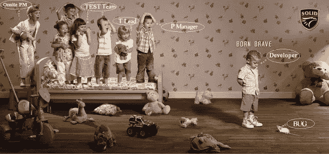
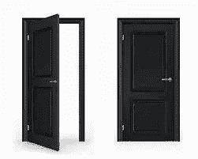

# 保持冷静和神盾局

> 原文：<https://medium.com/javarevisited/keep-calm-and-s-o-l-i-d-7ab98d5df502?source=collection_archive---------5----------------------->

2012 年冬天，我有机会参加了罗伯特的演讲。c .马丁(又名鲍勃叔叔)都柏林。我觉得很棒。鲍勃大叔是[干净代码的作者(我拿到了他的亲笔签名:p)](http://www.amazon.com/Clean-Code-Handbook-Software-Craftsmanship/dp/0132350882) ，也是软件行业非常有影响力的人物。

自从那次演讲后，我一直想写一些关于他对这个行业的贡献的东西，并把它贴在我的博客上。

他对我们说的最后一句话是，尽可能多地阅读……
在开始写这篇文章之前，我想了一会儿这些话……
我认为这是一个很好的建议。没有人否认真实的经历可能是最好的，但读书也很重要。他们带着前人的经验，也带着那些人在途中发现并记录下来的规则和原则。不要误会，严格遵守规则和原则并不总是能保证成功(“世界在不断变化”)，但在面临巨大挑战时，理解它们会有很大帮助。

所以最后我决定写这篇关于 Bob 叔叔对面向对象编程世界的最大贡献之一的文章，那就是 S.O.L.I.D 原则。

**单一责任原则** 如果我们有一个类有多种责任/特性/改变的理由；对其进行的修改会带来影响该类其他部分的风险(其他责任/功能/变更原因)。

换句话说:做多件事的类很难维护。

SRP 说:“一个类应该只有一个改变的理由”。

让我们看一个例子:

如您所见，这是一个有多种原因需要更改的类的明显示例:

*   未来的业务需求可能需要我们改变计算方法(例如，不同的指标)
*   未来的业务需求可能需要我们改变结果的保存方式。
*   未来的业务需求可能需要我们改变在身体质量指数创建培训计划的方式。

我们不希望所有上面提到的需求变化影响到这个类。如果我们不在开发的早期阶段寻求粒度，我们将很容易以难以维护的软件而告终。

我们需要做的是思考这个班级的唯一目标。我们还可以思考这个类肯定不会做什么，这样我们就可以区分其他不应该改变的原因。在修复违反 SRP 的情况时，请遵循这种思路，它将帮助您发现需要提取的类:

**开闭原理**

开闭原则背后的动机是在不修改现有代码的情况下扩展/改变行为。这个原则说:

“模块应该对扩展开放，但对修改关闭”。

你可能认为，这听起来很矛盾，但是在许多面向对象编程语言中，比如 Java，有一些机制允许你这样做。

其中一个机制是多态性。通过定义抽象函数/方法

让我们先来看看对开闭原则的违反:

Chef.java

Menu.java

NonVeg.java

Veg.java

在上面的代码中，如果一个新的需求要求我们做一些不同于素食和非素食的其他类型的饭菜，那么这个类就需要修改。上面给出的例子是不可维护的。

让我们看看如何使用多态性来删除条件逻辑并改进解决方案:

修改 Chef 类以删除 if 语句

膳食现在有了一个抽象的方法

NonVeg 类必须提供实现

Veg 类必须提供一个实现

正如你所看到的，解决方案更加灵活，现在更容易维护，我们也摆脱了一个邪恶的标志，从长远来看，它只会在操作时引起问题。包含敏感方法的类 Meal 对扩展开放，但对修改关闭。

OCP 原则非常强大，但我们也必须记住，通过增加抽象层次([作为替代，你也可以考虑组合与继承](http://en.wikipedia.org/wiki/Composition_over_inheritance))，我们也增加了复杂性，理解这一原则应该只应用于那些更有可能经常发生需求变化的地方是非常重要的。

**利斯科夫替代原理**

这个原则是关于子类代替基类的行为。

如果发生这种情况，当在程序的其他部分使用/调用这些新类时，它们可能会产生不希望的效果。

Liskov 的替换原则指出，如果客户端正在调用基类，那么对基类的引用应该能够被派生类替换，而不会影响基类的功能。

让我们看一个违反这一原则的例子:

Duck.java

野鸭还会嘎嘎叫和游泳。但是鸭子玩具呢？

DuckToy.java

正如你所看到的，一些鸭子玩具需要电池，而且它们并不真的嘎嘎叫，它们只是发出声音。即使没有编译错误，并且将 duck toy 包含在这个继承链中看起来很诱人，这也明显违反了 Liskov 的替换原则。原因是，如果客户端实例化基类，派生类 DuckToy 不能替换它，因为功能受到影响。

Pond.java

在这种情况下，一个解决方案可以是拥有一个单独的类来表示鸭子玩具。

一个独立的 DuckToy 类，与真正的野鸭无关(不再扩展 Duck)

**界面偏析原理**

这是一个非常容易理解的原则，它说客户不应该被强迫实现他们不使用的接口。看一看对这一原则的违反:

每种动物都会飞、跑和游泳吗？我不这么认为…

这里我们违反了接口隔离原则。狗不会飞！

太可怕了。所以有很多方法可以避免这种情况。
一个例子是根据需要组合特定的接口:

流道界面

游泳者界面

传单界面

海鸥是游泳者和飞行者

这很有道理，我们可以说狗是跑步者和游泳者，但绝对不是飞行者。使用方法较少的接口有助于我们避免违反接口分离原则。

**依存倒置原则**

这个原则说“不要依赖任何具体的东西，只依赖抽象的东西。”所以确保你所有的依赖都指向抽象的东西。这将为您的代码带来安全性，同时也使其更加灵活。也许你认为这个原则有点激进；但是很明显，在现实中严格遵循它是非常困难的(甚至是不可能的)。当你调用一个函数时，你可以使用一个技巧来验证你是否遵循了这个原则，那就是编程到接口而不是实现。

这个原则在实践中的一个很好的例子是模板设计模式。让我们先来看看一个常见的违反原则的情况:

PizzaMaker.java

上面的例子是一个糟糕的编码类，它制作了两种披萨……这段代码中有很多不好的地方，但我将只关注对我们正在讨论的原则的违反。因为对 pizza 对象的每一次调用都是对一个具体方法的调用，所以我们得到的是非常僵化和不灵活的东西。每一种披萨都有一些配料是必须的，比如基础、番茄、奶酪和牛至，但其余的都是可选的，所以:如果这不是我们所关心的，为什么我们要关心调用具体的方法来设置那些额外的配料呢？

在下面的代码片段中，引入了一个模板方法来抽象可选部分，并让子类实现它们。

比萨制造商现在是抽象的

肉类比萨饼模板方法的自定义实现

素食比萨饼模板方法的自定义实现

S.O.L.I.D 原则是由 Robert C.Martin 提出的，但是首字母缩写词是由 Michael Feathers 在 2000 年创造的，今天它们在面向对象软件的世界中已经广为人知，在书籍和互联网上有很多关于它们的文献。

在这篇文章的最后，我想和你分享一个我在网上找到的很棒的播客采访，是鲍勃叔叔，S.O.L.I.D .详细解释道。

【http://javing.blogspot.com/2013/09/keep-calm-and-solid.html】最初发表于