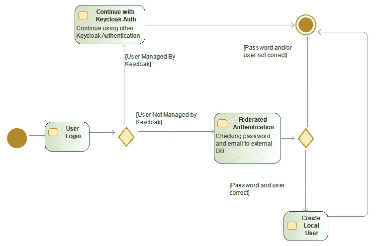

# 与外部现有数据库集成

> 原文：<https://medium.com/javarevisited/keycloak-integration-with-existing-database-587c119db3ae?source=collection_archive---------1----------------------->

我曾多次使用 Keycloak 作为身份和访问管理解决方案。我遇到的一个问题是，当我们想将我们的身份验证迁移到 keycloak 时，我们仍然有许多用户和密码存储在当前的外部数据库中。那么解决办法是什么呢？

**问题陈述**

1.  将身份验证迁移到 Keycloak
2.  现有用户仍在当前数据库中维护(keycloak 之外)
3.  用户唯一 id 将是其电子邮件

**解决方案**

解决方案是:Keycloak 的用户联盟。使用这种解决方案，当我们尝试验证用户时，它仍然会查询现有的数据库。如果认证成功，Keycloak 将在其[数据库](https://javarevisited.blogspot.com/2018/05/top-5-sql-and-database-courses-to-learn-online.html)中创建相似用户，并将认证链接到该用户联盟中。

这个解决方案的业务流程如图 1 所示。

[](https://javarevisited.blogspot.com/2019/10/top-5-coursera-professional-certificates-for-programmers-IT-professionals.html)

图一。使用外部数据库的 Keycloak 用户联盟

这种用户联盟的解决方案可以在我的 [github](https://github.com/rsatrio/Keycloak-Federation-ExistingDB) 上找到(别忘了给个星)。需要注意几件事:

1.  创建扩展 AbstractUserAdapterFederatedStorage 并从 keycloak 库中实现 UserModel 的类

```
public class UserData extends AbstractUserAdapterFederatedStorage  implements UserModel {
```

2.创建实现 UserStorageProvider、UserLookupProvider 和 CredentialInputValidator 的类。不要忘记覆盖 isValid()方法。这是执行身份验证过程的方法。

```
public class FederationDBProvider  implements UserStorageProvider,
UserLookupProvider
,CredentialInputValidator
```

3.为编号(2)创建工厂类

```
public class FederationDBProviderFactory implements UserStorageProviderFactory<FederationDBProvider> {
```

4.使用 keycloak-core 和 keycloak-server-spi 库

5.配置 keycloak 以使用正确的 jdbc 库和 jndi 来连接到该数据库

6.在 **resources** 中创建 META-INF/services 文件夹，其中包含一个名为"**org . key cloak . storage . userstorageproviderfactory**的文件，该文件包含我们创建的工厂类(在本例中为" com . rizky . key cloak . federationdb . federationdbproviderfactory "类)。

我们结束了。请注意，实际配置将是相当繁琐的。你可以用我的 [github repo](https://github.com/rsatrio/Keycloak-Federation-ExistingDB) 作为这种场景的起点。如果你有任何问题，请留下你的评论。

**参考文献**

1.  [https://github.com/rsatrio/Keycloak-Federation-ExistingDB](https://github.com/rsatrio/Keycloak-Federation-ExistingDB)