# WSO2 中的密钥库和信任库是🔐

> 原文：<https://medium.com/javarevisited/keystores-and-truststores-in-wso2-is-b18df7bd9382?source=collection_archive---------0----------------------->

大多数程序员感到困惑的最常见的术语之一是[密钥库](https://javarevisited.blogspot.com/2012/03/add-list-certficates-java-keystore.html)。大多数人不了解密钥库的重要性和功能。为了理解密钥库的重要性以及 WSO2 是如何使用密钥库的，首先，我们需要知道为什么我们需要[密钥库](https://javarevisited.blogspot.com/2012/09/difference-between-truststore-vs-keyStore-Java-SSL.html)。要开始学习它，我们首先需要了解什么是加密和解密。

# 什么是加密和解密？

任何应用程序最重要的方面之一是它应该有一个加密和解密数据的过程。为了理解密钥库在加密过程中的作用，我们首先需要理解什么是加密。

用最直白的话说，加密意味着使用一些数学和一组指令来隐藏和保护数据。这些数学和指令使纯文本文字变成一种不可理解的文本，称为密码文本。要解开密文并查看纯文本，我们需要解密它。

[](http://java67.blogspot.sg/2012/09/keytool-command-examples-java-add-view-certificate-ssl.html)

加密和解密过程

有两种主要的加密类型。

*   对称加密—在这种情况下，我们使用相同的密钥来加密和解密数据。
*   不对称加密—我们使用两个独立的密钥来加密和解密数据。

现在让我们来了解一下不对称加密，因为它对于密钥库是必不可少的。

## 不对称加密

不对称加密是一种使用公钥和私钥加密和解密数据的方式。在非对称加密中，公钥与外部方共享，而私钥保密。

当公钥加密数据时，其对应的私钥解密数据。这就是为什么这也被称为公钥加密和公钥密码学。

不对称加密是一种通过不安全的公共渠道来验证你从未见过的第三方的方法。举个例子，在阅读本文时，您正在使用非对称加密。你能看到在你的网址中有一个安全挂锁图标或 [HTTPS](https://javarevisited.blogspot.com/2013/07/how-ssl-https-and-certificates-works-in-java-web-application.html) 吗？这两种情况都表明您已经连接到使用 [SSL/TLS](https://javarevisited.blogspot.com/2022/02/top-5-courses-to-learn-ssl-and-tls-in.html) (安全套接字层/传输层安全)证书和安全 TLS 协议的网站。这实际上被称为 SSL/TLS 握手过程。SSL/TLS 握手的步骤是，

*   “客户端问候”消息—客户端通过向服务器发送“问候”消息来发起握手。这将包括客户端支持的 TLS 版本、受支持的密码套件以及一个被称为“客户端随机”的随机字节字符串。密码套件是一组用于建立安全通信连接的加密算法。这些通常有密钥交换算法、批量加密算法和消息认证码算法。
*   “服务器问候”消息—作为对客户端“问候”消息的回复，服务器会发送一条消息，其中包含服务器的 SSL 证书、服务器选择的密码套件以及“服务器随机”，即服务器生成的另一个随机字节字符串。
*   认证——客户端向颁发证书的认证机构(CA)验证服务器的 [SSL 证书](https://www.java67.com/2012/09/keytool-command-examples-java-add-view-certificate-ssl.html)。
*   前置密码—客户端发送一个随机字节串，即“前置密码”。预主密钥用公钥加密，只能由服务器用私钥解密(客户端从服务器的 SSL 证书获取公钥)
*   使用私钥—服务器解密预主密钥。
*   创建会话密钥—客户端和服务器都从客户端随机密钥、服务器随机密钥和预主控密钥中生成会话密钥。
*   客户端准备好了——客户端发送用会话密钥加密的“完成”消息。
*   服务器准备就绪—服务器发送一条用会话密钥加密的“完成”消息。
*   实现安全对称加密—握手完成，通信使用会话密钥继续进行。

虽然理论看起来上面的 TLS 连接很难理解。为了确保你得到正确的答案，我们将使用下面的例子。

假设你的浏览器是谷歌浏览器，你想登录 YouTube。那么步骤将如下。

1.  你在浏览器的地址栏中输入`https://www.youtube.com`，然后输入回车，说*给我 youtube。*
2.  然后，YouTube 发*当然，这是我的证书，里面有我的公钥。它是由谷歌 CA 签署的。*
3.  然后浏览器说，*哦！我也知道 Google CA，我信任 Google。而且我还有 Google CA 的公钥。所以我会核实一下。*
4.  验证公钥后，浏览器对`https://www.youtube.com` *说我信任 Google CA，看来你就是你所说的那个人。因此，我创建了一个随机密钥，并用公钥对其进行加密。*
5.  然后`https://www.youtube.com`说*哇！明智的选择。我将使用我的私钥解密它，这样我就可以拥有你的密钥。*
6.  之后，浏览器和`https://www.youtube.com`都是唯一拥有随机密钥的人。因此，他们可以通过使用该密钥加密数据来共享数据。

为了更好地理解这个概念，您可以按照下图中的步骤进行操作。

[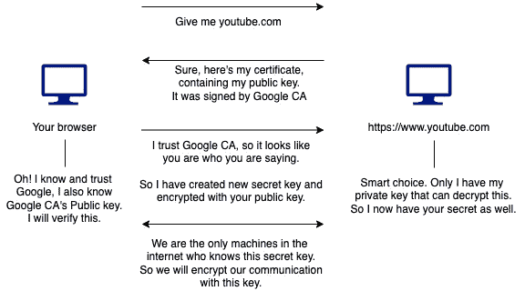](https://javarevisited.blogspot.com/2019/10/top-5-coursera-professional-certificates-for-programmers-IT-professionals.html)

简单来说就是 TLS 握手

# 密钥库和信任库

那么什么是密钥库呢？密钥库是保存信任链的密钥和证书的存储库。在密钥库中，您可以存储私钥和公钥。[信任库](https://www.java67.com/2012/12/difference-between-truststore-vs.html)是另一个受密码保护的存储库，它存储数字证书。

# WSO2 身份服务器中的密钥库和信任库

WSO2 有一个默认的 keystore 文件和 truststore 文件，它们位于`<IS_HOME>/repository/resources/security`目录中。

*   `wso2carbon.jks` —这是默认的密钥库，包含私钥和自签名公钥证书。
*   `client-truststore.jks` —这是默认的信任库，其中包含可以验证第三方系统身份的知名 ca 的证书。这个信任库还包含默认的`wso2carbon.jks`密钥库的自签名证书。

尽管这些是密钥库文件，但通常 WSO2 有四种类型的密钥库。

*   主密钥库—加密 IS 外部的数据(例如 JWT 令牌)。
*   内部密钥库—加密 IS 内部的关键数据。
*   SSL/TLS 密钥库—促进 SSL/TLS 连接。
*   信任库—包含数字证书。

如果您打开`<IS_HOME>/repository/conf/deployment.toml`文件，您可以看到主密钥库已经被设置为`wso2carbon.jks`

```
[keystore.primary]
file_name = wso2carbon.jks
password = wso2carbon[truststore]
file_name="client-truststore.jks"
password="wso2carbon"
type="JKS"
```

如果您没有单独提到内部和 SSL/TLS 密钥库，上面提到的代码片段会确保这两个密钥库获得相同的`wso2carbon.jks`，它与主[密钥库](https://www.java67.com/2012/09/keytool-command-examples-java-add-view-certificate-ssl.html)相同。

尽管使用`deployment.toml`设置密钥库是完全没问题的，但是知道这些密钥库在 WSO2 中的配置位置是很重要的，因为知道如何在不使用`deployment.toml`文件的情况下工作总是好的。

*   主密钥库和内部密钥库→ `<IS_HOME>/repository/conf/carbon.xml`
*   SSL/TLS 密钥库→ `<IS_HOME>/repository/conf/tomcat/catalina-server.xml`
*   信任商店→ `<IS_HOME>/repostitory/conf/carbon.xml`

既然我们现在知道了密钥库的细节以及它们在 WSO2 IS 中的角色，我们可以看一个场景，看看如何向密钥库添加一个新的 SSL/TLS 证书，并在 WSO2 IS 中配置它。

## 使用密钥库创建证书

在这种情况下，我们将看两个场景，

*   创建自签名证书
*   创建 CA 签名的证书

## *创建自签名证书并将其添加到信任库*

导航到`<IS_HOME>/repository/resources/security`并使用下面的命令创建一个包含私钥的新密钥库。

```
keytool -genkey -alias wso2carbon_1 -keyalg RSA -keysize 2048 -keystore newkeystore.jks -dname "CN=localhost, OU=Home, O=Home, L=SL, S=WS, C=LK" -storepass mypassword -keypass mypassword
```

这里，
CN →俗名
OU →组织单位
O →组织
L →所在地
S →州
C →国家

该命令将生成一个包含以下详细信息的新密钥库。
-密钥库名称— `newkeystore.jks`
-公钥证书别名— `wso2carbon_1`
-密钥库密码— `mypassword`
-私钥密码— `mypassword`

之后，我们将使用创建的 JKS 文件创建一个证书。

```
keytool -exportcert -keystore newkeystore.jks -alias wso2carbon_1 -file wso2carbon.crt
```

在键入密钥库的密码之后，在本例中是`mypassword`，您将获得一个名为`wso2carbon.crt`的证书，因为这是一个自签名证书，我们需要将它添加到我们的`client-truststore.jks`中。

```
keytool -importcert -keystore client-truststore.jks -alias wso2carbon_1 -file wso2carbon.crt
```

该命令将询问`client-truststore.jks`的密码，信任库的默认密码是`wso2carbon`添加证书后，您可以使用以下命令查看`client-truststore.jks`的密钥。

```
keytool -list -keystore client-truststore.jks -storepass wso2carbon
```

[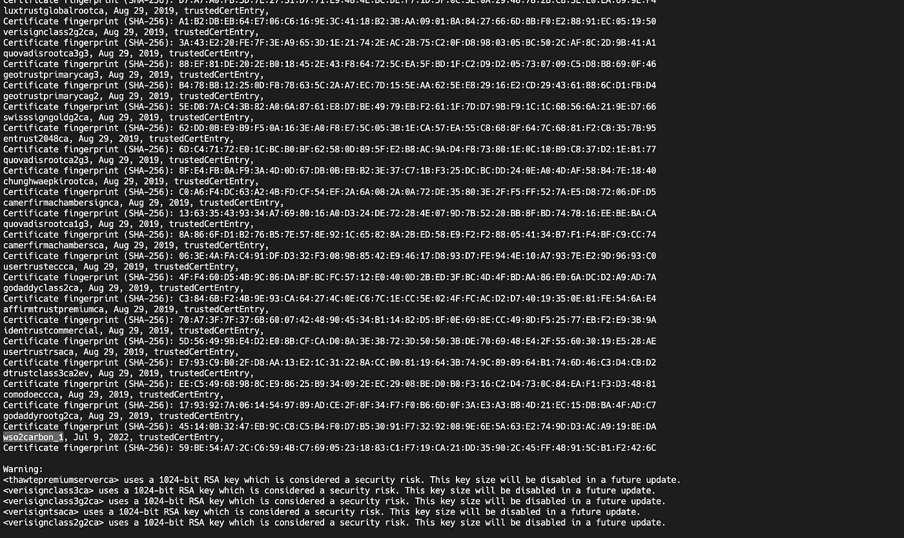](https://javarevisited.blogspot.com/2012/03/add-list-certficates-java-keystore.html)

自签名证书被添加到信任库中

由于我们已经有一个默认链接到`localhost`的证书，让我们在`client-truststore.jks`中删除它。如果您键入以下内容并搜索`wso2carbon`别名，您可以找到它。

```
keytool -list -v -keystore client-truststore.jks -storepass wso2carbon
```

[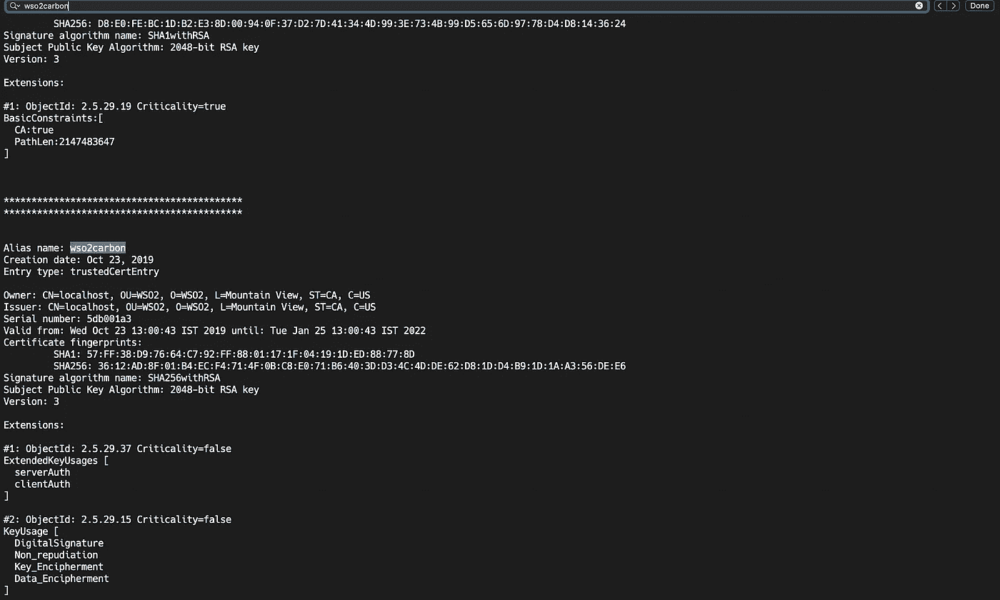](https://www.java67.com/2012/09/keytool-command-examples-java-add-view-certificate-ssl.html)

默认 SSL/TLS 认证

因为我们已经添加了自签名证书，所以让我们通过执行以下命令来删除默认别名(这是可选的)。

```
keytool -delete -noprompt -alias wso2carbon -keystore client-truststore.jks -storepass wso2carbon
```

但是我们仍然必须做一些事情，那就是在`deployment.toml`中将新创建的密钥库设置为 TLS 密钥库，因为否则，当我们转到`localhost:9443`时将显示的证书将是在`wso2carbon.jks`中配置的证书。要配置 TLS 密钥库，请在`<IS_HOME>/repository/conf`打开`deployment.toml`文件并添加以下内容。

```
[keystore.tls]
file_name = "newkeystore.jks"
type = "JKS"
password = "mypassword"
alias = "wso2carbon_1"
key_password = "mypassword"
```

现在，让我们启动 WSO2 IS by，转到 WSO2 IS pack 的`bin`文件夹并键入`sh wso2server.sh`在 IS 启动后，转到`localhost:9443`并单击地址栏中的`Not Secure`部分，然后单击`Certificate is not valid`

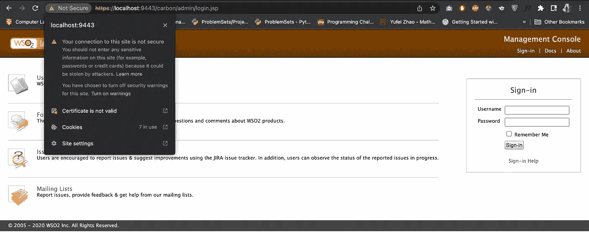

在浏览器地址栏中不安全

然后您可以发现我们的自签名证书已正确添加。


自签名证书

## 创建 CA 签名的证书并将其添加到信任库中

为此，我们将首先获得一个新的 WSO2 IS 包，并在`<IS_HOME>/repository/resources/security`目录中创建一个新的 JSK 文件。

```
keytool -genkey -alias wso2carbon_1 -keyalg RSA -keysize 2048 -keystore newkeystore.jks -dname "CN=nipunaupekshatest95.tk, OU=Home, O=Home, L=SL, S=WS, C=LK" -storepass mypassword -keypass mypassword
```

之后，您会发现在您的目录中创建了一个新的`jks`文件。在这里，你可以看到我使用了`nipunaupekshatest95.tk`作为通用名称。由于常用名应该是域名，所以我在那里插入了`nipunatestupeksha95.tk`。甚至可以用`localhost`换 CN。但是对于`localhost`你不能从一个经过验证的 CA 那里得到数字认证的证书。因此，跟随这篇文章，你可以从 [freenom](https://www.freenom.com) 获得一个免费的`.tk`域名并使用它。

您可以通过以下方式查看密钥库中的内容:

```
keytool -list -v -keystore mykeystore.jks -storepass mypassword
```

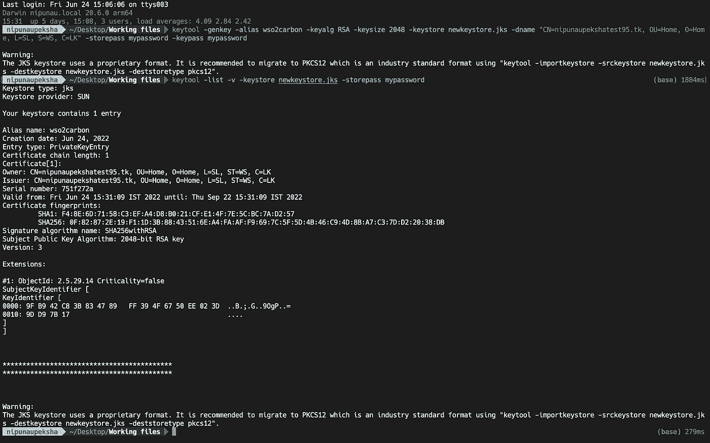

检查我们的密钥库

要使其有效，您必须创建一个证书签名请求文件(CSR ),然后由证书颁发机构(CA)对其进行认证。要制作 CSR，您可以使用下面描述的两种方法之一。

第一种是直接创建 CSR 并提交给 CA。为了做到这一点，

```
keytool -certreq -alias wos2carbon_1 -file wso2carbon.csr -keystore newkeystore.jks -storepass mypassword
```

第二种方法是创建一个`.pem`文件(隐私增强邮件文件)并提交给 CA。为了做到这一点，

```
keytool -certreq -v -alias wso2carbon_1 -file csr-for-wso2carbon.pem -keypass mypassword -storepass mypassword -keystore newkeystore.jks
```

创建其中任何一个之后，您可以从 CA 对其进行认证。你可以从 [SSLForFree](https://www.sslforfree.com/) 免费签一份。要使用它，请创建一个帐户并获取新证书。在那里，你可以输入`nipunaupekshatest95.tk`作为你的域名。

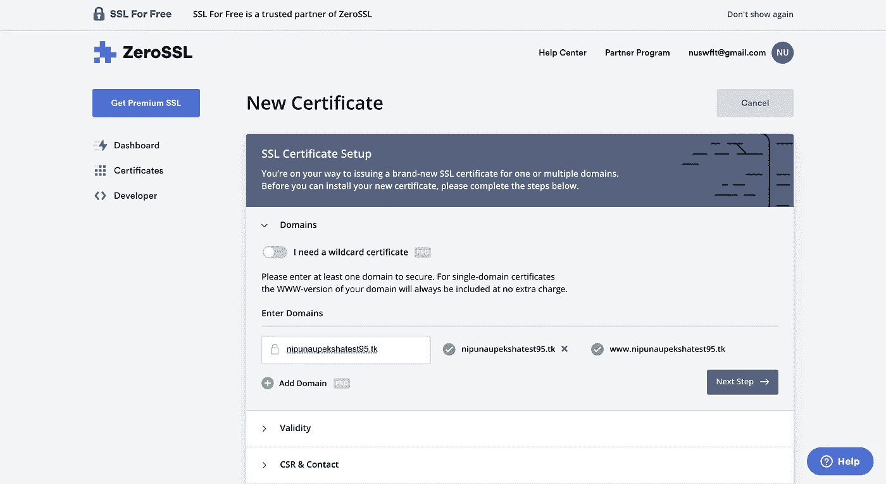

正在为证书添加域

然后为有效期选择 90 天的证书。对于 CSR 和合同，选择粘贴现有 CSR。然后打开 [VSCode](/javarevisited/8-best-vs-code-courses-for-beginners-to-learn-online-bd5c169f59b7?source=user_profile---------43----------------------------) 中的`csr-for-wso2carbon.pem`或`wso2carbon.csr`或记事本，将内容复制粘贴到那里。

[](https://javarevisited.blogspot.com/2021/05/favorite-courses-to-learn-visual-studio-code-f.html#axzz6uq12fuKh)

复制并粘贴 CSR

之后，确定你的订单。

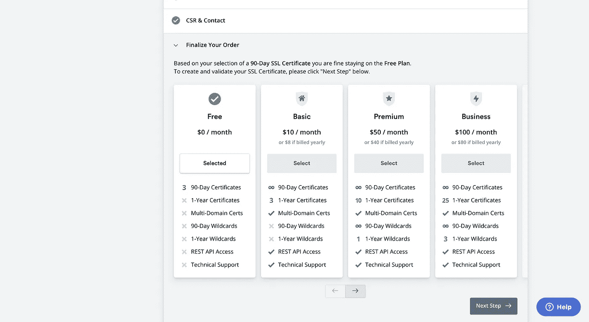

最终确定订单

之后，他们会要求你验证你的域名。最简单的方法是使用 DNS(CNAME)进行验证

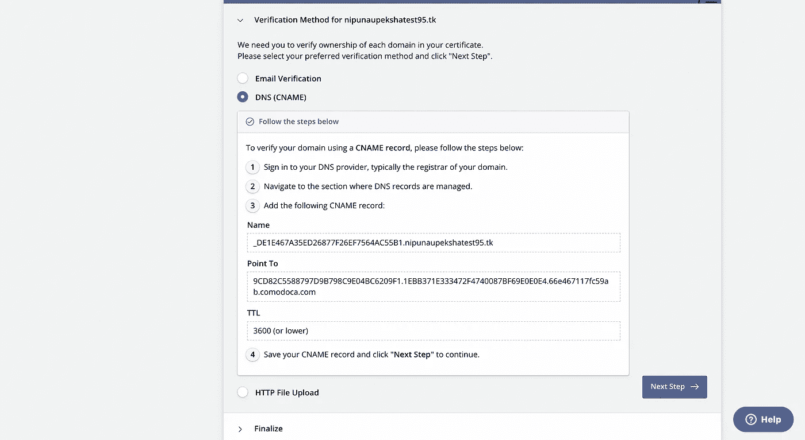

已选择 DNS(CNAME)

然后，进入你的 freenom 账户，选择你得到的域名，然后选择“管理 Freenom DNS”

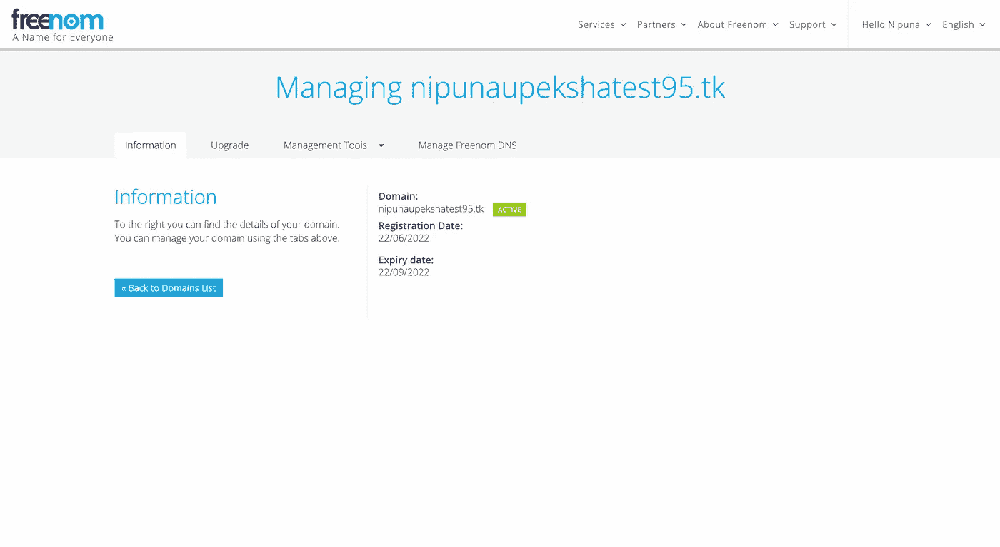

自由域名

之后，复制并粘贴相应的值。选择“CNAME”作为“类型”。

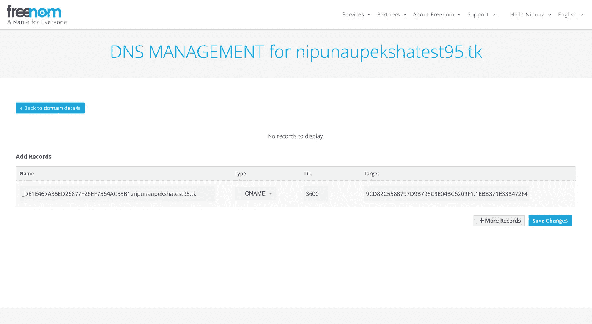

添加 DNS

然后点击 freenom 中的`Save Changes`，进入 SSLForFree 网站，进入下一步，点击验证域名。

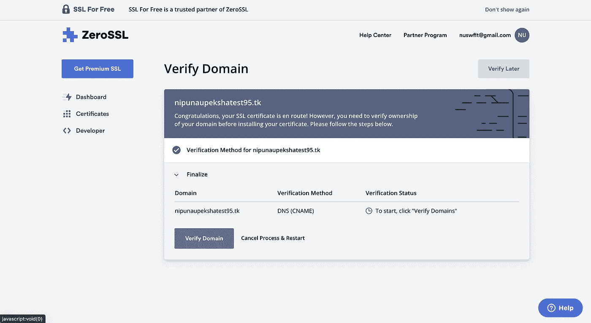

SSL 免费域验证

如果一切顺利，并且等待了足够的时间，服务器将意识到该域实际上属于您，并向您颁发 CA 签名的证书。

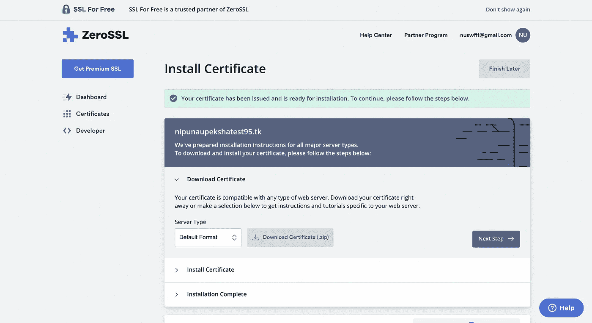

域已验证

之后，您将收到一封邮件，告知您该域名已通过认证。您可以到 SSLForFree 中的认证部分下载证书。


下载 CA 认证证书

解压缩下载的文件后，可以看到有两个文件，`ca_bundle.crt`和`certificate.crt`，这里的`ca_bundle.crt`包含 CA 根证书和一组中间证书。而`certificate.crt`是 CA 签名的证书。

要添加 CA 根证书和中间证书，请使用执行以下命令。

```
keytool -import -v -trustcacerts -alias ca_bundle -file ca_bundle.crt -keystore newkeystore.jks -storepass mypassword
```

然后使用以下命令将 CA 签名的 SSL 证书添加到密钥库中。并确保使用创建密钥库时使用的别名。

```
keytool -import -v -alias wso2carbon_1 -file certificate.crt -keystore newkeystore -keypass mypassword -storepass mypassword
```

现在让我们将它添加到`client-truststore.jks`中，作为 SSL/TLS 证书信任它。为此，我们首先需要从我们的密钥库中提取公钥。

```
keytool -export -alias wso2carbon_1 -keystore newkeystore.jks -file wso2carbon_1_public_key.pem
```

将公钥提取到. pem 文件后，我们可以将它添加到`client-truststore.jks`

```
keytool -import -alias wso2carbon_1 -file wso2carbon_1_public_key.pem -keystore client-truststore.jks -storepass wso2carbon
```

现在，我们成功地将 SSL 认证添加到了客户端信任库。现在，我们将把`wso2carbon.jks`文件重命名为`internal.jks`，把`newkeystore.jks`文件重命名为`wso2carbon.jks`，这样我们就可以把下面的配置添加到`<IS_HOME>/repository/conf`目录下的`deployment.toml`文件中。这是在`deployment.toml`文件中配置`keystore.tls`设置的另一种方式。

```
[server]
hostname = "nipunaupekshatest95.tk"
node_ip = "127.0.0.1"
base_path = "https://$ref{server.hostname}:${carbon.management.port}"[keystore.primary]
file_name = "wso2carbon.jks"
password = "mypassword"
alias = "wso2carbon_1"[keystore.internal]
file_name = "internal.jks"
password = "wso2carbon"
alias = "wso2carbon"
```

现在，通过转到`<IS_HOME>/bin`并键入`sh wso2server.sh`来启动服务器

[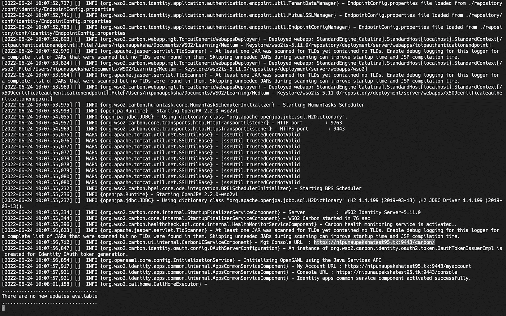](http://javarevisited.blogspot.sg/2016/12/javaxnetsslsslhandshakeexception-pkix-path-building-failed-certificate-not-found.html#axzz5DJlhq8w1)

已启动

现在，如果你去`nipunaupekshatest95.tk:9443/carbon`你将能够看到该网站是安全的。

(在这里，我没有附上任何结果的截图，因为截至编写 freenom 的 DNS 服务是关闭的。但是相信我，它是有效的:)

## Keytool 命令摘要

*   创建密钥库→ `keytool -genkey -alias wso2carbon -keyalg RSA 2048 -keystore wso2carbon.jks -dname "CN=localhost, OU=Home, L=SL, S=WS, C=LK" -storepass wso2carbon -keypass wso2carbon -validity 360 -ext "SAN=DNS:localhost.com"`
*   列表密钥库→ `keytool -list -keystore wso2carbon.jks -storepass wso2carbon`
*   扩展密钥库→ `keytool -list -v -keystore wso2carbon.jks -storepass wso2carbon`
*   将密钥库列表保存到一个文件中→ `keytool -list -v -keystore wso2carbon.jks -storepass wso2carbon >> keystore.txt`
*   出口证书→ `keytool -exportcert -keystore wso2carbon.jks -alias wso2carbon -file wso2carbon.crt`
*   进口证明→ `keytool -importcert -keystore client-truststore.jks -alias wso2carbon2 -file wso2carbon.crt`
*   使用 JKS 创建企业社会责任→ `keytool -certreq alias -wso2carbon_1 -file wso2carbon.csr -keystore newkeystore -storepass mypassword`
*   使用 JKS 创建 PEM 文件→ `keytool -certreq -v -alias wso2carbon_1 -file csr-for-wso2carbon.pem -keypass mypassword -storepass mypassword -keystore newkeystore.jks`
*   将 CA 根证书和中间证书添加到 JKS → `keytool -import -v -trustcacerts -alias ca_bundle -file ca_bundle.crt -keystore newkeystore.jks -storepass mypassword`
*   将 CA 签名的 SSL/TLS 证书添加到密钥库→ `keytool -import -v -alias wso2carbon_1 -file certificate.crt -keystore newkeystore -keypass mypassword -storepass mypassword`

## 附加注释

*   `keytool`中的`-ext`属性允许您将 San(主题别名)添加到密钥库中。您可以将 DNS、IP 或电子邮件添加为 San。

在本文中，我们讨论了什么是密钥库，以及如何在 WSO2 IS 中使用它们。希望你对它们有好的了解。:)而且，这是一篇相当大的文章，所以如果有任何错别字或错误，请随时指出。:)

## 参考

*   [https://is . docs . WSO 2 . com/en/latest/administer/creating-new-key stores/](https://is.docs.wso2.com/en/latest/administer/creating-new-keystores/)
*   [https://is . docs . WSO 2 . com/en/latest/administrator/configuring-key stores-in-WSO 2-products/](https://is.docs.wso2.com/en/latest/administer/configuring-keystores-in-wso2-products/)
*   [http://blog . facile log in . com/2008/03/keystore-management-part-I . html](http://blog.facilelogin.com/2008/03/keystore-management-part-i.html)

<https://javarevisited.blogspot.com/2012/09/difference-between-truststore-vs-keyStore-Java-SSL.html>  <https://www.java67.com/2012/09/keytool-command-examples-java-add-view-certificate-ssl.html> 