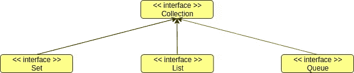
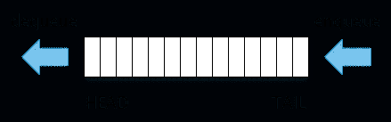

# 了解你的收藏！—第 1 部分，Java 集合简介。

> 原文：<https://medium.com/javarevisited/know-your-collections-part-1-introduction-to-java-collections-1e7df4fd4b7?source=collection_archive---------1----------------------->

**什么是收藏？它们为什么有用？为什么有必要了解他们？**

这些可能是你现在有的问题，过一会儿你会得到所有这些问题的明确答案。最近几天我们部门举办了运营商博览会，几乎所有面试官问我的一个很常见的问题就是关于 [**Java 系列**](/javarevisited/50-java-collections-interview-questions-for-beginners-and-experienced-programmers-4d2c224cc5ab) **。面对这些采访，我想到写这篇文章来简单介绍一下收藏。**

所以，顾名思义，Java 集合是用来以某种数据结构存储一组对象的。就像 Python 的列表和 JavaSciprt 的数组一样，Java 有自己的方法在程序中存储一组数据，这被称为**集合。**

这些集合除了存储一组元素之外，还提供了额外的功能。添加新元素、删除元素、遍历元素以及查找某个元素都可以称为这些功能中的一部分。

## Java 中集合是如何定义的

所以你可能会好奇，这些“集合”在 Java 里是怎么定义的？答案是**集合接口。** Java 有一个特定的接口叫做*集合<E>。如果任何类/接口实现了这个接口，那么这个类/接口在技术上就是一个**集合。**集合接口指定了集合应该具有的基本方法，如 add()、clear()、contains()等。*

在 [Java](/javarevisited/top-5-java-online-courses-for-beginners-best-of-lot-1e1e240a758) 中，有一个集合层次结构。这意味着，有实现这个集合类的子接口，还有它们的子类，等等。所以这些都构成了一个以集合< E >接口为根元素的集合树。集合的每个子接口都有自己特定的特性和方法。下面给出了基本的 java 集合层次结构。

Java 中的基本集合层次结构

如您所见，集合接口分为 3 个接口，Set、List 和 Queue，它们有自己的特定属性。

## 设置接口

在数学中,“集合”被定义为定义明确且截然不同的对象的集合。 这里的 distinct 是指一个集合中没有元素可以存在两次，即元素应该是唯一的。为了在 Java 中建模这个概念，引入了**集合< E >接口**。

没有重复元素的集合称为集合。它继承了之前在根接口中定义的基本集合方法，并添加了这个只有 Set 接口才有的功能。

**队列界面**

如果某个数据结构在处理添加和删除元素时遵循先进先出(FIFO)策略，它可以被命名为队列。增加了 java 中的[队列](https://javarevisited.blogspot.com/2013/10/what-is-priorityqueue-data-structure-java-example-tutorial.html#axzz6f4s58Ml9)接口，在 java 中实现了这个概念。除了集合接口提供的基本方法外，**Queue<E>接口还提供了一些额外的插入和删除数据的方法。它提供了 *poll()、remove()* 方法来获取位于队列头部的元素并从中移除该元素，还提供了 *add()、offer()* 方法来将某个元素添加到队列的尾部。**

## 列表界面

最后，还有列表界面。一个`List` 是 Java 中元素的有序集合，其中提供了几个方法来访问这些元素。这是`Collection<E>`接口的所有三个主要子接口中使用最多的集合。与集合不同，这个接口允许[中有重复的元素](https://javarevisited.blogspot.com/2012/04/difference-between-list-and-set-in-java.html#axzz6f4s58Ml9)。List 接口提供了基于索引访问和搜索其元素的附加方法。

正如您所看到的，集合接口的 3 个主要子接口有它们自己的属性，并且可以在不同的独特用例中使用。随着 Java 编程之旅的进行，您将看到这些接口在不同的场合是如何使用的。

## 接口的具体实现

正如您已经知道的，尽管 Java 已经为数据管理指定了这些可爱的接口。我们不能直接使用它们！我们必须对这些接口进行一些实现。

为此， [Java](/javarevisited/10-books-java-developers-should-read-in-2020-e6222f25cc72) 引入了大量不同的类和接口，它们是这三个主要接口的子类。这些类和接口解决了不同的独特需求，并由此构建了一个大型的集合层次结构。下面是 Java 为非常具体的场景提供的大量不同集合的一瞥。

所以我认为现在你必须对 Java 中的集合结构以及集合层次结构的构建有一个清晰的基本理解。我将在这里结束我的文章，在下一篇文章中，我将详细解释 [**Set 接口**](https://javarevisited.blogspot.com/2012/06/hashset-in-java-10-examples-programs.html) 及其子类。如果您有任何问题，请随时联系我。干杯！:)

 [## Ravindu Rashmin -斯里兰卡莫拉图瓦大学| LinkedIn

### 在世界上最大的职业社区 LinkedIn 上查看 Ravindu Rashmin 的个人资料。Ravindu 有 8 份工作列在…

www.linkedin.com](https://www.linkedin.com/in/ravindu-rashmin-2aa634a8/)