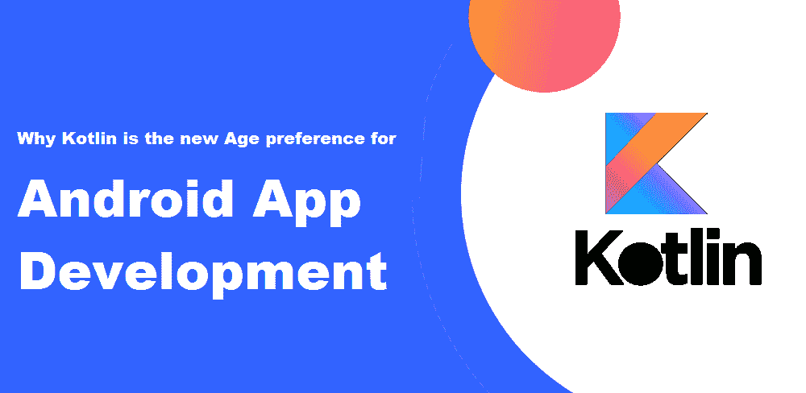
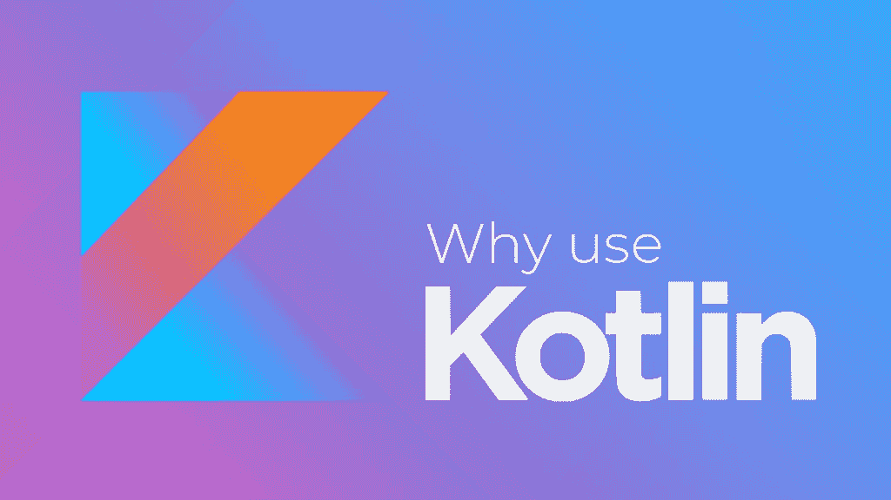

# Kotlin:使用这种编程语言进行开发的 8 个理由

> 原文：<https://medium.com/javarevisited/kotlin-8-reasons-to-use-this-programming-language-for-development-7cec07ba73c5?source=collection_archive---------3----------------------->

2017 年，谷歌宣布了其新的编程语言 Kotlin，该语言旨在编译成 Java 字节码，也可以编译成 JavaScript 源代码。虽然它还不像 Java 那样流行，但是 Kotlin 有很多优点可以说服你选择它而不是其他语言。这里我们将讨论为什么 [Kotlin](/javarevisited/7-free-courses-to-learn-kotlin-in-2020-327c3872c1e1) 是最好的**编程语言**之一。对于 [**Android**](/javarevisited/6-best-appium-and-mobile-testing-courses-for-android-and-ios-developers-80f6cd51e375) 、Java、服务器端开发(通过 kotlinx)都很棒。

# Kotlin 开发者如何让你的公司与众不同

用于移动应用的语言和平台 Kotlin 已经获得了很大的关注。有了最新发布的 Android Studio 3.0 Kotlin 支持，开发者现在可以使用 [Kotlin 编程语言](/javarevisited/kotlin-or-java-what-should-an-android-developer-learn-in-2019-e1f88c08cbad)来构建他们的应用。

**来源** : [开发技术系统](https://devtechnosys.com/insights/why-kotlin-is-the-new-age-preference-for-android-app-development/)

它是一种静态类型的编译语言，运行在 JVM 上。它在类和函数之间有很强的类型和内聚性，这使它成为开发高度可伸缩和可维护代码的理想语言。Kotlin 还有一个健壮的标准库，它提供了许多有价值的特性，比如协程和数据类。由于 Kotlin 是开源的，公司可以采用它而无需支付许可费。

*也可阅读:*[*7 大 Kotlin 应用程序开发公司打造 Android 应用程序——真正的财源*](https://www.valuecoders.com/blog/technology-and-apps/top-7-kotlin-app-development-companies-to-hire-dedicated-kotlin-app-developers/)

**来源** : [Zco 公司](https://www.zco.com/blog/why-you-should-use-kotlin-to-develop-your-android-app/)

Kotlin 是最新的编程语言，因其简单性、可读性和效率而受到开发者和公司的欢迎。它非常适合现代开发实践，可以帮助您的公司在竞争中脱颖而出。以下是你应该考虑在下一个项目中使用 Kotlin 的八个理由:

# 科特林很快

Kotlin 的设计考虑到了性能，因此代码速度快如闪电。它的代码通常比传统的 Java 更快，甚至在大型应用程序上运行。

为你的企业雇佣 Kotlin 开发者 的一个主要原因是它有一种快速的编程语言。它执行代码的速度比其他语言快得多，节省了开发过程中的时间和金钱。很简洁，要写的代码也少，省时&省钱。

*又读:* [*不可思议的 Kotlin 功能重述安卓应用开发流程*](https://www.valuecoders.com/blog/technology-and-apps/incredible-kotlin-features-reiterating-android-app-development-processes/)

# 用更少的错误编写更少的代码

Kotlin 构建于 JVM 之上，因此它拥有 Java 的所有可靠性优势。此外，Kotlin 支持内联函数和 lambdas，这使得它比其他语言更加可靠和高效。

这种语言最大的优点之一就是你可以编写更少的代码，并且最终产生更少的 bug。它被设计得更简洁，更容易阅读。

Kotlin 有许多开发工具，所以你不用花太多时间来设置，可以立即开始编码。如果您不确定什么最适合您的项目，Kotlin 还提供了 Java 互操作性，因此不必担心一下子改变一切。

总而言之，如果你在寻找高效且容易共事的开发人员，那么**雇佣 kotlin 应用程序开发人员**可能是完美的解决方案！

# 简单易学

与其他编程语言(如 Java 和 Python)相比，Kotlin 对于初学者来说很容易学习。这意味着你可以快速上手，开发下一个优秀的应用。Kotlin 是谷歌 Play 商店和大多数 Android 模拟器支持的开源编程语言。你可以用 Kotlin 为 Android 和 iOS 设备创建应用程序，这是跨平台开发的绝佳选择。

# 让 Java 更有表现力

Kotlin 是一种 JVM 语言，它使 Java 具有表现力。它具有简化常规任务的特性，使得开发更快更容易。这种语言比 Java 更简洁，这导致错误更少，并且与现有的 Java 库和框架兼容。雇佣 Kotlin 开发人员比雇佣 Java 开发人员更便宜，因为这样的人更少。

它可以在任何应用程序中与 Java 一起使用，因为它可以与 Java 互操作。因此，在处理现有代码库时，Kotlin 是理想的语言选择。即使您使用的是不同的编程语言，也可以在 Kotlin 上工作。

# 最小运行时间开销

Kotlin 的一个奇妙之处是它的最小运行时开销。您的应用程序将运行得更快更流畅，而不会浪费太多内存。Kotlin 是当今最具生产力的编程语言之一，拥有 Kotlin 开发服务可以帮助您的企业在更短的时间内交付高质量的工作。

除了是一种具有现代功能的相对较新的语言之外，Kotlin 还附带了几个工具&库，旨在使团队中的开发人员更容易立即上手。

*又读:* [*科特林多平台:跨平台开发中最聪明的选择*](https://www.valuecoders.com/blog/technology-and-apps/kotlin-the-best-choice-for-cross-platform-development/)

# 科特林零安全

Kotlin null safety 是一个使编写无错代码更加容易的特性。当你声明一个没有值的变量时，Kotlin 会自动给它赋一个字符串“null”。这可以防止您意外编写可能导致错误的代码。此外，该特性简化了您的代码，每当您重命名或移动一个变量时，Kotlin 将自动更新对该变量的所有引用。这不仅使重构代码变得更容易，而且更省时。空安全是一种有价值的语言特性，它使您的代码更加可靠和易于使用。

# 比 Swift 更适合 Android 开发

Kotlin 是一种多功能语言，用于各种目的，包括 Android 应用程序开发、web 开发和服务器端开发。Play 框架是在 Kotlin 中构建 web 应用程序的流行框架，为 Kotlin 开发提供了出色的支持。

Play 框架是在 Scala 之上创建的，但是你不需要了解任何关于 Scala 的知识就可以使用它。为 Java 开发(包括 [Android 开发](https://www.valuecoders.com/hire-developers/hire-android-developers))提供了优秀的支持，为 Kotlin app 开发提供了一流的支持。您可以用 Java 或 Kotlin 开发应用程序，然后在一个游戏应用程序中一起使用它们，或者您可以利用 Kotlin 代码的完全 Java 互操作性。

# 多平台支持

使用 Kotlin 编程语言进行开发的另一个原因是它的适应性，因为它可以用于多平台开发。如果你希望长期节省时间和金钱，你可以写一次代码，然后部署到多个平台，包括 Android、iOS、Windows、Mac 和 Linux。

此外，Kotlin 是一种非常强大的语言，越来越受欢迎。因此，如果你正在寻找 **kotlin 应用程序开发服务**，你可以相信你得到的是一流的质量。你可以通过 Kotlin 瞄准所有这些平台，而无需学习新的编程语言。

# 对你的公司有用吗？

为了了解[科特林](https://javarevisited.blogspot.com/2022/08/kotlin-interview-questions-with-answers.html)是否适合你的企业，你需要考虑上述几点。如果它在任何一个领域都行不通，那么它可能就不是适合你公司的正确的**编程语言**。然而，也有很多企业通过 kotlin 获得了成功。

因此，最终，它取决于正在做什么样的工作以及编程语言中的需求和价值。对于许多严重依赖移动应用的公司来说，Kotlin 值得考虑，因为它可以像原生应用一样快地运行代码。

*必读:*[*8+Web 开发的完美编程语言*](/quick-code/8-flawless-programming-languages-for-web-development-ea467074e6dd)

# 结论

Kotlin 是一种编程语言，随着开发人员远离 Java，它越来越受欢迎。如果你想在公司里独树一帜，使用 Kotlin 可能是个好办法。与 Java 相比，Kotlin 提供了更高的可读性和生产率，使其成为开发移动应用和后端系统的理想选择。此外，Kotlin 是开源的，这意味着您可以确保代码。

我们提供 Kotlin 应用程序开发，并对其潜力感到兴奋。如果你想雇佣 Kotlin 开发人员，请联系我们。我们的技术团队很乐意就我们如何帮助您的企业实现移动应用开发目标提供免费咨询。