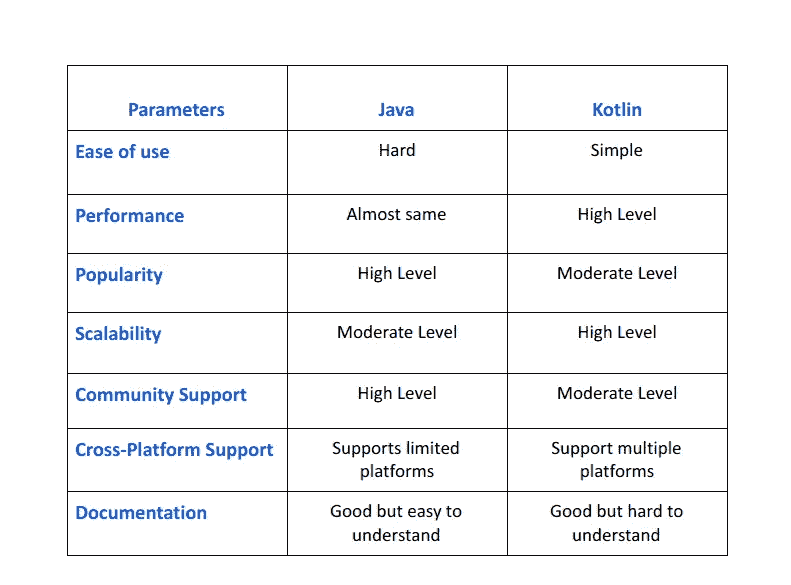
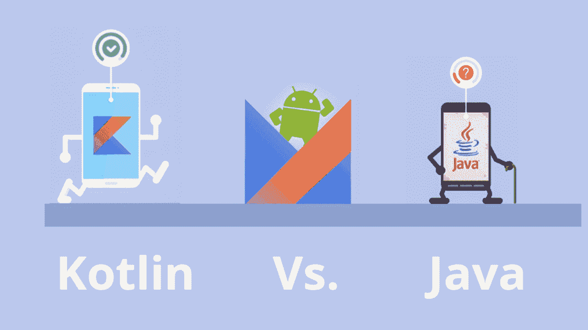

# kot Lin vs Java:Android App 开发哪个是最好的选择？

> 原文：<https://medium.com/javarevisited/kotlin-vs-java-which-is-the-best-choice-for-android-app-development-7c9fc782d2c9?source=collection_archive---------0----------------------->

图片来源:ValueCoders

Android 应用程序开发已经兴起有一段时间了。这是因为 Android 已经成为世界上最受欢迎的智能手机操作系统。随着这种新的需求激增，许多企业想知道他们应该使用哪种编程语言来构建领先和有影响力的移动应用程序。

好吧，每当有人谈论 Android 应用程序开发，那么在大多数专家的脑海中，只有两个技术的名字，即 Kotlin 和 Java。Kotlin 和 Java 都是优秀和流行的语言，主要以其卓越的功能、特性和开发优秀 Android 应用程序的能力而闻名。

开发任何移动应用程序，我们都不能使用多种语言，所以在 Kotlin 和 Java 之间找到哪一种将是最好的真的很重要。因此，让我们来看看这两种语言的优缺点，以及是什么使它们更适合某些类型的 Android 应用程序开发项目。

# 科特林技术综述

Kotlin 是 JetBrains 在 2010 年开发的一种编程语言，它是开源的。Kotlin 可以用于 Android、iOS 应用程序开发项目以及桌面应用程序。它提供了与 Java 的互操作性，这意味着您可以使用他们现有的 Java 技能和知识；这也使他们能够将 Kotlin 用于 Android 应用程序开发项目。

*   开发人员计划采用的五大编程语言是 Go、Kotlin、TypeScript、Python 和 Rust。
*   *短短 3 年时间，Kotlin 现已被 7.8%的行业专家使用。*
*   *Kotlin 被谷歌、网飞、亚马逊、Trello 等全球品牌使用。*

**科特林主要特点:**

*   **Java 互操作性:** Kotlin 允许使用 Java 中现有的技能和知识。这意味着开发人员可以继续使用他们当前的编程语言编写 Android 应用程序。
*   **空安全:** Kotlin 是空安全的，它可以防止通常由于缺少类型或参数没有正确初始化而导致的错误。确保不使用类型作为默认的空值是非常重要的。
*   **可空类型:** Kotlin 不需要“null”或“nil”。这意味着它可以防止由于缺少类型和参数而导致的错误。它还使代码更具可读性。
*   **自动创建 getter 和 setter 的属性:** Kotlin 带有自动生成 getter 和 setter 的属性。这意味着开发者可以更快地编写和阅读 Android 应用程序。
*   **简洁的语法:**没有不必要的标记或关键字，这有助于使代码简洁，容易被开发人员看到。

# Java 技术概述

图片来源:数据科学中心

Java 是由 Sun 公司在 1995 年开发的。它是面向对象的、命令式的，并且与自动内存管理并行。Java 可以用于 Android 应用程序开发项目以及桌面应用程序等。，但是它必须导入 java 类，这使得代码比 Kotlin 的稍微复杂一些。

## **Java 主要特性:**

*   **内存自动管理:**通过自动内存管理，开发人员不必担心在代码中分配和释放内存，因为垃圾收集器会自动处理这些。
*   **使用垃圾收集器:** Java 使用垃圾收集器自动管理代码中的内存。对于希望专注于 Android 项目而不是担心手动管理内存和分配/取消分配资源的企业来说，这更简单。
*   **支持多平台:** Java 支持多平台，这意味着开发者可以开始用 Java 编码，然后切换到 Kotlin 进行 Android 应用开发项目。

如果您期待 Java 应用程序开发，那么请使用最好、最可靠的 Java web 开发公司提供的 [**Java 开发服务**](https://www.valuecoders.com/java-web-application-development-company) 。

# Java 和 Kotlin 有什么相似之处？

Kotlin 和 Java 有很多相似之处。例如，Kotlin 的类型系统很像 Java 的类型系统，这意味着如果开发人员想尝试新语言，他们可以很容易地将现有代码转换成新语言。

*   **类型系统:**两种语言的类型是相似的，所以你不需要担心将你当前的代码转换成新的语言。
*   **Collections Library:**kot Lin 的 Collections Library 非常类似于 Java，类也很容易转换，这对于想要尝试这种编程语言的开发人员来说非常容易。

# Kotlin vs Java:两种 Android 应用程序开发语言的比较

## 1.易于使用

Kotlin 比 Java 更容易使用和学习。它还有一个很好的工具、ide 以及教程的集合，这使得移动应用程序的开发更加容易。然而，如果你选择 Kotlin 开发人员来开发应用程序，那么他会快速交付你的项目，因为他们擅长在 Android 应用程序开发中使用 Kotlin。

## 2.表演

Java 是一门性能优秀的成熟语言。另一方面，Kotlin 在 Android 开发中比 Java 表现得更好，因为它使用了不变性和属性，并且与 Java 100%互操作。

## 3.流行

Kotlin 是一种较新的语言，但已经迅速成为 Android 应用程序开发中最受欢迎的选择之一。此外，它得到了 Google 的支持，这意味着随着时间的推移，Kotlin 将继续得到更多的支持和改进。但如果我说目前的情况，那么 Java 比 Kotlin 更受欢迎。

## 4.跨平台开发

Kotlin 能够在多个平台上交叉编译和运行，而 Java 受到字节码使用的限制，字节码一次只能为一个平台编译。在移动开发中有许多情况，开发者需要创建一个 Android 版本以及 iOS 版本甚至 Windows 版本。

## 6.成熟的图书馆

Java 拥有大量可用于 Android 开发的库、框架和工具。Kotlin 已经开始赶上新库的引入，比如 KTX 和 Coroutines，但是在这个领域还有一些工作要做。

## 7.可量测性

使用像 Java 或 C++这样的语言的一个缺点是它们不具有可伸缩性。由于这个原因，应用程序有时会变得臃肿，影响性能，特别是在像 Android 手机这样的旧设备上。Kotlin 在其设计中更加注重可伸缩性，通过减少膨胀来提高应用程序的性能。所以，如果你想要一个可扩展的解决方案，那就专注于 Kotlin 应用开发吧。

## **8。社区支持**

Kotlin 是一种相对较新的语言，而 Java 已经存在很长时间了。因此，与 Java 相比，使用 Kotlin 时可以咨询更多的专家和开发资源，这使得它成为近年来许多企业的首选。

# Kotlin 与 Java:对照表

查看下面提到的表格，你将很容易分析哪种编程语言最适合你的 Android 应用程序开发项目。

# Java vs kot Lin:Android 应用开发哪个更好？

图片来源:Tekrevol

这两种语言都很棒，提供了一系列的好处，使它们成为开发领先的移动应用程序的绝佳选择。然而，如果你更具体地看 Java 和 Kotlin，那么在某些类型的应用中，一个可能比另一个更好。

***Java 比较适合:***

*   具有大量特性和功能的大型应用程序需要在所有平台上运行，包括 Android、iOS、Windows 或 Linux。Java 有成熟的库，可以很好地支持这种类型的应用程序开发。

***科特林更适合:***

*   性能非常重要的应用程序，例如需要在旧的 Android 手机上流畅运行的应用程序或用于照片编辑的应用程序。Kotlin 的设计比 Java 更精简、更高效，因此它在这些情况下会表现得更好，尤其是在涉及伸缩性的时候。
*   需要保持平台独立性并针对多个平台以及 Android 进行交叉编译的应用程序。Kotlin 可以执行这些功能，而 Java 不能，因为它使用字节码，一次只能为一个特定的平台编译代码。

# 结论

那么，哪个更好，该不该用呢？这个问题的答案取决于你的需求。如果你正在寻找一种有谷歌坚实支持的语言，那么 Kotlin 可能是最好的选择，因为 Android Studio 3 现在支持 Kotlin 开发。然而，如果你需要速度或者想要一个更加灵活的开源项目*(特别是在第三方库方面)*，Java 可能是你的正确选择。

为了在 Android app 开发中高效使用 Java 和 Kotlin 编程语言，分别从最好的 [**Java 开发公司**](https://www.valuecoders.com/java-web-application-development-company) 和 [**Kotlin app 开发公司**](https://www.valuecoders.com/hire-developers/hire-kotlin-developers) 聘请技术专用开发人员。通过这样做，你将能够构建有影响力和多种功能的 Android 应用程序。