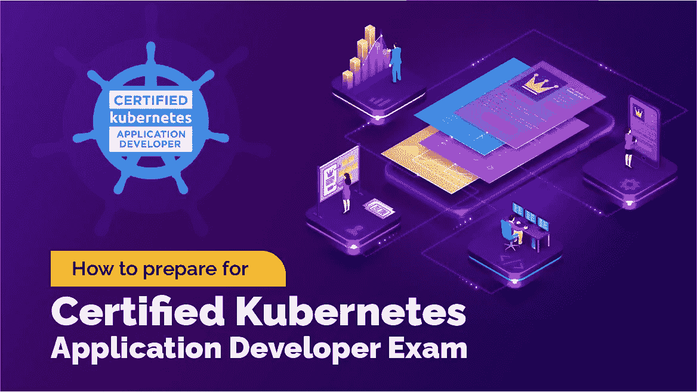

# Kubernetes 认证途径以及如何准备 Kubernetes 开发者考试(CKAD)？

> 原文：<https://medium.com/javarevisited/kubernetes-certification-paths-and-how-to-prepare-for-kubernetes-developer-exam-ckad-6d2d5c5aab19?source=collection_archive---------0----------------------->

图片来源:[https://www . whiz labs . com/blog/WP-content/uploads/2021/12/CKAD-exam . jpg](https://www.whizlabs.com/blog/wp-content/uploads/2021/12/CKAD-Exam.jpg)

大家好。欢迎阅读这篇文章，在这里我们将看到获得 [CKAD](/javarevisited/7-best-certified-kubernetes-application-developer-ckad-courses-practice-tests-in-2021-9b8b7d2c375) (认证 Kubernetes 应用程序开发人员)需要做的事情。我将分享我的学习计划，这将帮助你顺利通过考试。