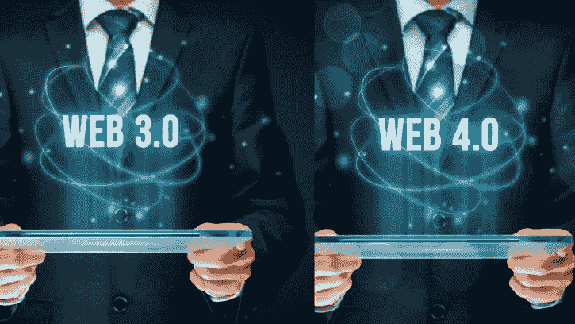
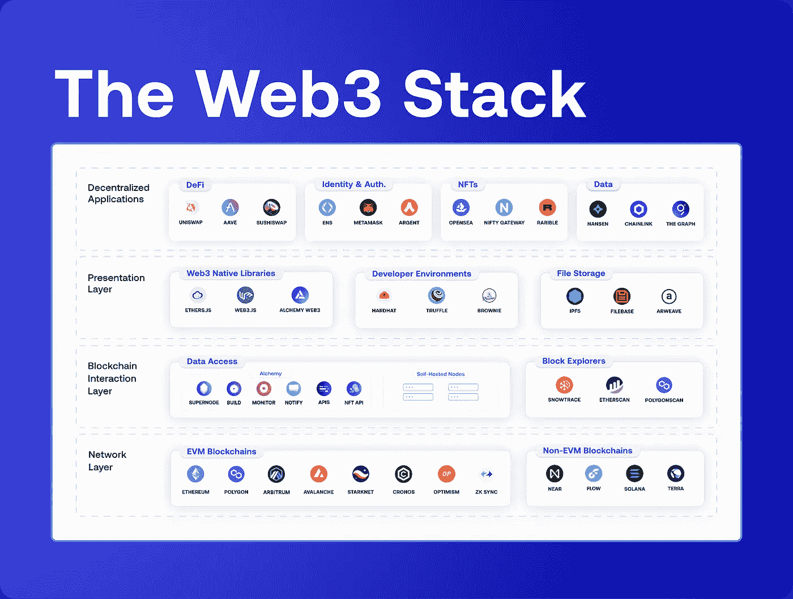
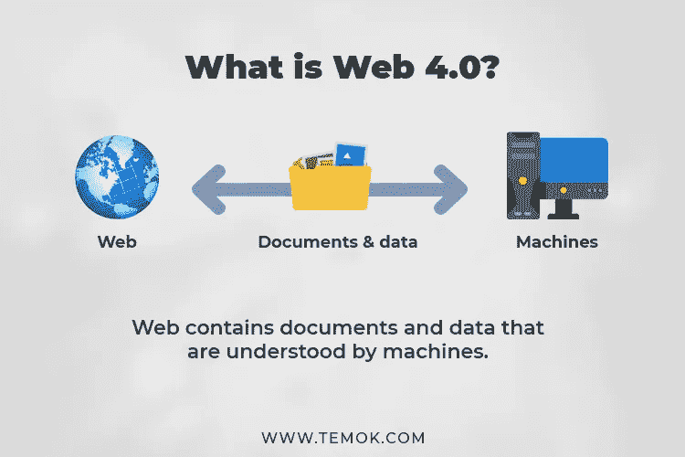

# 了解有关 Web 4.0 和 Web 3.0 技术的更多信息

> 原文：<https://medium.com/javarevisited/learn-more-about-web-4-0-and-web-3-0-technologies-2c04679cc6c5?source=collection_archive---------1----------------------->

图片作者:作者

# **简介:**

万维网是互联网的基础层。web 的最新版本是 [web 3.0 技术](/javarevisited/10-free-nft-non-fungible-tokens-metaverse-and-web3-0-courses-for-beginners-421b1d6ca263) 和 web 4.0 技术。Web 3.0 或语义网正在人工智能和机器学习的帮助下发展。而 web 4.0 使用户能够直接与机器互动。在这篇博客中，我们将详细了解 web 3 和 web 4。

# web 3.0 技术是如何工作的？

图片来源:[https://editor.analyticsvidhya.com/](https://editor.analyticsvidhya.com/)

Web 3.0 是第三代互联网，更侧重于使用最新技术人工智能和机器学习。Web 3.0，万维网的进化。

这种 Web 3.0 为其用户提供了数据驱动的语义 Web，使用机器学习和人工智能来提供下一级用户体验。 [web 3.0 技术](https://en.wikipedia.org/wiki/Web3)基于分散的方法，而不是集中的方法。

WEB 3.0 是一个更安全的万维网。它基于区块链技术，是分散的，不受任何控制。人们期待在 web 3 开发中[雇佣 web 设计师和开发人员](https://jumpgrowth.com/web-apps/)。

Web 3.0 堆栈包含四个主要层。下面我们来详细了解一下其中的每一个。

# **1)网络层:**

这是 Web 3.0 的最底层。如果开发人员想选择区块链网络来创建分散的应用程序，那么他们主要有两个选择:

# **与 EVM 兼容的区块链的分散应用:**

在 EVM 兼容的区块链中，EVM(以太坊虚拟机)存储与账户和余额相关的信息。该 EVM 还根据 EVM 制定的规则存储区块链中每个块的机器状态。有了兼容 EVM 的区块链，区块链开发者可以节省时间和金钱。

## **EVM 区块链的例子:**

*   [以太坊](https://javarevisited.blogspot.com/2022/01/5-best-courses-to-learn-cryptocurrency.html)
*   多边形
*   克罗诺司牌手表
*   雪崩
*   乐观
*   仲裁

# **与 EVM 不兼容的区块链的分散应用:**

现在，开发人员正朝着用不兼容 EVM 的区块链构建分散式应用程序的方向前进。非 EVM 网络工程师认为兼容 EVM 的区块链是有限的，因此为了设计新的结构，他们转向不兼容 EVM 的[区块链](/javarevisited/6-best-places-to-learn-blockchain-for-free-dcb20bd92c8f)。

## **非 EVM 区块链的一些例子有:**

*   流动
*   近的
*   索拉纳
*   土地

# **Web 3.0 技术的三大开发环境**

## **布朗尼:**

它是一个基于 python 的框架，提供了 web 3 开发中使用的工具的完整列表。这是 EVM 发展的替代方案。有了这个框架，开发人员可以编译、测试和部署分散式应用程序(dApps)。

## **安全帽:**

它是以太坊软件的开发环境。在这个环境的帮助下，您可以编辑、编译、部署和调试您的分散式应用程序和智能合同。

## **松露:**

这也是前端 dAPP 开发的开发环境。您可以使用 Truffle 编译、编辑、测试和部署应用程序。

图片来源:[https://alchemy.com/blog/web3-stack](https://alchemy.com/blog/web3-stack)

# **2)区块链交互层:**

顾名思义，这一层构建了用户和区块链之间的交互。在这一层，开发者和用户可以读写数据到区块链。这一层的功能完全依赖于数据提供者，数据提供者可以作为在线资源，检索与交易、地址余额、费用等相关的历史和实时数据。有了这个，人们可以很容易地检索这些信息。

# 3)表示层

这一层包含前端库和 web 2.0 开发之类的高级抽象。

# **4)应用层**

要访问 Web 3.0，公众将连接到这一层。应用层是 Web 3 开发中的客户界面层。

## **Web 3.0 的优势**

*   这一代 Web 3.0 使用人工智能和机器学习来思考并为用户的查询提供解决方案。这是 web 3.0 的关键特征。
*   Web 3.0 是一个分散的系统，这意味着没有中央权威。服务将以分布式方式启用。
*   基于加密货币:在 web 3.0 中，加密货币取代了法定货币的使用。
*   Web 3.0 技术专注于创建内容。

# **什么是 Web 4.0？**

图片来源:[https://www.temok.com/blog/web-30-vs-web-40/](https://www.temok.com/blog/web-30-vs-web-40/)

Web 4.0 是一个完全基于 web 3 的网络，它消除了人类和机器之间的界限。Web 4.0 将改变基础设施、医药、协调等一切。我们甚至可以说，web 4.0 通过提供计算机和人类之间的连接，有可能改变我们的日常生活。

## **从 web 1.0 到 4.0 的演进**

**Web 1.0:** 借助这种第一代网络技术，我们可以在网页上阅读和分享信息。这是基于书签和超链接。有一个静态页面的概念。

Web 2.0: 有了这个第二代 Web，我们可以阅读、写作和相互交流。这个 web 2.0 动态页面和用户生成的内容取代了静态页面。

**Web 3.0:** 有了这个第三代 Web，机器可以想到信息，而不是人类。这个 web 3.0 也被称为语义 web。

**web 4.0:** 这种第四代 Web 也被称为共生 Web。有了这个，人类和机器就可以相互交流了。

## **Web 4.0 的优势**

*   与其他时代的互联网速度相比，互联网具有更高的速度。
*   有了这个第四代网络，信息可以从世界的每一个角落传播。
*   有了 Web 4.0，互联网变得更加透明和可追踪。
*   互联网将使用人工智能，提高工作质量。

## **结论:**

我们的互联网发展迅速。如果你比较 web 1.0 和 web 4.0，你会发现我们在人工智能的帮助下弥合了速度和定制方面的巨大差距。现在我们拥有比 50 年后更多的个性化系统。现在，有了 3.0 和 4.0 网络，人们可以享受许多好处，如去中心化和相互之间的无障碍交互。

此外，如果你正在寻找网络应用程序开发人员或在更短的时间内完成你的网站，那么你必须选择最好的网络应用程序开发公司**。**