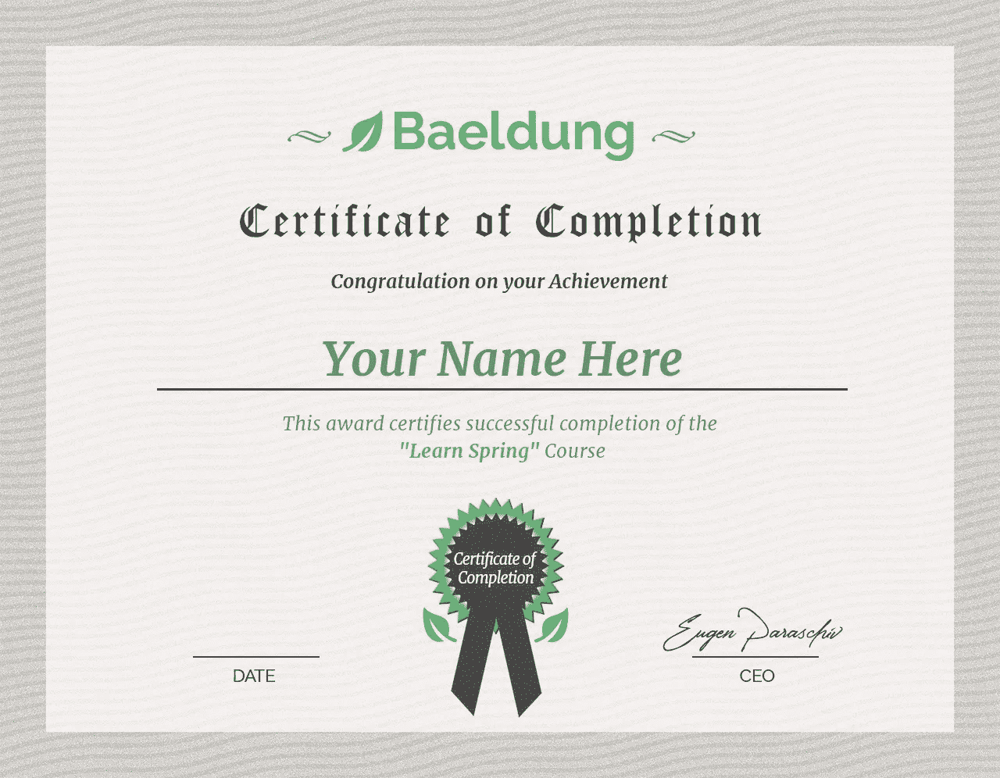

# 贝尔东评论——学习春天:欧根·帕拉斯基夫的认证课程值得吗？

> 原文：<https://medium.com/javarevisited/learn-spring-the-certification-class-cfb5886aa0b1?source=collection_archive---------2----------------------->

## Baeldung 上的 Learn Spring 课程是从零开始学习 Spring 的一个很好的课程，以一种有指导的、以代码为中心的方式

[**学春大师班**](https://courses.baeldung.com/p/ls-master-class?utm_source=javarevisited&utm_medium=web&utm_campaign=lss&affcode=22136_bkwjs9xa)

**你好，伙计们，如果你正在考虑加入 Baeldung 上的 Eugen Parashive 春季课程，并考虑它是否值得，那么你来对地方了。**

**之前，我已经分享了最好的 Spring 课程和书籍，在这篇文章中，我将回顾 Baeldung 广受欢迎的 Spring 5 和 Spring Boot 课程，[**the Learn Spring master class**](https://courses.baeldung.com/p/ls-master-class?utm_source=javarevisited&utm_medium=web&utm_campaign=lss&affcode=22136_bkwjs9xa)**。****

**<https://courses.baeldung.com/p/ls-master-class?utm_source=javarevisited&utm_medium=web&utm_campaign=lss&affcode=22136_bkwjs9xa>  

我第一次看到 Baeldung 是通过他们的博客，因为我也是一个 Java 博客作者，并且总是在寻找最好的 Java 资源。后来我遇到了欧根，了解了他在《春天和 Spring Boot》中的丰富经历。他参与了几个实际操作和咨询项目，在这些项目中他使用了 Java、Spring 和 Spring Boot，这在他的课程中有所体现。

他是最早创建在线 Spring 课程的人之一，这些课程可以深入地教你 Spring，如[**REST with Spring**](http://www.baeldung.com/rest-with-spring-course?utm_source=javarevisited&utm_medium=web&utm_campaign=rws&affcode=22136_bkwjs9xa)和[**Learn Spring Security**](https://courses.baeldung.com/p/learn-spring-security-the-certification-class?utm_source=javarevisited&utm_medium=web&utm_campaign=lss&affcode=22136_bkwjs9xa)，这些课程专注于深入地教你 REST web 服务和 Spring 安全性。

<https://courses.baeldung.com/p/learn-spring-security-the-certification-class?utm_source=javarevisited&utm_medium=web&utm_campaign=lss&affcode=22136_bkwjs9xa>  

很长一段时间，他没有任何初级水平的 Spring 和 Spring boot 课程，许多人要求创建一个，包括我，这就是这个课程的诞生，我必须说它是深入学习 Spring 5 的最佳资源之一。

# 学习春天 5 和 Spring Boot 课程包括什么？

正如我所说，这是学习 Spring 5 和 Spring boot 的最全面、最有条理的课程之一，**下面是即将推出的内容*学习 Spring*** :

**在模块 Spring 5 入门中:**

*   第 1 课——为什么是春天？
*   第 2 课— 介绍 Spring Boot 2
*   第 **3 课—** 了解整个春季生态系统
*   第 4 课— 我们正在构建的真实项目
*   第 5 课— 使用 IDE — Eclipse STS 和 IntelliJ
*   第六课——Maven 和 Spring

**在模块 2 —依赖注入和 Spring 上下文中:**

*   什么是 DI，它在春天是如何工作的？
*   第 2 课—Java 配置和 Spring 上下文的基础知识
*   第 **3 课—** 定义 Bean、组件扫描和 Bean 注释
*   第 4 课—Bean 的生命周期—初始化和销毁挂钩
*   第 **5 课—** 简单接线和注入
*   第 **6 课—** 调试和解决接线异常

**模块 3 —项目配置:**

*   第**课 1 —** 春季灵活配置
*   第 **2 课—** 使用属性
*   第 **3 课—** 在 Spring 中使用配置文件
*   第 **4 课—** 登录 Spring Boot 项目—正确的方式
*   第五课**我们正在构建的应用程序**
*   第 **6 课—** 部署 Boot 2 应用程序
*   第 7 课—Spring 测试框架

**在模块 4 —深入了解 Spring Boot 2:**

*   第 1 课—启动中简化的依赖关系管理
*   第 2 课—启动 2 内部机制—自动配置
*   第 3 课—启动装置 2 中的致动器
*   第 4 课—开机测试 2

**在第 5 单元—使用持久性中:**

*   第**课 1 —** 用 Spring 数据进行项目持久性 JPA
*   第**课 2 —** 默认存储库之外
*   第 3 课— 使用 Hibernate
*   第 4 课— 分页和排序
*   第 5 课— 集成测试和持久层
*   第 6 课— 其他 Spring 持久性技术

**在模块 6 — Web 基础和 Spring MVC 中:**

*   第**课 1 —** 什么是 MVC 和 Spring MVC
*   第 2 课—MVC 风格的应用程序与 REST API
*   第 3 课—我们的第一个控制器
*   第 **4 课—**Servlet 和 Dispatcher Servlet

**在模块 7 —模板引擎和 Spring MVC 中:**

*   第 1 课**视图、视图解析器和模板引擎**
*   第 2 课——充分利用百里香叶
*   第 3 课— 表单验证的基础知识
*   第 **4 课—** Apache 图块、Freemarker、速度

**在模块 8 中—一个典型的 REST API:**

*   第**课 1 —** 驱动 API 的注释
*   第 2 课— HTTP 消息转换器
*   第**课 3—**Spring API 中的异常处理
*   第 4 课—rest 模板介绍
*   第 5 课— 实时测试 REST API

**在模块 Spring 的高级特性中:**

*   第 1 课— 春季 AOP 介绍
*   第二课——春天的表达语言(SpEL)
*   第 **3 课—** 使用事件和监听器
*   第 **4 课—** 了解 Spring 5 中的新反应模式
*   第 5 课——春季安全介绍

# Baeldung 的 Learn Spring 认证课程值得吗？

在我看来，Baeldung 的 [*Learn Spring:认证班*](https://courses.baeldung.com/p/ls-master-class?utm_source=javarevisited&utm_medium=web&utm_campaign=lss&affcode=22136_bkwjs9xa) 是一门很棒的在线课程，旨在教开发者如何使用 Spring 框架构建企业级应用。该课程旨在深入理解 Spring 的核心特性和功能，包括依赖注入、Spring Boot、Spring 数据和 Spring 安全性。

该课程包括 **100+视频课程、测验和实践练习**以强化学习。它还包括一个认证考试，测试学生的 Spring 框架知识。

该课程的**关键优势之一是它对 Spring Framework** 的全面覆盖，Spring Framework 是一种在企业应用程序开发中广泛使用的技术。这门课程也是自定进度的，允许学生按照自己的进度和方便的方式学习。

然而，**对于一些学习者来说，课程的价格可能是一个缺点，**因为它比 Spring Framework 上的其他在线课程和资源要贵得多。此外，该认证可能不像传统的大学或行业认证那样举足轻重。

总的来说， [**Baeldung 的 Learn Spring:认证类**](https://courses.baeldung.com/p/ls-master-class?utm_source=javarevisited&utm_medium=web&utm_campaign=lss&affcode=22136_bkwjs9xa) s 是一门关于 Spring 框架的全面而深入的课程，但是它的价位可能不是所有的学习者都能接触到的。对于那些希望提升技能并专门研究 Spring Framework 的开发人员来说，这可能是值得考虑的。

是的，你还会获得这样的证书，这样你不仅能学到东西，还能得到对你技能的认可。

以上就是欧根·帕拉斯基夫在 Baeldung 上的 **Learn Spring 课程。如果考虑到 Eugen 的经历以及他对这门课程和 Baeldung 博客的工作，这门课程绝对是值得的。但是，撇开这一点不谈，这门课仍然很棒，因为它的结构、简单易学的课程和清晰明了的解释。**

如果你想加入，这里有加入这个令人敬畏的春季新兵课程的链接:

下面是链接— [**学春大师班**](https://courses.baeldung.com/p/ls-master-class?utm_source=javarevisited&utm_medium=web&utm_campaign=lss&affcode=22136_bkwjs9xa) **。**

<https://courses.baeldung.com/p/ls-master-class?utm_source=javarevisited&utm_medium=web&utm_campaign=lss&affcode=22136_bkwjs9xa>  

如果您对更多 Spring 资料感兴趣，您还可以查看以下资源

**继续学习**
[大师微服务带 Spring Boot 和 Spring 云](https://javarevisited.blogspot.sg/2018/02/top-5-spring-microservices-courses-with-spring-boot-and-spring-cloud.html#axzz5Cz1R4cHw)
[大师 Hibernate 和 JPA 带 Spring Boot 100 步](http://javarevisited.blogspot.sg/2018/01/top-5-hibernate-and-jpa-courses-for-java-programmers-learn-online.html)
[5 免费 Spring 框架和 Spring Boot 课程](http://www.java67.com/2017/11/top-5-free-core-spring-mvc-courses-learn-online.html)
[15 Spring Boot 面试问题与答案](http://www.java67.com/2018/06/top-15-spring-boot-interview-questions-answers-java-jee-programmers.html)
[20 Spring 面向 Java 程序员的面试问题](https://javarevisited.blogspot.com/2018/11/top-20-spring-mvc-interview-questions-answers-for-java-developers.html)
[20 REST 面向 Web 开发人员的面试问题](https://javarevisited.blogspot.com/2018/02/top-20-spring-rest-interview-questions-answers-java.html#axzz57Kv4wGXe)
[3 种学习方式](https://javarevisited.blogspot.com/2018/01/how-to-learn-spring-core-spring-mvc-boot-security-framework.html)

祝你的春季 5 号和 Spring Boot 学习一切顺利。**