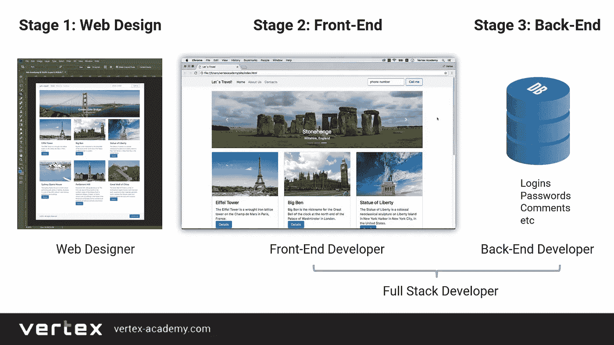
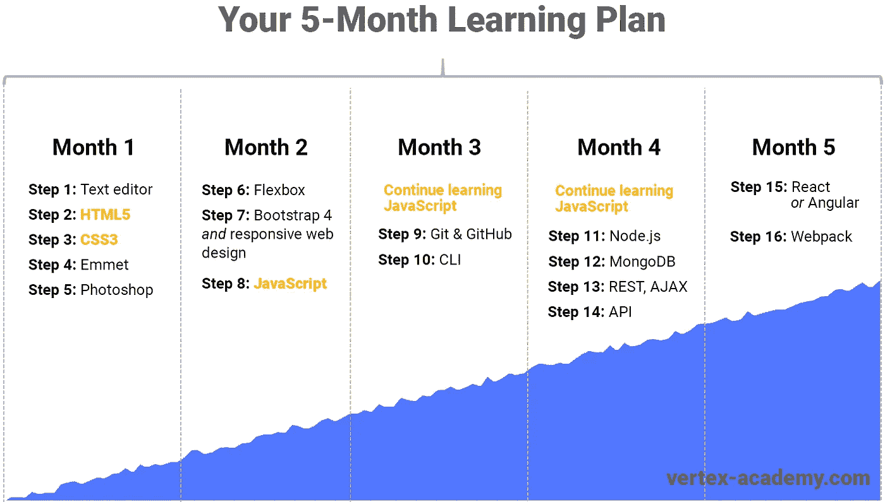
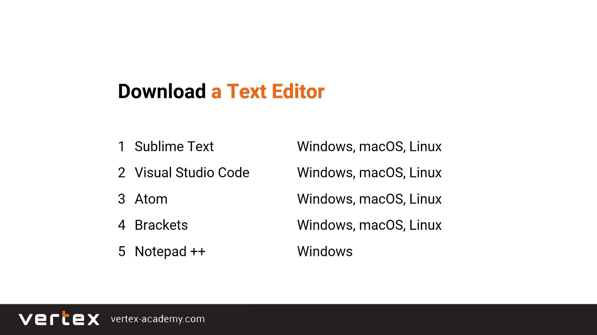
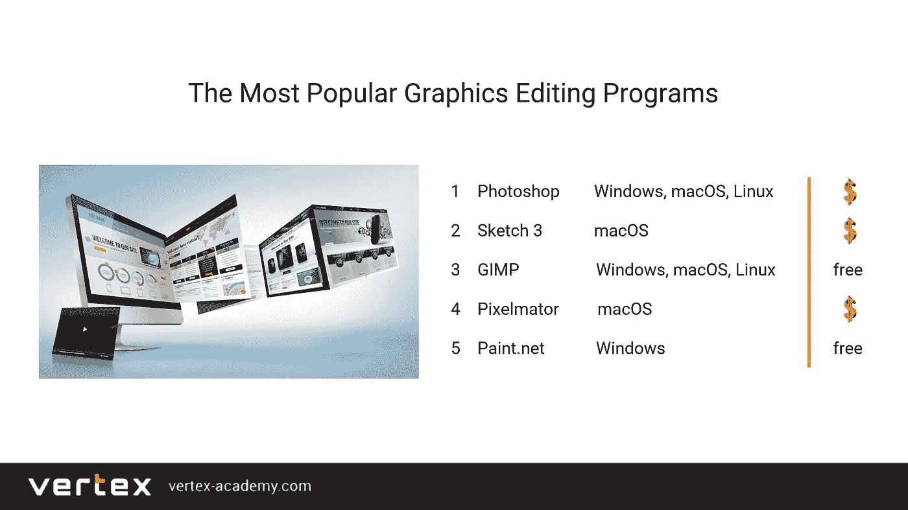
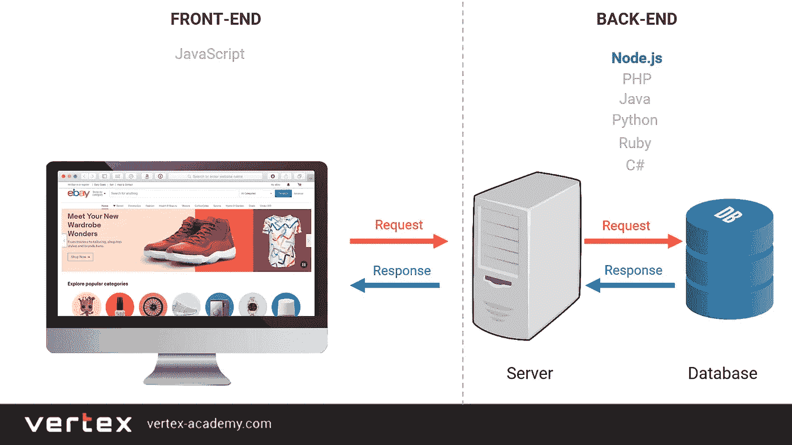
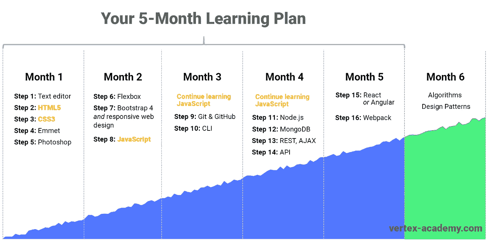

# 在 5 个月内学会编码，被录用，成为一名优秀的 web 开发人员

> 原文：<https://medium.com/javarevisited/learn-to-code-in-5-months-get-hired-and-thrive-as-a-web-developer-5ab6838b2f07?source=collection_archive---------0----------------------->

如今，我们无法想象没有网站和应用的生活——它们改变了一切。随着 web 开发继续呈指数增长，对 web 开发人员的巨大需求预计将在 10 年内持续增长。

成为一名网络开发人员有各种各样的可能途径，大多数学习者不知道如何开始，但在线课程可能是最好的开始方式。但是，选择正确的课程并不重要，这就是推荐可以帮助你的地方。

如果你想成为一名 web 开发人员，那么[**Udemy 上以结果为导向的 web 开发人员课程——boot camp 2020**](https://click.linksynergy.com/deeplink?id=JVFxdTr9V80&mid=39197&murl=https%3A%2F%2Fwww.udemy.com%2Fcourse%2Fresult-oriented-web-developer-course%2F)课程对于 Web 开发的绝对初学者和那些想要自己构建项目的人来说是一个很好的起点:

<https://click.linksynergy.com/deeplink?id=JVFxdTr9V80&mid=39197&murl=https%3A%2F%2Fwww.udemy.com%2Fcourse%2Fresult-oriented-web-developer-course%2F>  

在这篇文章中，你会发现如何在**5-18 个月** 内成为一名 web 开发人员的一步一步的计划。这篇文章回答了三个主要问题:

*第 1 部分:为什么要学习编码？*

第二部分:你将学到什么？(5 个月计划)

*第三部分:什么时候开始找工作？*

# **第 1 部分:为什么要学习编码？**

你可以提高你的年收入

根据薪酬比较网站 Paysa 的数据，“一名网页开发人员的平均收入为 91587 美元，从 77544 美元到 103370 美元不等，其中收入最高的人(前 10%)的收入超过 117646 美元。了解更多信息。

未来 10 年，你的工作会很吃香

每周收到工作邀请是不是很棒？不要害怕明天你可能没有工作。一旦你成为一名高技能的网络开发人员，你将会更加吃香。招聘人员会找你…

美国劳工统计局称，“到 2026 年，网络开发人员的就业率预计将增长 15%，比所有职业的平均增长率快得多。”

劳工统计局不是闹着玩的。请在这里阅读他们的数据和分析[。](https://www.bls.gov/ooh/computer-and-information-technology/web-developers.htm#tab-6)

你将获得灵活性——不受特定地点的限制

许多开发人员边工作边旅行，在不同的国家呆上几个月，而他们的客户或雇主却在另一个国家。但最终你决定是为公司工作还是做自由职业者，在办公室还是在家。

> 最棒的是，你可以在 5 到 18 个月内开始你的 web 开发生涯…

# **五大误解—** 不要让这些阻止你

**1:我需要一个计算机科学学位才能成为一名网页开发员。**

不是真的。IT 公司一般不要求学位或文凭。他们最关心的是你为他们的企业带来价值和最终利润的实际技能。

我需要花几年时间成为一名网络开发人员。

假的！一般来说，你需要不超过 5 至 18 个月来获得所需的专业知识。在这短暂的时间之后，你就可以开始你的网页开发生涯了。

**3:我已经 30-40 岁了——开始太晚了。**

永远不会太晚。还是那句话，公司只在乎你的技能，不在乎你的年龄。如果你拥有合适的技能，你会得到这份工作。请记住，今天对 web 开发人员的需求高于供应，并且这种趋势预计将在未来几年内不断增长。如果你需要一个故事，请看这个帖子:

<https://dev.to/javinpaul/can-you-become-a-web-developer-in-your-40s-and-50s-27ng>  

我需要花一大笔钱成为一名网络开发人员。

同样，不正确。随着在线教育一年比一年好，一年比一年便宜，投资却很少，不到 50 美元。一个全面的资源列表，包括免费的和付费的，在文章的最后。

我应该超级聪明，数学特别好。

假的！高中水平的基础数学知识就够了。你不需要成为数学专家。你需要的是解决问题的心态、动力和纪律。你有那些吗？然后你**就会**成为一名网页开发者。

既然我们已经了解了这些误解，让我们继续讨论*什么* *你将学习* **。**

> 我们为你制定了一个学习计划，让你在 5 到 18 个月内学会 web 开发。

许多学习者花费了太多的时间和精力试图弄清楚要学习哪些技术以及为什么要学习。他们经常对学习它们的顺序感到困惑。

我们为您提供了一个循序渐进的学习计划，可以节省时间，让您在最短的时间内获得作为 web 开发人员的第一份工作。

而且，如果你需要指导，这份 [**完整的 Web 开发者路线图**](https://javarevisited.blogspot.com/2019/02/the-2019-web-developer-roadmap.html) 也是一份极好的指南:

<https://javarevisited.blogspot.com/2019/02/the-2019-web-developer-roadmap.html>  

# **第二部分:你将学到什么**

首先，让我们弄清楚你需要学习什么，为什么。在文章的最后，你会发现**一个学习 web 开发的免费和付费资源的列表**。

在 web 开发过程中有 4 个主要角色:

1.网页设计师

2.[前端开发者](https://javarevisited.blogspot.com/2019/08/top-5-online-training-courses-to-learn-frontend-web-development.html)

3.后端开发人员

4.[全栈开发者](https://dev.to/javinpaul/top-10-advanced-courses-for-full-stack-java-developers-kop)(也称完整的 Web 开发者)

如果你喜欢视频指南，只需 [*点击此处*](https://youtu.be/-eTx5crZTNE) 查看我们的 2 分钟视频。

以下是网站开发的简要描述:

**第一阶段:**

网页设计师创建一个未来网站的布局。在这个阶段，网站只是一个静态图像。

第二阶段:

前端开发者**把静态图片变成网站** *。网站的“可见”部分，也就是通常所说的“前端”已经完成:网站的横幅、文本、菜单、滑块和链接已经可以工作了。在这个阶段，一些功能仍然无法使用:登录和注册按钮、联系我们表单、搜索栏等。*

**第三阶段:**

后端开发者确保网站的**“隐藏”部分的开发:数据库和服务器**连接到网站的“后端”部分。现在您可以正确使用**网站的所有功能**:通过您的浏览器登录并注册网站，发送联系信息，点击“联系我们”按钮进行搜索等。

此外，还有全栈开发人员，他们负责前端和后端开发。因此，如果你想成为一名网络开发人员，有 3 种可能的方法:

1.成为前端开发人员

2.成为一名后端开发人员

3.成为一名全栈开发人员(也称为完整的 web 开发人员)。

现在您已经了解了流程和角色，所以我们可以开始实际的计划了。这里有一个计划的图像供你理解。

*正如我已经提到的，一般来说，你需要不超过* ***5 到 18 个月*** *来获得所需的专业知识。*

如你所见，在视觉计划中有几个用橙色突出显示的项目: [HTML5](/javarevisited/5-free-html-and-css-courses-to-learn-front-end-web-development-online-8b04517c6ecb) 、 [CSS3](/javarevisited/top-10-free-courses-to-learn-html-5-css-3-and-web-development-872d62d97a97) 和 [JavaScript](/javarevisited/my-favorite-free-tutorials-and-courses-to-learn-javascript-8f4d0a71faf2) 。想知道为什么吗？好吧，让我们来看看。

**什么是 HTML、CSS 和 JavaScript？**

如果你喜欢视频指南，只需 [*点击这里*](https://youtu.be/D8Q3bAL6V_c) 查看一个 2 分钟的视频。这里有一个简单的描述。

HTML、CSS 和 JavaScript 是 web 开发的核心。

我们使用 HTML 来告诉浏览器在网页上显示哪些元素。例如，3 个图像、2 个按钮、1 个滑块、1 个搜索栏等。在这个阶段，元素没有被正确地放置在页面上，它们看起来不是我们想要的 100%。

我们使用 CSS 精确地调整每个元素的位置和外观。所以在 CSS 的帮助下，我们将元素风格化。

**JavaScript**–最后，通过 JavaScript，我们*为我们的网站添加了交互性*。因此，如果页面上有任何移动、跳跃、旋转或类似的东西，很可能是 JavaScript。例如，多亏了 JavaScript，滑块或弹出菜单才能工作。

而且，如果你想学习 HTML 5、CSS 3 和 JavaScript，那么 [**面向结果的 Web 开发者课程**](https://click.linksynergy.com/deeplink?id=JVFxdTr9V80&mid=39197&murl=https%3A%2F%2Fwww.udemy.com%2Fcourse%2Fresult-oriented-web-developer-course%2F) **是一个很好的起点。**

<https://click.linksynergy.com/deeplink?id=JVFxdTr9V80&mid=39197&murl=https%3A%2F%2Fwww.udemy.com%2Fcourse%2Fresult-oriented-web-developer-course%2F>  

# **第一个月**

**第一步:下载并安装一个文本编辑器**

文本编辑器是用于编写代码的特殊程序。下面你可以看到最受欢迎的。

文本编辑器的主要区别在于它们的功能以及它们可以在哪些操作系统上工作。举个例子，

● Notepad++只适用于 Windows。

● Sublime Text 适用于 Windows、MacOS 和 Linux。

您可以从上面的列表中选择任何文本编辑器。我们会推荐 **Sublime Text** 或 **Visual Studio Code** ，因为它们可以在所有主要操作系统上工作，并且有许多有用的插件。

**第二步:HTML5**

你得从学习 HTML5 开始。

**第三步:CSS3**

之后学习 CSS3。

**第四步:埃米特**

Emmet 是一个被 web 开发人员广泛使用的特殊插件，它可以将代码编写速度提高 10 到 15 倍。Emmet 简化了这一过程，而不是手动编写每一行代码。

第五步:Photoshop

你可能还记得，一个网页设计师在一个图形编辑程序中创建一个未来网站的布局，例如，在 Photoshop 中。然后网页设计师将它以 Photoshop 格式发送给网页开发人员。

有很多付费或免费的图形编辑程序。Photoshop 和 Sketch 3 最受欢迎。

Sketch 3 只能在 macOS 上工作，Photoshop 可以在 Windows、macOS 和 Linux 上工作。所以，学 Photoshop 吧。

创建 Photoshop 的 Adobe 公司给了用户 7 天的免费试用，这对学习基础知识来说绰绰有余。

*记住，你不需要成为 Photoshop 的专家。你只需要对它有足够的了解，足以应付一个网站开发人员的日常工作。*

# **第二个月**

**第六步:柔性盒**

Flexbox 帮了大忙。为什么？因为有了 Flexbox，您可以更轻松地处理 web 开发人员的日常任务。例如，在水平和垂直方向上使一个积木居中，对于纯粹的 [CSS3](/javarevisited/top-10-free-courses-to-learn-html-5-css-3-and-web-development-872d62d97a97) 来说是一件相当棘手的任务，而对于 [Flexbox](https://www.java67.com/2020/06/top-5-courses-to-learn-advanced-css.html) 来说则是小菜一碟。

**步骤 7:引导程序 4**

Bootstrap 是使网站具有响应性的方法之一，也就是说，它可以很好地在所有设备上显示:智能手机、平板电脑、笔记本电脑等等。

**第八步:**[**JavaScript**](/javarevisited/10-best-online-courses-to-learn-javascript-in-2020-af5ed0801645)

JavaScript 是一种编程语言。您可能还记得，JavaScript 为网页添加了交互性。因此，诸如滑块、弹出菜单等元素。工作。

如果 [JavaScript](/javarevisited/12-free-courses-to-learn-javascript-and-es6-for-beginners-and-experienced-developers-aa35874c9a32) 是你的第一门编程语言，请做好迎接挑战的准备。事实上，那就是 ***只适用于第一编程语言*** *。你将更容易地学习第二或第三种编程语言。*

为什么会这样呢？

你还记得有多少次我们的父母告诉我们同一个词(“妈妈”或“爸爸”)，有多少次我们试着说“妈妈”或“爸爸”，有多少次我们最终做到了？我们不记得了。我们花了一些时间努力学习我们的第一个单词和句子，然后是语言的句法。

嗯，编程语言有它自己的语法。请记住:你需要一些时间来适应它。

如果是你的第一门编程语言， ***不要拿自己和别人比*** 。假装是个孩子:不断尝试用 JavaScript 说出你的第一个“单词和句子”，很快你就会成功。

</javarevisited/10-of-the-most-popular-javascript-frameworks-libraries-for-web-development-in-2019-a2c8cea68094>  

# **第三个月**

在这个月继续学习 JavaScript，并添加第 9 步。

**第九步:** [**Git 和 GitHub**](/javarevisited/7-best-courses-to-master-git-and-github-for-programmers-d671859a68b2)

Git 帮助你变一些魔法。使用 Git，您可以确保当您在处理应用程序时删除了某些内容，您可以在需要时轻松地恢复它们。

学习 web 开发时，您将创建一个文件夹。GitHub 是一个网站，你可以在上面上传你已经完成的项目。此外，您可以通过使用 Git 来使用 GitHub。如果你需要资源，这里有一个学习 Git 的[免费课程列表:](https://dev.to/javinpaul/5-free-courses-to-learn-git-and-github-in-depth-jpp)

</@javinpaul/top-10-free-courses-to-learn-git-and-github-best-of-lot-967aa314ea>  

**第十步:CLI(命令行界面)**

命令行界面(CLI)帮助您创建文件和文件夹，无需使用鼠标、热键组合甚至触摸板。魔法？..算是吧。你将学会键入一些特殊的命令。

在这个阶段，找到一个当地的 web 开发人员社区，并立即加入他们。

鼓励自己和更有经验的程序员在一起。你可以向他们学习，这种方式甚至比书虫和网上潜伏更重要。

为什么？因为他们有实践经验，可以很容易地与你分享。不要害怕成为“最笨的人”:“傻瓜”比“聪明人”成长得快得多，他们更喜欢和能力相当或较低的人在一起，如果你需要学习 Linux 命令行的课程，请查看这个为程序员提供的免费和最好的 Linux 课程列表:

</javarevisited/top-10-courses-to-learn-linux-command-line-in-2020-best-and-free-f3ee4a78d0c0>  

# **第四个月**

**第十一步:** [**Node.js**](/javarevisited/top-10-online-courses-to-learn-node-js-in-depth-8ef0e31ca139)

以前，作为一个全栈开发人员(完整的 web 开发人员)，同时在前端和后端工作，你必须知道至少一种后端编程语言。有不同的后端编程语言。比如 [PHP](/javarevisited/top-10-free-courses-to-learn-php-and-mysql-for-web-development-e96e69982675) ， [Java](/javarevisited/top-5-java-online-courses-for-beginners-best-of-lot-1e1e240a758) ， [Python](/better-programming/top-5-courses-to-learn-python-in-2018-best-of-lot-26644a99e7ec) ， [Ruby](/javarevisited/top-10-popular-programming-languages-and-their-creators-java-ruby-python-c-javascript-php-f52e28618e4f) 等等。

所以之前，你必须知道 [JavaScript](/javarevisited/10-javascript-frameworks-and-libraries-to-learn-in-2020-best-of-lot-5f61f86c60b4) 和这些后端语言中的任何一种，这很不方便，因为你必须学习**两种**不同语言的语法。

如今，有一种特殊的技术叫做 Node.js。使用 Node.js，你可以同时进行前端和后端开发，只需要知道一种语言——JavaScript，这很棒。

Node.js 已经非常受欢迎，更重要的是它的受欢迎程度和使用仍在增长。PayPal、网飞、沃尔玛、LinkedIn、易贝、NASA、优步、Groupon 等公司都使用 Node.js。如果你需要学习 Nodejs 的免费课程，请查看面向程序员的 Node JS 课程列表:

<https://www.java67.com/2019/07/top-5-free-nodejs-courses-for-web-development.html>  

**第十二步:** [**MongoDB**](https://javarevisited.blogspot.com/2019/01/top-5-mongodb-online-training-courses.html)

存储所有用户的登录，密码，评论等。，程序员用数据库。

有两种类型的数据库:

1. [**SQL 数据库**](/javarevisited/7-free-courses-to-learn-database-and-sql-for-programmers-and-data-scientist-e7ae19514ed2) (又名关系数据库)以*表格的形式存储信息。*

2. **NoSQL 数据库**(也称为非关系数据库)以不同于表格的方式存储信息*。*

MongoDB 是最流行的 NoSQL 数据库之一，它可以与 Node.js 完美配合

**第十三步:REST，AJAX**

为什么我们需要 REST 和 AJAX？例如，谷歌地图允许搜索尽可能多的地址*，而无需为每次新的搜索重新加载整个页面*。REST 和 AJAX 提供了这种流畅的交互性。

**第十四步:API**

API(应用编程*接口)*。它是一个*接口*，用于用户和服务器之间的通信。例如，在谷歌地图中，你输入一个地址就可以得到一个位置。您向服务器发送请求，并通过 API 从服务器获得响应。您将学习实现 API。

# **第五个月**

**第 15 步:反应或角度**

除了纯 JavaScript，还有基于 JavaScript 的库和框架。

我们建议您检查一下在您的市场上使用最多的是哪一个:Vue.js、 [React](/@javinpaul/top-5-courses-to-learn-react-js-in-2019-best-of-lot-fa02cd96cdf0) 或 [Angular](/javarevisited/10-courses-to-learn-angular-for-web-development-6da1bd2856dc) 。选择一个最常用的。尽管如此，我们的建议是在 React 或 [Angular](/javarevisited/top-10-angular-books-and-courses-for-beginners-and-experienced-web-developers-best-of-lot-9a2dae87f04c) 之间选择。

**第十六步:网络包**

当处理一个应用程序时，它由各种文件组成:几个 HTML、CSS 和 JavaScript 文件等。例如，要将所有 CSS 或所有 JavaScript 文件组合成单独的包，您需要 Webpack。

第 5 个月末，你可以也应该开始找工作了。去吧！是时候了。

# **第六个月**

这个月是可选的。为什么？

因为对于不需要了解算法和设计模式的 web 开发人员来说，有很多空缺。了解算法和设计模式可以巩固你的基础，增加你作为一名 web 开发人员获得更高工资的机会。

# 第三部分:什么时候开始找工作？

学习 web 开发的主要目标是**尽快找到工作。**我们制定了一个 5 个月的计划，以确保您在最短的时间内实现这一目标。所以请不要在完成后用怀疑来拖累自己。

**投入到积极的求职中**

最常见的新手错误是在申请工作前试图学习所有的东西。不可能的！你不可能什么都知道。大多数成功的开发人员每天都学习新的东西，所以你为什么不在赚钱的同时也学习呢？

> 秘诀是:你相信什么，你就是什么。如果你有 80%甚至 70%的技术专长，是时候申请工作了。

**创建或更新您的 LinkedIn 个人资料**

LinkedIn 是最大也是最好的接触人力资源官员的平台，提升你作为一个网络开发者的身份，并建立一个网络。

记住:人力资源部经常在工作描述中提到太多的要求，而实际上这个职位可以由一个不太熟练的人来担任。因此，即使你认为某个职位需要的知识比你实际拥有的多一点，还是要投简历。即使你不符合所有的要求，你也可能被邀请参加面试。

**GitHub &作品集是必备的**

确保你在 GitHub 上有你的作品集。仅仅有理论知识不足以开始一个网页开发者的职业生涯。所以在学习网站开发的时候，练习，练习，再练习。为您的 GitHub 帐户制作项目。当然，别忘了在你的 LinkedIn 个人资料中添加一个 GitHub 账户的链接。

对了，我是[顶点学院](https://click.linksynergy.com/deeplink?id=JVFxdTr9V80&mid=39197&murl=https%3A%2F%2Fwww.udemy.com%2Fuser%2Ff8d5433a-2f80-45d1-9eff-db4bae354197%2F)的教官。**我们创建了最生动的课程来有效地学习网络开发:**

<https://click.linksynergy.com/deeplink?id=JVFxdTr9V80&mid=39197&murl=https%3A%2F%2Fwww.udemy.com%2Fcourse%2Fresult-oriented-web-developer-course%2F>  

此外，请查看我们面向绝对初学者的 SQL 课程:

<https://click.linksynergy.com/deeplink?id=JVFxdTr9V80&mid=39197&murl=https%3A%2F%2Fwww.udemy.com%2Fcourse%2Fthe-complete-mysql-bootcamp-from-sql-beginner-to-expert%2F>  

**请分享、评论并按下👏有几次。。。激励某人加入发展最快的工作领域。**

这里有一些免费的学习资源

**HTML & CSS:**

[HTML 速成班绝对初学者](https://www.youtube.com/watch?v=oNADLXHMMu8)

[HTML5 和 CSS3 基础](http://bit.ly/2D0KY5l)

【w3schools.com 

[freecodecamp.org](https://learn.freecodecamp.org/)

[CSS-招数](https://css-tricks.com/)

**埃米特:**

[Emmet 文档](https://docs.emmet.io/)

[埃米特基础知识](https://webdesign.tutsplus.com/articles/build-bootstrap-in-minutes-using-emmet--webdesign-14585)

**Photoshop:**

[官方 Photoshop 教程](https://helpx.adobe.com/photoshop/tutorials.html)

Photoshop 101:网页开发者入门

[Photoshop CC 2018 —初学者全教程](https://www.youtube.com/watch?v=FvFq1eGKUTY&list=PLXP4h6BgzlN1E_AidD0HEMvPUKL_4iJG7&index=2&t=0s)

**引导程序&柔性盒**

自举 4:你需要知道的一切

[CSS Flexbox 教程](https://www.youtube.com/watch?v=Mkza0N8NiK4)

**JavaScript & jQuery**

[freecodecamp.org](https://learn.freecodecamp.org/)

[javascript.info](http://javascript.info/)

[趣味趣味功能](https://www.youtube.com/channel/UCO1cgjhGzsSYb1rsB4bFe4Q/featured)

[JSConf](https://www.youtube.com/user/jsconfeu)

[jQuery 初学者教程](https://www.youtube.com/watch?v=hMxGhHNOkCU)

**Visual Studio 代码**

[10 个最佳 Visual Studio 代码扩展](https://www.youtube.com/watch?v=bhu7-5x46BM)

**Git**

[Git Book](https://git-scm.com/book/en/v2)

[rogerdudler.github.io](http://rogerdudler.github.io/git-guide/)

[使用 Git 进行简单的版本控制](https://code.tutsplus.com/tutorials/easy-version-control-with-git--net-7449)

[Git 从 GitHub 开始](http://bit.ly/2CazjRb)

CLI

[Windows 命令行教程](https://www.youtube.com/watch?v=MBBWVgE0ewk)

[Linux 教程和项目](http://bit.ly/2ybWmZX)

**Node.js & MongoDB**

新波斯顿

[MongoDB 大学](https://university.mongodb.com/)

[MongoDB 初学者教程](https://www.youtube.com/playlist?list=PL6gx4Cwl9DGDQ5DrbIl20Zu9hx1IjeVhO)

[Mongo DB 带节点& Express](http://bit.ly/mongo-db-with-node-express)

**SQL:**

[SQL 初学者(1 小时)](https://www.youtube.com/watch?v=JbyIatQZcfc)

[数据库和 SQL 查询简介](http://bit.ly/2BQuq2O)

**AJAX**

[什么是 AJAX？](https://www.keycdn.com/support/ajax-programming)

[获取 API](https://developer.mozilla.org/en-US/docs/Web/API/Fetch_API)

[使用获取](https://css-tricks.com/using-fetch/)

**API，REST API**

[什么是 API？](https://www.youtube.com/watch?v=6STSHbdXQWI)

[什么是 API？请用英语。](https://medium.freecodecamp.org/what-is-an-api-in-english-please-b880a3214a82)

[REST API 概念](https://www.youtube.com/watch?v=7YcW25PHnAA)

[面向 Java 开发者的 REST API 课程](https://javarevisited.blogspot.com/2018/02/top-5-restful-web-services-with-spring-courses-for-experienced-java-programmers.html#axzz61O27yGjY)

**反应**

[官方教程](https://reactjs.org/tutorial/tutorial.html)

[最值得学习的 5 门课程 React.js](/@javinpaul/top-5-courses-to-learn-react-js-in-2019-best-of-lot-fa02cd96cdf0)

**网络包**

[Webpack 教程](https://www.youtube.com/watch?v=9kJVYpOqcVU)

**算法**

[JavaScript 中的算法](/siliconwat/algorithms-in-javascript-b0bed68f4038)

[JavaScript 中的数据结构和算法](https://www.youtube.com/watch?v=t2CEgPsws3U)

[10 门免费数据结构与算法课程](/javarevisited/top-10-free-data-structure-and-algorithms-courses-for-beginners-best-of-lot-ad807cc55f7a?source=collection_home---4------1-----------------------)