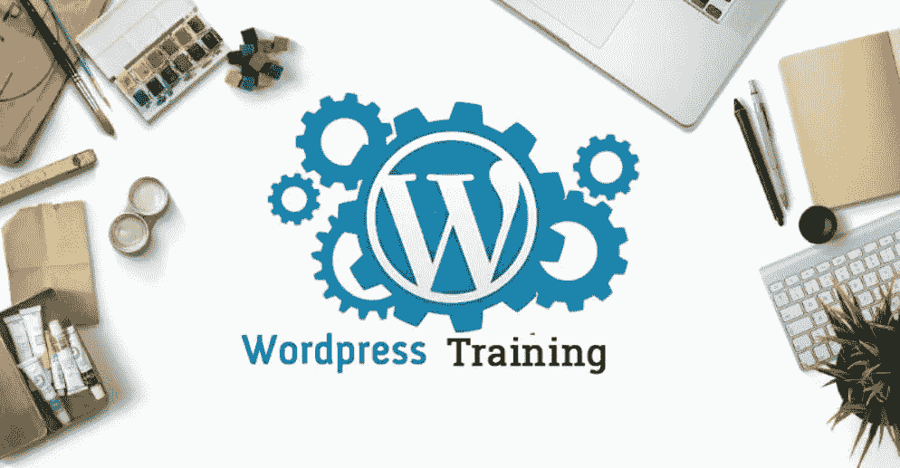
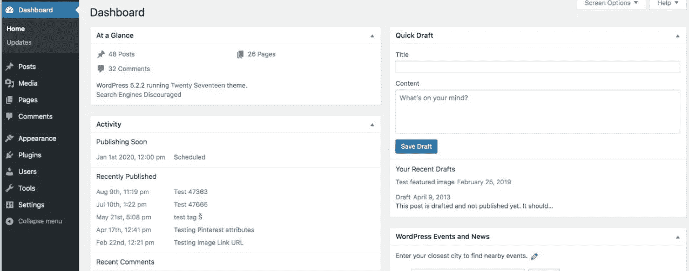
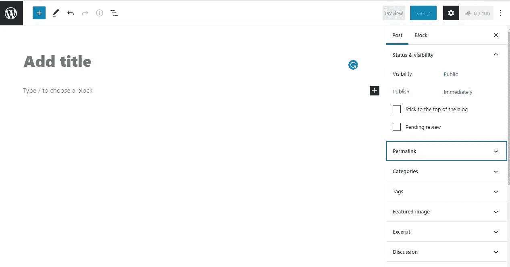

# 2021 年初学 Web 开发的最佳 WordPress 开发者课程

> 原文：<https://medium.com/javarevisited/learn-wordpress-core-concepts-in-5-minutes-f91396434471?source=collection_archive---------4----------------------->

WordPress 是最受欢迎的内容管理系统，主要用于博客，但它可以用于任何类型的网站，甚至你可以从 WordPress 建立一个电子商务网站。

有很多方法可以让你用 [WordPress](https://wordpress.com/) 创建你梦想中的网站。用户通常觉得这个软件很容易使用，但是如果你对这个过程完全不熟悉，开始使用可能会令人生畏，这是可以理解的。这就是为什么我们建立了这个“最佳 WordPress 课程”指南。

所以，伙计们，如果你想为你或你的客户开发网站，并在没有真正学习密集的编码或复杂的 web 架构的情况下开始你的 Web 开发生涯，那么这是学习 WordPress 的正确地方。我们浏览了许多 WordPress 的在线课程，发现这几门课程是学习 WordPress 的最佳课程之一，即使对初学者来说也是如此。

如果你已经知道了 WordPress 的基础知识或者已经成为了 WordPress 的大师，那么你可以根据你的兴趣从我们的列表中挑选一两门课程，从今天开始学习。除了 CoreWordPress，我们还为想学习 WordPress 主题和插件开发的学生提供了一些相关的 WordPress 课程。所以，如果你已经知道了 WordPress 的网站开发，你可以进一步学习保护你的网站免受黑客攻击，并学习修改或添加新功能到你的网站。

# 面向初学者的在线 WordPress 课程列表

任何人都可以在几个小时内在 WordPress 上建立一个网站，而不需要了解任何编程知识，甚至一个知道如何在电脑上工作的非技术人员也可以建立 WordPress 网站。

因此，不浪费任何时间，这里列出了学习 WordPress 的最佳在线课程。这些都是从 Udemy，Skillshare，Coursera & Pluralsight 中挑选出来的最好的课程，所有的课程都由来自全球的专家指导。你可以在 Udemy 上找到最实惠的课程，每门课程从 10 美元到 19 美元不等。

## 1. [WordPress 初学者——快速掌握 WordPress](https://click.linksynergy.com/deeplink?id=iES2LKDPLgo&mid=39197&u1=medrev&murl=https://www.udemy.com/course/wordpress-for-beginners-course/)

这是最基础的课程，仅用 8 个小时的视频讲座就能让你从 WordPress 初学者变成专业人士。讲师安德鲁·威廉姆斯是一个非常优秀的 WordPress 开发者，通过学习他的课程，你将在很短的时间内学会完成 WordPress 的开发。这不是一个速成班，但所有的主题都在一个非常具体的时间内涵盖，而不影响课程质量。

**你将学到什么**

*   学习在本地或虚拟主机上安装 WordPress
*   学习文章和页面的概念
*   了解如何使用主题自定义网站。
*   学习使用插件添加新功能。
*   使用类别和标签对文章进行分类。
*   学习设计主页和法律页面
*   建立一个博客网站，商业和混合网站。

本教程涵盖了所有你需要知道的关于建立不同网站的 WordPress 概念。从课程一开始，你将深入 WordPress，在建立一个网站后，你也将学习一些重要的安全措施来保护你的网站免受黑客攻击。

## 2.【WordPress 训练营终极课程——建立 10 个网站

这个课程是一个一体化的 WordPress 课程，从基础开始，通过在 WordPress 上建立 10 个不同类型的网站，带你进入下一个层次。所以，如果你想成为一名自由职业者，想在 WordPress 上为客户建立各种类型的网站，那么你可以参加这个课程。

这个 WordPress Bootcamp 课程大约 23 个小时，有 7 篇文章和 7 个项目，将从托管网站开始，我们将立即开始建设项目。不同的项目包括建设博客，商业网站，会员网站，论坛，姜鹏董事会，电子商务和画廊网站。

**你将学到什么**

*   在单一课程中建立多种网站。
*   确定不同类型网站的最佳插件和主题。
*   提高你的整体技能
*   学习建立一个电子商务网站
*   学习用 Elementor 设计页面。

所以，如果你已经知道了 WordPress 的基础和核心，那么你可以参加这个课程，学习建立 10 种不同类型的在线网站。

## 3.[完整 WordPress 网站& SEO 培训大师班](https://click.linksynergy.com/deeplink?id=iES2LKDPLgo&mid=39197&u1=medrev&murl=https://www.udemy.com/course/wordpress-website-seo-training/)

这是唯一一个 4.7 分的 WordPress 大师班课程，有超过 30 小时的点播视频讲座，将在 15 天内带你从零到英雄。无论你是 WordPress 的完全初学者还是新手，这门课程是为所有想在 WordPress 建立职业生涯的人准备的。这个课程不仅教你 WordPress，也教你成为 WordPress 专业人士所需的所有相关技能。

**你将学到什么**

*   学习完整的 WordPress 基础知识。
*   学会建设专业网站。
*   主元素或页面生成器插件。
*   学习建立一个电子商务网站，了解销售心理
*   学习做 SEL 和关键字搜索
*   学习 WordPress 的数字营销。

这些是你将要学习的所有技能中的一部分。你可以访问课程以了解课程的细节。

## 4.[成为 WordPress 开发者:用代码解锁权力](https://click.linksynergy.com/deeplink?id=iES2LKDPLgo&mid=39197&u1=medrev&murl=https://www.udemy.com/course/become-a-wordpress-developer-php-javascript/)

在上面的课程中，你已经学习了 WordPress 网站开发，如果你已经知道使用 WordPress 建立一个网站，并且有兴趣扩展改变现有 WordPress 特性的功能，那么你可以参加这个课程，它将教你与 WordPress 修改相关的编程。

这个课程包括一个关于 PHP 编程和 Javascript 的教程，将教你使用 WP REST API 和创建自定义钩子，这对添加新功能很有用。这个课程也将在未来的插件开发中帮助你，因为你将理解所有的 WordPress 钩子。

**你将学到什么**

*   学习 PHP 基础知识& WordPress 特定的 PHP
*   学习构建自定义博客部分
*   学习构建自定义帖子类型
*   理解和定制 WP REST API
*   学习构建自定义插件

**5。** [**WordPress 主题从无到有发展**](https://click.linksynergy.com/deeplink?id=iES2LKDPLgo&mid=39197&u1=medrev&murl=https://www.udemy.com/course/advanced-wordpress-theme-development-with-bootstrap/)

到目前为止，我们已经看到了专门针对 WordPress 网站开发的课程，并使用现有的主题来添加设计和功能。但是，大多数时候，我们从客户那里获得客户需求，要求特定的设计和功能。现在，为了克服这个问题，我们可以为一个特殊的客户建立一个定制的主题，主题开发在 WordPress 领域是一个非常有利可图的工作。

所以，如果你想学习 WordPress 主题开发并为商业创建你自己的主题，那么这个课程就是为你准备的。

**你将学到什么**

*   学习和理解基本的主位结构
*   学习构建 WordPress 主题的高级功能
*   学习库和本地 WordPress API。
*   学习为 WordPress 主题创建内页。

## 6.WordPress 核心概念文章

本指南不包括购买域名和主机概念，从本指南开始，你应该已经在任何主机上安装了 [WordPress](/coursesaving/best-body-language-training-course-85f97f33fda7) ，并且应该能够登录到 WordPress 仪表盘。WordPress 仪表盘如下图所示，你可以用[https://yourdomain.com/wp-admin/.](https://yourdomain.com/wp-admin/.)登录你的仪表盘

WordPress 仪表板

仪表板是您在管理中的第一页，您可以从这个仪表板管理一切。你可以在仪表盘的左侧看到一些选项，比如主页、更新、文章、媒体等等。这些选项是 WordPress 的核心功能，你可以用它们来添加文章、页面以及使用插件和主题的新功能。

## 利用职位

WordPress 中的文章选项用于为你的博客添加文章。现在，根据你正在建立的网站的类型，你可以把这篇文章作为一篇文章、博客、新闻，或者作为一个产品来使用。注意:要添加文章，你可以进入文章选项，选择“添加新的”，WordPress 将打开编辑器，让你添加文章。如下图所示。

WordPress 帖子

现在第一步是给你的文章起一个标题，然后你可以写一篇文章的描述。所有的内容都要加在标题下面的方框里。这是一个基于块的编辑器，所以每当你按下回车键，它会打开一个新的块。您必须选择书写文本段落的块类型，您可以选择段落块。

您可以在编辑器的左侧看到一些选项卡，这些是您可以选择来添加帖子的选项。永久链接是改变 yourdomain.com/post-url-to-edit 等职位的网址，你可以选择修改你的链接。

下一步是**分类**，这是给你的文章分类，例如如果这篇文章属于购物，那么你可以给分类为购物，这在 WordPress 中被称为分类。

就在类别下面，你有**标签**这和文章分类的类别一样，但是它会显示在文章下面。比如，你可以在购物类别下添加“移动”标签。

接下来是**特色图片**，这是用来给帖子一个图片，它将作为文章顶部或页面网格布局上的主要图片显示。你必须每次都在你的文章中添加特色。将所有这些添加到你的 WordPress 文章后，你可以点击发布按钮，你的文章就会被发布。你可以随时编辑你的文章，添加新的内容或修改文章。

## WordPress 中的媒体

您在撰写帖子或页面时添加的任何图像或视频都将显示在媒体中。您可以在此编辑您的媒体或添加新媒体。这用于管理您的媒体，如果您删除了相关的帖子或页面，您也可以从这里删除媒体。

## WordPress 中的页面

页面和文章是一样的，但是用于不同的目的，而不是写文章。它用于添加重要页面，如联系我们，条款和条件，添加画廊，或组织页面中的帖子。它被用作帖子的容器，例如，如果你想在一个页面上显示与某个特定主题相关的所有帖子，你可以这样做。

## 外观和插件

这些用来增加或者扩展 WordPress 的功能。从外观上看，你可以添加新的主题来改变你的网站的日志和感觉，你也可以添加插件来增加额外的功能。例如，如果你想建立一个电子商务网站，那么你可以为 Woocommerce 添加一个主题和插件来添加产品。我会为每个 WordPress 写一篇关于一些最好的主题和插件的文章。

如果你正在寻找 B [est 搅拌机课程](/@elncart/best-blender-course-for-beginners-5e7dbc5ee661)那么你可以参考这篇文章。

目前，这是它，我会更新这篇文章来解释更多的东西。

披露:这篇文章可能包含附属链接，如果你点击关注并报名参加课程，我们可能会得到佣金。