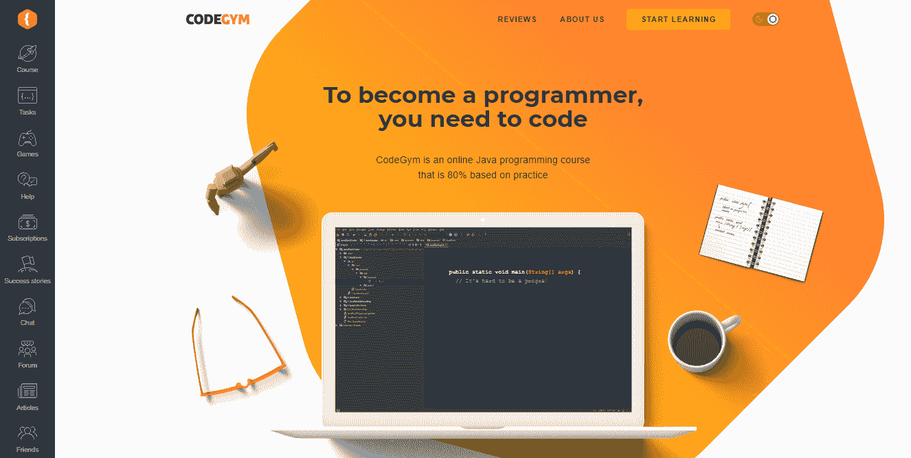
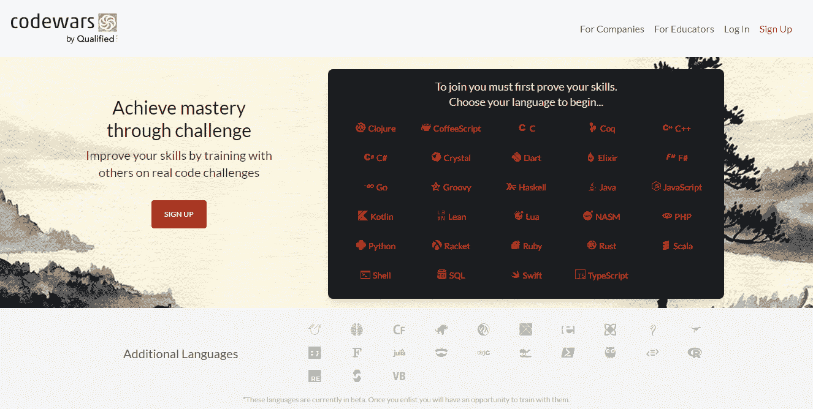
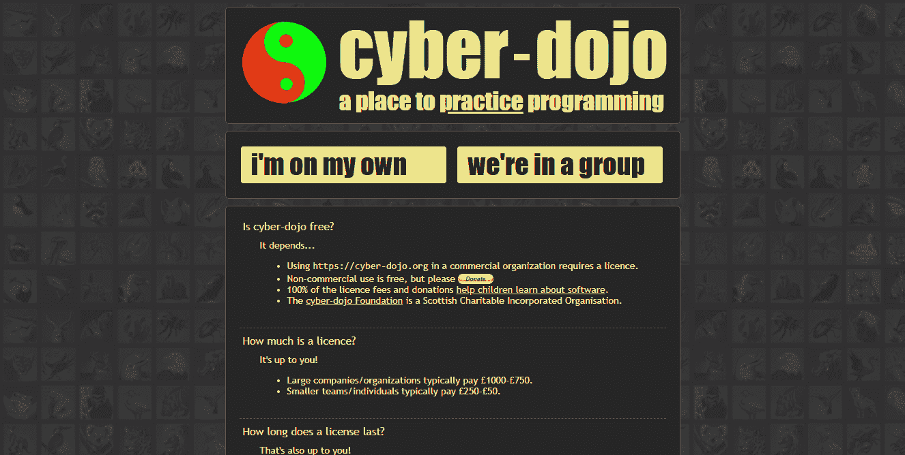
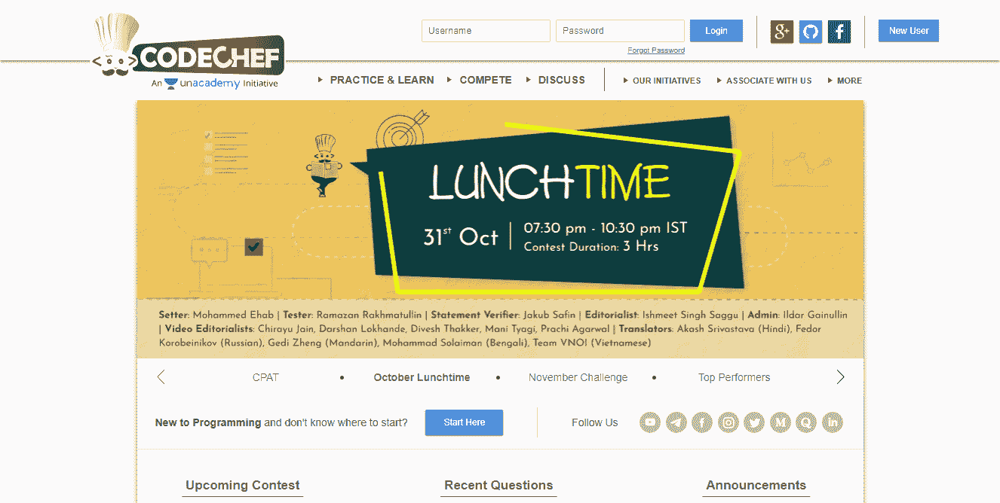
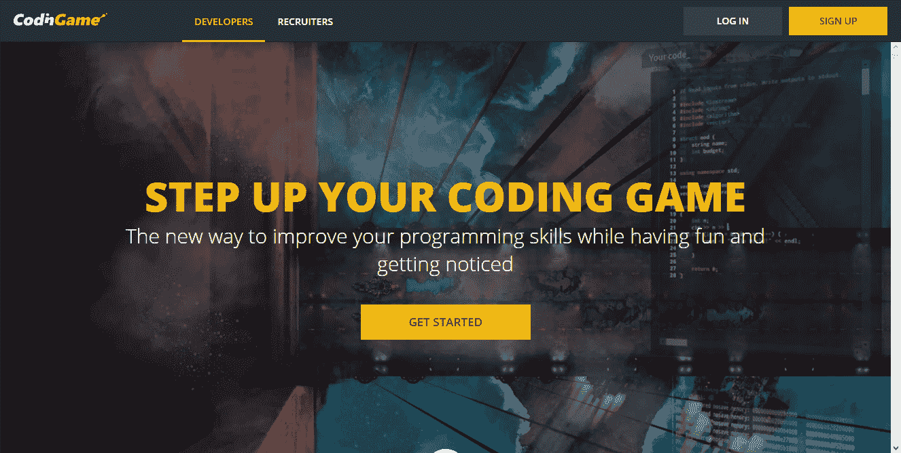

# 边玩边学:如何用编码游戏和任务学习 Java？

> 原文：<https://medium.com/javarevisited/learning-by-playing-how-to-learn-java-with-coding-games-and-quests-12727e0dd274?source=collection_archive---------1----------------------->

图片由 [Unsplash](https://unsplash.com/?utm_source=unsplash&utm_medium=referral&utm_content=creditCopyText) 上的 [Alexandru Acea](https://unsplash.com/@alexacea?utm_source=unsplash&utm_medium=referral&utm_content=creditCopyText) 拍摄

这年头，学习 Java 的资源几乎不计其数。自学教程、书籍、在线课程、离线课程——应有尽有。

然而，为了保持学生学习编码的积极性，开发人员最近推出了基于游戏的在线课程。他们被发现是获得编程技能的最佳方法之一，而以前几乎没有经验。游戏化让你在玩中学习，这是一种避免倦怠的有特色的做法。

因此，接下来，您会发现一个包含五个 Java 游戏化平台的列表，这些平台将使学习语言的过程成为一次激动人心的旅程。

# 面向 Java 实践的 5 大基于游戏的编程平台

## 1.CodeGym

定价:

*   免费零级，以及免费进入游戏部分，论坛，和帮助部分。
*   保费计划每月 49 美元。
*   Premium Pro 计划每月 99 美元。

一旦你从 [CodeGym](https://codegym.cc) 开始课程，你将被迫从头开始写你的第一行代码。这是一个在线编程平台，致力于给学生尽可能多的 Java 练习。该课程包含四个问题，每个问题 10 个级别。总的来说，你将解决 1200 个越来越复杂的小实际任务，并获得在任何急需程序员的公司找到工作所需的知识和技能。

除此之外，这门 [Java 课程](/javarevisited/10-free-courses-to-learn-java-in-2019-22d1f33a3915)使用最新的教学方法，让学生对学习过程感兴趣。游戏化是方法之一。一个用户到达由机器人居住的未来星球，并面临团队粉碎。从零级开始，用户和一个年轻的机器人朋友一起开始自学代码，以教育团队的其他成员，离开这个星球，回到地球。

正如你所看到的，这个课程非常有趣，它允许学生们更进一步，直到他们达到最后的水平。除了收到学习者完成的所有任务的即时验证，他们还可以访问一个活跃的社区。在这里，他们可以寻求帮助，与其他学生分享他们对任务的印象，并向毫无编程经验的人伸出援手。

## 2.代码战争

定价:

*   免费。
*   9.99 美元/月访问附加教程。

Codewars 平台的创建得益于用户的集体努力。它允许学生通过训练自己的形来提高他们的技能，这种挑战是以一些武术的一种练习形式命名的。这些[编程练习](/javarevisited/top-21-string-programming-interview-questions-for-beginners-and-experienced-developers-56037048de45)有助于强化不同的技能，从掌握所选语言到扩展对一门新语言的理解。课程是游戏化的，所以学生在学习编码的时候永远不会感到无聊。

当加入 Codewars 平台时，用户可以获得 [20 种编程语言](/hackernoon/10-best-programming-languages-to-learn-in-2019-e5b05af4a972)供他们选择；其他 12 种语言在测试版中仍然可用。Kata 可以在学生的浏览器中解决，并使用测试用例进行检查。

除此之外，学生们在挑战自己的形的同时，也赢得了等级和荣誉。他们完成的形的等级越高，与他们获得的技能相关的挑战就越复杂。学习者还可以与同龄人比较他们的解决方案，讨论最佳实践，或者在社区内进行头脑风暴。

最后但同样重要的是，Codewars 用户可以根据自己的兴趣和技能创建自己的形，挑战社区，并收集反馈。

## 3.赛博道场

定价:

*   免费用于非商业用途(欢迎捐赠)。

[Cyber-Dojo](https://cyber-dojo.org/creator/home) 是学习 [Java](/javarevisited/top-5-java-online-courses-for-beginners-best-of-lot-1e1e240a758) 、 [JS](/javarevisited/10-best-online-courses-to-learn-javascript-in-2020-af5ed0801645) 、 [Python](https://javarevisited.blogspot.com/2019/09/5-websites-to-learn-python-for-free.html) 等 25+种编程语言的另一个地方。与 CodeGym 和 Codewars 一样，Cyber-Dojo 平台是使用游戏化技术开发的。学生可以通过完成大量的练习和挑战来获得编码技能，每个练习和挑战都有很好的描述并解释了解决方案可能是什么样子。

该平台使学生可以选择喜欢的语言和练习，开始自己练习或参加小组会议。训练时，用户编写代码，然后测试运行，以检查他们是否通过了挑战。如果失败，灯会变成红色，而琥珀色灯则表示语法错误。最后，当您通过所有任务时，灯会变成绿色。

网络道场课程的主要目标是帮助你提高编码技能，而不是尽快达到最后的水平。

## 4.厨师长

定价:

*   免费。

如果你想一边学习 Java，一边和你的开发伙伴竞争，考虑一下 [CodeChef](https://www.codechef.com) 。这是一个为每月举办三次编程竞赛和挑战而开发的平台。CodeChef 鼓励专家们让自己得到认可，并以奖品和糖果的形式获得激励。除此之外，该平台允许其他编程社区，包括来自世界各地的大型机构和组织，开展自己的竞赛。

虽然比赛更适合有经验或至少有基本技术知识的专家，但 CodeChef 也照顾到了初学者。除此之外，你可以找到关于[算法](/hackernoon/50-data-structure-and-algorithms-interview-questions-for-programmers-b4b1ac61f5b0)、[、](/javarevisited/binary-search-in-java-algorithm-eca288cb9bc2?source=extreme_sidebar----d3a191ac6ed-----0-1----------------------)、[排序](https://javarevisited.blogspot.com/2019/04/top-20-searching-and-sorting-algorithms-interview-questions.html)的培训课程、教程和讨论，以及其他有助于开始你的编程之旅的概念。由于要解决的问题都是按照等级和题目进行标注的，所以可以选择适合自己技能的。

像 Codewars 一样，CodeChef 允许学生在浏览器窗口中上传、编写和运行代码，并从 35 种以上的技术中选择他们想要掌握的语言。每次用户给出正确的答案，他们就会获得积分和更高的排名。此外，他们从导师那里获得对代码的反馈，这允许消除任何可能的错误或差异。一旦学生觉得他们有足够的编程知识和技能，他们最终可以参加竞赛。

## 5.编码游戏

定价:

*   对开发者免费(由等待与编码者接触的公司赞助)。
*   €349 按月支付，€249 按年支付，用于发展计划(针对希望雇佣专家的企业)。
*   需要为企业计划请求报价。

CodinGame 是少数几个鼓励学生在编写第一行代码时承担责任并为未来建立全球游戏做出贡献的平台之一。它也是一个招聘平台，帮助专业人员被寻找[熟练开发人员](https://javarevisited.blogspot.com/2014/01/10-tips-to-improve-programming-skill-become-better-programmer.html)的科技公司注意到。这些和其他特点使它值得在这个顶级游戏化课程的名单中。

CodinGame 平台结合了理论和实践教学方法，因此所有技能水平的开发人员都可以学习和练习 25 种以上的语言。他们可以接触到越来越复杂的编程难题和机器人竞赛。

编写一个[人工智能机器人](/javarevisited/5-best-dialogflow-and-chatbots-courses-to-learn-in-2021-14ce2e85090d)让学生们以一种有趣的方式与其他程序员的机器人竞争，并学习如何用手头的工具解决问题。那些总是忙碌的人可以充分利用每天 5 分钟的编码战。

除了以其游戏化的挑战而闻名，CodinGame 还拥有一个充满活力和支持的程序员社区。你是否很难完成谜题并且几乎找不到答案，有一些编码问题，或者只是想分享你对竞赛的印象？论坛和聊天是寻找帮助和与你处境相同的人的理想方式。

# 包装东西

学习编程就像健康饮食一样——就像每个人都觉得健康的食物没有味道一样，每个人都习惯了 Java 实践和学习其他编程语言很无聊的想法。

然而，这与现实相差甚远，学习编码可以通过基于游戏化教学方法的在线课程来获得尽可能多的乐趣。将提到的平台放在列表中，当学习一门新的编程语言或扩展您已经掌握的知识时，尝试它们。