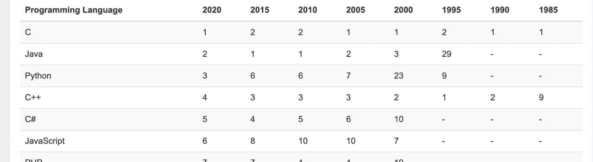
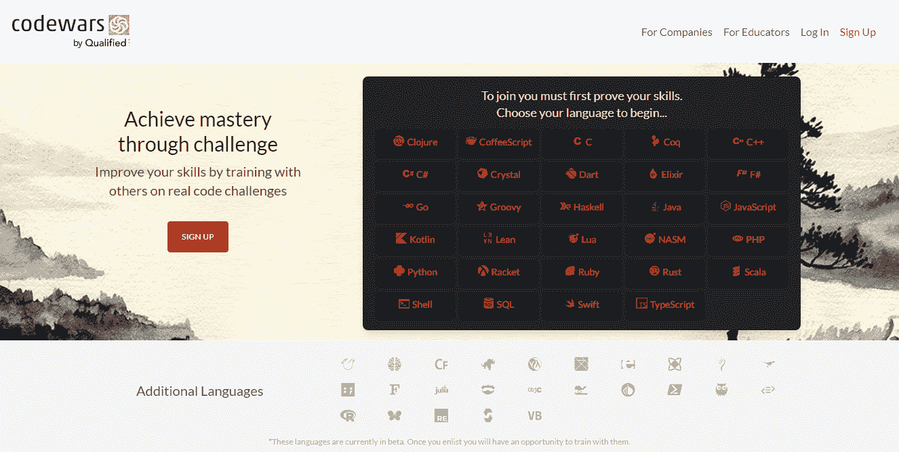
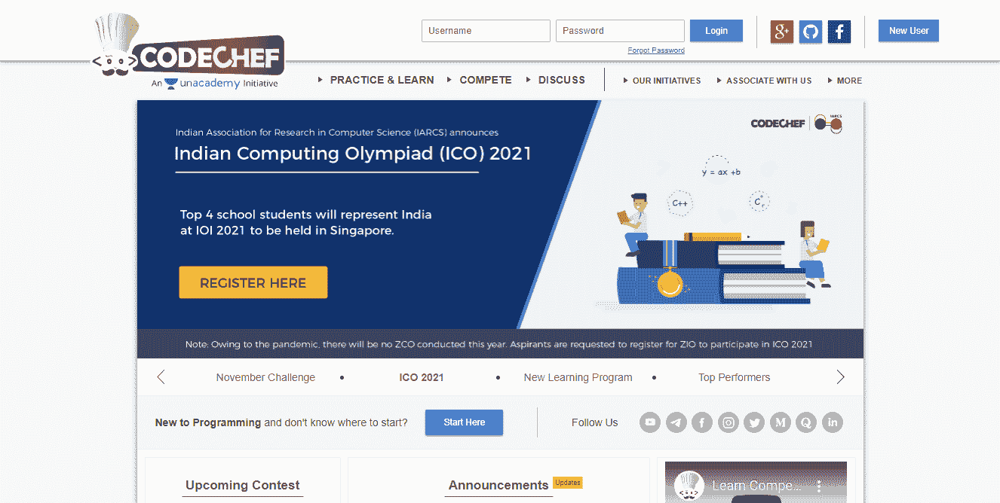
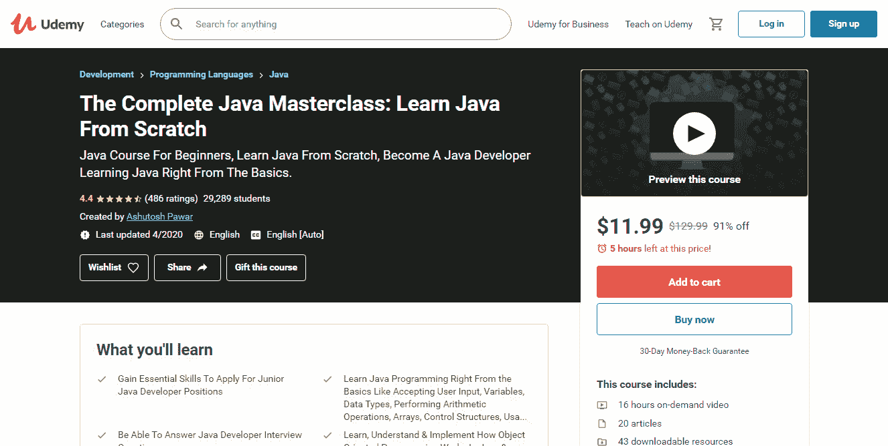
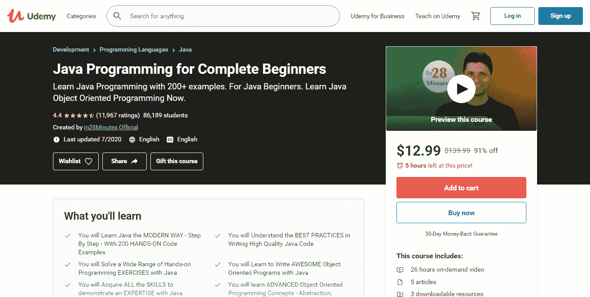
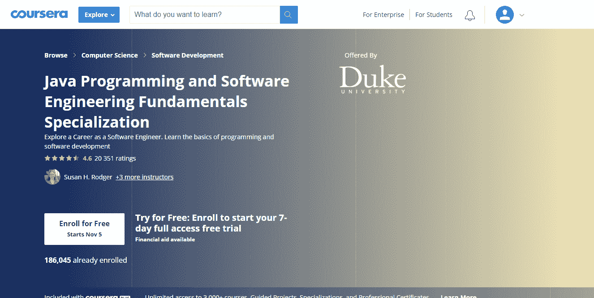

# 学习 Java 作为你的第一语言:支持还是反对

> 原文：<https://medium.com/javarevisited/learning-java-as-your-first-language-for-and-against-94f9c319e625?source=collection_archive---------1----------------------->

Yusuf Evli 在 [Unsplash](https://unsplash.com/s/photos/learn?utm_source=unsplash&utm_medium=referral&utm_content=creditCopyText) 上的照片

所以，你已经决定下周一开始学习编程。然而，这里有一个问题:如果你以前没有编码经验，从哪种语言开始？所有新手常见的困境，不是吗？尽管有许多适合新手的编程语言，我还是建议你从 Java 开始，因为我发现它非常适合介绍编码世界。所以，我们来了解一下最前沿的学习 Java 的理由有哪些。

# 为什么要掌握 Java 作为主要语言

## Java 是三大编程语言之一

[TIOBE Index](https://www.tiobe.com/tiobe-index/) 发布了 11 月份最受欢迎编程语言的最新统计数据，Java 以 11.68%的份额位居第三。

Java 多年来一直受欢迎的原因[是它一直在不断发展，并定期更新新的特性，使开发过程变得更加简单。](/javarevisited/why-java-is-the-best-programming-language-to-learn-coding-for-beginners-cba79aed1271)

它通常用于不同的行业，包括医疗保健、金融、零售、游戏、机器学习、反应式编程、营销等。今天，全世界大约有八百万程序员在工作中使用 Java 语言。这就是为什么许多公司为他们的新项目选择这种相同的语言，因为他们知道他们可以很容易地在 Java 程序员中找到一个专家。

## 了解 Java 打开了就业机会的大门

Java 常用于大型团队的大型企业级公司。这些类型的公司通常从事大型且昂贵的项目，这些项目需要大量的专家，也包括许多初学者。因此，开发新手一旦掌握了语言基础，就可以找到一份工作，并有望获得不错的报酬。

但是让我们来看看他们应该具备什么样的技能才能获得招聘经理的青睐。

大多数公司希望申请人具备核心 Java 知识，以及使用 Java 编程中最常用的技术、技巧和工具的经验。

*   [核心 Java](/javarevisited/top-5-java-online-courses-for-beginners-best-of-lot-1e1e240a758)
*   [春天和冬眠](/javarevisited/8-best-spring-and-hibernate-training-courses-for-java-developers-acf09aa0e244)
*   [servlet](/javarevisited/6-free-courses-to-learn-servlet-jsp-and-java-fx-in-2020-best-of-lot-720201c84f63)
*   单元测试
*   [SQL 和数据库](/hackernoon/top-5-sql-and-database-courses-to-learn-online-48424533ac61)
*   JSON/Jackson
*   用于 RESTful Web 服务的 Java API
*   设计和架构模式
*   构建自动化工具( [Maven](/javarevisited/6-best-maven-courses-for-beginners-in-2020-23ea3cba89) ， [Gradle](/javarevisited/5-best-gradle-courses-and-books-to-learn-in-2021-93f49ce8ff8e) )
*   [Git](/@javinpaul/top-10-free-courses-to-learn-git-and-github-best-of-lot-967aa314ea)
*   [码头工人](https://dev.to/javinpaul/top-10-courses-to-learn-docker-and-kubernetes-for-programmers-4lg0)

此外，公司希望候选人对 Java 8 中出现的特性有很强的了解，包括 lambdas，以及 Java 流 API、接口中的默认和静态方法等。在测试方面，潜在雇主希望申请人在 JUnit 5 库、Mockito 和机器人框架测试工具方面表现良好。

# 教育资源没有限制

与最近的时代相比，今天，在线学习 Java 的资源数量令人望而生畏。有上百个网站让新手学习 Java 成为可能。

这里有一份实用课程清单，可以开始你的旅程。

## CodeGym

[CodeGym](https://codegym.cc) 在线 Java 平台的目标是让学习过程变得有趣和令人兴奋。该课程包括超过 1200 个实践任务，迫使学生在加入平台后立即编写代码。由于有了即时的代码验证，新来的人可以很快检查他们的任务，并且知道要改进什么。除此之外，该课程还包含一个游戏部分，允许专家构建他们自己版本的流行经典视频游戏。

## 代码战争

这是另一个学习平台，它将让你通过与你的开发伙伴一起进行名为 kata 的真实世界代码挑战来磨练你的技能。Codewars 允许通过与他人竞争和创建自己的项目来获取必要的知识。

## 赛博道场

如果你想提高你的编码技能，而不是在他们最方便的时候完成游戏，考虑一个更游戏化的平台。Cyber-Dojo 也将有益于有经验的程序员，因为它很适合用于编码对练和小组竞赛。

## 厨师长

[CodeChef](https://www.codechef.com) 因每月三次在平台上举办竞赛和挑战而闻名。除了掌握和磨练您的编码技能，并在竞赛中赢得奖杯，您还将能够参加涵盖二分搜索法、算法和其他技术概念的培训课程和讨论。

## [完整的 Java masterclass](https://javarevisited.blogspot.com/2020/11/review-java-programming-masterclass-.html#axzz6dl56Y3wG)s

如果你想从 Java 的基础开始教授 Java 的所有内容，并开始学习更高级的主题，如 lambda 表达式、泛型或多线程，[这门课程](https://javarevisited.blogspot.com/2020/11/review-java-programming-masterclass-.html#axzz6dl56Y3wG)是一条可循之路。

## 面向完全初学者的 Java 编程

如何学习 Java 不中途退出？一切都很简单——只需申请 Udemy 为完全初学者开设的 Java 编程课程。它是使用旨在简化学习过程的渐进教学技术创建的。

## [杜克大学 Java 认证](/javarevisited/18-coursera-courses-you-can-join-in-2020-to-learn-from-the-worlds-top-tech-companies-google-74af46967d1e?source=collection_home---4------0-----------------------)

Coursera 也推出了一个 [Java 项目](https://www.coursera.org/specializations/java-programming)，向你介绍 Java 基础知识。在完成课程和动手项目后，你将获得一个证书，你将能够与潜在的雇主分享。

# 社区是友好和支持的

一个支持性的社区是编程不同于其他行业的地方。刚刚开始编码之路的初学者相信，他们不会独自面对可能的困难——有经验的开发人员准备好提供一点帮助、支持、帮助解决问题，并分发最后一条信息。鉴于从零开始学习编程并不是一件容易完成的任务，要明白你并不是一个人在帮忙。

Java 有一个巨大且快速增长的社区，在这个社区中，所有成员都相互支持，不管他们的知识基础和经验水平如何。大量与 Java 相关的论坛、社会媒体团体和组织鼓励并推广 Java 程序员积极参与社区生活。

考虑一下访问量最大的资源，从中你可以得到支持。

*   [GitHub](https://github.com)
*   [StackOverflow](https://stackoverflow.com)
*   [黑客新闻](https://news.ycombinator.com)
*   [站点点](https://www.sitepoint.com/community/)
*   [Reddit](https://www.reddit.com) 频道
*   r/编程
*   学习编程
*   r/代码在一起
*   r/编程工具
*   r/游戏开发
*   r/Prog articles
*   r/webdev
*   r/每日程序
*   r/java
*   r/javahelp
*   [Java form](https://www.java-forums.org/forum.php)

# 编码功能已经在多个库中可用

世界各地的开发人员可以使用大量的开源库，这也是 Java 脱颖而出的原因。许多公司，如 Apache 和 Google 以及非营利组织已经发布了公共库来显著改进 Java 开发。因此，在编写代码之前，新手使用 Google 搜索最有可能可用且随时可用的所需功能是有意义的。

以下是一些有用的库示例:

*   [Java 标准库](https://docs.oracle.com/javase/8/docs/api/index.html)
*   杰普斯特
*   [阿帕奇社区](https://commons.apache.org)
*   [番石榴](https://github.com/google/guava)
*   谷歌 Gson
*   冬眠形态
*   [莫奇托](https://site.mockito.org)
*   [朱尼特](/javarevisited/5-courses-to-learn-junit-and-mockito-in-2019-best-of-lot-f217d8b93688?source=---------20------------------)

鉴于大量可用的库和其他有用的资源定期出现，许多编码专家一致认为 Java 并没有失去其受欢迎的程度，并且首先是一种理想的语言。Javin Paul 发现它是最好的编程语言之一，因为它已经存在了 20 年，而且只会变得更强。

IT 专家 [John Mueller](https://blog.newrelic.com/engineering/java-python-comparison/) 支持这一观点，他认为 Java 功能的改进不会停止——开发者会添加新的特性，使语言更快更灵活。Java 仍然普遍用于构建大型应用程序，这是当今财富 500 强中 90%使用的编码类型。所以，Java 不是“前”语言，也不会很快消失。

记住，对于 Java 来说，有可能有一些库，如果不能解决您的问题，也能简化它。用谷歌！

# 这一切都很好。但是有什么困难在等着你呢？

至此，您应该毫不怀疑 Java 是成为您的第一编程语言的理想选择。

但是，事实是，这个世界上没有十全十美的东西，学习 Java 也不例外。除了所有提到的好处之外，我还需要谈谈初学者可能会遇到的一些挑战——以确保您没有误解我，现在认为学习 Java 是件轻而易举的事情。

事实上不是那样的。教育资料的数量从字面上看是无穷无尽的，这对新人是有好处的。但是，从一开始就掌握 Java 可能需要额外的努力，因为它是一种中年、成熟的语言，具有丰富的信息，需要学习才能成为有经验的专家。我想说的是，紧张的工作和规律的练习会帮助你实现目标。

# 总结事情

不管你在学习 Java 时可能会遇到什么问题，选择它作为你的第一语言来学习仍然是值得的。Java 被设计成对初学者相对友好，并以其庞大的支持性社区、大量的交互式课程和其他资源使您的编码生活更容易而闻名。所以，把你的疑虑抛在脑后，去争取吧！