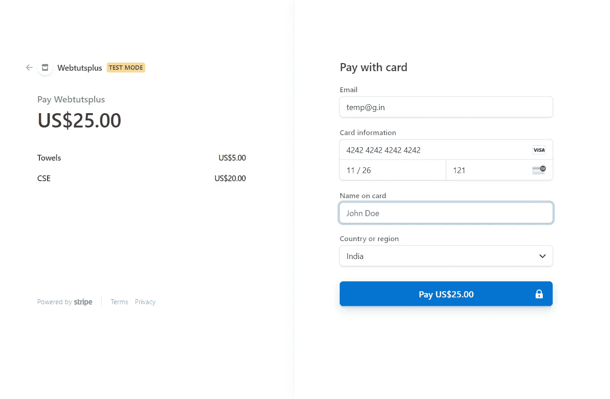

# 让我们在 Spring Boot 为我们的电子商务应用程序添加一个结账功能

> 原文：<https://medium.com/javarevisited/lets-add-a-checkout-feature-in-spring-boot-for-our-ecommerce-app-72b12a7f3648?source=collection_archive---------1----------------------->

在本教程中，我们将学习如何在我们的演示电子商务应用程序中使用 Stripe 来集成 Spring Boot 的支付网关

条带支付网关的前端

# 介绍

结帐是电子商务应用程序的一个重要功能，它允许用户为订单付款。我们将为我们的应用程序使用条纹支付网关。