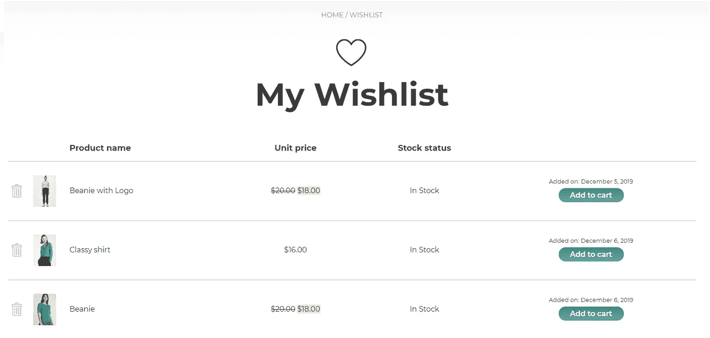

# 使用 Java 和 Spring Boot 的电子商务应用程序的愿望列表功能

> 原文：<https://medium.com/javarevisited/lets-add-wishlist-feature-for-our-e-commerce-app-using-java-and-spring-boot-1402c0b6f1e8?source=collection_archive---------1----------------------->

## 我们将使用 Java 和 Spring Boot 在每个电子商务网站中创建一个非常重要的功能的后端— **愿望列表**

一个**愿望列表**是一个电子商务功能，允许购物者创建他们想要购买的个性化产品集合，并保存在他们的用户账户中。这是一个…