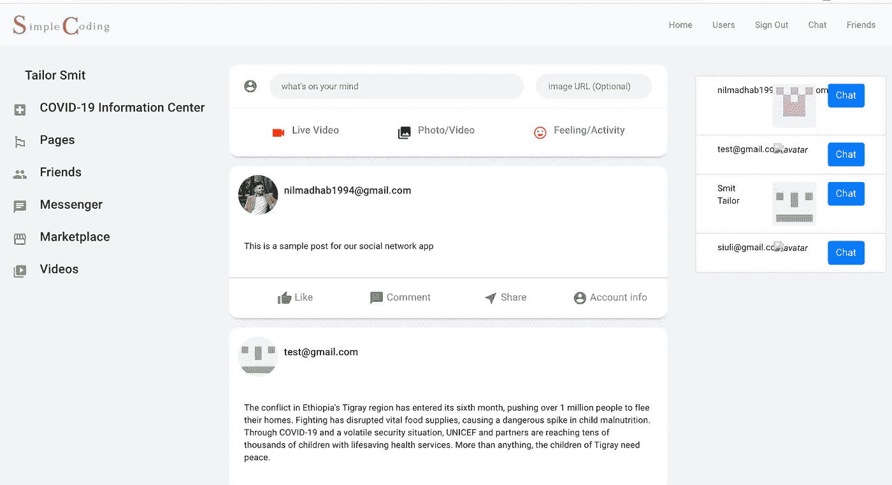

# 让我们使用 Spring 为我们的社交网络应用程序中的帖子构建后端

> 原文：<https://medium.com/javarevisited/lets-build-backend-for-posts-in-our-social-network-app-using-spring-387c31eb899?source=collection_archive---------3----------------------->

在本教程中，我们将使用 Springboot 后端为我们正在构建的演示社交网站添加一个帖子功能。

# 介绍

我们每天都会使用很多社交媒体平台，比如脸书、Linkedin、Twitter、Whatsapp、Instagram。我一直想自己造一个。所以在这一系列教程中，我们…