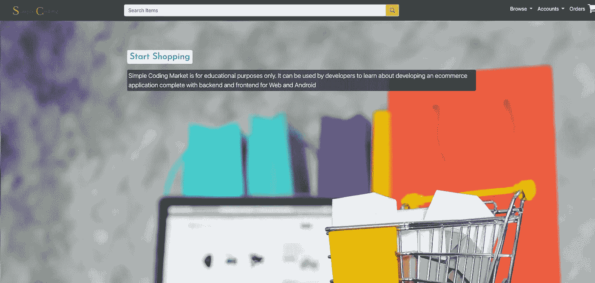

# 让我们使用 Java 和 Spring 从头开始开发一个电子商务应用程序

> 原文：<https://medium.com/javarevisited/lets-develop-an-e-commerce-application-from-scratch-using-java-and-spring-a921f448a93b?source=collection_archive---------0----------------------->

## 项目设置、开发类别和产品 API

# 动机

在我看来，学习编程的最好方法是创建一个有实际用途的真实生活项目，这样整个学习过程会变得相当令人兴奋。此外，您还可以在您的中展示您的应用程序…