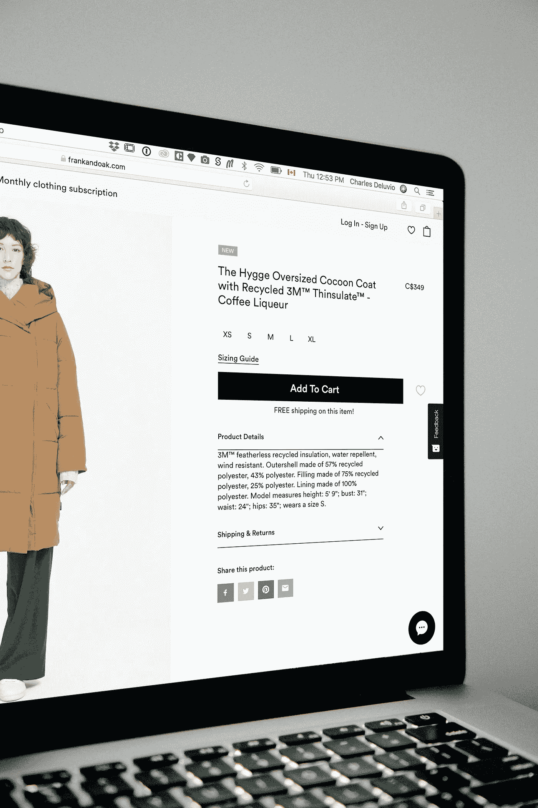

# 让我们为电子商务应用程序开发购物车

> 原文：<https://medium.com/javarevisited/lets-develop-shopping-cart-for-ecommerce-app-8e57a9ab4868?source=collection_archive---------0----------------------->

每个电子商务网站都有一个 S **跳跃** **推车**功能，今天我们将学习如何使用 Java 和 Spring Boot 制作后端 API

照片由 [Charles Deluvio](https://unsplash.com/@charlesdeluvio?utm_source=unsplash&utm_medium=referral&utm_content=creditCopyText) 在 [Unsplash](https://unsplash.com/s/photos/online-shopping?utm_source=unsplash&utm_medium=referral&utm_content=creditCopyText) 上拍摄

购物车是电子商务应用程序的必备功能，允许用户保存他们想要购买的商品，更改数量，并删除它们。它还应该能够显示购物车中的项目的总成本。