# 让我们更好地了解:素描！

> 原文：<https://medium.com/javarevisited/lets-get-to-know-better-the-sketch-5d34907dfb49?source=collection_archive---------2----------------------->

你很有可能已经听说过这个名字，但这里有一个简短的介绍，以防你不知何故错过了这场闹剧。

草图是 Mac OS 的一个应用程序，在过去的几年里，由于其专注于数字设计，受到了很多关注。

该计划有一个非常友好的用户界面，并有许多网页开发的风格选择。

当同时设计各种屏幕状态和尺寸时，多个画板特别有用。最后，由于插件数量的不断增长，Sketch 正在成为数字设计师武器库中不可或缺的领导者。

# 例如，为什么是素描而不是 Photoshop？

它们出现在 2010 年，但直到现在才开始流行。那么为什么网页设计者和开发者更喜欢 Sketch 而不是 Photoshop 来进行实体模型的开发，一般来说草图模板是什么？

它们是使用 Sketch 应用程序开发的实体模型和网站的现成设计解决方案。

与 Photoshop 相比，Sketch 具有以下优势:

*   在一个项目中安装多个设计扩展的能力；
*   100%基于矢量图形，因此作品可以有 5 到 5000 像素的扩展；
*   在不同页面上创建项目的能力；
*   该应用程序允许您创建文本样式或元素的其他样式；
*   它的主要目的是加快工作流程。

# 如何用素描工作？

现在，您可能在想，“有一个好工具是很好的，但是您如何充分利用它的潜力呢？”。

你需要知道去哪里，按下哪个按钮才能让事情发生。

因此，让我们深入到 [**的事情，你可以用草图**](https://www.sketch.com/docs/) 来做。

1.  使用页面分隔各种设计模板。例如，通常会为主页的设计预留一个页面，页面上的每个画板都是状态或设计的变体，包括智能手机、桌面和平板电脑的版本。在一个地方，所有这些版本都立即可见，因此您可以非常快速地将任何元素从一个画板移动到另一个画板。
2.  草图开发人员很清楚，响应式 web 设计已经是一种标准，它极大地影响了创建图形和开发 web 应用程序和网站的方法。这就是为什么它有一个特殊的内置网格，可以为您计算尺寸，以便您可以按照自己的方式定制网格，而无需手动进行复杂的计算和绘制指南。Sketch 应用程序将其称为所有相同的布局，您可以根据需要在每个画板上启用或禁用网格。
3.  在整个项目中保持排版的一致性是至关重要的，这样所有的元素都有统一的风格。这有助于显著减少创建设计的时间。Sketch 中的文本样式通过为任何文本变体构建样式列表来帮助实现这一点。不要忘记图层样式。这些与文本样式相同。但是，轮廓样式、填充、不透明度、混合模式、阴影都是在图层样式中设置的。

# 与草图一起使用的 5 大附加功能

正确的插件就像顶上的樱桃:不完全是必需品，但在有意使用时是杰出的增强剂。

## #1 [文本(分割文本)](https://github.com/joshwayne/jw-sketch-plugins)

有时候你需要从一个站点或者一个标题/列表中提取一定量的文本，并把它转移到布局中。例如，分割文本允许一次复制一个长列表，在草图中单击一次即可将每一行分割成一个单独的文本对象(也可以是文本本身，就像在布局中一样)。

## #2 [地图生成器](https://github.com/eddiesigner/sketch-map-generator)

一个插件，允许你用基于位置(基于谷歌地图)生成的地图填充一个层。有了它，您可以快速创建移动应用程序或网站的地图视图。你只需要写一个位置，插件会完成剩下的工作。

## #3 [号飞船](https://www.invisionapp.com/craft)

这个独特的插件必须“挂在每个 UI / UX 设计师的工具带上”。Craft 是一整套插件，通过自动化统一的操作和提取更真实的数据样本来帮助简化您的设计工作流程。

## #4 [CSSketch](https://github.com/JohnCoates/CSSketch)

CSSketch 允许你通过附加一个样式表来快速修改你的项目，你可以用它来快速布局你的设计，快速改变颜色，阴影等等。CSS 支持意味着您可以将函数和变量放在样式表中，使您的工作流更加高效。

## **#5** [**实时板**](https://help.miro.com/hc/en-us/articles/360017731173-Sketch-Plugin)

实时板是一个伟大的工具，让您创建图表，表格，图表在自由空间与其他专家一起。这个插件可以让你从 Sketch 中加载屏幕，并方便地更新它们，覆盖已经加载的内容。

# 草图的 9 大高效模板

## [茜拉电子商务草图模板](https://www.templatemonster.com/sketch-template/79826.html?aff=javarevisited&utm_campaign=blog_site_sketch&utm_source=javarevisited&utm_medium=referral)

茜拉是一个干净清晰的主题，使用了许多高级模块和修改，如收藏夹列表、社交媒体集成和主页上的图库。

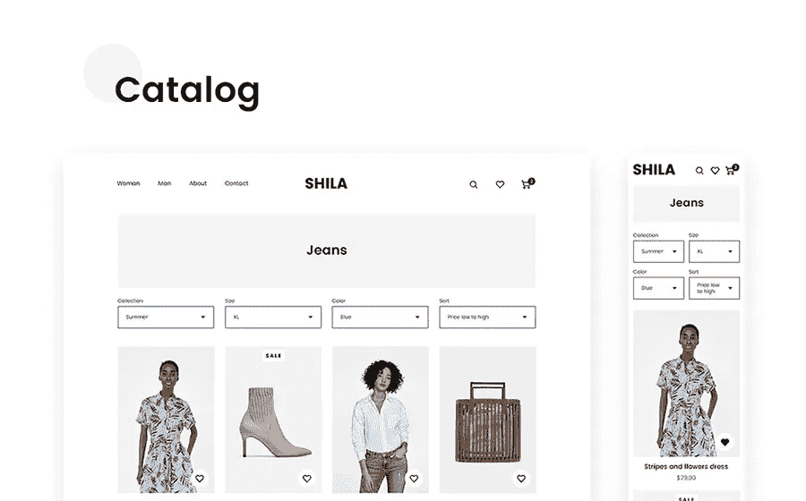

它也基于 Bootstrap 框架，这意味着无论访问者使用什么设备，你的商店都会看起来很好。

## [方法线框套件 2 草图模板](https://www.templatemonster.com/sketch-template/method-wireframe-kit-2-sketch-template-78960.html?aff=javarevisited&utm_campaign=blog_site_sketch&utm_source=javarevisited&utm_medium=referral)

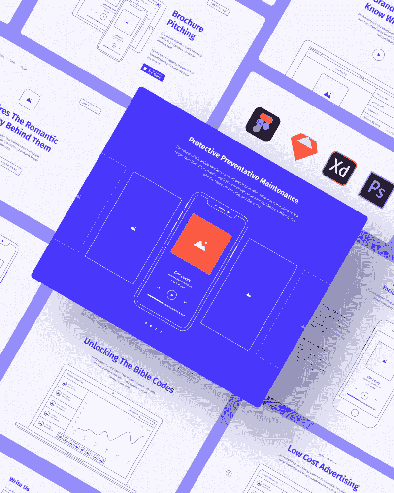

这是一个方便直接的构造器，用于站点的快速原型制作。你不需要任何特殊技能；你可以采用现成的模板或布局，编辑它们，组合和创建你的网站原型。打开它工作，不需要任何指示。

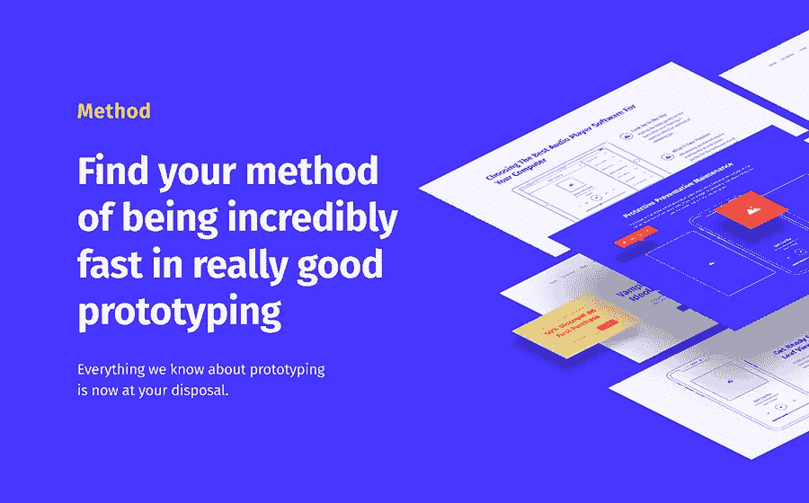

你可以从头开始组装一个原型，或者你可以使用现成的模板，然后根据你的口味进行修改。大量的块和空白允许你一个块地创建一个原型站点，而不是单独地添加每个元素。

## [紫晶——电竞草图模板](https://www.templatemonster.com/sketch-template/amethyst-esports-sketch-template-94139.html?aff=javarevisited&utm_campaign=blog_site_sketch&utm_source=javarevisited&utm_medium=referral)

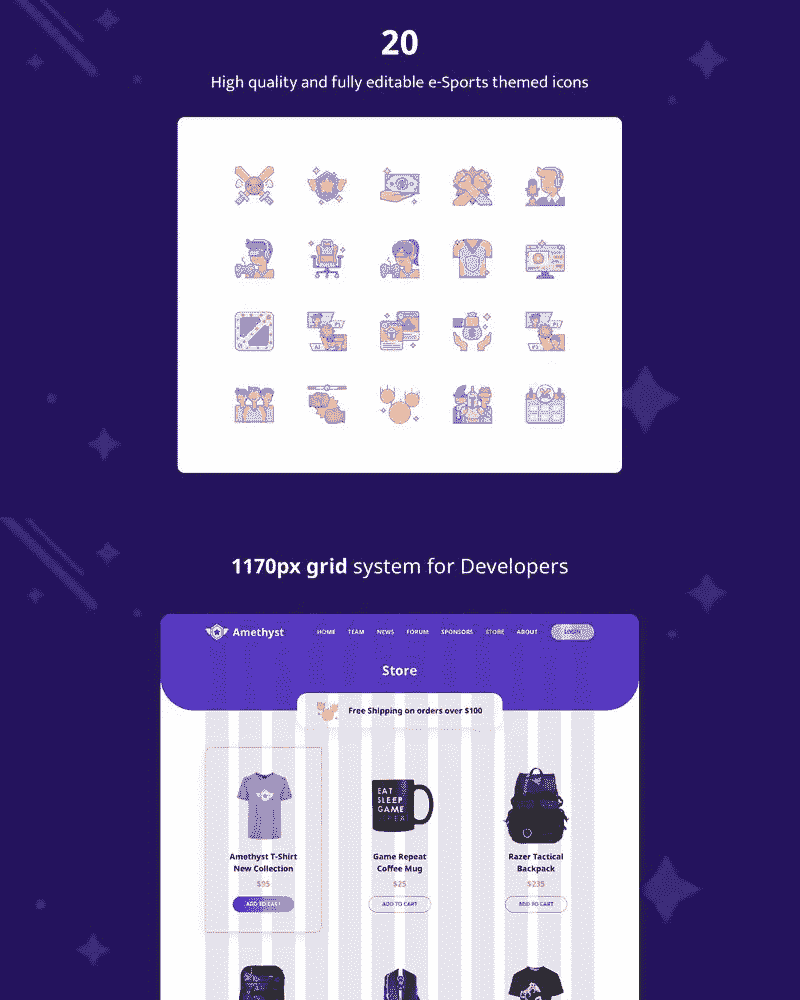

任何与体育相关的网站主题。它可以像公司宣传册或娱乐资源一样简单，也可以是每部智能手机上的商店。

当实现这个模板时，用户可以获得更多的机会和友好的界面，同时企业主也有机会赚取额外的钱。20 多个图标、页面设计和谷歌字体也可以利用。

## [密码草图模板](https://www.templatemonster.com/sketch-template/crypto-sketch-template-92778.html?aff=javarevisited&utm_campaign=blog_site_sketch&utm_source=javarevisited&utm_medium=referral)

一个简单的登录页面，包含加密货币的所有必要功能。网站访问者可以使用流行的支付系统在线购买感兴趣的“常规单位”。

模板本身很容易适应加密货币的主题。它的配置得益于在线购物插件和灵活的滑块设置，这弥补了一个完美的登录页面，名片，或者可以扩展到更强大的功能。

## [深海潜水发布/新闻/博客草图模板](https://www.templatemonster.com/sketch-template/bathyscaphe-publishing-news-blog-sketch-template-82663.html?aff=javarevisited&utm_campaign=blog_site_sketch&utm_source=javarevisited&utm_medium=referral)

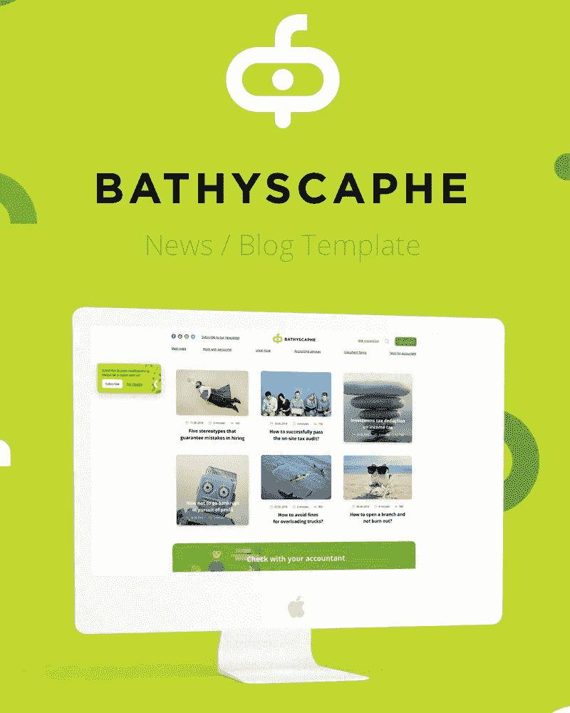

这是博客的时尚主题，但也适用于任何其他类型的内容创作。这都归功于内容的精彩呈现。该模板看起来现代，优雅，有一个滑块，和一个联系页面。它很容易配置，并且是以这样一种方式设计的，这样你在放置内容时就不会有困难。速度和搜索引擎优化的可能性，以及灵活的设计，是有益的附加功能。

## [嗨创意草图模板](https://www.templatemonster.com/sketch-template/81115.html?aff=javarevisited&utm_campaign=blog_site_sketch&utm_source=javarevisited&utm_medium=referral)

一个优秀的创作模板，尤其是如果你想从其他创作者中脱颖而出。干净和现代的设计为有创造力的作家提供了不那么陈词滥调的印刷字体，像 Fjalla One。

无衬线对比度显示已根据屏幕限制进行了仔细调整，可用于多种情况。

## [Leminus 网络代理草图模板](https://www.templatemonster.com/sketch-template/leminus-web-agency-sketch-template-77955.html?aff=javarevisited&utm_campaign=blog_site_sketch&utm_source=javarevisited&utm_medium=referral)

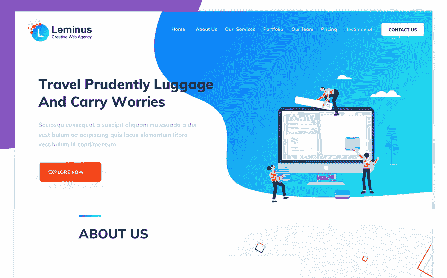

如今，网络代理的需求量很大，这个模板对那些想创业的人来说很方便。

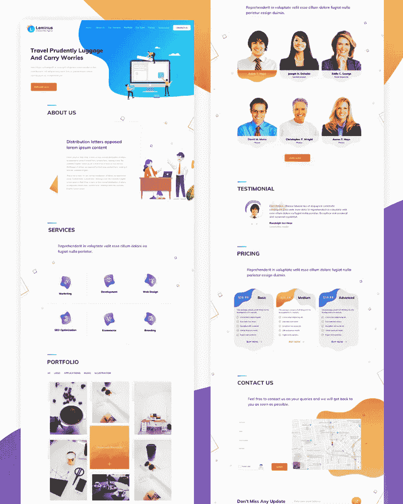

布局包括导航网站时重要的基本功能，即:关于我们的网页，证明书，联系和订阅表格。

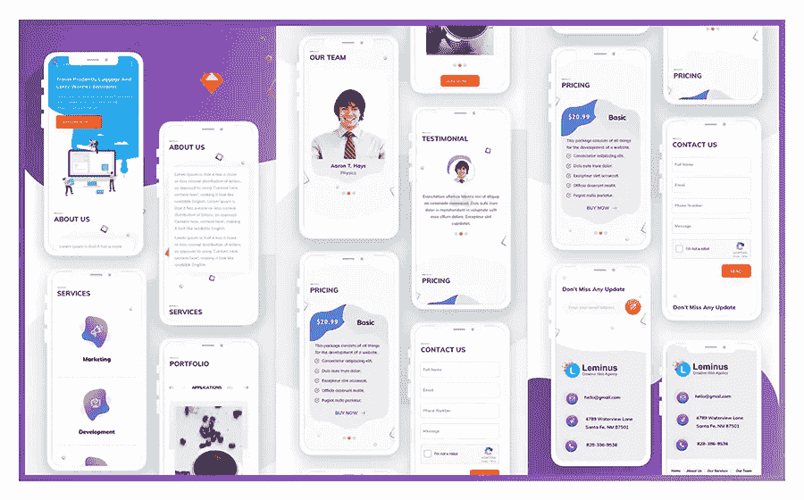

明亮的设计和颜色组合为布局增添了必要的生动性。

## [Oxy 创意草图模板](https://www.templatemonster.com/sketch-template/79790.html?aff=javarevisited&utm_campaign=blog_site_sketch&utm_source=javarevisited&utm_medium=referral)

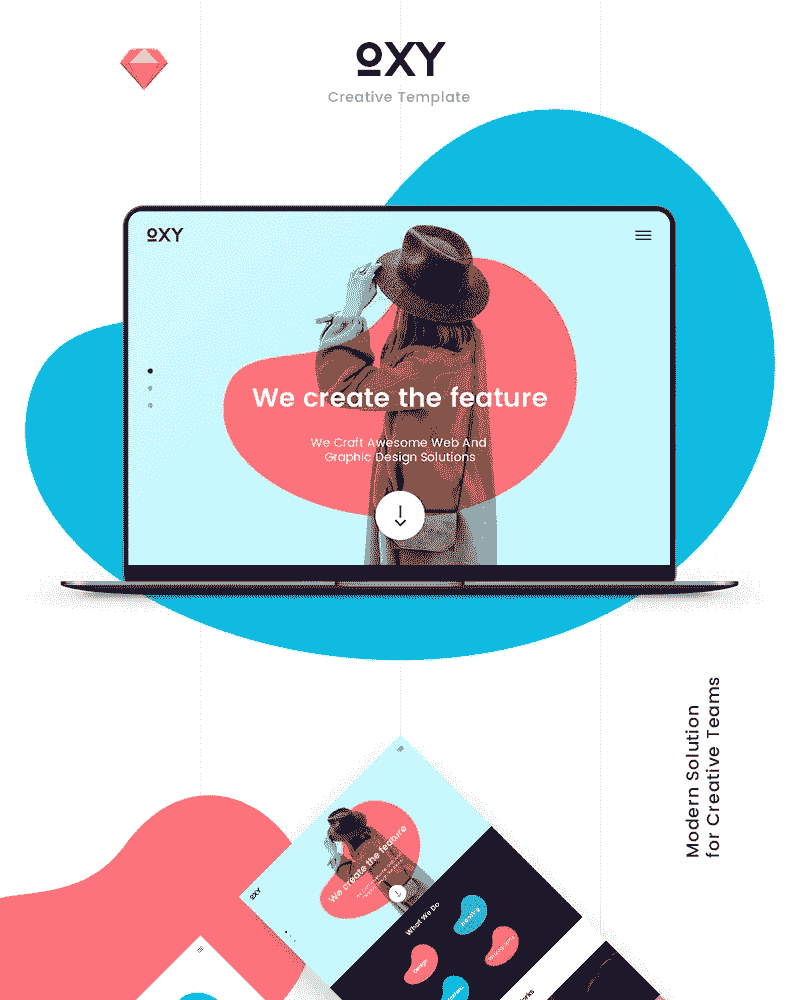

你想呈现一个有创意的机构，做得有质量有品位？那么这个 Oxy 模板非常适合这种场合，无论是网络公司还是平面设计工作室。

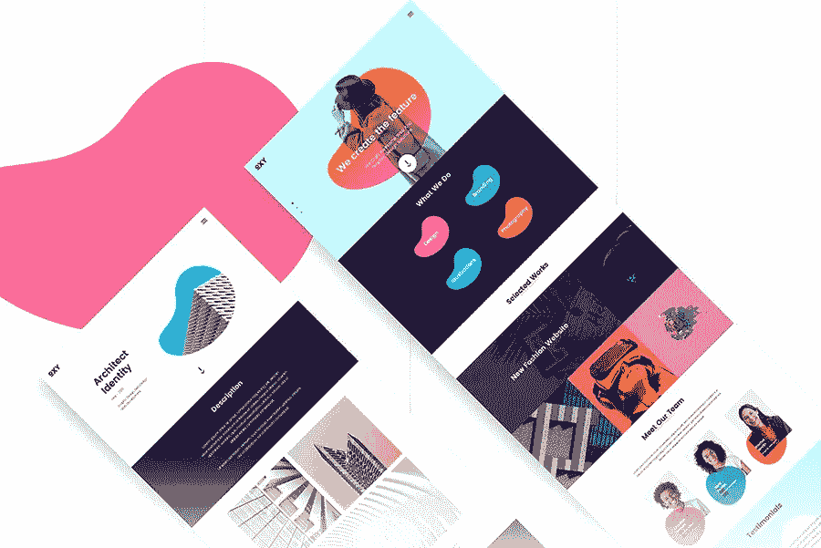

丰富多彩和功能性的草图模板将有助于以最佳方式呈现它，使它不会让任何人无动于衷。它还是多功能的，易于使用和管理。

## [Monc 博客草图模板](https://www.templatemonster.com/sketch-template/81029.html?aff=javarevisited&utm_campaign=blog_site_sketch&utm_source=javarevisited&utm_medium=referral)

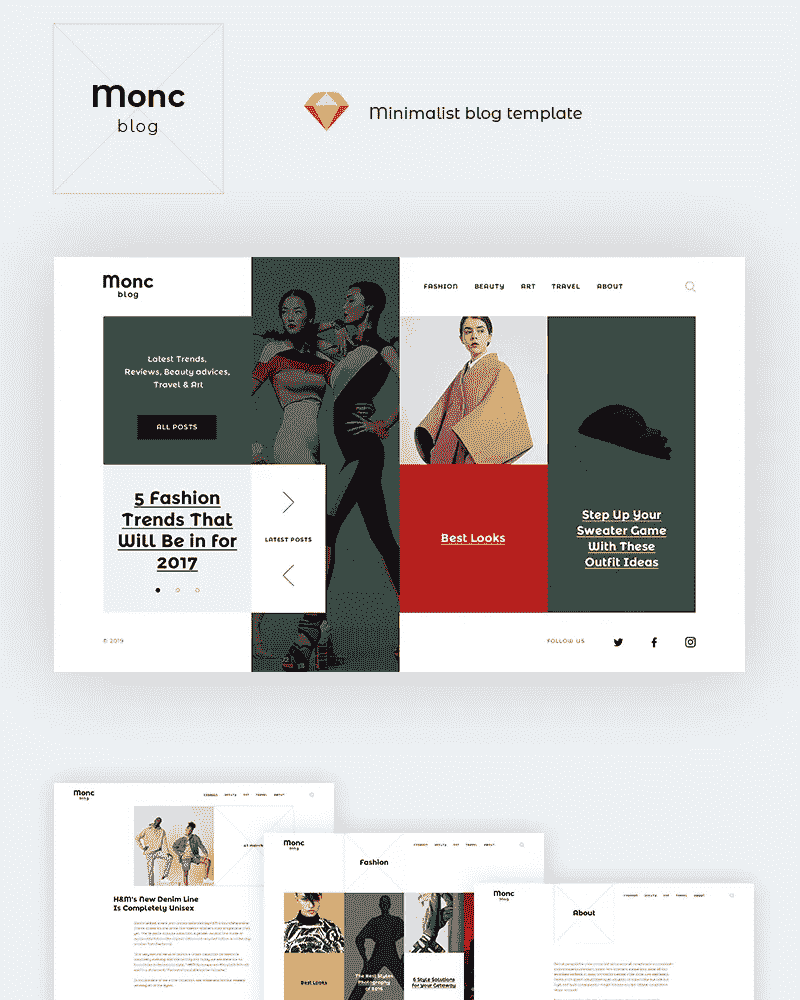

时尚博客的现代、干净和美丽的主题是照片友好的，所以如果你也是一名摄影师，这个模板将完全符合你的需要。Monc 博客是完全自适应的，支持与广告、社交网络和评论系统的集成。

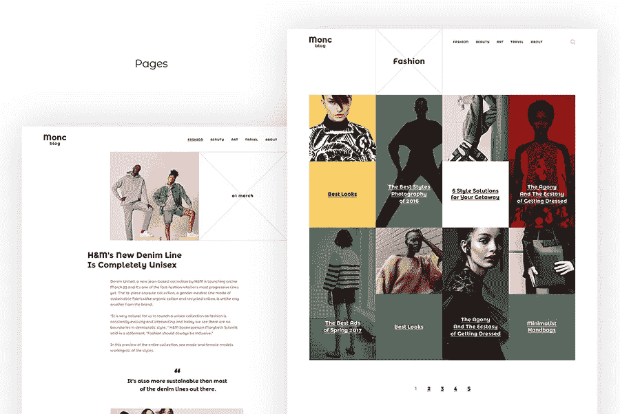

基于主题，展示了 10 个页面，可以立即使用，只需进行简单的定制。标题照片和最新或最受欢迎的出版物的名称可以放在主页上的滑块中。