# 让我们一起学习会话:Hazelcast

> 原文：<https://medium.com/javarevisited/lets-learn-together-sessions-hazelcast-e6e1816e44a4?source=collection_archive---------0----------------------->

在本文中，我们将学习流行的内存数据网格技术 Hazelcast 的基础知识，并使用 Java 制作一个简单的例子。


柯蒂斯·麦克牛顿在 [Unsplash](https://unsplash.com?utm_source=medium&utm_medium=referral) 上的照片

# **什么是黑兹尔卡斯特？**

Hazelcast 是一种开源技术，以分布式内存方式设计，使可伸缩的应用程序具有更快的数据访问和写入。

**Hazelcast 是用 Java 实现的，但是提供的客户端有** [**C**](/javarevisited/10-best-c-programming-courses-for-beginners-2c2c1f6bcb12) **，**[**c++**](/javarevisited/10-best-c-and-c-programming-books-for-beginners-and-experienced-programmers-eb5ee8dbdc5a)**，** [**。NET、**](/javarevisited/7-best-online-courses-to-learn-asp-net-core-and-mvc-in-depth-a68c1b728090?source=---------28------------------)**[**REST**](/javarevisited/top-5-books-and-courses-to-learn-restful-web-services-in-java-using-spring-mvc-and-spring-boot-79ec4b351d12?source=---------17------------------)**，**[**Python**](/javarevisited/10-best-python-certification-courses-from-coursera-4576890eb6b3)**，** [**Node.js**](/javarevisited/top-10-online-courses-to-learn-node-js-in-depth-8ef0e31ca139) ，**等等** …所以你可以通过使用这些广泛分布的客户端，轻松地将其与你的后端系统集成。选择 Hazelcast 的另一个原因是，除了核心 Java 模块之外，它不需要外部依赖。**

**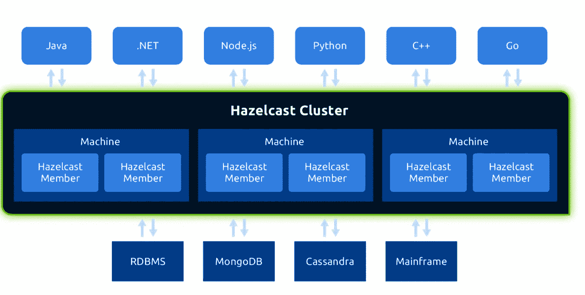**

**图片来源:Hazelcast 网站**

****Hazelcast 不为数据系统提供单点故障**。这意味着什么，Hazelcast 是如何实现的？因为它在成员之间使用对等通信，所以集群成员之间没有主从关系。所有集群成员都以相同的方式配置，因此任何成员都可以被其他成员替换。(集群中创建的第一个节点管理集群成员，如果第一个节点出现故障，第二个最旧的节点将承担责任。)**

**Hazelcast 具有高度的可扩展性。如果您向集群添加新成员，Hazelcast 会自动发现新成员并重组内存和处理能力。**

**除此之外， **Hazelcast 还提供了许多分布式数据结构**，比如标准的实用程序集合:[映射](https://javarevisited.blogspot.com/2020/09/10-examples-of-concurrenthashmap-in-java.html)、[队列](https://javarevisited.blogspot.com/2012/12/blocking-queue-in-java-example-ArrayBlockingQueue-LinkedBlockingQueue.html#axzz6iYmMFnsA)、[集合](https://javarevisited.blogspot.com/2012/06/hashset-in-java-10-examples-programs.html)，以及[列表](https://javarevisited.blogspot.com/2011/05/example-of-arraylist-in-java-tutorial.html#axzz6qVaG06bu)，发布/订阅机制的主题。除此之外，并发实用程序数据结构也包含在 Hazelcast 中，比如 FencedLock、ISemaphore 等等。如果已经存在的分布式数据结构不足以满足您的需要，您可以通过使用 Hazelcast 为用户提供的服务提供者接口来创建自己的分布式数据结构。**

# ****在哪里使用 Hazelcast？****

**尽管 Hazelcast 被认为是一种内存缓存解决方案，但它并不仅限于此。Hazelcast 不仅是分布式缓存需求的好选择，也可用于[同步](https://javarevisited.blogspot.com/2011/04/synchronization-in-java-synchronized.html#axzz6ngd8ND25)、集群、处理和发布/订阅消息需求。**

**应用程序可以使用 Hazelcast 更快地访问和写入最常用的数据，如会话或订户信息。在我以前的一次经历中，我们使用 Hazelcast 在微服务架构中的微服务之间共享客户信息和外部系统会话信息。由于 Hazelcast，每个微服务都可以通过创建一个 Hazelcast 客户端来快速获取这些数据。**

**另一方面，分析应用程序可以使用 Hazelcast 对 b [ig 数据进行分区处理](/javarevisited/top-5-big-data-frameworks-java-developers-can-learn-in-2021-9a3e20437c8c)。利用 Hazelcast 的分布式处理机制，可以更好更快地解析和处理数据。**

**此外，应用程序可以将 Hazelcast 作为应用程序发布/订阅通信的核心机制。因此，应用程序可以与相关用户和用户连接的通道共享主题(发布/订阅机制的数据结构)。**

**不同行业的许多公司都使用 Hazelcast，如摩根大通、威瑞森、空中客车、施耐德电气等。在我的国家土耳其，我知道 Hazelcast 用于电信、银行，甚至保险部门。**

**Hazelcast 支持 Windows、 [Linux](/javarevisited/7-best-linux-courses-for-developers-cloud-engineers-and-devops-in-2021-7415314087e1) 等多种操作环境，VM 解决方案，以及 VMware、【Azure】、 [Docker、](/javarevisited/top-5-free-courses-to-learn-docker-for-beginners-best-of-lot-b2b1ad2b98ad?source=collection_home---4------2-----------------------)和 [OpenShift](/javarevisited/6-best-openshift-courses-for-beginners-and-experienced-developers-d124edd2baff) 等容器。下面你可以看到一个高层次的 Hazelcast 基础设施。**

**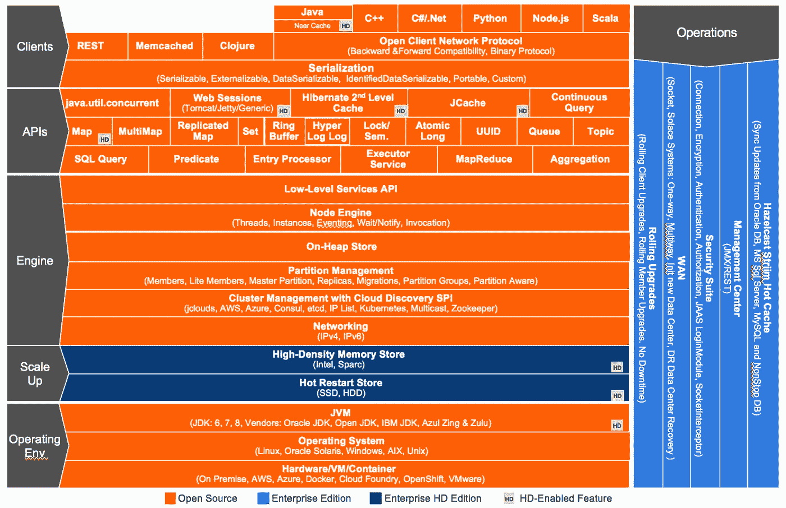**

**Hazelcast 建筑:::(图片鸣谢:Hazelcast 网站)**

**Hazelcast IMDG 公司为公司和个人提供不同版本的免费和付费服务。上面的 Hazelcast 基础设施显示了不同版本的 Hazelcast 功能或模块的兼容性。**

# **它是如何工作的？**

**Hazelcast 为用户提供了两种类型的部署选项:嵌入式部署和客户机/服务器部署。**

**对于关注异步和高性能计算以及低延迟数据访问的应用程序来说，嵌入式部署是必不可少的。但是嵌入式部署只支持 [Java](/javarevisited/10-advanced-java-books-and-courses-for-experienced-developers-b90cc1086975) 。因此，如果您计划使用 Java 客户端之外的编程语言来集成 Hazelcast，那么嵌入式部署将不是一个合适的选择。**

**在嵌入式部署中，每个成员不仅包括应用程序本身，还包括 Hazelcast 服务模块。**

**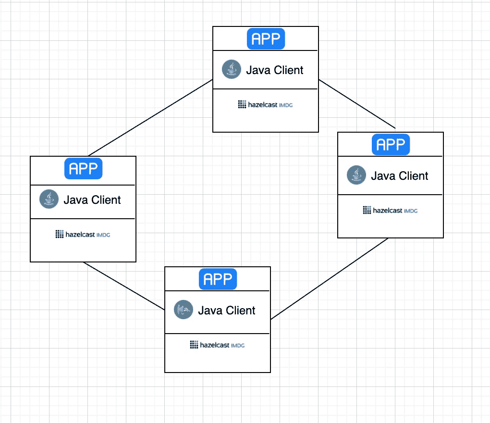**

**嵌入式部署图示**

**除了嵌入式部署，您还可以使用客户机/服务器部署选项。客户机/服务器部署将 Hazelcast 服务模块与应用程序隔离开来。由于 Hazelcast 服务模块与应用程序相隔离，因此您可以轻松地诊断 Hazelcast 的问题，还可以扩展您的 Hazelcast 服务模块。**

****

**客户端/服务器部署图示**

**Hazelcast 的优势之一来自于数据分片机制。每个分片数据块称为一个分区。分区是存储大量数据的内存段。每个分区包括分布式集群成员上的一个或多个副本。主分区称为主分区，其他分区称为备份分区。**

**分区计数是一个动态属性，可以通过 hazelcast.xml 文件以声明方式或编程方式进行修改。对于包含单个成员的集群，默认分区数是 271。当您增加集群成员时，分区以成员增加的速度复制。**

**分发机制基于散列算法。对于集群成员中的每个数据，使用以下公式计算分区 id:**

****

**黑兹尔卡斯特分配公式**

**通过计算每个成员的分区 id，创建一个分区表。每个集群成员都知道这个分区表，所以每个成员都知道所搜索的数据在哪里。**

**正如我前面提到的，分区表的责任在这个节点上，因为集群中的第一个或最老的节点管理集群。它将所有的更改和最新的分区表共享给集群成员。并且一个新成员加入集群或者一个成员离开集群，则由 Hazelcast 触发重新划分过程。这个过程对于分区所有权分配至关重要。**

# ****从哪里开始？****

**我希望我上面提到的关于 Hazelcast 的工作方式在你的脑海中有一席之地。所以我们可以进入文章的下一部分:**我们如何开发一个端到端的 Hazelcast 缓存系统？从哪里开始？****

**开发 Hazelcast 集群的第一个也是最重要的部分是配置部分，就像其他关系型或 [NoSQL](/javarevisited/10-free-online-courses-to-learn-mongodb-and-nosql-942609611664) 技术一样。Hazelcast 提供了两种配置管理方式:**

*   ****声明式配置****
*   ****程序化配置****

**对于声明式配置，您可以使用相同的 **hazelcast.xml** 或 **hazelcast.yaml** 文件之一。(这些文件位于下载的 hazelcast.jar 的 bin 文件夹中)另一个 XML 文件名为 hazelcast-full-example.xml 或 hazelcast-full-example.yaml，是 hazelcast.xml 或 hazelcast.yaml 文件的指导文档，在下载的包中提供。您可以访问许多配置元素和属性，并使用它们将所需的配置复制到 hazelcast.xml 文件中。或者您可以通过用 hazelcast.xml 更改它的名称来直接使用它**

**您可以看到下面的配置示例:**

**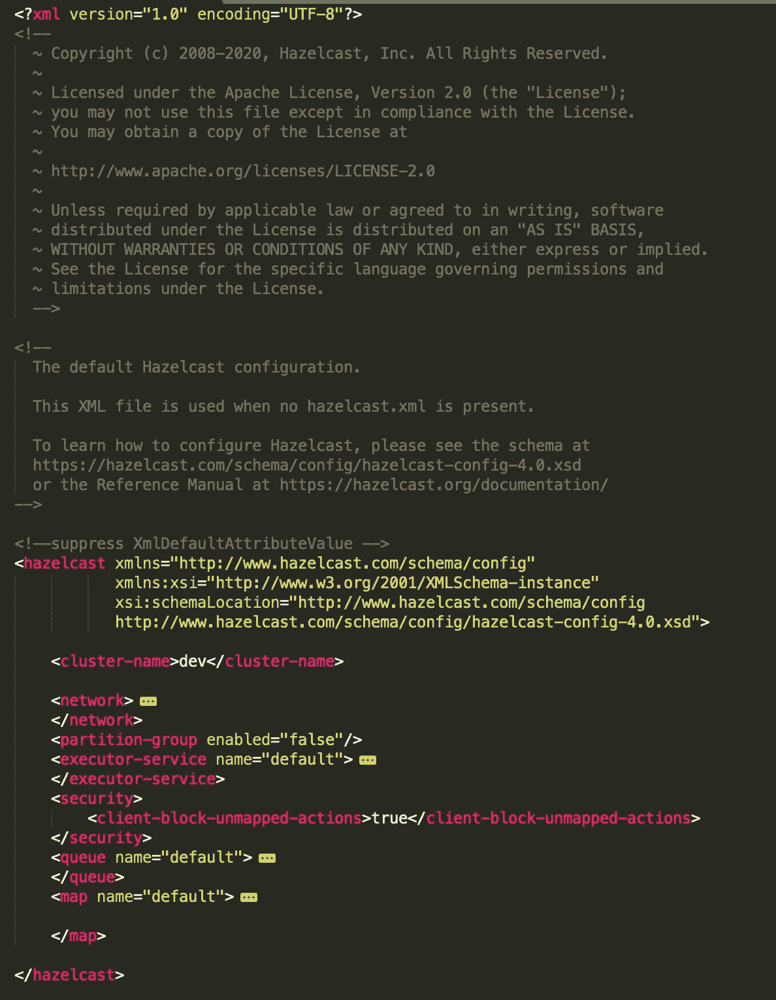**

**hazelcast.xml 配置示例**

**Hazelcast 配置集群的另一种方式是编程配置。对于这种配置方式，您可以在首选的 Hazelcast 客户端中使用 Hazelcast 的 **Config** 对象。**

********* 由于 Java 是我最喜欢的编程语言，所以我将在本文的 [Java languag](/javarevisited/why-java-is-the-best-programming-language-to-learn-coding-for-beginners-cba79aed1271) e 中展示示例，不过不用担心，其他的 Hazelcast 客户端也很相似。**

**下图显示了使用编程配置方法创建的 Hazelcast 配置示例:**

```
Config config = new Config();
config.setNetworkConfig(getHazelcastNetworkConfig());
config.setClusterName("hazelcast-cluster");
config.setInstanceName("hazelcast-template");
config.setPartitionGroupConfig(getPartitionGroupConfig());
config.setProperty("hazelcast.health.monitoring.level","NOISY");
config.addMapConfig(getHazelcastMapConfig());
```

**如上所述，您可以添加基于网络、分区和分布式数据结构的配置。以上配置我都一一说明。**

**通过网络配置，您可以设置 Hazelcast 集群成员端口号，并为新的集群成员启用/禁用自动递增机制等。在此配置示例中，我们将默认端口设置为 5900，并禁用端口自动递增选项。(Hazelcast 默认端口是 5701)**

```
NetworkConfig networkConfig = new NetworkConfig().setPort(5900)  
                          .setPortAutoIncrement(false);
```

**下一部分是关于如何创建一个用于发现 Hazelcast 成员的连接配置，并提供一个集群形式的工作机制。您可以使用许多不同的连接配置。从 [TCP/IP](/javarevisited/5-best-books-and-courses-to-learn-computer-networking-tcp-ip-and-udp-protocols-5a0e4dce75fa) ，组播， [AWS](/javarevisited/how-to-prepare-for-aws-solution-architect-associate-certification-saa-c01-saa-c02-exam-in-2021-a6e7e7e771fc) 到 [Azure，](/javarevisited/7-free-microsoft-azure-fundamentals-az-900-online-courses-for-beginners-in-2021-efd01d8be403)，甚至还有网飞 OSS 的 Eureka。
在我之前的经验中，在电信领域，我使用了 TCP/IP 和多播配置，因此我将通过这些配置来解释本文中使用的示例。您可以通过遵循 [Hazelcast 文档](https://docs.hazelcast.org/docs/3.12.1/manual/html-single/index.html)轻松使用其他不同的配置。**

**您还可以在 Hazelcast 上为不同的集群添加多个配置。您可以针对不同的集群配置启用/禁用它们。以下示例显示了 TCP/IP 和多播配置:**

```
private NetworkConfig getHazelcastNetworkConfig(){

    NetworkConfig networkConfig = new NetworkConfig().setPort(5900)  
                              .setPortAutoIncrement(false);

    JoinConfig joinConfig = new JoinConfig();
    TcpIpConfig tcpIpConfig = new TcpIpConfig();
    tcpIpConfig.setConnectionTimeoutSeconds(30); 
    tcpIpConfig.setEnabled(true);

    List<String> memberList = new ArrayList<>();
    memberList.add("127.0.0.1:5900");
    tcpIpConfig.setMembers(memberList);

    joinConfig.setTcpIpConfig(tcpIpConfig);

    //------------------------------------------

    MulticastConfig multicastConfig = new MulticastConfig();
    multicastConfig.setMulticastTimeoutSeconds(30);
    multicastConfig.setMulticastTimeToLive(255);
    multicastConfig.setEnabled(false);

    joinConfig.setMulticastConfig(multicastConfig);

    networkConfig.setJoin(joinConfig);

    return networkConfig;
}
```

**在上面的例子中，我们通过使用 setEnabled 方法来启用 **TCP/IP 配置**，并将连接超时周期设置为 30 秒。该选项意味着一个成员最多等待 30 秒，以通过网络从其他 TCP/IP 成员处获得响应**。**设置太低的值可能意味着成员无法连接到集群。**

**另一方面，您不应该为超时输入太高的值，以防止新集群成员的启动时间变长。此外，我们定义了将托管集群的 IP 地址和端口号。**

**另一方面，我们定义了多播配置，但使用 setEnabled 方法禁用了它。对于这种类型的加入配置，我们设置了与 TCP / IP 相同的超时时间，即 30 秒。与 TCP/IP 不同，我们还将多播生存时间变量设置为 255。这里我应该特别注意，您不应该在生产环境中使用多播配置，因为 UDP 在生产环境中经常被阻止，而其他发现机制更加明确。**

**下一个配置部分是**分区配置**，它对于集群上的数据分区过程的机制至关重要。Hazelcast 随机平均地分发分区副本。但是，这种随机机制会阻止您将主数据和副本放在不同的 JVM 中。为此，Hazelcast 提供了组分区功能，使您能够在一个分区组上托管主数据分区，并在另一个分区组上托管副本。Hazelcast 为分区组的分布提供了许多分区组类型。默认的分区组是 **PER_MEMBER** 。在此配置中，Hazelcast 为每个成员定义了一个组分区。像 **PER_MEMBER** 一样，您可以使用 **PER_ZONE** 根据服务器位置对 Hazelcast 成员进行分组。在下面的配置中，我们启用了组分区属性，并将组分区类型设置为默认的 **PER_MEMBER****

```
private PartitionGroupConfig getPartitionGroupConfig(){

  return new PartitionGroupConfig().setEnabled(true)                                    .setGroupType(PartitionGroupConfig.MemberGroupType.*PER_MEMBER*);

}
```

**还可以通过使用键值对来配置 Hazelcast 上的属性。
您可以使用这个键-值方法设置任何配置参数，包括我上面提到的配置。**

**在下面的示例中，我们将 Hazelcast 监控级别设置为**噪音**。Hazelcast 监控内存和 CPU 的使用情况，并在使用情况超过阈值时记录下来。对于噪声级别，您可以启用 Hazelcast 始终打印日志，Hazelcast 不会检查写入日志的阈值。**

```
config.setProperty("hazelcast.health.monitoring.level","NOISY");
```

**我将在本文中介绍的最后一个配置是**地图配置**。正如我已经说过的，使用 Hazelcast，您甚至可以配置像 [Map](https://www.java67.com/2013/02/10-examples-of-hashmap-in-java-programming-tutorial.html) 这样的分布式数据结构。对于我的例子，我使用 map 作为分布式数据结构，所以我添加了一个 Map 配置，如下所示:**

```
private MapConfig getHazelcastMapConfig(){

    MapConfig mapConfig = new MapConfig();

    mapConfig.setName("hazelcast-map-config");
    mapConfig.setBackupCount(2);
    mapConfig.setAsyncBackupCount(1); 

    mapConfig.setMaxIdleSeconds(3600);
    mapConfig.setTimeToLiveSeconds(3600); EvictionConfig evictionConfig = new EvictionConfig();
    evictionConfig.setEvictionPolicy(EvictionPolicy.*LRU*); 
    evictionConfig.setMaxSizePolicy(MaxSizePolicy.*PER_PARTITION*);
    evictionConfig.setSize(1000);

    mapConfig.setEvictionConfig(evictionConfig);

    mapConfig.setMetadataPolicy(MetadataPolicy.*CREATE_ON_UPDATE*); mapConfig.setReadBackupData(false);

    mapConfig.addEntryListenerConfig(
            new EntryListenerConfig( "com.justayar.springboot.util.MapEntryListener",
                    true, false ) );

    return mapConfig;
}
```

**首先，我将地图配置的名称定义为**“hazel cast-map-config”**。在同一集群中使用多个映射配置时，命名配置对于避免混淆至关重要。**

**然后，我将**备份计数**设为 2。(默认值为 1)。因此，对于地图中的每个数据，Hazelcast 在不同的集群成员上创建两个副本。我还为地图配置设置了**异步备份计数**属性。所以这里可能会出现问题:**同步和异步备份有什么区别？**在同步备份中，Hazelcast 在 put 操作完成之前更新备份，因此它使集群稳定。但是这会导致每个 put 操作的延迟问题，因此您必须选择最小的备份计数来提供高性能。(建议的最大计数为 6)。**

**另一方面，异步备份操作是在某个时间点执行的，因此操作速度更快，但在这种情况下，群集稳定性可能会令人怀疑。默认的 **async-backup-count** 值是 0，但是您可以像上面那样通过编程来设置它**

**此外，请记住，Hazelcast 群集可以同时拥有同步和异步备份，如下所示:**

```
mapConfig.setBackupCount(2);
mapConfig.setAsyncBackupCount(1);
```

**然后我们定义了另外两个属性分别是**maxidlesseconds**和 **timeToLiveSeconds** 。这些特性是决定 Hazelcast 集群中数据过期的关键因素。我们可以将 **MaxIdleSeconds** 值定义为每个条目在不调用任何读或写操作的情况下保留在地图上的最大有效时间(秒)。另一方面， **TimeToLiveSeconds** 可以被认为是每个条目在没有写访问的情况下保留在地图上的最长时间(以秒为单位)的值。与映射配置中的备份计数一样，您可以为相同的映射配置设置 MaxIdleSeconds 和 TimeToLiveSeconds，如下所示:**

```
mapConfig.setMaxIdleSeconds(3600);
mapConfig.setTimeToLiveSeconds(3600);
```

**此外，你可以为每个地图元素设置不同的时间。**

**Hazelcast 中的另一个重要概念是**驱逐**。驱逐过程是基于分区的状态执行的。如果您在配置中定义每个分区节点最多可以有 n 个元素，那么当分区有 n-1 个元素，并且您想要添加一个新元素时，分区必须决定将哪个元素逐出。在基于策略的驱逐系统完成之后，该元素将被添加到分区中。有三种驱逐策略:**无**、 **LRU** (最近最少使用)，以及 **LFU** (最少使用)。您可以使用 setEvictionPolicy 方法选择您的策略，还可以配置 maxSizePolicy 和 maxSize 属性，如下所示:**

```
EvictionConfig evictionConfig = new EvictionConfig();
evictionConfig.setEvictionPolicy(EvictionPolicy.*LRU*); 
evictionConfig.setMaxSizePolicy(MaxSizePolicy.*PER_PARTITION*);
evictionConfig.setSize(1000);mapConfig.setEvictionConfig(evictionConfig);
```

****元数据策略**是在更新时预处理数据条目的重要选项之一，使查询返回快速响应。这是默认属性 **CREATE_ON_UPDATE** ，但是您可以通过将**关闭**选项来禁用它，如下所示:**

```
mapConfig.setMetadataPolicy(MetadataPolicy.*OFF*);
```

**另一方面，您可以向地图中添加侦听器来跟踪地图上的事件。(如放置、移除、驱逐、更新、清除等操作)。您可以通过指定监听程序类将条目监听程序配置添加到映射中，如下所示:**

```
mapConfig.addEntryListenerConfig(
        new EntryListenerConfig( "com.justayar.springboot.util.MapEntryListener",
                true, false ) );
```

**监听器类的实现在本文后面的监听器部分。**

**与上面的配置一样，您可以通过编程方式编辑 Hazelcast 上的任何配置。现在我们已经了解了如何以声明方式和编程方式配置 Hazelcast，因此我们可以继续本文的下一部分:**通过使用 Hazelcast 映射实现 Hazelcast 客户端**。**

# **如何实现一个基本的 Hazelcast 地图？**

**Hazelcast 提供了一系列分布式数据结构来满足您的需求，比如 Map、 [Queue](https://javarevisited.blogspot.com/2013/10/what-is-priorityqueue-data-structure-java-example-tutorial.html#axzz6f4s58Ml9) 、Set、List、MultiMap、Topic( Pub/Sub)和 Locks。对于本文，我将以地图为例，并使用它开发一个简单的应用程序。**

**首先，您需要使用本文前面的配置创建一个 hazelcast 实例:**

```
HazelcastInstance hazelcastInstance = Hazelcast.*newHazelcastInstance*(hazelcastConfig);
```

**然后，您必须使用 get 方法来访问具有指定名称的分布式地图。它将创建一个新的地图，如果它以前不存在。它在文献中被称为延迟初始化，这意味着它在第一次访问地图时创建一个新的 Hazelcast 地图。我们已经在本文的配置部分定义了映射配置。**

```
IMap<String,String> hazelcastMap = hazelcastInstance.getMap("hazelcast-map");
```

**Hazelcast Map 对象以分布式方式扩展了 Java ConcurrentMap 接口。所以可以使用的基本 map 操作有" **put"** 用于向 map 中写入一个新对象(这里我们用" **set"** 代替)和" **get"** 用于读取 map 中的对象)。对于本文，我使用以下方法为 Hazelcast 地图定义了基本的 CRUD 操作:**

```
public void putToMap(String key,String value){

    if(key == null)
        throw new NullPointerException("Key of element which is added to map cannot be null");

    if(key.isEmpty())
        throw new IllegalArgumentException("Key of element which is added to map cannot be empty");

    hazelcastMap.set(key, value);
    logger.info("New data added to hazelcast map with key: {}", key);
}public String getMapItemWithKey(String key){

    if(key == null)
        throw new NullPointerException("Key of element which is read from map cannot be null");

    if(key.isEmpty())
        throw new IllegalArgumentException("Key of element which is read from map cannot be empty");

    logger.info("Getting data item from hazelcast map with key: {}", key);
    return hazelcastMap.get(key);
}

public Map<String, String> getAllMap(){

    return hazelcastMap;
}

public void removeMapItemWithKey(String key){

    if(key == null)
        throw new NullPointerException("Key of element which is removed from map cannot be null");

    if(key.isEmpty())
        throw new IllegalArgumentException("Key of element which is removed from map cannot be empty");

    hazelcastMap.remove(key);
    logger.info("Remove item from hazelcast map succeeded with key: {}", key);
}

public void clearAllMap(){

    if(hazelcastMap.size()>0){
        hazelcastMap.clear();
        logger.info("Remove all item from hazelcast map succeeded");

    }
}
```

**我们将自己设计的第一个向 map 添加新成员的方法命名为" **putToMap"** 。首先，我们进行了一些 null 和空检查，然后我们在 Java Map 接口中使用了一个" **set"** 方法，而不是" **put"** 方法。在分布式架构中，如本 [URL](https://hazelcast.com/blog/performance-top-5-1-map-put-vs-map-set/) 中所述，put 方法会导致开销或性能问题，因为它会返回旧值。如果您想要将新成员添加到映射中，而该映射中不存在具有相同键的成员，您可以使用**puti absent**方法。**

**第二种方法是提供用密钥访问成员的操作。这是 Java Map 接口中的“**get”**操作，所以我们在这里使用了同样的方法。**

**另一个是 removeMapItemWithKey，用于从映射中删除成员。通过使用成员的键，我们删除了带有键的成员(如果它存在于映射中)。**

**最后一种方法旨在通过从映射中删除所有成员来清除映射。我们为这个功能使用了 Java Map 接口的“**clear”**方法。您可以根据需要使用这四种方法来添加、更新、映射上的元素，以及从映射中删除或清除成员。在我的示例设计中，我在地图中保存了字符串对。如果您的对象比 string 更复杂，您也可以为您的键或值使用简单的 Pojo 类。**

**为了进行演示，我为 CRUD 端点创建了一个简单的控制器，它们是" **write"** ，" **read"** ，" **readAll"** ，" **remove"** 和" **clear"** ，如下所示:**

```
@RestController
@RequestMapping("/hazelcast")
public class HazelcastController {

    @Autowired
    private HazelcastMapManager hazelcastMapManager;

    @PostMapping("/write")
    public String writeToHazelcast(@RequestParam String key,
                                   @RequestParam String value) {

        hazelcastMapManager.putToMap(key, value);

        return "OK";
    }

    @GetMapping("/read")
    public String readFromHazelcast(@RequestParam String key) {

        return hazelcastMapManager.getMapItemWithKey(key);
    }

    @GetMapping("/readAll")
    public Map<String, String> readAllFromHazelcast() {

        return hazelcastMapManager.getAllMap();
    }

    @DeleteMapping("/remove")
    public String removeFromHazelcast(@RequestParam String key){

        hazelcastMapManager.removeMapItemWithKey(key);
        return "OK";
    }

    @DeleteMapping("/clear")
    public String clearHazelcast(){
        hazelcastMapManager.clearAllMap();
        return "OK";
    }

}
```

**然后，我们可以用 run 命令启动我们的 Spring Boot 应用程序。当您查看控制台日志时，可以看到 Hazelcast 对象的创建。如果向 Hazelcast 群集添加新客户端，日志的成员部分会自动更新。**

> **2020–04–09 21:25:25.032 信息 40330—[main]c . h . internal . cluster . clusterservice:[127 . 0 . 0 . 1]:5900[dev][4.0]**
> 
> **Members {size:1，ver:1 }[
> Member[127 . 0 . 0 . 1]:5900—e9 B9 cf 09–61 C2–479 e-93bc-90ab 6 f 1449 a 1 this**
> 
> **]**

**我们的演示应用程序运行在 Spring Boot 港 **8081** 。(默认的 Spring Boot 项目端口是 8080)。由于 Hazelcast 和我们的应用程序运行在同一台机器上，并且 Hazelcast 管理中心应用程序运行在端口 8080 上，因此我们将演示应用程序的端口更改为 8081。对于此更改，我将在 Spring Boot 应用程序的 application.properties 文件中添加以下命令:**

```
server.port=8081
```

**另一方面，Hazelcast 使用 TCP/IP 网络在 5900 端口上运行。我们可以使用上面的 rest 端点来检查我们的 Hazelcast 地图实现是否工作。首先，您可以尝试编写一个端点来向 map 中添加一个新成员，然后使用一个 read 端点通过一个键从 map 中访问一个成员。**

*** * *这个演示应用程序的 postman 集合也可以在 Github 页面上找到。**

**正如我之前所说，我们使用 8081 作为我们的演示应用程序端口，我们使用 8080 端口作为 Hazelcast 管理中心。**那么什么是 Hazelcast 管理中心呢？为什么我们要在应用程序中使用它？怎么才能整合呢？****

> **Hazelcast 管理中心使您能够监控和管理运行 Hazelcast 的集群成员。除了监视集群的整体状态，您还可以详细分析和浏览您的数据结构，更新映射配置，并从成员获取线程转储。可以运行脚本(JavaScript、Groovy 等。)和命令及其脚本和控制台模块。**
> 
> **(**鸣谢:Hazelcast 管理中心文件**)**

**为了集成哈兹卡斯特管理中心，我们首先从下载页面([https://hazelcast.org/imdg/download/](https://hazelcast.org/imdg/download/))下载哈兹卡斯特 IMDG。然后，解压缩 zip 或 tar 文件，并转到归档文件夹内的管理中心目录。可以从命令行直接启动 **mancenter-version.war** 文件。之后打开自己喜欢的网页浏览器，进入页面:[**http://localhost:8080/mancenter**](http://localhost:8080/mancenter)**

**当您第一次尝试访问此页面时，Hazelcast 会要求您为安全起见创建一个管理员用户。**

**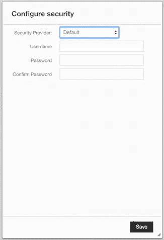**

**Hazelcast 管理中心管理员用户创建**

**您将在以后的每次访问中使用该用户名和密码。登录系统后，可以进入集群管理页面。在此页面中，您可以看到您的集群或添加新的集群配置。对于我们的示例，我们添加了一个新的集群配置，如下所示。**

**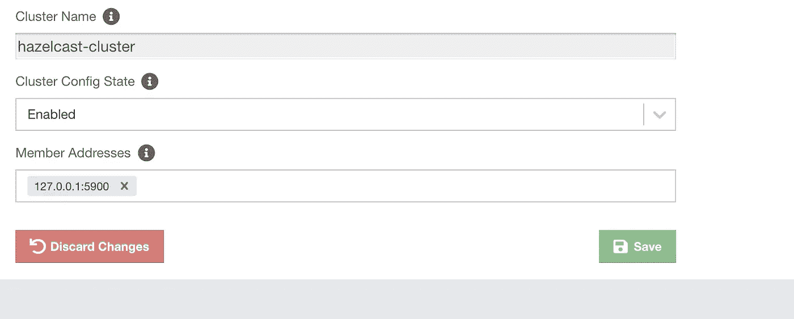**

**添加新集群配置面板**

**群集名称将是 hazelcast-cluster。(我们在本文的配置一节中进行了设置)我们将集群的状态设置为 enabled，并将成员地址设置为 127.0.0.1:5900，这在本文的 join 配置部分进行了定义。**

**添加集群配置后，我们可以看到创建的集群如下所示:**

**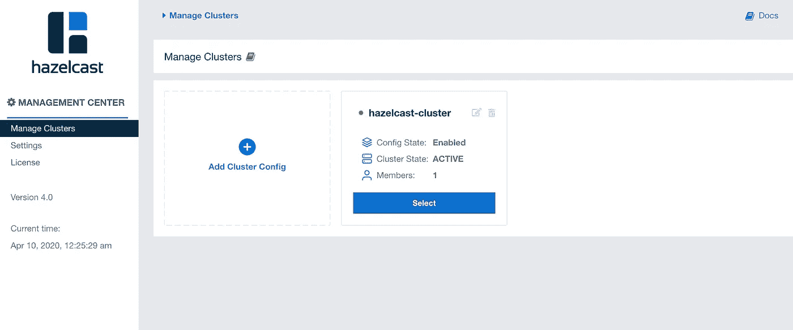**

**Hazelcast 管理集群面板**

**选择创建的集群后，集群管理仪表板如下所示欢迎您。从集群管理仪表板中，您可以看到集群状态、健康状况、堆内存和分区分布、内存和 CPU 利用率。从左侧栏，您可以访问客户端、成员和管理面板。另一方面，从存储部分，您可以看到所使用的数据结构及其当前的用法**

**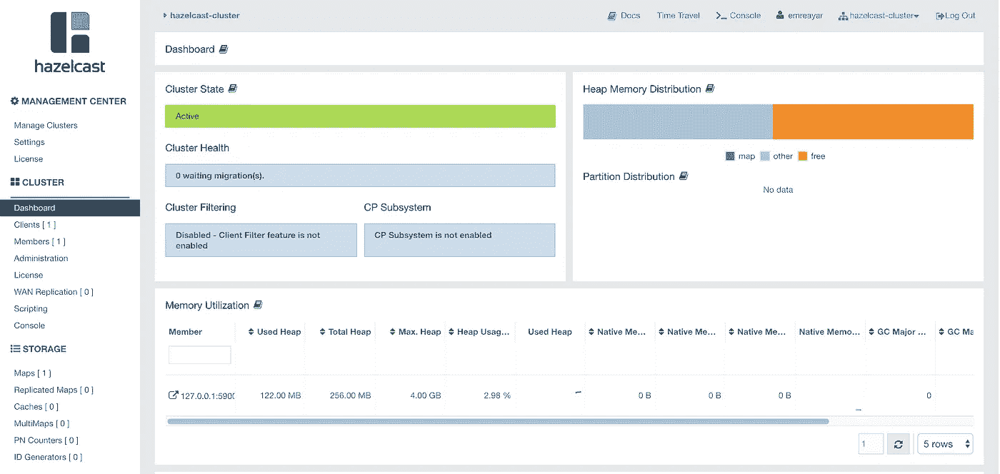**

**Hazelcast 管理仪表板面板**

**在这里，我们可以很容易地看到 Hazelcast 客户机，它是我们用示例演示应用程序运行的。当您调用 write 命令并向列表中添加新成员，然后刷新该仪表板时，您可以看到集群内存分布发生了变化，成员大小也将得到更新。此外，您可以在存储部分看到我们用演示应用程序创建的地图。**

**当您单击左侧栏中的 maps 部分时，可以看到关于条目数量、操作、内存和备份随时间变化的图表。您还可以看到客户端调用了多少 get、put、remove 和 hits 操作。**

**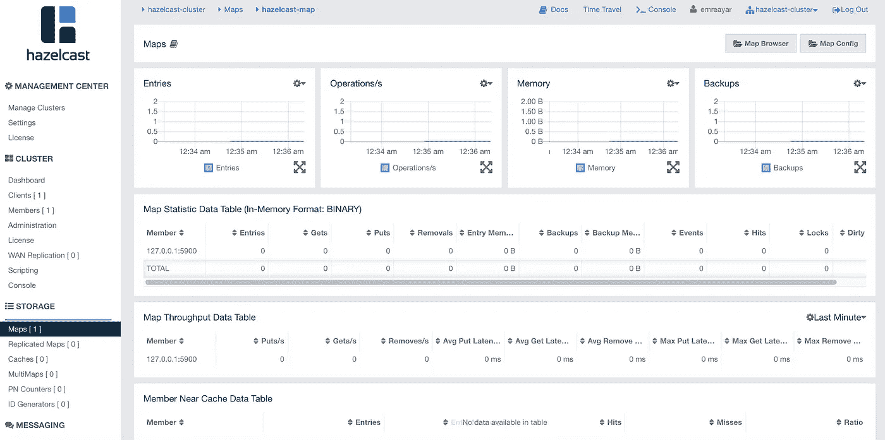**

**地图仪表板面板**

**在地图面板的顶部，还有地图浏览器和地图配置面板。使用地图浏览器面板和成员键，可以访问对象值、超时值、创建时间和其他属性:**

**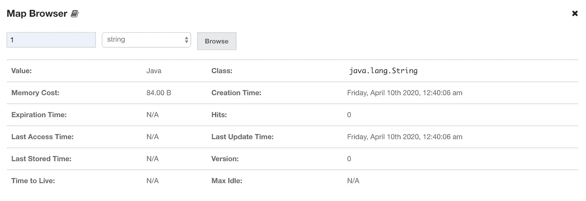**

**地图浏览器面板**

**另一方面，您可以使用地图配置面板更改地图配置，如下所示:**

**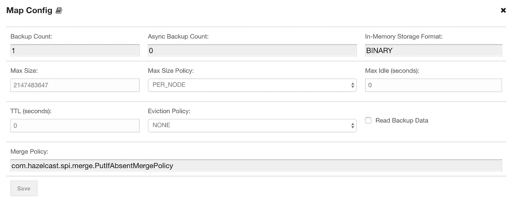**

**地图配置面板**

**总之，Hazelcast 管理中心为您的 Hazelcast 集群提供了一个更优雅、更有用的仪表板。有了它，您可以轻松地监控集群和分布式数据对象。我个人的看法是，每一个使用 Hazelcast 的应用都应该主动激活并使用 Hazelcast 管理中心。**

**现在我们回到我们的代码，转到文章的最后一部分:**向 Map 添加监听器。****

# ****如何将监听器添加到 Hazelcast 地图？****

**使用 Hazelcast，您可以为不同的功能添加多个侦听器。您可以添加监听器，不仅监听集群，还监听每个操作上的分布式对象。您可以使用 **MembershipListener** 界面来跟踪添加到集群中的新成员，并在一些集群成员将他们从您的集群中删除时得到通知。此外，您可以通过这个监听器了解集群成员的任何属性变化。为此功能，我们创建了一个侦听器类，它实现了 MembershipListener 接口，如下所示:**

```
@Component
public class ApplicationMembershipListener implements MembershipListener {

    private Logger logger = LoggerFactory.*getLogger*(getClass());

    @Override
    public void memberAdded(MembershipEvent membershipEvent) {
        logger.info("New member added to cluster {} ",membershipEvent);

    }

    @Override
    public void memberRemoved(MembershipEvent membershipEvent) {
        logger.info("A member removed from cluster {} ",membershipEvent);

    }
}
```

**然后，我们使用下面的命令将这个侦听器添加到 Hazelcast 实例集群中:**

```
HazelcastInstance hazelcastInstance = Hazelcast.*newHazelcastInstance*(hazelcastConfig);

hazelcastInstance.getCluster().addMembershipListener(applicationMembershipListener);
```

**除了集群监听器接口，Hazelcast 还提供分布式对象监听器。因为我在我们的演示应用程序中使用了 map，所以我向 map 添加了 **EntryListener** 接口。有了这个接口，我可以跟踪地图上的任何变化，比如添加到地图上的新元素、从地图上删除的元素或者地图上触发的 get 操作事件。您还可以通过使用这个接口来跟踪驱逐事件。**

```
public class MapEntryListener implements EntryListener {

    private Logger logger = LoggerFactory.*getLogger*(getClass());

    @Override
    public void entryAdded(EntryEvent entryEvent) {

        logger.info("New object added to map with key {} and value {}",entryEvent.getKey(),entryEvent.getValue());
    }

    @Override
    public void entryEvicted(EntryEvent entryEvent) {

        logger.info("Map Entry was evicted : {}",entryEvent);

    }

    @Override
    public void entryRemoved(EntryEvent entryEvent) {

        logger.info("Object with key {} removed from map.",entryEvent.getKey());

    }

    @Override
    public void entryUpdated(EntryEvent entryEvent) {

        logger.info("Object with key {} updated from {} to {}.", entryEvent.getKey(),entryEvent.getOldValue(),entryEvent.getValue());

    }

    @Override
    public void mapCleared(MapEvent mapEvent) {

        logger.info("Map was cleared : {}",mapEvent);

    }

    @Override
    public void mapEvicted(MapEvent mapEvent) {

        logger.info("Map was evicted: {}",mapEvent);

    }

    @Override
    public void entryExpired(EntryEvent entryEvent) {

    }
}
```

**要在 Hazelcast 实例映射对象上激活此监听器，必须将其添加到分布式映射对象，如下所示:**

```
hazelcastMap = hazelcastInstance.getMap(ApplicationConstants.*HAZELCAST_MAP*);
hazelcastMap.addEntryListener(mapEntryListener,true);
```

**在 listener 类中，我添加了日志来跟踪事件。因此，当您在地图上调用" **putToMap"** 操作时，您可以看到一个示例日志:**

> **2020–04–11 13:37:28.925 INFO 4587—[emplate . event-2]c . j . spring boot . util . mapentrylistener:key 为 1 的对象从 Java 更新到 Java。**

# **结论**

**Hazelcast 提供高度可伸缩、分布式和更快的数据访问和写入，以满足不同的需求，如缓存、数据分析、数据处理等。它支持许多操作环境，并有许多不同软件语言的客户机。Hazelcast 基础设施的大部分是开源的，因此您可以在您的企业或自由职业者解决方案中使用它。**

**Hazelcast 为发布/订阅机制提供了许多分布式对象、线程安全对象，甚至主题对象，并且由于 SPI(服务提供者接口),还让您有机会通过定制的配置来实现自己的分布式数据对象。**

**Hazelcast 分区和分片机制保证了数据基础设施的高可用性和一致性。此外，对等系统(所有节点都以相同方式配置)完全消除了数据丢失问题。**

**我在我的自由职业者和企业解决方案上使用 Hazelcast，强烈推荐 Hazelcast 你试试。**

**代码在 [**Github**](https://github.com/justayar/SpringBootTemplates/tree/master/hazelcast) 上有。**

**这是我在 Medium 上的第一篇文章，请随意反馈:)**