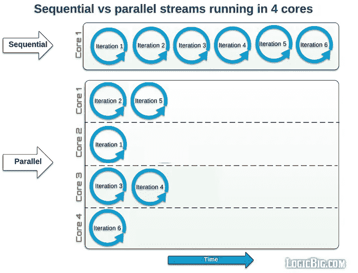
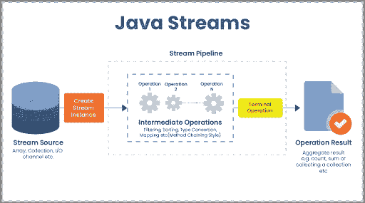
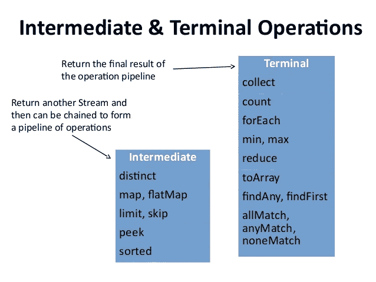

# 让我们一起学习会话:Java 流 API

> 原文：<https://medium.com/javarevisited/lets-learn-together-sessions-java-stream-api-3409122190a3?source=collection_archive---------1----------------------->

这篇文章将解释自 Java 8 以来 Java 发布历史中一个很酷很吸引人的特性。它使您的 Java 代码可读性更强，更简洁。


照片由 [JJ 英](https://unsplash.com/@jjying?utm_source=medium&utm_medium=referral)在 [Unsplash](https://unsplash.com?utm_source=medium&utm_medium=referral)

# 什么是 Java Stream API？

Java Stream API 是 2014 年 3 月发布的 Java 8 中的一个特性。流不是一个数据结构，而是一个抽象层，它可以被描述为来自单个资源的一系列元素。有序元素的源可以是 Java [集合](https://docs.oracle.com/javase/8/docs/api/java/util/Collection.html)接口、数组或 I/O 资源的任何数据结构的一部分。

Stream API 主要是通过开发带有有用操作符的查询，让**数据处理**在 Java 中更加强大。查询机制对于开发者来说并不是一个新概念。我们从数据库系统中知道这个术语。许多开发人员在开发 API 或用户交互应用程序时需要面向数据库的系统。

在 [Java](/javarevisited/review-of-courseras-java-programming-software-engineering-fundamentals-specialization-4dcfa0ed2de4) 发布之前，我们遇到了 LINQ(语言集成查询)。NET 框架 3.5 在 2007 年 11 月。它的灵感来自函数式编程语言，如 Haskell 和 ML。

由于其数据处理操作，Stream API 在数据库查询机制中提供了类似的体验。

[Stream API](/javarevisited/7-best-java-collections-and-stream-api-courses-for-beginners-in-2020-3ad18d52c38) 和 LINQ 一样，为 Java 增加了函数式编程的强大功能。总的来说，Java 的目标是通过添加函数式编程和数据驱动设计以及不同编程范式的强大功能来对抗这些编程范式。

Stream API 支持两种类型的流:流和并行流。虽然基本流按顺序处理数据，但并行流的顺序是不确定的。[并行流](https://javarevisited.blogspot.com/2014/03/2-examples-of-streams-with-Java8-collections.html)使用 Java 的多线程功能，在多个内核上处理数据。

[](https://javarevisited.blogspot.com/2021/05/java-8-stream-lambda-expression-d.html)

图片鸣谢:[https://www . logic big . com/tutorials/core-Java-tutorial/Java-util-Stream/sequential-vs-Parallel . html](https://www.logicbig.com/tutorials/core-java-tutorial/java-util-stream/sequential-vs-parallel.html)::Stream vs Parallel Stream

我选择了一张管道图片作为本文的标题图片。我强调了在处理数据时， [Stream API 像管道](https://javarevisited.blogspot.com/2021/05/java-8-stream-lambda-expression-d.html)一样工作的机制。简而言之，我们可以将流描述为功能的**管道。**

[](https://www.java67.com/2018/10/java-8-stream-and-functional-programming-interview-questions-answers.html)

图片来源:【http://innovationm.co/concept-of-stream-api-java1-8/】T4:::流水线机制

在流 API 中，我们将应用于数据的每个函数命名为操作符，并将所有这些操作符的名称集命名为**聚合操作符**。有两种类型的聚合运算符:

*   中介运营商
*   码头操作员

**中间操作符**是通过流处理数据并返回新流作为响应的操作符。示例中介运算符有[映射](https://www.java67.com/2015/01/java-8-map-function-examples.html)、[过滤器](https://www.java67.com/2016/08/java-8-stream-filter-method-example.html)、[排序](https://www.java67.com/2014/04/java-8-stream-examples-and-tutorial.html)等等。

另一方面，**终端操作符**被用作流流的结束，它返回流上处理的新数据。[***Collect***](https://www.java67.com/2018/06/java-8-streamcollect-example.html)*，*[***foreach***](https://www.java67.com/2016/01/how-to-use-foreach-method-in-java-8-examples.html)*，*[***reduce***](https://www.java67.com/2016/09/map-reduce-example-java8.html)等等运算符都是 Stream API 中使用最多的一些终端运算符。

Java Stream 的一个伟大特性是**它不修改源数据**。因此，我们不仅保存了源数据，而且也不需要为流上的数据处理占用内存。因此，如果我们需要通过流处理数据，我们必须在单个或多个中间操作之后使用终端操作符。在流中没有通知终端操作符的情况下，流 API 不会启动与中间操作符的数据处理。

除了所有这些好的特性，Stream API 减轻了开发人员的迭代管理负担。它提供了对集合的自动迭代。

# 如何使用 Stream API？

Stream API 提供了许多中间和终端操作符来处理您的数据。在这篇文章中，我用简单的使用示例来讨论使用最多、最有效的操作符。

[](https://javarevisited.blogspot.com/2014/02/10-example-of-lambda-expressions-in-java8.html#axzz6ieZZarMY)

图片来源:【https://www.slideshare.net/mariofusco/java-8-workshop ::中间运营商 vs 终端运营商

要在集合对象上使用流操作符，需要从集合中生成一个流对象，如下所示:

```
List<Product> list = new ArrayList<>();**list.stream();** // Generate a stream object in sequential order**list.parallelStream();** //Generate a parallel stream in parallel order.
```

# **中级操作:**

## **1。独特的**

**distinct**方法根据列表中对象的 [equals()方法](https://www.java67.com/2012/11/difference-between-operator-and-equals-method-in.html)返回列表的不同元素。

下面的例子展示了**“distinct”**方法如何通过一次方法调用来解决列表的唯一性需求。

```
@Getter
@Setter
@Builder
public class Product {

    private long id;
    private String mainCategory;
    private String name;
    private int barcodeNumber;

    @Override
    public boolean equals(Object o) {
        if (this == o) return true;
        if (o == null || getClass() != o.getClass()) return false;
        Product that = (Product) o;
        return id == that.id || 
                (mainCategory.equalsIgnoreCase(that.mainCategory) && name.equalsIgnoreCase(that.name)) ||
                barcodeNumber == that.barcodeNumber;
    }

}public void findNumberOfUniqueProductsWithStreamDistinctAndCount(List<Product> products){

    int uniqueProductsCount = products.stream().distinct().count();

}
```

如果我们想在没有[流 API](https://javarevisited.blogspot.com/2020/04/top-5-courses-to-learn-java-collections-and-streams.html#axzz6nwXUSoGH) 的情况下使用相同的功能，我们需要更多的代码行来获得相同的结果。此外，我们需要一个新的集合对象来保存唯一的产品，这意味着应用程序需要更多的内存。for 循环示例实现如下:

```
public void findNumberOfUniqueProductsWithForLoop(List<Product> products){

    List<Product> uniqueProducts = new ArrayList<>();
    for(Product product : products){
        if(!uniqueProducts.contains(product)){
            uniqueProducts.add(product);
        }
    }
    int uniqueProductsCount = uniqueProducts.size();}
```

## 2.地图-平面地图

[**Map**](/javarevisited/how-to-use-streams-map-filter-and-collect-methods-in-java-1e13609a318b) 方法提供了对每个集合对象应用相同的功能。

假设我们有一个不含税的产品价格列表，您必须用含税的产品价格更新这个列表。在这种情况下，您必须将清单中的每个价格乘以税率。对于该功能，您可以使用一行代码流"*映射*。一个示例实现如下:

```
private static final double *TAX_RATE* = 1.18;

public void getPricesWithTaxesByStreamMap(List<Double> prices){

    prices.stream().map(price -> price * *TAX_RATE*).collect(Collectors.*toList*());

}
```

Stream API 中的另一个 map 操作符是 [**FlatMap**](http://www.java67.com/2016/03/how-to-use-flatmap-in-java-8-stream.html) 。FlatMap 将集合流转换为单个流。

为了用一个简单的例子来解释，让我们考虑一下我们有不止一个产品价格列表，我们想在另一个列表中列出我们所有的价格。在这种情况下，我们必须收集所有产品价格表中的所有价格，并将它们合并到一个价格表中。在这一点上，[流平面图方法](https://javarevisited.blogspot.com/2016/03/difference-between-map-and-flatmap-in-java8.html)成为救命稻草。您可以在下面看到如何使用 FlatMap 在单个平面列表上合并不同的集合。

```
public void mergeAllPricesFromDifferentSourcesWithStreamFlatMap(List<List<Double>> prices){

    List<Double> collect = prices.stream().flatMap(Collection::stream).collect(Collectors.*toList*());

}
```

## **3。极限排序**

顾名思义，**限制**操作符的目的是用指定的限制数来减小流的大小。它从集合中获取前 n 个元素。n 是您希望在自己的收藏中看到多少元素。

Stream API 中另一个最常用的操作符是 **Sorted。sorted** 操作符用于按升序或降序对流进行排序。默认顺序是升序。如果你想使用降序，你必须在排序的操作符中传递参数[**. reverse order()**](https://www.java67.com/2019/06/top-5-sorting-examples-of-comparator-and-comparable-in-java.html)**。**

**我们已经使用 FlatMap 操作符收集了所有价格。假设我们想知道价目表中的 10 个最高价格。为此，我们可以将极限运算符和排序运算符一起使用，如下所示:**

```
public void getTopTenPricesWithStreamLimitAndSorted(List<Double> prices){

    List<Double> topTenPriceList = prices.stream().sorted().limit(10).collect(Collectors.*toList*());

}
```

**正如您在这个例子中看到的，我们可以在一行代码中完成对集合的排序和限制。**

## **4.过滤器**

****[**过滤器**操作符](https://javarevisited.blogspot.com/2018/05/java-8-filter-map-collect-stream-example.html#axzz6RfpUEkHC)用于根据传递给操作符的谓词参数检索集合中匹配的元素。可以在谓词上使用单个或多个条件。****

****假设我们需要列出某个类别中的项目。我们可以创建一个谓词来检查列表中的每个元素是否都在搜索的类别中。下面的代码显示了该功能的一个示例实现:****

```
**public void findSpecificCategoryProductsWithStreamFilter(List<Product> products,String categoryName){

    products.stream().filter(product -> product.getMainCategory().equalsIgnoreCase(categoryName));

}**
```

## ****5.偷看****

****假设我们调用了一个流操作符，但是我们遇到了一个意外的结果。在这种情况下，我们必须调试我们的代码来分析什么是错误的。Peek 通常使用这个目标来调试流。从形式上来说， [**Peek** 返回一个新的流](https://www.java67.com/2016/09/java-8-streampeek-example.html)，该流由原始流中的所有内容组成，应用了传递给 Peek 操作者的客户操作。****

****假设我们需要调试上面的过滤器功能，并在控制台日志中看到所有被过滤的产品。我们可以将上面的代码修改如下:****

```
**public void findSpecificCategoryProductsWithStreamFilter(List<Product> products,String categoryName){

    products.stream().filter(product -> product.getMainCategory().equalsIgnoreCase(categoryName)).peek(System.out::println);

}**
```

******* * *不要忘记 peek 操作不适合 prod 环境，所以不要在生产中使用它们。******

****中间操作符不会在流上运行，直到它以一个终端操作符结束。总之，没有终端运营商，中间运营商什么都不干。所以让我们学习如何用终端操作符完成一个流管道。****

# ****终端操作:****

****流管道必须以终端操作结束。终端操作处理任何流管道的输出。该目标的终端操作是流管道中的最后一个操作。****

****终端操作的输出可以是以下三种选择之一:原始值(long 或 boolean)、可选的具体对象类型(可选的<list>>)或无响应(void 方法)。</list>****

****一个流管道可以有许多中间操作符，但只有一个终端操作。****

****下面我们就来逐一看看 Stream API 上使用最多的终端操作。****

## ****1.收集****

******Collect** 操作符组合集合中处理过的元素的结果，并将逻辑应用于输出数据(如字符串连接)。流 API 通过 [**收集器**库](https://www.java67.com/2018/11/10-examples-of-collectors-in-java-8.html)提供收集功能。通过使用这个库，您可以将流元素收集到一个列表、集合或映射中。****

****比方说，我们需要像在过滤器示例中那样使用指定的类别过滤列表中的产品，然后从匹配的产品中返回一个新的列表。我们可以这样做:****

```
**public List<Product> findSpecificCategoryProductsWithStreamFilter(List<Product> products,String categoryName){

    return products.stream().filter(product ->   product.getMainCategory().equalsIgnoreCase(categoryName)).**collect(Collectors.toList())**;

}**
```

****在 Java 10 中，您还可以使用收集器实现的不可修改版本。分别是 ***不可修改列表*** 、 ***不可修改集合*** 、 ***不可修改映射*** 。您可以在这些数据类型上收集流元素，但不能在以后修改它们。要使用一个[不可修改列表](https://javarevisited.blogspot.com/2018/02/java-9-example-factory-methods-for-collections-immutable-list-set-map.html)而不是一个简单列表，您只需要将收集操作符的参数更改为**收集器。*toUnmodifiableList*()**。****

```
**public List<Product> findSpecificCategoryProductsWithStreamFilter(List<Product> products,String categoryName){

    return products.stream().filter(product ->   product.getMainCategory().equalsIgnoreCase(categoryName)).**collect(Collectors.*toUnmodifiableList*())**;

}**
```

****另一方面，你可以从一个**流<字符串>** 类型化的流对象返回一个字符串对象结果。为此，必须使用[连接**收集器**和](https://www.java67.com/2018/11/10-examples-of-collectors-in-java-8.html)。****

****假设您正在开发一种搜索方法。算法将搜索文本作为参数，并返回包含匹配文本的单个字符串。这个字符串用逗号分隔每个匹配的文本。在下面的代码片段中，您可以看到这个用例的连接收集器的示例用法:****

```
**public String searchTextWithStreamFilter(List<String> texts, String textToSearched){

   return texts.stream().filter(text -> text.contains(textToSearched)).**collect(Collectors.*joining*(", "))**;

}**
```

****有许多不同的收集器实现可供使用。此外，您可以通过使用收集器接口来实现您的自定义收集器。****

> ****公共接口收集器 <t a="" r="">{…}</t>****

## ****2.为每一个****

****[**forEach** 操作符](https://javarevisited.blogspot.sg/2015/09/java-8-foreach-loop-example.html)看起来像集合库中的 forEach 方法。它用于迭代流中的每个元素。****

****例如，您想对价目表上的价格进行折扣，但不想对低于 50 美元的价格应用这些折扣。您可以使用[流 API **forEach** 操作符](https://javarevisited.blogspot.sg/2015/08/java-8-journey-of-for-loop-in-java.html)来完成，如下所示:****

```
**@Getter
@Setter
@Builder
public class Product {

    private long id;
    private String mainCategory;
    private String name;
    private int barcodeNumber;
    private double price;

}
public List<Product> applyDiscountsWithStreamForEach(List<Product> products,String categoryName){

    return products.stream().forEach(product -> { if(product.getPrice() > 50){ 
             product.setPrice(product.getPrice()*(1- SALE_RATE))
          } });

}**
```

## ******3。计数******

******Count** 简单地返回流中元素的数量。您可以在计数操作之前应用过滤操作。在这种情况下，它返回筛选结果中的元素数。计数操作返回一个**长型**响应。****

****您可以在下面的代码片段中看到带有过滤器的计数操作的示例用法。****

```
**public long getNumberOfSearchedTextWithStreamFilter(List<String> texts, String textToSearched){

   return texts.stream().filter(text -> text.contains(textToSearched)).**count()**;

}**
```

## ****4.最小-最大****

******Min** 和 **max** 运算符是 Stream API 中的其他终端操作。您可以在数字流、字符串流和具有一般类型对象的流上使用它。对于后一种类型的流，您必须向这些操作传递一个比较器来查找对象的最小值或最大值，否则，它将根据从类上的 [Comparable](https://javarevisited.blogspot.com/2011/06/comparator-and-comparable-in-java.html#axzz6d6JZB400) 接口重写的 [**compareTo** 方法](https://javarevisited.blogspot.com/2011/11/how-to-override-compareto-method-in.html)来比较项目。****

****请记住上面的价目表示例。如果我们希望达到价目表中的最高和最低价格，我们可以使用最小和最大运算，如下所示:****

```
**public void getMinAndMaxPrice(List<Double> prices){

    Optional<Double> minPrice = prices.stream().**min(Double::compareTo)**;

    Optional<Double> maxPrice = prices.stream().**max(Double::compareTo)**;

}**
```

## ****5.减少****

******Reduce** 操作用于从一系列元素中得到一个结果。它组合元素序列，并返回重复组合操作的结果。****

****归约操作需要三个参数。****

*   ******恒等式:**是运算的初始值。****
*   ******累加器:**是一个有两个参数的函数。第一个是操作的部分结果，第二个是流中的下一个元素。****
*   ******合并器:**这是另一个功能，用于在并行化简操作时合并子流的结果。****

****例如，使用 Reduce 操作，我们可以获得包含价格序列的价目表中的价格总和。****

```
**public Double getSumOfPricesWithStreamReduce(List<Double> prices){

    Double sumOfPrices = prices.stream().**reduce(0.0, (a, b) -> a + b)**;

}**
```

****在上面的例子中，恒等式中， ***减少*** 操作的初始值为 0.0。(a，b) - > a+b 是累加器。它涉及到归约操作，在本例中是求和操作。这只是一个普通的流，不是并行的，所以没有组合器函数作为*的操作参数。*****

## *****6.findFirst-orElse*****

*******FindFirst** 用于从流中检索第一个元素。如果流不为空，此方法将流中的第一个元素作为可选对象类型的形式返回。如果不想处理 Optional，必须在 findFirst 之后使用 **orElse** 操作。因此，该管道的结果将是集合中类型为的单个对象。*****

*****下面的例子试图找出列表中的最大数字。我们可以用最大运算来做，但这个也可以。流不是空的，但是我们通过使用 findFirst 和 orElse 操作来保证结果是单个对象或 null。*****

```
***public void findTheMaxNumberInTheListWithStream(){

  Stream numberList = Stream.*of*(2,50,-3,120,1,0,78,111);

 numberList.sorted(Comparator.*reverseOrder*()).**findFirst().orElse(null)**;

}***
```

## *****7.全匹配-任意匹配-无匹配*****

*******allMatch** 以一个谓词为参数，检查流中的所有元素是否实现了谓词上的条件。 **anyMatch** 用于检查流中是否有提供条件的元素。另一方面，另一个操作， **noneMatch，**检查没有一个元素匹配谓词条件。*****

*****假设我们正在开发一个学生管理系统，我们需要知道是否所有学生的 GPA 都超过 3.0，并检查没有一个学生的 GPA 低于 2.0，并检查是否有任何学生的专业是计算机工程，其 GPA 超过 3.0。那么下面就用 ***allMatch*** ， ***noneMatch，*** 和 ***anyMatch*** 来回答我们的问题吧。*****

```
***@Builder
@Value
public class Student {

    private int id;
    private String name;
    private String major;
    private double gpa;
}public void checkStudentList(List<Student> studentList){

    boolean check = studentList.stream().**allMatch(student -> student.getGpa() > 3.0)**;

  boolean check = studentList.stream().**noneMatch(student -> student.getGpa() < 2.0)**;boolean check = studentList.stream().anyMatch(student ->
        student.getMajor().equalsIgnoreCase("Computer Engineering") &&
                student.getGpa() > 3.0);
}***
```

*****所有中间和终端操作都适用于单流和并行流。当您使用单个流时，它会按顺序遍历该流。另一方面，如果您喜欢并行流，那么顺序是不确定的。所以如果你想在流操作之后保持顺序，你就不要使用并行流。*****

*****在并行流中，流并行执行，以提高大量元素的运行时性能。它使用 ForkJoinPool 机制。池的大小可以增加到最多 5 个线程，但这因设备而异，具体取决于设备中的内核数量。*****

*****您可以在下图中看到两个核心并行流上的中间过滤器操作的运行机制。*****

**********

*****图片鸣谢:[https://blog . oio . de/2016/01/22/parallel-stream-processing-in-Java-8-performance-of-sequential-vs-parallel-stream-processing/](https://blog.oio.de/2016/01/22/parallel-stream-processing-in-java-8-performance-of-sequential-vs-parallel-stream-processing/):::对并行流的过滤操作*****

# *******结论*******

*****有了 Java 8，我们遇到了流 API 的概念。Stream API 及其数据处理能力使 Java 开发人员的生活稍微轻松了一些，并且它为数据库系统的查询机制提供了类似的体验。*****

*****这就是为什么已经熟悉数据库系统的开发人员很容易适应这种新的数据处理 API。*****

*****在 Java 8 的更高版本之后，Java 团队为 API 添加了新的功能，并提供了性能改进。它将日益成为 Java 开发人员不可或缺的工具。*****

*****有了 Stream API，Java 开发人员可以给他们未来的同事留下更干净的代码。这使得应用程序对于变化和改进更加敏捷。*****

*****我强烈推荐在您的项目中尽可能多地使用它，并努力在您的算法中应用流操作的最佳实践。*****

*****代码示例可以在 [Github 库](https://github.com/justayar/SpringBootTemplates/tree/master/java8streams)获得。*****

## *****感谢您的阅读。随时给我反馈:)*****