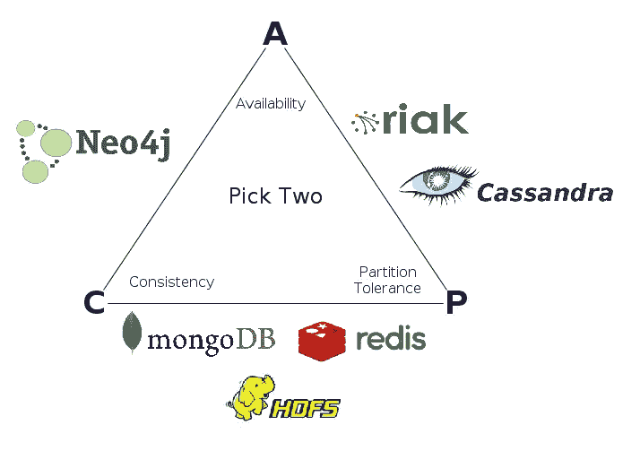
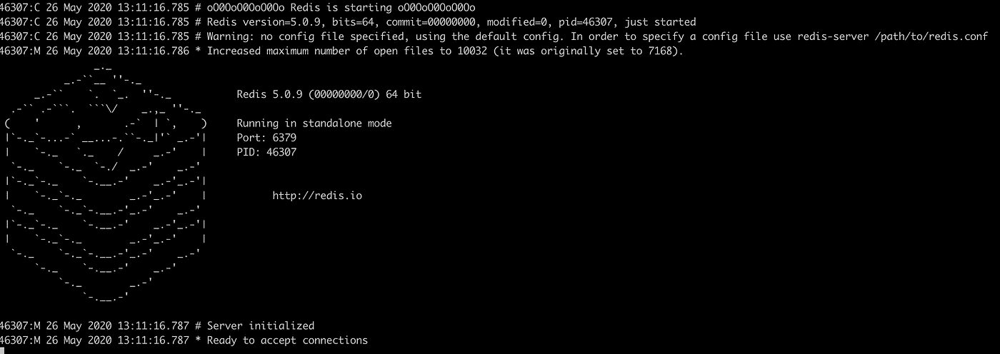

# 让我们一起学习会话:Redis

> 原文：<https://medium.com/javarevisited/lets-learn-together-sessions-redis-4663d57cc136?source=collection_archive---------2----------------------->

本文简要介绍了 Redis，它是最流行的内存数据存储、数据库、缓存和消息代理 NoSQL 解决方案之一。


照片由 [Aaron Burden](https://unsplash.com/@aaronburden?utm_source=medium&utm_medium=referral) 在 [Unsplash](https://unsplash.com?utm_source=medium&utm_medium=referral)

# **什么是 Redis？**

Redis 是速度最快的内存数据存储之一，其数据库模型基于键值存储。Redis 的名字来源于单词“ **Re** mote”、“**Di**dictionary”和“ **S** erver”的缩写。它是由 [Salvatore Sanfilippo](https://github.com/antirez) 开发的，旨在提高他的初创公司的可扩展性性能，该公司提供名为[lloogg.com](http://lloogg.com/)的实时分析服务。

**Redis 是用 C 语言编写的开源解决方案，发布在 Github 上**。另一方面，Redis 还有一个 [BSD3-Clause 商业许可](https://spdx.org/licenses/BSD-3-Clause.html)，它保护源代码和二进制形式的再分发和使用，以及印刷条款。

Redis 有一个很大的开源社区，不仅支持它保持其简单性和性能，还为不同的模块和设计增加了企业能力和功能以及集成。

这个名为 Redis Labs 的社区是一家私人公司，于 2011 年由 Ofer Bengal(T21)和 Yiftach Shoolman(T23)创建。Redis 的创始人 Salvatore Sanfilippo 也是 Redis 实验室的成员，该实验室领导 Redis 的开源开发。


Redis 实验室的创始人 Yiftach Shoolman(左)和 Ofer Bengal(右)。

**有许多客户端可以与不同的语言一起使用 Redis，如**[**Java**](/javarevisited/10-best-places-to-learn-java-online-for-free-ce5e713ab5b2)**[**node . js**](/javarevisited/7-free-courses-to-learn-node-js-in-2020-2f1dd6722b49?source=---------10------------------)**[**C**](/javarevisited/9-free-c-programming-courses-for-beginners-2486dff74065)**[**C #**](/javarevisited/5-best-c-c-sharp-programming-courses-for-beginners-in-2020-494f7afc7a5c)**[**Swift**](/javarevisited/7-free-courses-to-learn-swift-programming-language-in-2020-f40ac9d3ee53?source=---------7------------------)**，**您可以通过下面的链接找到 Redis 客户备选方案和 Redis 社区推荐的客户:********

****<https://redis.io/clients>  

**Redis 支持许多基于键值的数据结构，如** [**哈希**](https://www.java67.com/2013/02/10-examples-of-hashmap-in-java-programming-tutorial.html) **，** [**集合**](https://javarevisited.blogspot.com/2012/06/hashset-in-java-10-examples-programs.html) **，** [**排序集合**](https://javarevisited.blogspot.com/2012/11/difference-between-treeset-hashset-vs-linkedhashset-java.html#axzz6hX6XfwBD) **，** [列表](https://www.java67.com/2012/07/how-to-iterate-loop-traverse-list-java.html) **。**此外，Redis 支持发布/订阅消息代理，其中发布的消息被分配给通道，而不知道连接的订户。连接到相关频道的订户接收发布的消息。

**Redis 提供了改进的读取性能、稳定的故障转移机制和更快的数据恢复**，这得益于其主从复制和分片机制的支持。

Redis 还支持持久化到磁盘。您可以轻松启用或禁用此属性，并对其进行参数化管理。(每天 9:00 或每小时等指定时间段自动启动，或通过“**bgsave”**命令手动调用，或关机时自动触发)。所以 Redis 是设计一致的和分区容忍的数据存储的一个很好的选择。



图片来源:【https://datasciencepedia.com/】T4:::CAP 定理

**Redis 通过主从复制机制提供高可用的结构**。您可以通过添加新节点或删除节点来轻松扩展 Redis。这是一种非常安全和稳定的方法，可以根据您的应用程序需求来扩展您的应用程序。

# Redis 用在哪里？

Redis 在许多不同的部门和领域用于不同的目的。使用 Redis 的知名公司有 Twitter、Github、Pinterest、Snapchat、Stackoverflow 等等…

**Redis 的一个主要用例是缓存。**减少数据访问延迟时间，提高数据操作(访问或写入)性能。它提供了快速的响应时间，对于大多数或经常使用的数据甚至低于 1 毫秒。您可以通过一些配置提高响应时间和写入时间性能，例如从从节点读取和写入主节点功能等

由于其模式匹配和不同的数据结构支持，Redis 也是发布/订阅和队列机制的一个很好的选择。您可以创建基于房间或频道的聊天应用程序、实时内容流以及社交媒体 feed 基础架构。

**Redis 还被前端和后端应用程序用于内存会话存储**。它以高度可伸缩和持久的方式存储会话数据、用户会话和凭证。

**Redis 有序集合数据结构是游戏开发者开发实时排行榜**功能的首选解决方案。许多流行的游戏开发公司，如 Roblox 和 Jelly Button Games 等，以及领先的游戏直播公司，如 Twitch，都使用 Redis 作为他们的内存数据存储需求。您可以通过以下链接获得游戏行业 Redis 实验室的详细文档和解决方案:

<https://redislabs.com/redis-enterprise/industries/gaming/>  

除了这些用例之外，您还可以为许多域选择 Redis，以提高应用程序的可伸缩性和性能。
**让我们看看，Redis 是如何提供这一点的？**

# 它是如何工作的？

如果您已经决定使用 Redis，您必须首先选择要使用的 Redis 模式。Redis 为用户提供以下四种不同的模式:

*   独立模式
*   复制模式
*   集群模式
*   哨兵模式

**Redis 独立模式在可扩展性方面类似于关系数据库。**它支持垂直可扩展性，但由于单点故障而不支持高可用性。独立模式很容易设置，但不建议用于生产环境。

**第二种模式，复制模式，由于其主从结构，解决了独立模式的可用性问题。**有主节点和一些副本。主节点向副本更新新数据，副本之间没有网络和数据传输。复制模式的主要问题是弹性。您必须手动应用操作和管理节点。如果主服务器关闭，您必须手动将复制副本分配为新的主服务器，并重新启动所有客户端。

**Sentinel 模式已被开发作为前两个节点的替代，以解决恢复能力问题。**除主节点或从节点外，还有前哨节点。Sentinel 模式旨在提高主从节点和 sentinel 模式的恢复能力。每个节点都知道谁是主节点，并在回退情况下自动升级新的主节点。

哨兵模式使用**法定人数系统**来提供主提升流程。仲裁是指分配新主机所需的最小节点数。仲裁数量可以根据您的 Redis 哨兵设计(主人或奴隶的数量-哨兵的数量等)和您的资源进行更改。哨点监控、分析和报告群集。如果主节点关闭，它会在其他节点之间创建一个连接，并分配一个新的主节点。或者它会从群集中提取不正常的应用程序，并在运行正常时将其重新连接到群集。

**最后一种模式，集群模式，通过多主机配置提供了弹性和可扩展性功能。**被认为是一个主人，N 个奴隶。主节点负责所有的写操作，从节点只是只读的。这减少了主节点上的流量，并防止了读取操作的延迟。

在集群模式下，数据被分成 16k 个存储桶。每个存储桶分配给一个主存储桶，至少复制两次。在群集模式下，每个节点可以是主节点，也可以是副本节点。对于一个高度可用和稳定的集群结构，必须至少有 6 个节点(其中 3 个必须是主节点，3 个必须是从节点),因此如果您想在集群模式下使用 Redis，与其他部署模式相比，您需要更多的资源。

此外，您还必须检查客户端对所选开发语言上的集群模式的支持，因为所有 Redis 客户端都不支持集群模式。

对于本文，我开发了一个支持三种模式的演示项目:独立、sentinel 和集群。因此，您可以通过启用相关配置和 Redis 实用程序类来使用您选择的部署模式。

# **从哪里开始？**

首先，你必须从 [Redis.io 下载页面](https://redis.io/download)下载稳定的 Redis 版本。这个下载页面只适用于 [Unix](/javarevisited/6-free-courses-to-learn-bash-shell-scripting-in-linux-and-unix-a50461ecd4fe) 或 [Linux](/javarevisited/7-best-linux-courses-for-developers-cloud-engineers-and-devops-in-2021-7415314087e1) 分布式计算机。如果你想在 Windows 机器上安装 Redis，你可以使用下面的微软档案页面链接。

<https://github.com/MicrosoftArchive/redis/releases>  

redis 安装完成后，您可以安装 redis-cli 包来管理您的 Redis 集群，并在您的 Redis 服务器上进行查询。要安装 redis-cli，您可以使用以下 npm 命令:

```
npm install -g redis-cli
```

要在您的机器上启动一个简单的 Redis 服务器，您必须转到 **/usr/local/etc** 文件夹，执行不带任何参数的 **redis-server** 命令。如果运行 Redis 服务器时不带参数，它会自动在端口 6379 上创建一个 Redis 服务器。它使用默认的 redis 配置，名为 redis.conf，位于/usr/local/etc 文件夹下。如果一切顺利，您将看到下面的屏幕:)



然后，您可以使用 redis-cli 检查 Redis 的运行状况，也可以使用以下命令:

```
my-pc:etc rootuser$ redis-cli
127.0.0.1:6379> ping
PONG
127.0.0.1:6379>
```

正如我已经说过的，Redis 提供了许多数据结构，如散列、集合、列表、计数和有序集合等。Redis 文档告诉您如何使用这些数据结构，以及如何用基本的 CRUD 操作(设置、获取、更新、删除)来管理数据。例如，如果您在 Redis 集群上使用散列，那么您可以使用下面的 **hmset** 命令将数据添加到散列中:

```
hmset student_id name "George" major "Mathematics"
```

然后，您可以使用带有 student_id 参数的 **hmget** 命令访问该数据的任何字段，如下所示:

```
hmget student_id name
```

Redis 提供了一系列非常好的命令来管理您的数据。您可以通过以下 Redis 文档链接获得完整的命令列表:

<https://redis.io/commands>  

# 如何用 Java 使用 Redis？

如果您想在 Java 中使用 Redis，您必须从 [Redis clients 页面](https://redis.io/clients#java)中检查建议的 Redis 客户端。有一堆开源的 Redis Java 客户端，但其中有三个是 Redis 社区推荐的:Jedis、莴苣、Redisson。

对于我的演示项目，我需要使用多个 Redis 模式，独立、sentinel 和集群。因为 Jedis 支持所有这些模式，所以我选择 Jedis 作为我的 Java 客户端。另外，其他两个推荐的客户端支持这三种模式，所以您也可以在您的应用程序中使用它们。我没有试过其他客户，所以我无法比较。

要在 Spring boot 项目上使用 Jedis，您必须添加 [Maven](/javarevisited/6-best-maven-courses-for-beginners-in-2020-23ea3cba89) 或 [Gradle](/javarevisited/5-best-gradle-courses-and-books-to-learn-in-2021-93f49ce8ff8e) 依赖项，如下所示:

## maven-->

```
<dependency>
   <groupId>redis.clients</groupId>
   <artifactId>jedis</artifactId>
</dependency>
```

**Gradle->**

```
compile group: 'redis.clients', name: 'jedis'
```

要使用 Jedis，你必须用一个 **JedisPool** 对象初始化一个 Jedis 池。您可以将 Redis 特定的连接配置作为配置添加到 Jedis 池中。我将为三种 Redis 模式使用相同的连接配置，因此我创建了一个抽象类，称为 RedisConfiguration，它创建了一个简单的 Jedis 池配置，该配置是从[generic Java](/javarevisited/top-10-free-interactive-programming-courses-from-educative-for-beginners-to-learn-in-2021-713cbf96d4eb)**GenericObjectPoolConfig**类扩展而来的，如下所示:

```
public abstract class RedisConfiguration {

    public JedisPoolConfig getJedisPoolConfig(){

        JedisPoolConfig jedisPoolConfig = new JedisPoolConfig();

        jedisPoolConfig.setBlockWhenExhausted(false); 
        jedisPoolConfig.setMaxIdle(15);  
        jedisPoolConfig.setMinIdle(1);  
        jedisPoolConfig.setMaxTotal(20); 

        return jedisPoolConfig;
    }
}
```

第一个参数**“blockWhenExchausted”**设置为 false，以便当客户端尝试请求连接并且没有 Redis 服务器可用时，触发客户端返回错误。**“MaxIdle”**属性表示池的最大空闲(由应用程序使用并在池中等待使用)连接数。该属性的默认值是 8，但是我们将它设置为 15，以允许更多的客户端连接到该池。 **"MinIdle"** 属性定义使池工作的最小空闲连接数。默认值为 0，但是您可以像上面的示例一样更改该值。您可以使用**“max total”**属性来限制总连接数(空闲+已用)。

我将这个配置池用于所有的 Redis 模式，但是您可以为不同的 Redis 模式创建不同的配置。然后，我用不同的配置类创建了 Jedis 池和 Jedis 集群对象配置:

*   再孤立配置
*   重新感知配置
*   rediscluster 配置

对于独立配置，我们使用池配置创建了一个 JedisPool 对象，我们在上面定义的池配置如下:

```
JedisPoolConfig jedisPoolConfig = getJedisPoolConfig();

return new JedisPool(jedisPoolConfig,
        appConf.getRedis().getStandalone().getHost(),
        appConf.getRedis().getStandalone().getPort(),
        appConf.getRedis().getStandalone().getTimeout());
```

我们从应用程序配置文件中设置主机、端口和超时值。我们使用端口 6379 在本地主机上启动 Redis 服务器，并将超时值设置为 3 秒，如下所示:

```
redis.standalone.host= localhost
redis.standalone.port= 6379
redis.standalone.timeout = 3000
```

对于 sentinel 配置，我们创建了一个 **JedisSentinelPool** 对象，类似于独立配置中的 **JedisPool** 对象。对于 sentinel 模式，我们在端口 5000、5001、5002 中创建了三个 sentinel 节点。JedisSentinelPool 对象创建过程实现如下:

```
@Bean
public JedisSentinelPool getJedisSentinel(){

    String[] sentinelNodes = appConf.getRedis().getSentinel().getHost().split(";");

    Set sentinels = new HashSet<>();

    for(String sentinelNode : sentinelNodes){

        if(sentinelNode!= null &&
                !sentinelNode.isEmpty()){
            sentinels.add(sentinelNode);

        }

    }

    JedisPoolConfig jedisPoolConfig = getJedisPoolConfig();

    return new JedisSentinelPool("mymaster",sentinels,jedisPoolConfig,appConf.getRedis().getSentinel().getTimeout());

}
```

我们从 application.configuration 逐一添加了所有主机，超时值也来自配置文件:

```
redis.sentinel.host= 127.0.0.1:5000;127.0.0.1:5001;127.0.0.1:5002
redis.sentinel.timeout = 3000
```

集群模式配置与独立和 sentinel 配置略有不同。集群模式有自己的池结构，而不是创建池对象，因此我们可以创建一个简单的 JedisCluster 对象来连接 Redis 集群:

```
@Bean
public JedisCluster getJedisCluster(){

    String[] clusterNodes = appConf.getRedis().getCluster().getHost().split(";");

    Set<HostAndPort> clusters = new HashSet<>();

    for(String clusterNode : clusterNodes){

        if(clusterNode!= null &&
                !clusterNode.isEmpty()){

            String[] clusterNodeEndpoint = clusterNode.split(":");

            if(clusterNodeEndpoint.length == 2)
                clusters.add(new HostAndPort(clusterNodeEndpoint[0],Integer.parseInt(clusterNodeEndpoint[1])));

        }

    }

    JedisPoolConfig jedisPoolConfig = getJedisPoolConfig();

    return new JedisCluster(clusters,
            appConf.getRedis().getCluster().getTimeout(),
            appConf.getRedis().getCluster().getTimeout(),jedisPoolConfig);

}
```

我们已经用 HostAndPort 对象分别分配了集群节点。我们创建了 6 个节点(其中 3 个是主节点，3 个是从节点)，端口从 7000 到 7005。此外，与其他配置不同，我们将套接字超时值设置为 3 秒。我们还像其他配置一样添加了池配置，以覆盖 Redis 集群的默认池机制。我们从应用程序配置文件中获取如下配置参数:

```
redis.cluster.host= 127.0.0.1:7000;127.0.0.1:7001;127.0.0.1:7002;127.0.0.1:7003;127.0.0.1:7004;127.0.0.1:7005
redis.cluster.timeout = 3000
```

我们可以在演示项目中使用所有三种模式。为此，您需要将 ActiveRedisMode 属性设置为所需的模式，如下所示:

```
# Redis Modes -> standalone,sentinel,cluster

activeRedisMode= standalone
```

要创建一个独立的 Redis 服务器，转到 **/usr/local/etc** 文件夹并执行 **redis-server** 命令。对于 sentinel Redis 模式，您可以遵循以下 Redis 文档页面上的说明:

<https://redis.io/topics/sentinel>  

要创建包含 6 个集群节点的 Redis 集群，可以遵循 Redis 页面上的集群文档:

<https://redis.io/topics/cluster-tutorial>  

对于我的演示项目，我创建了一个简单的名为 Student 的 POJO 类。我想用 Redis " **hash"** 对象存储 Redis 中的所有学生，我还需要用基本的 CRUD 操作管理学生。为此，我们创建了一个名为“ **RedisCacheManager”的单一接口。**我们向管理器类添加了以下功能:

```
public interface RedisCacheManager {

    StudentCacheObject getObjectFromHashWithKey(String key);

    String getSingleFieldFromHashWithKey(String key, String valueType);

    void updateObjectInHashWithKey(String key, StudentCacheObject studentCacheObject);

    void setNewObjectToHashWithKey(StudentCacheObject studentCacheObject);

    void removeSingleValueFromHashWithKey(String key, String removedType);

    void removeObjectFromHashWithKey(String key);

    List<StudentCacheObject> getAllObjects();

}
```

前两种方法是经典的 get 操作。第一种方法返回 Student hash 对象中的所有对象字段，而第二种方法只返回 Student 的所需字段，如 email 和 GPA 等。Redis 散列对象上的任何 get 操作都是通过使用 **"hget"** 或" **hgetall"** 命令来完成的。如果你想到达一个散列对象中的单个字段，你必须使用**“hget”**命令。另一方面，必须使用 **"hgetall"** 命令从 hash 对象中获取所有字段。我们为所有三个 Redis 模式管理器类定义了这两个对象，如下面的代码片段所示:(RedisStandaloneCacheManager，RedisSentinelCacheManager，RedisClusterCacheManager)

```
public StudentCacheObject getObjectFromHashWithKey(String key) {
    Map<String, String> redisMap = redisClient.hgetAll(key);
    ObjectMapper mapper = new ObjectMapper();

    return mapper.convertValue(redisMap, StudentCacheObject.class);
}

public String getSingleFieldFromHashWithKey(String key, String valueType) {
    return redisClient.hget(key, valueType);
}
```

有时我们需要更新数据库[中某个对象的某些字段。对于这些类型的操作，我们可以使用更新操作。在 Redis 散列数据结构中，没有独特的更新方法。我们使用 **"hmset"** 命令用期望的参数更新已经定义的对象。**" updateObjectInHashWithKey "**方法提供使用 Key 更新 Student hash 对象中的任何字段:](/javarevisited/8-free-oracle-database-and-sql-courses-for-beginners-f4e9b25b33c4)

```
public void updateObjectInHashWithKey(String key, StudentCacheObject studentCacheObject) {

    if (studentCacheObject == null)
        throw new IllegalArgumentException("[(updateObjectInHashWithKey)] Student object cannot be null");

    if (key == null)
        throw new IllegalArgumentException("[(updateObjectInHashWithKey)] Key cannot be null");

    Map<String, String> studentObjectMap = convertStudentObjectToMapObject(studentCacheObject);

    redisClient.hmset(key, studentObjectMap);
}
```

经典 API 中另一个最常用的操作是插入或添加操作。
“setNewObjectToHashWithKey”方法用于添加一个新的学生对象，其参数在 Redis 中定义。**“hm set”**命令用于在 Redis 中添加一个新的对象到 hash 中。
我们实施了如下操作:

```
public void setNewObjectToHashWithKey(StudentCacheObject studentCacheObject) {

    if (studentCacheObject == null)
        throw new IllegalArgumentException("[(setNewObjectToHashWithKey)] Student object cannot be null");

    if (studentCacheObject.getStudentId() == null)
        throw new IllegalArgumentException("[(setNewObjectToHashWithKey)] Student id cannot be null");

    Map<String, String> studentObjectMap = convertStudentObjectToMapObject(studentCacheObject);

    redisClient.hmset(studentCacheObject.getStudentId(), studentObjectMap);

}
```

如果您可以向 Redis 添加一个新对象，那么您应该能够随时删除它。或者您可能想要移除对象的单个区域。可以用 Redis 中的 **"hdel"** 命令从对象中删除一个字段或字段列表。以下两个流程完全满足这一需求:

```
public void removeSingleValueFromHashWithKey(String key, String removedType) {

    redisClient.hdel(key, removedType);
}

public void removeObjectFromHashWithKey(String key) {

    redisClient.hdel(key, "studentId", "name", "email", "major", "gpa");
}
```

最后一个方法，**“getAllObjects”**是另一个 get 操作，它逐个返回 Redis 中的所有学生对象。对于这个过程，我们首先使用**“keys”**命令获取 Redis 服务器上的所有密钥。然后我们使用**“hgetall”**命令获取 Redis hash 对象的所有字段。

```
public List<StudentCacheObject> getAllObjects() {

    List<StudentCacheObject> studentCacheObjectList = new ArrayList<>();

    Set<String> keys = redisClient.keys("*");
    if (!CollectionUtils.*isEmpty*(keys)) {
        for (String key : keys) {

            Map<String, String> redisObjectMap = redisClient.hgetAll(key);

            ObjectMapper mapper = new ObjectMapper();

            studentCacheObjectList.add(mapper.convertValue(redisObjectMap, StudentCacheObject.class));
        }

        return studentCacheObjectList;
    }

    return null;
}
```

对于演示应用程序，我们还创建了一个[控制器类](https://javarevisited.blogspot.com/2017/11/difference-between-component-service.html)来测试我们的 Redis 散列功能。StudentController 类可以用不同的 Redis 模式测试所有这些方法。

```
@PostMapping("/addNewStudent")
public String addNewStudent(StudentCacheObject studentCacheObject) {

    redisCacheManager.setNewObjectToHashWithKey(studentCacheObject);

    return "OK";
}

@GetMapping("/getStudentInfo")
public StudentCacheObject getStudentInfo(@RequestParam String studentId) {

    StudentCacheObject studentCacheObject = redisCacheManager.getObjectFromHashWithKey(studentId);

    if(studentCacheObject.getStudentId() == null)
        throw new NullPointerException("Student does not exist on system.");

    return studentCacheObject;
}

@GetMapping("/getStudentSingleField")
public String getStudentSingleField(@RequestParam String studentId,@RequestParam String fieldType) {

    return redisCacheManager.getSingleFieldFromHashWithKey(studentId,fieldType);

}

@GetMapping("/getAllStudents")
public List<StudentCacheObject> getAllStudents(){

    return redisCacheManager.getAllObjects();

}

@PutMapping("/updateStudentInfo")
public String updateStudentInfo(@RequestParam String studentId,
                                StudentCacheObject studentCacheObject) {

    redisCacheManager.updateObjectInHashWithKey(studentId, studentCacheObject);

    return "OK";

}

@DeleteMapping("/removeStudent")
public String removeStudent(@RequestParam String studentId) {

    redisCacheManager.removeObjectFromHashWithKey(studentId);

    return "OK";
}
```

# 结论

Redis 是数据库世界中非常快速的内存数据存储。使用 Redis 和类似的数据存储，可以横向扩展数据库并提高数据性能。

Redis 根据您的需求和资源为您提供不同的分销模式。您可以使用 Redis 作为基本的数据存储，缓存您经常访问的数据，以便进行更强大、更快速的数据操作和处理。

另一方面，您可以将 Redis 视为会话存储、发布/订阅机制、实时社交媒体提要和评论数据结构，甚至游戏排行榜功能的替代数据存储解决方案。

Redis 支持许多不同的数据结构，从简单的散列对象到计数器对象。你可以在许多操作系统上使用 Redis Unix、 [Linux、](/javarevisited/top-10-courses-to-learn-linux-command-line-in-2020-best-and-free-f3ee4a78d0c0)甚至 Windows(带有微软扩展)。

许多 Redis 客户端使得管理许多编程语言的 Redis 成为可能，如 [Java](https://javarevisited.blogspot.com/2018/01/top-10-udemy-courses-for-java-and-web-developers.html) 、 [C #](/javarevisited/9-free-c-c-sharp-courses-and-tutorials-for-beginners-and-intermediate-programmers-best-of-lot-dc8c793aab31?source=---------16------------------) 、 [Python](/javarevisited/8-advanced-python-programming-courses-for-intermediate-programmer-cc3bd47a4d19) 和 [Node.js](/javarevisited/top-10-online-courses-to-learn-node-js-in-depth-8ef0e31ca139) 等

Redis 很好学，文档和社区真的很强大，与日俱增。Redis 实验室还为 Redis 提供开源和企业解决方案。

我在 Node.js 应用程序上使用 Redis 作为高可用的数据存储解决方案，并强烈推荐 Redis 您尝试在您的后端和前端系统中满足您的数据存储需求。

代码在 [**Github**](https://github.com/justayar/SpringBootTemplates/tree/master/redis) 上有。****