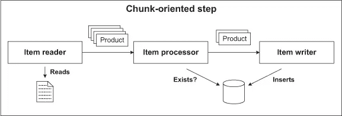
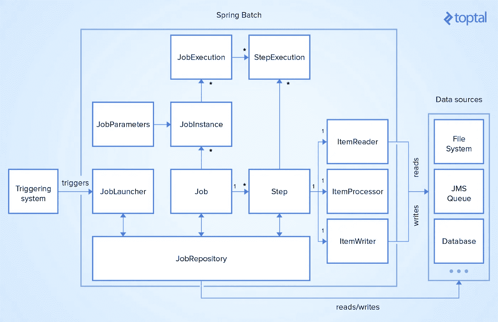
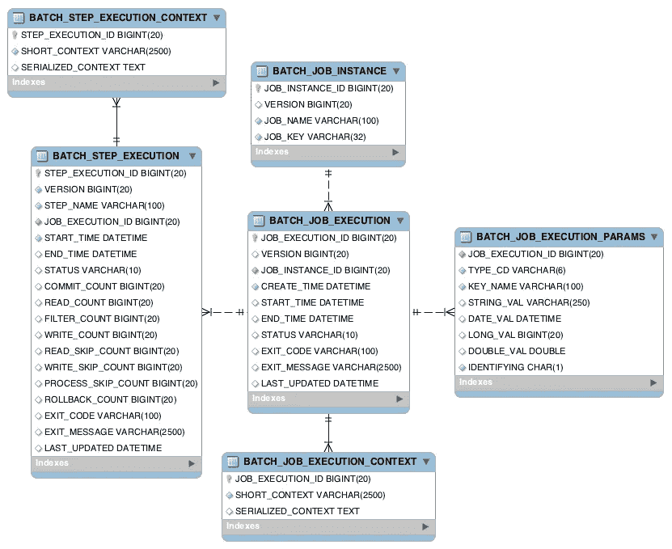

# 让我们一起学习会话:春季批次

> 原文：<https://medium.com/javarevisited/lets-learn-together-sessions-spring-batch-e690fd5428ec?source=collection_archive---------0----------------------->

在本文中，您将了解如何借助 Spring Batch 框架，在基于 Spring 的应用程序中使用批处理。


杰拉尔丁·莱瓦在 [Unsplash](https://unsplash.com?utm_source=medium&utm_medium=referral) 上的照片

# 批处理的历史:

批处理是一个已经存在多年的术语。
批处理可以被认为是一组过程，包括在每一步处理大量输入数据的某一部分。

这种类型的批处理过程通常包括日常或预定时间的操作。多年来，批处理的方式发生了变化，但即使在今天，这个术语仍然是一种常见的做法。

最早的批处理是基于第一个计算系统的开发。第一批计算机一次只能做一项工作。也就是说，控制机器的一个人可以在单位时间内运行一个作业，这个人必须等到当前作业完成后才能开始另一个作业。当正在运行的作业完成时，控制机器的人必须触发机器开始下一个作业。

对于每个新作业或批处理作业，都要重复这一过程。时间复杂度是指一个人完成一项工作所需的时间。另一方面，每一项工作都是在人工干预下完成的，因此显然需要人工来保证流程的连续性。

在那个时代，使用计算机系统的人们使用穿孔卡(下图)或磁带来运行批处理。穿孔卡片的发明可以追溯到 18 世纪。1890 年，美国统计学家赫尔曼·何乐礼发明了一种处理穿孔卡片的机器。赫尔曼最初在美国 1890 年人口普查中使用这台机器。这台机器将全美人口普查时间从 8 年缩短到 6 年。这是用真实机器进行批处理的最早例子之一。**【1】**

尽管这个系统部分地消除了批量操作的时间复杂性，但是系统中人的需求仍然是清楚的。


图片来源:[https://www.computerhope.com/jargon/p/punccard.htm](https://www.computerhope.com/jargon/p/punccard.htm):::打卡

因此，下一个目标是消除批处理中的人工需求。批处理在接下来的几十年里继续发展。随着批处理过程中新技术和软件系统的出现，人工干预日益减少。

随着诸如大型机系统之类的高可用性和高性能计算系统的发展，批处理已经变得可以以更高的性能和更少的内存消耗进行处理。

有了[软件语言](/javarevisited/top-10-programming-languages-you-can-learn-for-jobs-and-career-in-technology-491e611c22bc?source=extreme_sidebar---------0-2----------------------)，如 **COBOL** 和 **REEX** ，它们提供了容易的开发和高可读性，批量处理的转换在大型机系统中使用变得更加容易。

如今，现代的[函数式](/javarevisited/7-free-scala-and-functional-programming-courses-for-beginners-370f3cd41a4e)和[面向对象语言](/swlh/5-free-object-oriented-programming-online-courses-for-programmers-156afd0a3a73)已经取代了 Cobol 等老式的方法语言。因此，业务需求所需的批处理操作已经开始用这些现代的、高度可伸缩的、有特色的语言来开发。

如今，虽然开源的 [**Hadoop**](/javarevisited/top-10-courses-to-learn-big-data-and-hadoop-best-of-lot-23ef8691633f) 框架如 [Spark](/javarevisited/5-free-courses-to-learn-apache-spark-in-2020-bdff2d60c800) 被用于大数据处理，但人们更喜欢批量的 **ETL** 工具如 Informatica 用于较小的数据集。

另一方面，像**亚马逊红移**和**谷歌大查询**这样的关系数据库是在你的日常业务操作中使批处理成为可能的其他流行选项。**【2】**

在 Java EE 中，还可以借助规范 [JSR352](https://jcp.org/en/jsr/detail?id=352) 使用批处理。应用程序开发人员可以使用这个规范模型来开发健壮的批处理系统。

像 Spring 这样的现代 Java Web 框架也在这个规范上开发了批处理框架。开发人员现在能够使用批处理框架提供的特定配置和预实现的接口和监听器，以最少的工作量进行批处理。Spring 在它的文档网站上解释了它开发的流行的批处理框架如下:

> 一个轻量级、全面的批处理框架，旨在支持对企业系统的日常操作至关重要的健壮批处理应用程序的开发。

Spring Batch framework 不仅提供有用的功能，还支持日志/跟踪、事务管理、作业进程统计、作业跳过、重启和资源管理功能。我们可以列出 spring 批处理提供的主要功能如下:

*   事务管理
*   基于组块的处理
*   说明性输入输出
*   启动/停止/重启
*   重试/跳过
*   基于 Web 的管理界面

总之，尽管批处理可以追溯到 18 世纪，但是在今天的计算世界中，批处理的数量和用途已经发生了变化。在文章的下一部分，让我们看看现在在哪里使用批处理。

# 在哪里使用批处理？

批处理已经在不同的领域和部门使用了多年。如今，批处理仍然是公司甚至政府机关使用的主要操作之一。

批处理技术主要用于 ETL 事务，目的是从多个系统中提取数据，然后将数据存储在数据仓库系统中，再将数据从数据仓库转换到分析平台。例如，一个成本会计系统可以结合来自工资，销售和采购的数据。

另一方面，[数据可视化工具](/javarevisited/8-best-data-visualization-tools-and-libraries-data-analysts-and-scientists-can-learn-d2734371df16)从几个系统收集数据，如数据库、社交媒体条目、数据收集工具和其他服务，然后将其存储在数据仓库中，并可以通过对数据进行转换为客户提供定制的数据可视化。


图片来源:【https://www.spec-india.com/tech-in-200-words/what-is-etl ::ETL 流程

另一方面，遗留系统中的数据迁移是一个通过批处理广泛执行的过程。报告生成过程、计费分析系统和日志分析系统使用批处理在可管理和可监控的结构中实现高效和可扩展的解决方案。

批处理是处理大量数据时生成的日常操作和业务报告的首选技术之一。

随着批处理的转变，许多数据输入专业人员的工作被计算机取代，另一方面，公司避免了一笔巨大的开支。

除了这些使用领域，未来需要人工干预的过程向无人化过程的转化将会增加。虽然这种转变将导致许多人失业，但它也将为计算系统管理人员创造新的工作机会。

# 它是如何工作的？

要理解 Spring Batch 框架中的批处理，您必须了解批处理系统的术语和主要组件。

数据的批量处理是先采集大量数据，然后以特定方式处理，再产生批量结果的过程。批处理通常由称为作业的任务组成。每个 ***工作*** 描述一个加工流程或步骤。每个 ***步骤*** 由一个阅读器、一个处理器和一个写入器组成。在 Spring Batch 中，主任务称为作业。作业可以按时间安排，也可以由事件触发。

另一方面，步骤，即作业的处理单元，是 Spring Batch 基础设施的关键点之一。根据我们定义的逻辑，一个作业可以包含一个或多个步骤。我们可以通过使用 **chunk** 或 **tasklet** 模型来定义 Spring 批处理中的一个步骤。

在分块方法中，一个步骤的初始化有 3 个组成部分，其顺序如下:

*   **项目阅读器:**从数据库、消息队列或其他地方读取。
*   **商品处理器:**对来自商品阅读器的数据应用业务逻辑，并对数据进行处理。
*   **条目编写器:**获取数据并写入数据库或消息队列。

数据存储在定义的块中，并在这些块上进行处理。
一个 **chunk** 是某一部分数据的组合。您可以使用**块大小**参数指定块中数据的大小。“区块提供了一种简单的解决方案来处理分页读取或我们不想在内存中保留大量数据的情况”。**【3】**



图片鸣谢:[https://live book . manning . com/concept/spring/filter-item-processor](https://livebook.manning.com/concept/spring/filter-item-processor):::面向组块的步骤

相反，在小任务模型**中，小任务**作为一个步骤中的单个任务来执行。小任务模型中的作业包括读取、处理和写入步骤，并且一个接一个地执行每个步骤。与块模型不同，它在一个步骤中处理所有数据。作为一种风险，如果您的数据非常大，资源可能会耗尽。因此，如果您的数据量很大，那么选择块方法会更好。小任务模型步骤创建，通常用于删除资源或执行查询等操作。

在 Spring Batch 框架中，另一个重要组件是 **JobRepository** 。它将作业和步骤细节存储在由框架处理的内存数据库中。另一方面，这个存储库在项目处理期间定期存储作业和步骤执行，并计算执行度量以提供统计数据。因此，作业和步骤执行的管理和流程由 Spring Batch 框架提供。

在 Spring Batch 基础设施中定义了一个作业和相关步骤之后，您需要一个 **JobLauncher** 来运行一个特定的作业。Spring Batch 为 JobLauncher 的作业运行和所有可能的特别执行提供了一个简单的接口。根据实施情况，用户可以手动同步或异步运行作业。要使用 JobLauncher 运行作业，您需要创建一个 **JobInstance** ，并使用 **JobParameters** 为 JobInstance 提供作业参数，如果可用的话。

你可以在下图中看到 Spring Batch 框架的主要基础设施:



图片来源:[https://www.toptal.com/spring/spring-batch-tutorial](https://www.toptal.com/spring/spring-batch-tutorial)::春批框架

让我们设计一个应用程序，从提供冠状病毒数据的免费 API 中读取数据。这个演示应用程序通过在处理器步骤中使用映射器将数据转换成实体对象。然后它将所有的 Covid 数据保存到一个 [CSV 文件](https://javarevisited.blogspot.com/2015/06/2-ways-to-parse-csv-files-in-java-example.html)。

要在一个 [Java 项目](https://javarevisited.blogspot.com/2020/12/top-5-project-based-courses-to-learn-java-python-javascript.html)中使用 Spring Batch 框架，您需要向您的应用程序添加以下依赖项。

```
<groupId>org.springframework.boot</groupId>
   <artifactId>spring-boot-starter-batch</artifactId>
</dependency>
```

要启用批处理，您需要向主类添加 **@EnableBatchProcessing** 注释。使用 enable annotation，您可以使用 Spring 批处理功能，并为在配置类中设置批处理作业提供基本配置。

```
@SpringBootApplication
@EnableBatchProcessing
public class CovidBatchServiceApplication {
}
```

添加完依赖项和注释后，您可以通过定义批处理过程中的步骤来开始应用程序的设计。在 Spring Batch 框架中，您可以使用 **StepBuilderFactory** 来定义一个步骤。它使用[构建器模式](http://javarevisited.blogspot.sg/2012/06/builder-design-pattern-in-java-example.html)创建一个新对象，并将读取器、处理器和写入器对象作为如下参数:

```
@Autowired
private StepBuilderFactory stepBuilderFactory;@Bean
Step saveDataFromApiToCsvFileStep(){
    return stepBuilderFactory.get("saveDataFromApiToCsvFileStep")
            .<CovidCountryDataDTO,CovidCountryData>chunk(5)
            .reader(reader())
            .processor(processor())
            .writer(fileItemWriter())
            .build();
}
```

在上面的代码中，块大小设置为 5，默认的批处理块大小为 1。因此，它每次读取、处理和写入 5 个数据集。阅读器可以通过使用来自 Spring Batch 框架的 **ItemReader** 接口来定义。

ItemReader 接口包含一个 **read()** 方法，所以这个方法可以在实现的 Reader 类中被覆盖。在类的初始化时间，reader 类使用一个服务读取数据，该服务使用 [RestTemplate](https://javarevisited.blogspot.com/2017/02/how-to-consume-json-from-restful-web-services-Spring-RESTTemplate-Example.html) 从 API 获取数据。

然后在 read 方法中，通常对每个批处理调用多次，每次调用`read()`都返回下一个值，最后当所有输入数据都用尽时返回`null`，如下所示**【4】**:

```
public class CovidDataItemReader implements ItemReader<CovidCountryDataDTO> , InitializingBean {

    @Autowired
    CovidApiBatchService covidApiBatchService;

    private List<CovidCountryDataDTO> covidCountryDataList;
    private Integer index = 0;
    private boolean initialized;

    private void init() {

        covidCountryDataList = covidApiBatchService.getCovidSummaryData().getCountries();
        initialized = true;
    }

    @Override
    public void afterPropertiesSet() throws Exception {
        init();
    }

    @Override
    public CovidCountryDataDTO read(){

        if(!initialized)
            init();

        if(index == covidCountryDataList.size()){
            index = 0;
            initialized = false;
            return null;
        }

        CovidCountryDataDTO countryDTO = covidCountryDataList.get(index);
        index++;
        return countryDTO;
    }
}
```

在自定义 Reader 类实现之后，需要开发一个处理器，将来自 Reader 的数据映射到实体对象列表。在 **ItemProcessor** 的帮助下，可以轻松实现一个定制的 ItemProcessor 类。ItemProcessor 包含 **process()** 方法，该方法允许我们将业务逻辑应用于读取器进程中读取的数据。

```
@Slf4j
public class CovidDataItemProcessor implements ItemProcessor<CovidCountryDataDTO, CovidCountryData> {

    @Autowired
    private CovidCountryDataMapper covidCountryDataMapper;

    @Override
    public CovidCountryData process(CovidCountryDataDTO covidCountryDataDTO){

        return covidCountryDataMapper.map(covidCountryDataDTO);
    }
}
```

实现自定义处理器类后，最后一步是设计编写类。与读取器和处理器步骤一样，另一个 Spring 批处理接口 **ItemWriter** 可用于实现编写器功能。如果您想将数据写入文件， [Spring](/javarevisited/10-best-spring-framework-books-for-java-developers-360284c37036) 为此功能提供了另一个定制接口，称为 **FlatFileItemWriter。**

首先，您需要定义一个实现这个接口的类。在实现的 writer 类的构造函数中，首先设置文件的标题字段。然后为 [CSV 文件](https://www.java67.com/2019/05/how-to-read-csv-file-in-java-using-jackson-library.html)定义分隔符，并将数据列交给 bean 包装器字段提取器，以便只从数据中提取某些字段。方法将数据写入属性文件中定义的资源。此功能的示例实现如下:

```
public class CovidDataFileItemWriter extends FlatFileItemWriter<CovidCountryData> {

    private static final String[] *dataColumns* = new String[]{"country", "countryCode", "newConfirmed", "totalConfirmed", "newDeaths", "totalDeaths", "newRecovered", "totalRecovered"};

    public CovidDataFileItemWriter(ApplicationProperties applicationProperties){

        super();

        this.setHeaderCallback(writer -> writer.write("Country;CountryCode;New Confirmed;Total Confirmed;New Deaths;Total Deaths;New Recovered;Total Recovered"));

        this.setAppendAllowed(true);

        DelimitedLineAggregator<CovidCountryData> delimitedLineAggregator = new DelimitedLineAggregator<>();

        delimitedLineAggregator.setDelimiter(";");

        BeanWrapperFieldExtractor<CovidCountryData> fieldExtractor = new BeanWrapperFieldExtractor<>();

        fieldExtractor.setNames(*dataColumns*);

        delimitedLineAggregator.setFieldExtractor(fieldExtractor);

        this.setResource(new PathResource(applicationProperties.getCsvFilePath()));
        this.setLineAggregator(delimitedLineAggregator);

   }
}
```

现在，第一步完成了读取器、处理器和写入器方法的实现。我们再定义一个步骤，从上一步写的 [CSV 文件](http://www.java67.com/2015/08/how-to-load-data-from-csv-file-in-java.html)中读取数据，然后用上一步设计的处理器处理数据，最后将处理后的数据写入一个数据库。为此，我们将定义另一个步骤 bean，如下所示:

```
@Bean
Step  (){
    return stepBuilderFactory.get("saveDataFromCsvFileToDbStep")
            .<CovidCountryDataDTO,CovidCountryData>chunk(5)
            .reader(fileItemReader())
            .processor(processor())
            .writer(writer())
            .build();
}
```

reader 类可以通过使用来自 Spring Batch 框架的 **FlatFileItemReader** 接口来定义。所以你必须定义一个实现这个接口的类。

在实现的 reader 类的[构造函数](https://javarevisited.blogspot.com/2012/12/what-is-constructor-in-java-example-chainning-overloading.html)中，首先指定从文件中读取数据的分隔符，然后给出要解析的数据列。您还需要指定目标对象类型，并设置读取器将读取的资源。此外，假设文件的第一行是标题行，您必须将 **linesToSkip** 参数作为 1 传递，以便在读取类的过程中跳过文件的第一行。

```
public class CovidDataFileItemReader extends FlatFileItemReader<CovidCountryDataDTO> {

    private static final String[] *dataColumns* = new String[]{"country", "countryCode", "newConfirmed", "totalConfirmed", "newDeaths", "totalDeaths", "newRecovered", "totalRecovered"};

    private static final int *LINES_TO_SKIP* = 1;

    public CovidDataFileItemReader(ApplicationProperties applicationProperties){

        super();

        DefaultLineMapper<CovidCountryDataDTO> lineMapper = new DefaultLineMapper<>();

        DelimitedLineTokenizer delimitedLineTokenizer = new DelimitedLineTokenizer();
        delimitedLineTokenizer.setDelimiter(";");

        delimitedLineTokenizer.setNames(*dataColumns*);

        BeanWrapperFieldSetMapper<CovidCountryDataDTO> fieldSetMapper = new BeanWrapperFieldSetMapper<>();
        fieldSetMapper.setTargetType(CovidCountryDataDTO.class);

        lineMapper.setLineTokenizer(delimitedLineTokenizer);

        lineMapper.setFieldSetMapper(fieldSetMapper);

        this.setResource(new PathResource(applicationProperties.getCsvFilePath()));
        this.setLineMapper(lineMapper);
        this.setLinesToSkip(*LINES_TO_SKIP*);
    }
}
```

在处理器步骤中，我们将使用在上一步中已经定义的处理器类。

由于我们希望将数据存储在数据库中，而不是写在 CSV 文件中，我们需要开发一个实现 **ItemWriter** 接口的类。ItemWriter 接口提供了一个 **write()** 方法，使得写操作在批处理中成为可能。在下面的代码中，数据存储的 **saveAll** 方法被调用并保存到[数据库](/javarevisited/8-free-oracle-database-and-sql-courses-for-beginners-f4e9b25b33c4)。

```
public class CovidDataItemWriter implements ItemWriter<CovidCountryData> { @Autowired
    private CovidDataRepository covidDataRepository; @Override
    public void write(List<? extends CovidCountryData> countryDataList){
        if(countryDataList != null) {
            covidDataRepository.saveAll(countryDataList);
        }
    }
}
```

这样，我们就完成了这两个步骤的实现，分别是**saveDataFromApiToCsvFileStep**和**saveDataFromCsvFileToDbStep**。我们需要将这两个步骤连接到一个作业来运行它们。要在 Spring Batch 中定义一个作业，可以使用 **JobBuilderFactory** 。与 StepBuilderFactory 一样，它也是用构建器模式设计的，并使用给定的参数创建一个作业实例。

要运行的步骤在作业中定义。此外，如果您想要多次运行作业，您必须定义一个 **incrementer** ，它一次递增一个作业实例 ID。否则，它返回错误**“作业实例已经存在，并且对于 parameters={}”是完整的。**使用**下一步**和**流程**步骤字段，您可以指定哪些步骤将首先开始，哪些步骤将在每个步骤之后开始:

```
@Autowired
private JobBuilderFactory jobBuilderFactory;@Bean
Job batchJob(){
    return jobBuilderFactory.get("job1")
            .incrementer(new RunIdIncrementer())
            .flow(saveDataFromApiToCsvFileStep())
            .next(saveDataFromCsvFileToDbStep())
            .end()
            .build();
}
```

如果您定义了作业 bean，当应用程序启动时，它会尝试运行作业。您可以在属性文件中禁用它，这样就可以手动或通过计划的操作调用作业。

```
spring.batch.job.enabled=false
```

在运行应用程序之前，我们可以在 application.yml 中启用 H2(内存中)控制台，如下所示:

```
spring:
  h2:
    console:
      enabled: true
  jpa:
    database-platform: org.hibernate.dialect.H2Dialect
    show-sql: false
  datasource:
    url: jdbc:h2:mem:testdb
    driverClassName: org.h2.Driver
    username: admin
    password: admin
```

我们可以使用 Spring 批处理框架中的 JobLauncher 接口来运行作业。JobLauncher 包括 **run()** 方法，该方法创建一个 **JobInstance** 来运行作业及其步骤。使用 Spring Batch 框架中的 **JobParameters** 类，我们可以将任何参数(如用户、开始时间和运行参数)传递给作业实例，如下所示:

```
JobParameters jobParameters = new JobParametersBuilder()
        .addString("user", user)
        .addDate("startDate",new Date())
        .toJobParameters();

jobLauncher.run(batchJob, jobParameters);
```

Spring Batch 提供了一个内存中的 H2 数据库，名为[**job repository**](https://www.java67.com/2021/01/spring-data-jpa-interview-questions-answers-java.html)**。**这些存储库的模式如下:



图片鸣谢:[https://docs . Spring . io/Spring-Batch/docs/current/reference/html/schema-appendix . html](https://docs.spring.io/spring-batch/docs/current/reference/html/schema-appendix.html):Spring 批处理表

运行作业后，我们可以使用 **batch_step_execution** 和 **batch_job_execution** 表来查看已执行作业和步骤的状态，以及计算读、写、事务数量以及开始和结束时间的指标值。

Spring Batch 框架支持使用监听器接口进行流程干预。Spring Batch 框架中实现的接口有:**【5】**

*   JobExecutionListener
*   StepExecutionListener
*   ItemReadListener
*   ItemProcessListener
*   ItemWriteListener
*   SkipListener

在作业或步骤的执行过程中进行干预，以进行记录、检验等。它们用于处理一些操作。 **JobExecutionListener** 接口为 Spring 批处理作业提供了拦截，因此您可以借助 **beforeJob** 和 **afterJob** 被覆盖的方法来应用作业前后的任何逻辑。在下面的例子中，我们在作业执行前后创建了一个**信息**级别的日志。

```
@Log4j2
public class CovidDataJobItemListener implements JobExecutionListener {

    @Override
    public void beforeJob(JobExecution jobExecution) {
        *log*.info("Job started for user: {}.",jobExecution.getJobParameters().getString("user"));
    }

    @Override
    public void afterJob(JobExecution jobExecution) {
        *log*.info("Job ended for user: {}.",jobExecution.getJobParameters().getString("user"));
    }
}
```

与 JobExecutionListener 一样，StepExecutionListener 为 Spring 批处理步骤提供了拦截，因此您可以借助于步骤前的**步骤后的**和步骤后的**覆盖方法来应用步骤前后的任何逻辑。您不仅可以截取一个步骤，还可以截取读取器、处理器、编写器步骤中任何单个步骤的前后。**

**ItemReaderListener** 、 **ItemProcessorListener、**和**itemrewriterlistener**接口可以实现操作前后功能的定制。同样，通过在这些接口中使用 **on…Error** 方法，您可以捕捉和管理错误。**【6】**下面的例子展示了这些接口实现的一般结构:

```
@Log4j2
public class CovidDataItemReaderListener implements ItemReadListener<CovidCountryDataDTO> {

    @Override
    public void beforeRead() {
    }

    @Override
    public void afterRead(CovidCountryDataDTO covidCountryDataDTO) {
    }

    @Override
    public void onReadError(Exception e) {
    }
}
```

在实现这样的自定义侦听器类之后，您需要将它们作为参数传递给 bean 定义中的作业或步骤对象，如下所示:

```
@Bean
Step saveDataFromApiToCsvFileStep(){
    return stepBuilderFactory.get("saveDataFromApiToCsvFileStep")
            .<CovidCountryDataDTO,CovidCountryData>chunk(5)
            .reader(reader())
            .processor(processor())
            .writer(fileItemWriter())
            .listener(processListener())
            .listener(readerListener())
            .listener(writerListener())
            .build();
}
```

# 结论:

多年来，批处理一直是处理大量数据的公认标准技术。虽然这些年来技术和工具发生了变化，但是流程背后的思想仍然是标准。批处理不仅为数据处理提供了更快的解决方案，还减少了人工干预，降低了公司管理批处理的成本。

Spring Batch framework 在 Java EE JSR352 标准上提供了高度可用和可配置的批处理功能。该框架不仅提供了构建器类来简化作业和步骤的创建，还提供了接口来为作业和步骤的执行和侦听器开发定制的解决方案。

当您使用 Spring Batch 框架时，您不必处理批处理的事务和上下文管理。Spring Batch 框架支持事务机制、数据库和上下文执行管理，还支持本文中没有讨论的分区。如果您想定制框架中的任何实现，您可以使用给定的接口轻松地覆盖任何功能。

批处理已经被许多公司使用多年。公司寻求将 ETL 和其他批处理过程转换成现代的高性能框架和批处理工具。如果您在项目中有类似的需求，Spring Batch 框架将是您的完美解决方案。

代码在 [**Github**](https://github.com/justayar/SpringBootTemplates/tree/master/springbatch) 上有。

## **参考文献:**

[1][https://www . BMC . com/blogs/what-is-batch-processing-batch-processing-explained/](https://www.bmc.com/blogs/what-is-batch-processing-batch-processing-explained/)

[https://www.upsolver.com/blog/batch-stream-a-cheat-sheet](https://www.upsolver.com/blog/batch-stream-a-cheat-sheet)

[https://www.baeldung.com/spring-batch-tasklet-chunk](https://www.baeldung.com/spring-batch-tasklet-chunk)

[https://www.toptal.com/spring/spring-batch-tutorial](https://www.toptal.com/spring/spring-batch-tutorial)

[5][https://howtodoinjava . com/spring-batch/spring-batch-event-listeners/](https://howtodoinjava.com/spring-batch/spring-batch-event-listeners/)

[6][https://www . javadevjournal . com/spring-batch/spring-batch-listeners/](https://www.javadevjournal.com/spring-batch/spring-batch-listeners/)