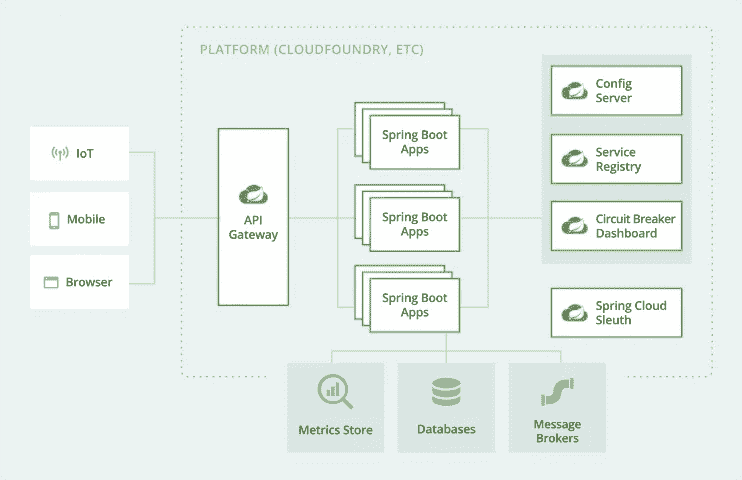
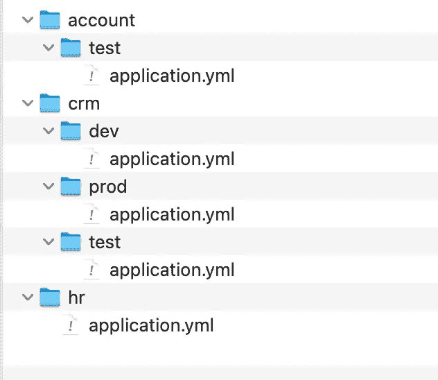

# 让我们一起学习会话:Spring 云配置服务器

> 原文：<https://medium.com/javarevisited/lets-learn-together-sessions-spring-cloud-config-server-17ecd171d86?source=collection_archive---------2----------------------->

本文揭示了如何使用 Spring Cloud Config Server 更好地管理配置，这是我们的应用程序中最重要的部分之一。


照片由 [Rima Kruciene](https://unsplash.com/@rimakruciene?utm_source=medium&utm_medium=referral) 在 [Unsplash](https://unsplash.com?utm_source=medium&utm_medium=referral) 上拍摄

O 软件世界的主要组成部分之一，甚至是我们应用程序中最常用的概念是**配置**。配置足够强大，可以改变我们的应用程序的行为。它们还提供了一种灵活的方式来管理我们的应用程序中的工作流。我使用了词语**灵活的**，因为配置既可以在内部**管理**也可以在外部管理**。**

在内部，您可以通过使用应用程序配置文件或常量类或变量，在应用程序代码库上保存您的配置。另一方面，由于不是应用程序代码库的一部分，它们可以在外部管理，使用外部配置文件，位于服务器或配置服务器(如 git-repo)或任何其他可访问的服务器上的配置映射中。

当我们说配置时，你可能会有点困惑。这就是为什么我想多解释一点。因为软件行业有很多配置；**服务器配置**、**数据库配置**、**应用配置、**等等……在本文中，我们主要关注**应用配置**包括:

*   财务应用程序中的业务或工作流程变量，如[增值税](https://ec.europa.eu/taxation_customs/what-vat_en)税率
*   基于所用框架和第三方工具的应用程序属性，例如应用程序的服务器端口
*   访问应用程序中使用的外部服务器和 API 的信息(主要是主机和端口信息),例如访问 [XE](https://www.xe.com/xecurrencydata/) 以获取最新汇率的信息
*   数据库连接、提供者和管理信息，SQL 或 NoSQL
*   超时和运行状况检查配置参数
*   弹性和回退配置(重试、断路器、隔板、时间限制器或速率限制器)
*   指标管理和仪表板配置，如 Prometheus 的 scraper 配置，用于从应用程序收集指标并将其存储在数据库中
*   应用程序日志配置等等…

现在我希望我们在单词**配置**上处于同一点。

虽然在应用程序中管理配置非常灵活，但对于开发人员来说，在应用程序中管理它们并不总是那么容易。由于这些配置是动态变量，它们可能需要在生产和其他环境中进行更改。

软件行业的最佳实践之一是将配置文件分成基于环境的配置文件。例如，我们可以在 [Spring framework](/javarevisited/10-best-online-courses-to-learn-spring-framework-in-2020-f7f73599c2fd) 中使用概要文件来管理不同环境的应用程序行为和配置。我们可以在每个环境中定义一个或多个活动的概要文件，这样 Spring 就会考虑这些活动的概要文件来运行我们的应用程序。

正如我已经说过的，您可以从内部和外部管理您的应用程序配置。但它们之间有什么区别呢？在什么情况下我们需要选择哪一个？

把你的配置**保存在内部**意味着把你的配置放在你代码库中的某个地方，这样你就可以随时轻松地访问它们。
但是在这种方法论中，你必须在每一次配置变更上操作**SDLC****(**[**软件开发生命周期**](/javarevisited/6-best-sdlc-courses-for-beginners-and-experienced-programmers-devops-and-project-managers-b8242c04d761) **)** 。

另一方面，**在外部**，您可以将您的配置保存在一个文件系统或另一个服务器上，这样您的应用程序就可以在启动时或任何需要的时候从该源获取配置文件。这种方法还支持在重启服务器后更新配置，甚至支持在不重启服务器的情况下自动刷新。

那么，我应该选择哪种方法来保存我的配置呢？这是一个棘手的问题，我们不能马上回答。您必须做的第一件事是问自己或领域专家，您希望多久更改一次配置？如果他/她说从不，那么保持这样的配置是有意义的。

如果希望经常更改这些配置，那么将这些配置保存在外部系统上是很有用的。如果有一个配置你不确定多久会被改变一次，我更喜欢将这些配置存储在外部。

这个决定取决于您的应用程序基础设施和业务预期。如果您在一个敏捷系统中工作，通常希望您有一个灵活的应用程序基础设施来应对业务变化。因此，在外部保存配置文件是一种更好的方式。

另一方面，从技术角度来看，将配置存储在外部是最受欢迎的方式。特别是考虑到**云**基础设施、 [**微服务**](/javarevisited/7-free-microservices-courses-for-java-programmers-c9b2f3a2ea7d) 以及从**传统 SDLC(瀑布等)向** [**敏捷**](/javarevisited/7-best-agile-and-scrum-online-training-courses-3b191e9b65eb) 的转变，配置文件的外部管理已经成为应用适应这些系统和流程的重要标准。 [12 Factor App](https://12factor.net/) ，其中一个流行的文档，宣称了一个 App 与云兼容的最佳实践，告诉**“在环境中存储配置”。**他们将管理配置过度应用的最佳实践解释为:

> 应用程序有时会将配置作为常量存储在代码中。这违反了要求将配置与代码严格分离的十二要素。配置在不同的部署中有很大的不同，代码则没有。

因此，我们学习了管理配置文件的最佳实践。下一步是学习如何做到这一点。对于这一点，有很多库和技术，比如由 [Kubernetes](/javarevisited/top-15-online-courses-to-learn-docker-kubernetes-and-aws-for-fullstack-developers-and-devops-d8cc4f16e773) 开发的 [ConfigMap](https://kubernetes.io/docs/concepts/configuration/configmap/) ，由 Alibaba 开发的 [Nacos](https://nacos.io/en-us/docs/what-is-nacos.html) ，由 [CFEngine](https://cfengine.com/) ， [Puppet](/javarevisited/7-best-puppet-online-courses-for-system-administrators-and-devops-engineers-889b5ab8aeca) 等等……但是在本文中，我将只尝试解释名为**Spring Cloud Config Server**的基于 Spring 的解决方案。我可以发表关于上面列出的其他配置管理技术的文章。

# 在哪里使用配置服务器？

我想你已经知道在哪里可以使用这项技术了。但是在您的应用程序中使用这项技术有一些限制。

第一个也是最重要的标准是你的后端技术。Spring 只支持**基于 JVM 的技术**，所以你必须使用 [Java](/javarevisited/10-advanced-java-books-and-courses-for-experienced-developers-b90cc1086975) 或者 [Kotlin](/javarevisited/top-5-courses-to-learn-kotlin-in-2020-dfc3fa7706d8) 作为你的后端开发语言。

另一个限制是 Spring 依赖。由于 Config Server 是 Spring Cloud 库的一部分，没有 [**Spring**](/javarevisited/top-10-free-courses-to-learn-spring-framework-for-java-developers-639db9348d25) 和**[**Spring Cloud**](/javarevisited/5-best-courses-to-learn-spring-cloud-and-microservices-1ddea1af7012)就无法使用。**

**[](https://javarevisited.blogspot.com/2018/02/top-5-spring-microservices-courses-with-spring-boot-and-spring-cloud.html)

[Spring](https://spring.io/) 对 [Spring.io 微服务](https://spring.io/microservices)拍照** 

**如果你工作的公司的技术栈是建立在微服务基础设施、 [Spring framework](https://javarevisited.blogspot.com/2018/06/top-6-spring-framework-online-courses-Java-programmers.html) 和 JVM 技术之上，你可以使用 Spring Config Server 作为你的一些应用程序的配置管理工具。**

# **从哪里开始？**

**如果您想要在您的项目中使用 Spring Config Server，您必须首先使用您的依赖项管理工具将它作为一个依赖项添加到您的项目中。如果您使用的是 [**Maven**](/javarevisited/6-best-maven-courses-for-beginners-in-2020-23ea3cba89) ，您可以将 Spring Config Server 添加到 **pom.xml** 文件中，如下所示:**

```
<dependencies>
   <dependency>
      <groupId>org.springframework.cloud</groupId>
      <artifactId>spring-cloud-config-server</artifactId>
   </dependency>
</dependencies>
```

**对于 [Gradle](/javarevisited/5-best-gradle-courses-and-books-to-learn-in-2021-93f49ce8ff8e) ，您需要将下面的命令作为依赖项添加到您的 **build.gradle** 文件中:**

```
dependencies **{** implementation group: 'org.springframework.cloud', name:  'spring-cloud-config-server'
**}**
```

**配置服务器保存应用程序所有环境的敏感数据。在某些情况下，您可以存储数据库和其他服务器访问凭证、API 密钥和许多其他配置，当黑客访问它们时，可能会对您的应用程序造成攻击。**

**因此，保护配置服务器是将 Spring Cloud Config Server 集成到您的应用程序基础设施中的一个关键点。Spring Cloud Config Server 可以很容易地与 Spring Security 集成在一起，以提供基本的认证。**

**在您的 Maven 项目中，您必须将以下依赖项添加到 pom.xml 中:**

```
<dependencies>
   <dependency>
      <groupId>org.springframework.boot</groupId>
      <artifactId>spring-boot-starter-security</artifactId>
   </dependency>
</dependencies>
```

**另一方面，您可以通过将下面的命令添加到 Gradle 项目中来集成它，如下所示:**

```
dependencies **{** implementation group: 'org.springframework.boot', name: 'spring-boot-starter-security'
**}**
```

# **如何使用 Spring Cloud Config Server？**

**要将配置管理功能与 Spring Cloud Config Server 集成，您需要一个 Spring Boot 应用程序作为您的配置服务器。此应用程序必须包括上述依赖关系。**

**首先，我们必须将 [**@EnableConfigServer** 注释](https://www.java67.com/2018/12/top-5-spring-cloud-annotations-for-java.html)添加到我们的应用程序主类中，如下所示:**

```
@SpringBootApplication
@EnableConfigServer
public class ConfigServerApplication {

    public static void main(String[] args) {
        SpringApplication.run(ConfigServerApplication.class, args);
    }

}
```

**配置服务器是一个工作在 8080 端口的 Spring Boot 应用程序，该端口是任何 [Spring Boot 应用程序](https://javarevisited.blogspot.com/2018/05/the-springbootapplication-annotation-example-java-spring-boot.html)的默认端口。在我们的例子中，让我们给它一个特定的端口，比如 9090，以区别于其他的 Spring boot 应用程序。**

```
server:
   port: 9090
```

**现在我们需要一个 Github 存储库来保存不同环境下的一个或多个应用程序的配置。您可以将这个存储库视为一个结构良好的文件目录。这个文件目录包括许多子目录，这些子目录在层次级别上表达应用程序和概要文件。**

**Spring Cloud 配置服务器以下列形式解析配置:**

```
/{application}/{profile}[/{label}]
/{application}-{profile}.yml
/{label}/{application}-{profile}.yml
/{application}-{profile}.properties
/{label}/{application}-{profile}.properties
```

**假设我们有三个服务，分别是 Crm、Account 和 Hr。例如，您可以遵循`{application}/{profile}`语法来管理存储库中的配置，如下所示:**

**[](https://www.java67.com/2017/11/top-5-free-core-spring-mvc-courses-learn-online.html)

配置存储库的文件目录** 

**在上图中，您可以看到目录模式中的第一层代表服务，而第二层包含特定应用程序的不同概要文件的配置。**

**在下一步中，我们将在配置服务器应用程序中定义必要的配置，以连接到 Git 配置存储库，并在服务启动并运行时从该存储库中解析配置。**

```
**spring:**
  **cloud:**
    **config:**
      **server:**
       ** git:**
          **uri:** https://github.com/justayar/SpringBootTemplates/
          **searchPaths:** 'app_configs/{application}/{profile}'
          **cloneOnStart:** true
```

**在上面的配置中，我们设置了引用 Git 配置存储库的***【uri】***参数。使用***“search paths”***参数，我们将公式提供给配置服务器，以解析特定服务和配置文件的配置。**

**将"***cloneon start "***设置为 true 有助于在配置服务器启动时快速识别错误配置的配置源(例如无效的存储库 URI)。有了这些配置，我们就完成了配置服务器应用程序到 Git 配置存储库的集成。**

**正如我们在文章的前一部分中提到的，使配置服务器安全是标准配置管理机制最重要的一点。此时，[春保](/javarevisited/top-10-courses-to-learn-spring-security-and-oauth2-with-spring-boot-for-java-developers-8f0222d6066d)来帮我们了。为了在配置服务器上提供基本认证，我们可以将****用户名/密码"*** 对添加到我们的配置文件中，如下所示:***

```
*spring:
  security:
    user:
      name: config_admin
      password: Pass_1234*
```

***设置好这个配置之后，我们就完成了配置服务器应用程序的实现。下一步是实现一个客户端应用程序，它使用我们已经实现的配置服务器应用程序作为配置管理工具。该应用程序必须使用 [Spring](/javarevisited/5-advanced-spring-framework-books-experienced-java-developers-should-read-in-2020-best-of-lot-2a786fc5ad31?source=collection_home---4------4-----------------------) 作为基础框架，并且在其 pom.xml 文件中具有以下 Spring Cloud Starter 配置依赖项:***

```
*<dependencies>
   <dependency>
      <groupId>org.springframework.cloud</groupId>
      <artifactId>spring-cloud-starter-config</artifactId>
   </dependency>
</dependencies>*
```

***在将依赖项添加到客户机应用程序之后，我们可以通过下一步，即将客户机应用程序连接到作为配置管理器的配置服务器应用程序。为此，我们可以将以下基本集成配置添加到我们的属性文件中(您可以使用 bootstrap.yml 或 application.yml 文件)***

```
*spring:
  cloud:
    config:
      uri: http://localhost:9000
      username: config_admin
      password: Pass_1234
  application:    
    name: ticker*
```

******“uri”***参数定义了配置服务器应用程序的基本 URL。因为我们已经向配置服务器应用程序添加了安全层，所以客户端需要[身份验证](https://javarevisited.blogspot.com/2018/01/how-http-basic-authentication-works-in.html#axzz6hhgr3Uqg)来访问它。为此，我们需要设置 ***【用户名】******【密码】*** 字段。***

***我们的配置服务器可以包含许多应用程序的配置，因此我们需要在客户端属性文件中指定应用程序的" ***name"*** ，以使配置服务器中的配置解析过程更加容易。***

***正如我们在配置服务器应用中所做的那样，我们可以定义一个特定的端口来区分我们的客户端应用和[微服务](/javarevisited/10-best-java-microservices-courses-with-spring-boot-and-spring-cloud-6d04556bdfed?source=rss-bb36d8439904------2&utm_source=dlvr.it&utm_medium=linkedin)基础设施中的其他应用。我们在下面为这个客户端应用程序定义了 9091 端口:***

```
*server:
   port: 9091*
```

***现在我们可以试试它是否有效。为了测试它，我们在客户机应用程序的属性文件上设置静态属性。我们将我们的客户端应用程序设计为一个简单的 Ticker 服务，它从 [**Cryptonator 汇率 API**](https://de.cryptonator.com/api) **获取汇率。**汇率 API 获取以下参数以返回不同货币的汇率:***

*   *****基础** —基础货币代码***
*   *****目标** —目标货币代码***
*   *****价格** —数量加权价格***

***我们可以在 Ticker 服务中使用**基本**和**目标**参数作为静态变量。另一方面，价格是一个动态变量，您可以为每个服务调用设置不同的值。***

***首先，我们可以将基本参数和目标参数添加到属性文件中，如下所示(这些是基本参数和目标参数的默认配置):***

```
*market:
  base: btc
  target: eur*
```

***在服务类中，我们可以将静态变量、base 和 target 作为参数传递给 API，方法是将这些静态变量注入一个字段。***

```
*@Service
public class CryptonatorTickerService implements TickerService {

    @Value("${market.base}")
    private String base;

    @Value("${market.target}")
    private String target;

}*
```

***现在，让我们为配置文件定义基本参数和目标参数，该文件位于 Git 配置存储库中的 ticker 目录下。***

```
*market:
  base: usd
  target: try*
```

***当我们运行 Ticker 应用程序时，我们可以看到它从 Git 配置存储库中解析了上述静态参数，并将它们作为 API 的参数注入到服务中。***

***虽然一切都很完美，但我们仍能感觉到缺少了一些东西。我们可以意识到，当相关的配置文件发生变化时，我们必须重新启动 Ticker 服务来从配置服务器获取更新的参数。此时，Spring 框架用另一个名为**[**【Spring Boot 执行器】**](https://docs.spring.io/spring-boot/docs/current/reference/html/actuator.html) 的库来帮助我们。*****

*****[Spring Boot 执行器](https://www.java67.com/2021/02/spring-boot-actuator-interview-questions-answers-java.html)通过提供额外的特性来增强 Spring 框架，以便更容易地监控和管理您的 Spring Boot 应用程序。它提供了一些基本的 HTTP 端点:*****

*   *******指标** —显示您的应用程序的当前指标，如 CPU 使用率，或使用的 JVM 内存*****
*   *******健康** —显示您的应用程序的健康状态*****
*   *******关闭** —提供一个端点来正常关闭您的应用程序*****
*   *******actuator/refresh** —提供一个端点来刷新应用程序的配置，而无需重启*****

*****要在您的 Spring Boot 应用程序中使用 Spring Actuator，您需要将它的依赖项添加到您的 [Maven](https://javarevisited.blogspot.com/2015/01/difference-between-maven-ant-jenkins-and-hudson.html#axzz6cKi4RVpi) 和 [Gradle](https://javarevisited.blogspot.com/2020/06/maven-vs-gradle-beginners-introduction.html#axzz6dHZ7oEpK) 的构建文件中，如下所示:*****

```
***<dependencies>
    <dependency>
        <groupId>org.springframework.boot</groupId>
        <artifactId>spring-boot-starter-actuator</artifactId>
    </dependency>
</dependencies>dependencies {
    implementation 'org.springframework.boot:spring-boot-starter-actuator'
}***
```

*****Spring Actuator 寻找 **@RefreshScope** 注释来识别将由刷新机制自动刷新的包。当调用 actuator/refresh 端点时，带有这些注释的类中的属性变量将自动刷新。因此，我们只将@RefreshScope 注释添加到应用程序中包含属性变量的服务类中。*****

```
***@Service
@RefreshScope
public class CryptonatorTickerService implements TickerService {

    @Value("${market.base}")
    private String base;

    @Value("${market.target}")
    private String target;

}***
```

*****当我们运行客户端应用程序时，我们可以看到它从配置服务器获得了最新的配置。我们需要在与我们的应用程序相关的 Git 配置存储库的每次更新中调用以下端点:*****

```
***http://localhost:9001/actuator/refresh***
```

*****你也可以使用下面的[卷曲命令](https://javarevisited.blogspot.com/2017/03/10-examples-of-curl-command-in-unix-and-Linux.html#axzz6bYzaddcE):*****

```
***curl localhost:9001/actuator/refresh -d {} -H “Content-Type: application/json”***
```

*****因此，我们想到了另一个问题，对于在生产环境中有许多实例的应用程序，如何轻松地管理它？根据 Spring Actuator 刷新机制下的理论，我们必须为应用程序的所有实例调用上面的命令。我知道这听起来有多艰难和愚蠢。春云也有一个解决方案，叫做 [***春云总线***](https://spring.io/projects/spring-cloud-bus) ，来解决这个复杂性。Spring 在他们的官方网站上解释如下:*****

> *****Spring Cloud Bus 使用轻量级消息代理链接分布式系统的节点。然后，这可以用于广播状态变化(例如，配置变化)或其他管理指令。AMQP 和 Kafka 代理实现包含在项目中。或者，在类路径上找到的任何[Spring Cloud Stream](https://spring.io/projects/spring-cloud-stream)binder 都将作为传输文件开箱即用。*****

*****Spring Cloud Bus 是一个有点复杂的解决方案，不是本文的一部分。我想以承诺在我的下一篇文章中详细写一个单独的故事来结束这篇文章。*****

# *****结论*****

*****配置是我们应用程序不可避免的一部分。随着微服务架构、基于云的应用甚至无服务器基础设施的出现，正确的配置管理已经成为应用的一个重要方面。*****

*****在敏捷世界中，更快地响应变化是非常关键的。不断变化的业务需求、客户期望和意想不到的环境因素不断增加了对监控和管理系统的需求。在这一点上，配置允许我们随时随地轻松地更改工作流甚至应用的行为，而无需操作 [SDLC](https://javarevisited.blogspot.com/2020/08/top-5-courses-to-learn-software.html#axzz6oQMlXxTh) 。*****

*****今天广为接受的软件开发标准，如 **12FactorApp** 提出了配置的外部管理，以提供对这些变化需求的快速响应。*****

*****在配置管理领域，不同的语言有许多可供选择的解决方案。Kubernetes 的 [ConfigMap](https://kubernetes.io/docs/concepts/configuration/configmap/) ，阿里巴巴的 [Nacos](https://nacos.io/en-us/docs/what-is-nacos.html) ，CFEngine ， [Puppet](https://puppet.com/) 只是这些解决方案中的一部分。*****

*****在本文中，我尝试了 Spring Cloud Config Server，以及如何在基于 Spring 和 Java 的项目中轻松使用它。此外，我试图用一个简单的服务器和客户机应用程序来演示它。*****

*****你可以从 [**这里**](https://github.com/justayar/SpringBootTemplates) 访问源代码。*****

# *****感谢您的阅读。随时给我反馈:)*****