# 让我们尝尝饼干

> 原文：<https://medium.com/javarevisited/lets-taste-cookies-30fd342e60cf?source=collection_archive---------1----------------------->

严格针对开发人员 **—本地托管**

我们大多数人都知道什么是[网络 Cookie](https://developer.chrome.com/docs/devtools/storage/cookies/?utm_source=devtools) 。但是以防万一，如果你不知道，一个简单的[谷歌搜索就能让它大白于天下。](https://www.google.com/search?q=web+cookie&oq=web+cookie&aqs=chrome..69i57j69i60l3.1864j0j1&sourceid=chrome&ie=UTF-8)

[](https://www.java67.com/2022/06/web-development-interview-questions.html)

由 [openai](https://beta.openai.com/docs/guides/images/introduction) 生成的图像

这个*帖子主要涵盖了*在实际*实现*一个 **cookie** 时一个开发人员可能会有的问题，而不是**在理论上阅读它们。**

**内容**

*   [饼干桌](#ed39)
*   谁能设置 Cookie？
*   [默认字段](#83fb)
*   Cookie 可以在子域中访问吗，反之亦然？
*   如何删除 Cookie？
*   饼干可以用在哪里？
*   [如何用 JavaScript 让 Cookie 不可读？](#da5f)
*   [子域集-Cookie](#c4ee)
    - [代码变更](#dd90)-
    -[无 HttpOnly 字段](#9cf6)-[有 HttpOnly 字段](#2f8d)
*   [跨域设置-Cookie](#d6ae)
*   为什么他们说饼干不安全？
*   我们如何保护 Cookie？
*   [问题和补救措施](#1939)
*   [最终拍摄](#63c8)

这篇文章是关于用一个简单的 [JavaScript](https://www.javascript.com/) 例子探索所有的领域。

> 饼干桌

[cookie 表](https://developer.chrome.com/docs/devtools/storage/cookies/?utm_source=devtools#open)有多个[字段](https://developer.chrome.com/docs/devtools/storage/cookies/?utm_source=devtools#fields)。下面是一个在本地运行的 JavaScript 应用程序示例，

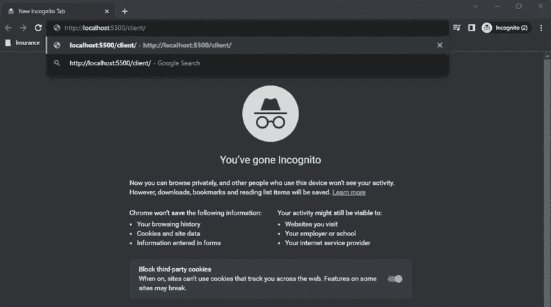

F12 —在一个开发人员工具箱中打开所有内容。导航到**应用标签**->-**Cookies**

> 谁能设置 cookie？

*   Cookie 可以在 **JavaScript** 客户端代码中设置，

```
document.cookie = 'username=hello world'
```

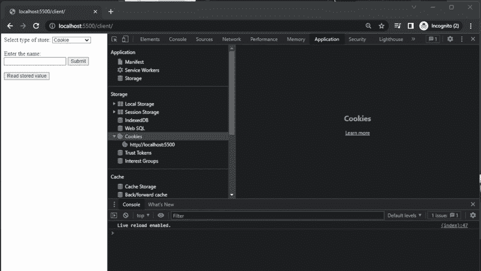

*   也可以从 **Set-cookie *头*** 中的**服务器响应**设置 Cookie，

从服务器发送的 [httpOnly](#da5f) Cookie

> 默认字段

如我们所知，有四个字段是默认的，

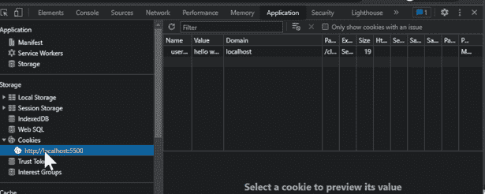

*   **域**
    这指定只有主机 **localhost** 可以读取 Cookie。如果试图从 ***访问任何其他域*** 127.0.0.1，它不会将 cookie 显示为 ***字符串* localhost！= 127.0.0.1**

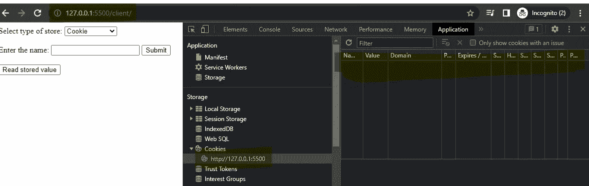

127.0.0.1 **未显示**我们之前设置的 Cookie

*   **路径
    路径**cookie 仅在**路径**集合中可见。它默认为 url 中的当前路径。

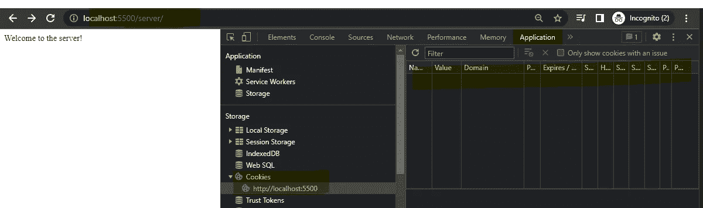

正如我们所看到的，url 路径-**/服务器**没有显示相同的 cookie

*   **Expiry/Max-age** 默认设置为 **Session** *(大部分是在浏览器关闭时，但根据浏览器和用户设置的不同而不同)* **。**当明确的**到期**或**最大年龄**被设置[时，cookie 被从](#dcd6) [cookie 表](#ed39)中移除。
*   **优先级** 优先级设置为**中。**

> 可以在子域中访问 Cookie 吗，反之亦然？

**不**由*默认*。然而，当如下所示明确设置**域**时，可以实现这一点，

```
document.cookie = 'username=suriya;domain=localhost.com'
```

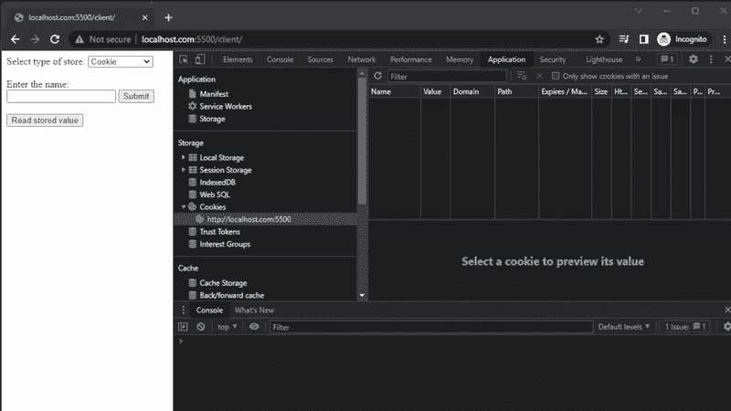

显示 cookie 级联到**子域**的示例

嗯，当 Cookie 在客户机中设置时，这样做是可行的，但是当从服务器设置了 **Cookie 并在响应中将其发送回客户机时，情况又会如何呢？**。让我们在子域和[跨域部分的](#d6ae) [**Set-Cookie**](#da5f) [中查看一下吧。](#c4ee)

> 如何删除 Cookie？

将[过期**过期日期**](https://www.w3schools.com/js/js_cookies.asp) 设置为 Cookie 键会使[的生存期](https://developer.mozilla.org/en-US/docs/Web/HTTP/Cookies#define_the_lifetime_of_a_cookie)超出界限，从而从 [cookie 表](#ed39)中删除 Cookie。

```
document.cookie = "username=; expires=Thu, 01 Jan 1970 00:00:00 UTC; path=/;";
```

> 饼干可以用在哪里？

它为无状态的 HTTP 协议记住有状态的信息。饼干[主要有三个用途](https://developer.mozilla.org/en-US/docs/Web/HTTP/Cookies#define_the_lifetime_of_a_cookie)、

*   会话管理
*   个性化
*   跟踪

> 运行同一个**域**的多个标签可以更新同一个 Cookie 密钥吗？

同一浏览器中的不同选项卡/窗口—是。Cookie 基于[域字段](https://developer.chrome.com/docs/devtools/storage/cookies/?utm_source=devtools#fields)。如果不同的选项卡运行相同的域，那么每个选项卡可以通过其**密钥**更新 *cookie 值*。

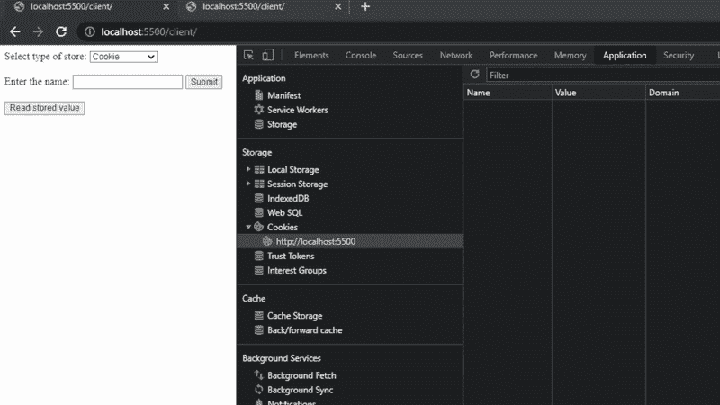

> 如何用 JavaScript 让一个 cookie 不可读？

通过客户端代码创建的 Cookies 总是可以被客户端代码读取。

然而，由**服务器响应头 *Set-Cookie*** 创建的 Cookie[***http only****字段*使得](#2f8d)Cookie[不可读](#2f8d)到 [JavaScript 像变魔术一样](https://developer.mozilla.org/en-US/docs/Web/HTTP/Cookies#restrict_access_to_cookies)。

> 子域集-Cookie

让我们来演示一下这个案例，

*   在**server.localhost.com**运行*服务器*
*   在**client.localhost.com**运行*客户端*

这里的**服务器**和**客户端**是 [Cookie 表](#ed39)中表示为****. localhost . com***的**localhost.com**的子域*

## ***代码变更***

*为了让它工作，我们需要更新我们的客户端代码***http . with credentials = true***，*

```
 *const http = new XMLHttpRequest();
    const url='https://server.localhost.com:3000/server';
    http.open("GET", url);
    http.withCredentials = true;
    http.send();*
```

*此外，我们需要设置我们的服务器代码，*

*   *接受来自起源的请求*
*   *允许访问凭据*

```
*res.setHeader('Access-Control-Allow-Origin', 'https://client.localhost.com:5500');
res.setHeader('Access-Control-Allow-Credentials', 'true');*
```

*这就要求连接要有 [**安全**](/javarevisited/ssl-certificate-67b4e3bdee38#7ec7) 的意思，服务器应用需要在 [**https**](/javarevisited/self-signed-certificate-d545d6054327#59d2) **上。***

```
*res.setHeader('Set-Cookie', 'where=server;domain=localhost.com;Secure;expires='+ getUtcTimeInSecondsFromNow(60));*
```

*检查该岗位生成**自签名** [**证书**](/@suriyaprakhash/cryptography-algorithms-e86ce7e2bb9b#41bc) ，*

*[](/javarevisited/self-signed-certificate-d545d6054327) [## 正在生成自签名证书

### 本地主机

medium.com](/javarevisited/self-signed-certificate-d545d6054327) 

**注意**客户端应用**不需要在 **https 上**。**但是，出于模拟生产环境的演示目的，在[**https**](/javarevisited/self-signed-certificate-d545d6054327#59d2)**上运行客户端也是如此。**

## ****不带 *HttpOnly* 字段****

**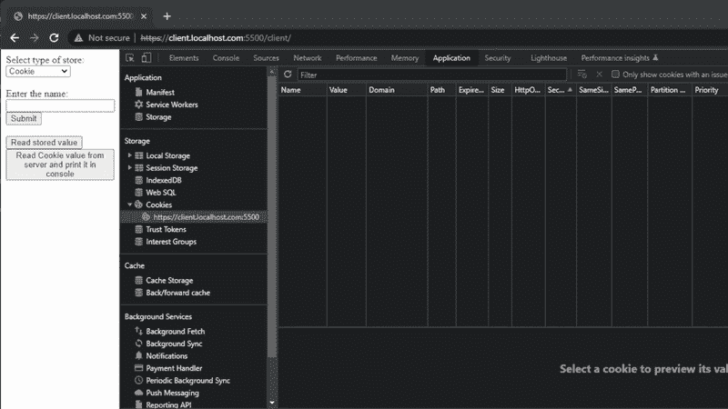**

**不带 HttpOnly 的对 **Set-Cookie** 的典型 http 调用**

**下面的截图显示，当 **HttpOnly 丢失时，对同一个域 **的*后续 http 调用***没有设置 **cookie 值**。****

**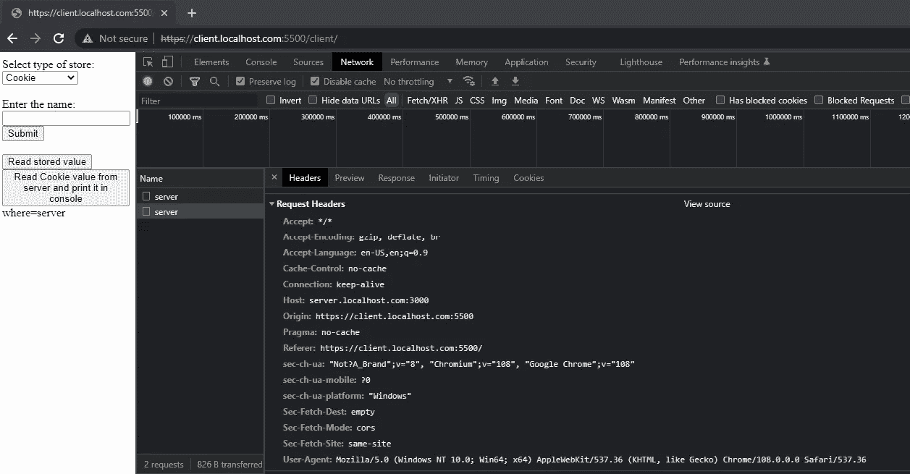**

**没有 http 的 Set-cookie **只有** cookie 在后续调用时**不会发送回服务器****

## ****带 *HttpOnly* 字段****

**下面是响应中设置的 HttpOnly 字段，**

**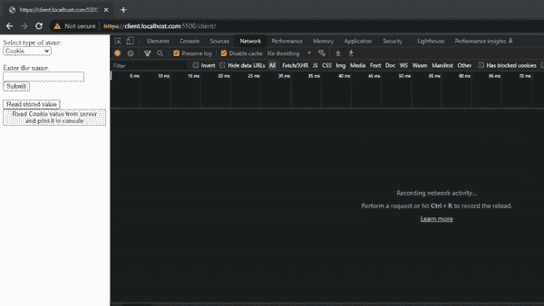**

**HttpOnly cookie**

**尽管 JavaScript 代码出现在 [Cookie 表](#ed39)中，但上面的内容使其**不可读**。**

**点击**读取存储值*按钮*** 读取时，无显示。**

****

****http only**JavaScript 中的 cookie 不可读**

**此外，只有 **HttpOnly** 的 cookie 才被发送回服务器，**

**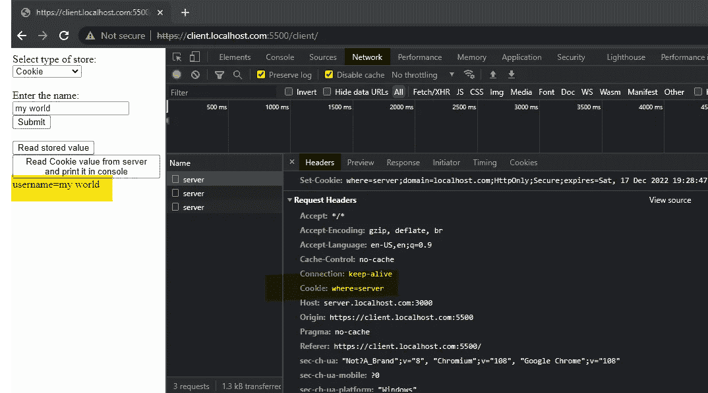**

**屏幕截图只显示了在下一次调用时，HttpOnly Cookie 被发送回服务器**

> **跨域 Set-Cookie**

**由服务器响应设置的*的**跨域**Cookie 不会出现在 [Cookie 表](#ed39)中。***

**但是，如果响应具有以下字段，它们将在后续请求中被发送到同一个域以进行进一步的服务器验证**，****

*   **[HttpOnly](#2f8d)**
*   **[安全](#dd90)**
*   **[**same site = None**](https://developer.mozilla.org/en-US/docs/Web/HTTP/Cookies#define_where_cookies_are_sent)，此处检查浏览器兼容性[。](https://developer.mozilla.org/en-US/docs/Web/HTTP/Headers/Set-Cookie/SameSite#browser_compatibility)**

**并且**下面的字段去掉了**，**

*   **[域](#4a92)到[避免浏览器验证](#bd73)**

**并且**在非匿名窗口**或[中尝试它，否则它可能要求改变用户偏好](#2aeb)。**

**出于演示目的，我们可以，**

*   **在**clienthost.net**运行*客户端***
*   **在**server.localhost.com**运行*服务器***

**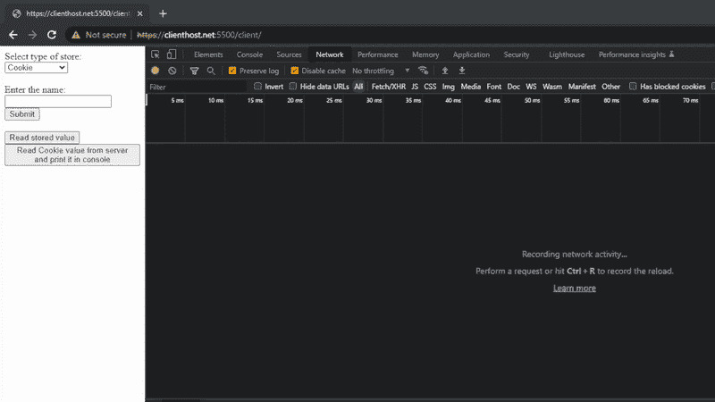**

> **为什么他们说 **Cookie** 是**不安全**？**

**Cookies 容易受到 [XSS](https://owasp.org/www-community/attacks/xss/) 和 [CSRF](https://owasp.org/www-community/attacks/csrf) 的攻击。**

> **我们如何保护 Cookie？**

**为了应对攻击并避免信息丢失，我们需要注意以下几点:**

*   **试图避免[跨域](#d6ae)，让根域通过子域处理请求。一旦我们开始使用带有 [**芯片**](https://developer.chrome.com/en/docs/privacy-sandbox/chips/) 的 **cookies，这就有可能避免。****
*   **使用 [**路径**](#93de) 并在必要时限制对客户端的访问。**
*   **使用 [**安全**](#dd90) **字段**来避免*中间人*，因为流量将在 http 上受到[安全保护。](/javarevisited/ssl-certificate-67b4e3bdee38#6ba0)**
*   **为 cookie 设置一个 [**到期**或**最大期限**](#198d) ，其中敏感信息可以按一定的时间间隔删除。**
*   **如果可能，使用 [**相同站点**到**严格**](https://developer.mozilla.org/en-US/docs/Web/HTTP/Headers/Set-Cookie/SameSite) 不允许跨域**
*   **使用 [**httpOnly** 标志来避免 JavaScript 代码在需要时访问 cookie](#2f8d) 。**

> **问题和补救措施**

## ****CORS 域名访问****

****错误**在“[https://server.localhost.com:3000/server'](https://server.localhost.com:3000/server')从原点“[https://client host . net:5500”](https://clienthost.net:5500')访问 XMLHttpRequest 已被 CORS 策略阻止:请求的资源上不存在“Access-Control-Allow-Origin”标头。**

**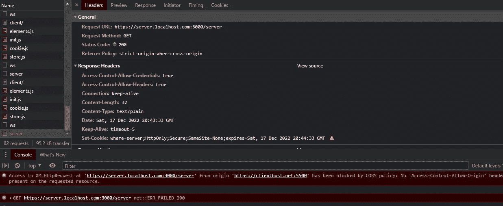**

**在**、**中增加以下**响应头****

```
 res.setHeader('Access-Control-Allow-Origin', 'https://clienthost.net:5500');
```

## **Set-Cookie 响应中的域集不正确**

****警告**通过 Set-cookie 头设置 Cookie 的尝试被阻止，因为其域属性对于当前主机 url 无效。**

**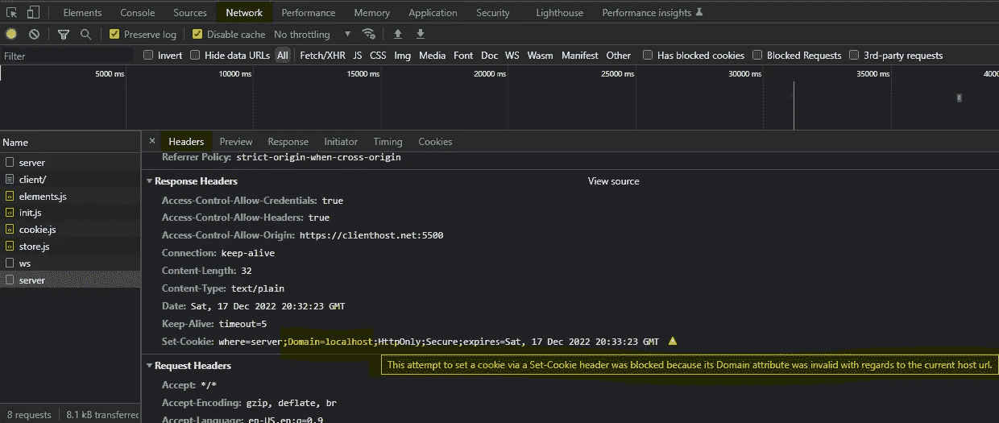**

**检查以下内容，**

*   **如果是同一个根域，url 中的[域与请求 url 的](#c4ee)域相同**
*   **在跨域的情况下查看[**same site = None**](https://developer.mozilla.org/en-US/docs/Web/HTTP/Cookies#define_where_cookies_are_sent)标志和[避免在响应](#d6ae)中传递域字段**
*   **检查 url 中的正确域名是否在 **Set-Cookie 头**中传递**

## ****由于用户偏好被阻止****

****警告**由于用户偏好，通过 Set-cookie 头设置 Cookie 的尝试被阻止。**

**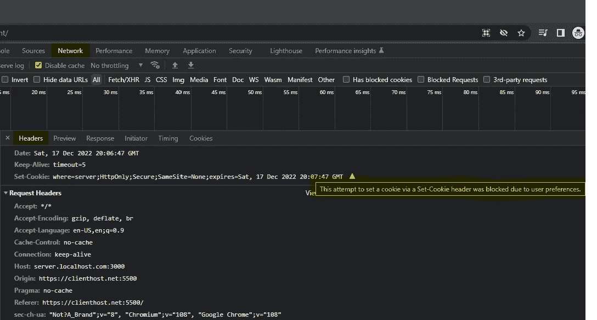**

**尝试使用**非隐名窗口**或[更改用户首选项](https://support.google.com/chrome/answer/95647?hl=en&co=GENIE.Platform%3DDesktop)的设置。**

> **最终拍摄**

****Cookies** 是*存储关于用户浏览**活动**和**偏好**的信息*的有用工具。它们可以用来*个性化用户在网站上的体验*和*跟踪用户在多个网站上的浏览活动*。**

**然而，**负责任地使用 cookie**和**尊重用户的隐私**是很重要的。这意味着**对于*如何使用 cookie*和*保持透明***，让用户能够控制如何收集和使用他们的数据。考虑将 **敏感信息**存储在 cookies 中*的安全含义也很重要。***

**一般来说，最好只在必要时使用 cookies，并尽量减少存储在其中的个人数据量。让用户选择退出 cookie 跟踪，并在不再需要时删除或阻止 cookie 也是一个好主意。**

**我们忽略的领域是，**

*   **[分区键](https://developer.chrome.com/en/docs/privacy-sandbox/chips/)**
*   **[优先级](https://bugs.chromium.org/p/chromium/issues/detail?id=232693)**

**我们将在另一篇 **localhost-ing** 帖子中讨论这个问题！***