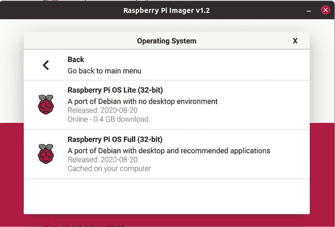
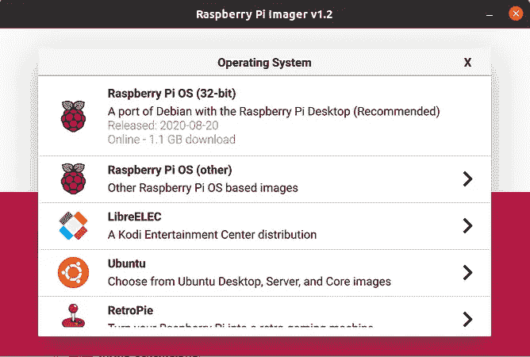
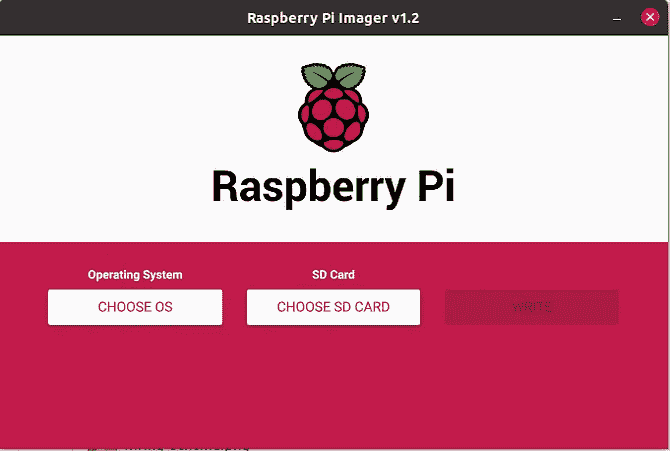
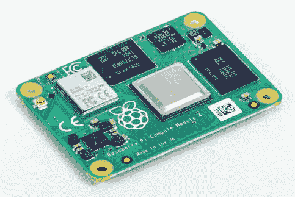
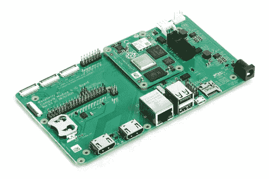
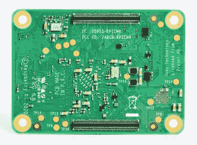
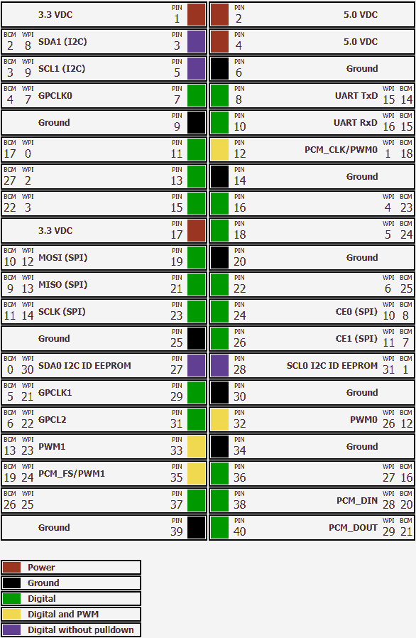
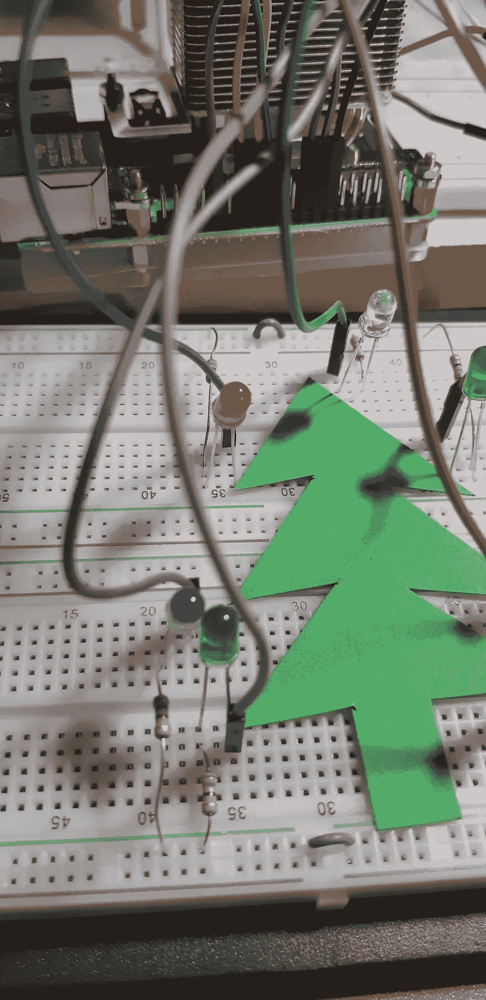
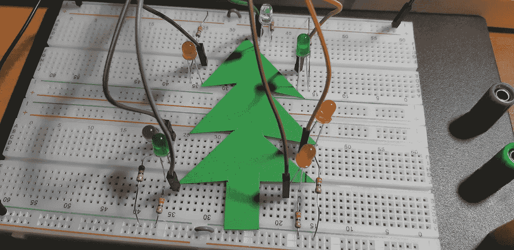
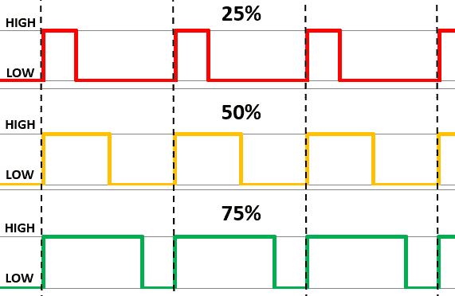

# 用 Java 和 Raspberry Pi 点亮你的圣诞之灯——JVM 降临节

> 原文：<https://medium.com/javarevisited/light-up-your-christmas-lights-with-java-and-raspberry-pi-jvm-advent-4148f99f29e5?source=collection_archive---------1----------------------->

你是一个认真的 Java 开发者，正在寻找一个有趣的项目吗？或者想学习一些全新的东西，用你的 Java 知识来控制电子元件？在这里，我们通过这个小项目向您介绍电子编程的世界！

我们要打造“Hello World”——相当于一个电子项目:一个闪烁的 LED。更具挑战性的是，不只是闪烁一个 LED，而是一棵“完整的”圣诞树，嗯…至少有 7 个闪烁的圣诞彩灯。

我们开始吧！

# 树莓派

Raspberry Pi 是一款小型主板上的全 PC。有不同的类型，但是在本文中我们将使用一个 Raspberry Pi 4 模型 B。该主板提供 3 种不同的内存大小(2、4 或 8Gb ),起价 35 美元。您可以在[产品页面](https://www.raspberrypi.org/products/raspberry-pi-4-model-b)上找到当地或在线经销商。

# 操作系统

如果你买了一个新的树莓派，确保你还有一个最小 16Gb 的迷你 SD 卡。用[成像仪工具](https://www.raspberrypi.org/software/)，可以把“树莓 Pi OS (Full)”刻录到这张卡上。这是一个完整的操作系统，基于 Debian 32bit，包含了很多工具，最重要的是 OpenJDK 11！



当您第一次启动您的主板时，您需要配置 Wifi 和一些附加设置。完成后，打开一个终端并运行`java -version`以确保您使用了正确的操作系统。

```
$ java -version 
openjdk version "11.0.9" 2020-10-20 
OpenJDK Runtime Environment (build 11.0.9+11-post-Raspbian-1deb10u1) 
OpenJDK Server VM (build 11.0.9+11-post-Raspbian-1deb10u1, mixed mode)
```

# 新产品 2020

需要提一下 2020 年(后期)发布的两款重要新品！

## 计算模块 4

计算模块是 Raspberry Pi 的特殊版本。它根本没有外围设备的连接，而是需要与一个“基板”相结合，你可以购买，也可以自己设计。该产品的目标是以合适的外形构建您自己的设备，并提供您需要的连接。

因此，它的目标不是简单的 DIY，而是作为一台基础计算机集成到专业项目中。

这个新版本 4 基于 Raspberry Pi 4，有 32 种版本可用[，有一系列 RAM 和 eMMC 闪存选项，有或没有无线连接。](https://www.raspberrypi.org/products/compute-module-4)



## 树莓派 400

这个产品让我想起了 35 年前我的第一台电脑，Commodore 64…这是一个集成了键盘的电脑！拥有 4Gb 内存的 Raspberry Pi 4 经过了重新设计，以适应官方已经存在的 Raspberry Pi 键盘。你只需要一个 SD 卡，电源，显示器和鼠标。对于 75€来说，这确实是一台神奇的机器，以低廉的预算为每个人带来了强大的计算能力。


# 安装附加工具

好了，我们有一个树莓派，下一个是什么？让我们给它添加一些开发人员的东西…

## IDE

在大多数情况下，我在 PC 上为 Raspberry Pi 开发我的应用程序，因为我更喜欢使用 IntelliJ IDEA T1，不幸的是，它不适用于 Pi。但是如果您想在 Pi 本身上工作，您可以安装带有 Java 扩展的 Visual Studio 代码，这是完全可能的！欲了解更多信息，请参阅这篇文章“[树莓 Pi 上的 Visual Studio 代码(32 和 64 位操作系统)](https://webtechie.be/post/2020-10-15-visual-studio-code-on-raspberry-pi/)”。

## 专家

我们将使用 [Maven](/javarevisited/6-best-maven-courses-for-beginners-in-2020-23ea3cba89) 在我们的 Pi 上构建应用程序，所以让我们用一个命令安装它，之后我们可以通过请求版本来立即检查安装:

```
$ sudo apt install maven 
$ mvn -v 
Apache Maven 3.6.0 
Maven home: /usr/share/maven
```

## Pi4J

为了控制 LED 灯，我们将使用 Pi4J 库，它是 Java 代码和 Raspberry Pi 上的 GPIO 引脚之间的桥梁。这些通用输入/输出引脚允许我们连接和控制电子元件。树莓皮上有 40 个这样的针，可以用于不同的目的。在这篇文章中，我们只使用它们作为输出引脚来控制 led，但还有无数其他的可能性。



为了完全支持 Pi4J 库，我们需要在板上安装一些额外的软件。同样，我们只需要一个命令就可以做到这一点:

```
$ curl -sSL [https://pi4j.com/install](https://pi4j.com/install) | sudo bash
```

## WiringPi 的更新

做好充分准备的最后一步…如果你使用的是 Raspberry Pi 4，你需要更新 WiringPi。Pi4J 使用它作为本地库来控制 GPIOs，因为在版本 4 上片上系统的架构已经改变，所以 WiringPi 的新版本([但最终版本](http://wiringpi.com/wiringpi-deprecated/))2.52 已经发布:

```
$ wget [https://project-downloads.drogon.net/wiringpi-latest.deb](https://project-downloads.drogon.net/wiringpi-latest.deb) 
$ sudo dpkg -i wiringpi-latest.deb 
$ gpio -v 
gpio version: 2.52
```

# 布线

这是一个电子项目，所以我们需要将一些组件连接到我们的 Raspberry Pi。我使用了一些基本的，你会在任何[电子初学者工具包](https://www.ebay.com/sch/i.html?_from=R40&_trksid=p2380057.m570.l1313&_nkw=electronics+starter+kit&_sacat=0)中找到的:发光二极管和 330ω电阻。结合试验板和一些电线，你可以很容易地建立一个这样的项目。

每个 LED 都连接到正极的 GPIO，并通过一个电阻连接到 LED 负极的共享地。我们之所以使用电阻，是因为 GPIOs 在假/关/低状态下以 0V 工作，在真/开/高状态下以 3.3V 工作，但大多数 led 设计用于更低的电压。

您可以计算每种 LED 类型的确切电阻值，但我们对所有 LED 使用相同的电阻值。也许它们不会完全发光，但至少我们不会烧掉它们:-)。

顺便说一下，谷歌和苹果应用商店中甚至有一个 JavaFX 移动应用程序用于这种计算，请参见“[使用 Gluon Mobile 和 GitHub 操作从单个 JavaFX 项目中为所有 PC 和移动平台构建原生应用程序](https://webtechie.be/post/2020-11-24-javafx-gluon-mobile-github-actions/)”。



# 应用程序

TL；DR；运行这些命令直接在您的 Raspberry Pi 上构建并启动应用程序:

```
$ git clone [https://github.com/FDelporte/JvmAdvent2020.git](https://github.com/FDelporte/JvmAdvent2020.git) 
$ cd JvmAdvent2020 
$ mvn package 
$ sudo java -jar target/jvm-advent-2020-1.0-SNAPSHOT-jar-with-dependencies.jar
```

# Maven 依赖性

这是一个 Maven 项目，Pi4J-library 是作为 pom.xml 中的一个依赖项添加的:

```
<dependency>
   <groupId>com.pi4j</groupId>
   <artifactId>pi4j-core</artifactId>
   <version>1.2</version>
</dependency>
```

# 脉宽调制（pulse-width modulating 的缩写）

LED 最简单的用法是打开或关闭，但我们将通过 PWM(脉宽调制)信号来使用它们。这样，我们也可以让它们从零到全亮度渐入渐出。PWM 在低电平和高电平之间快速切换。根据低电平和/或高电平状态的持续时间，可以通过创建平均值来实现“半模拟输出”。这种情况下使用的值是:

*   导通时间:输出为高电平的持续时间
*   关断时间:输出为低的持续时间
*   周期:工作时间+非工作时间
*   占空比:输出为高的时间百分比



Raspberry Pi 有几个 GPIOs 提供硬件控制的 PWM，您需要使用它来获得精确的信号。但在我们的例子中，我们将使用软件控制的 PWM，因为我们希望使用更多的 led。

要知道需要使用哪些 GPIO 号，您可以查看上面的引脚布局图并使用接线号。

## led 的初始化

在我们的代码中，我们使用了一个 GpioPinPwmOutput 列表，并添加了我们正在使用的所有引脚。引脚 32 仅支持硬件 PWM，因此需要初始化如下:

```
List<GpioPinPwmOutput> leds = new ArrayList<>(); 
leds.add(gpio.provisionSoftPwmOutputPin(
   RaspiPin.GPIO_04, "LeftGreen")); // Pin 16 
leds.add(gpio.provisionSoftPwmOutputPin(
   RaspiPin.GPIO_05, "LeftBlue")); // Pin 18 
leds.add(gpio.provisionSoftPwmOutputPin(
   RaspiPin.GPIO_06, "LeftRed")); // Pin 22 
leds.add(gpio.provisionSoftPwmOutputPin(
   RaspiPin.GPIO_10, "Top")); // Pin 24 leds.add(gpio.provisionSoftPwmOutputPin(
   RaspiPin.GPIO_11, "LedRightGreen")); // Pin 26 
leds.add(gpio.provisionSoftPwmOutputPin(
   RaspiPin.GPIO_31, "RightYellow")); // Pin 28 
leds.add(gpio.provisionPwmOutputPin(
   RaspiPin.GPIO_26, "RightRed")); // Pin 32
```

由于我们使用软件 PWM，我们还需要做一些配置:

```
int PWM_MAX = 100; 
Gpio.pwmSetMode(Gpio.PWM_MODE_MS); 
Gpio.pwmSetRange(PWM_MAX); 
Gpio.pwmSetClock(500);
```

## 全部打开或关闭

使用列表的 forEach 功能，打开或关闭所有 led 变得非常简单:

```
private static void allOff() { 
   leds.forEach(l -> l.setPwm(0)); 
} 
private static void allOn() { 
   leds.forEach(l -> l.setPwm(PWM_MAX)); 
}
```

## 衰退

通过增加或减少 PWM 值，我们可以使 led 变暗，例如，从 0 到最大值一个接一个地变暗:

```
for (GpioPinPwmOutput led : leds) { 
   for (int fade = 0; fade <= PWM_MAX; fade += fadeSteps) { 
      led.setPwm(fade); 
      Thread.sleep(speed); 
   } 
}
```

# 构建和运行

完整的代码包含了更多的 LED 方法，所以看一看它，找出已经存在的内容。从 [GitHub](/javarevisited/7-best-courses-to-master-git-and-github-for-programmers-d671859a68b2) 获取完整的 Maven 项目，打包并直接在 Raspberry Pi 上运行，命令如下:

```
$ git clone [https://github.com/FDelporte/JvmAdvent2020.git](https://github.com/FDelporte/JvmAdvent2020.git)
$ cd JvmAdvent2020
$ mvn package
$ sudo java -jar target/jvm-advent-2020-1.0-SNAPSHOT-jar-with-dependencies.jar
...
Warming up...
LEDs initialized
All flash 5 times at speed 250
All off
All on
...
One by one on and then off 5 times at speed 100
All off
All random flash 20 times at speed 500
All off
All fade at speed 50 with steps of 2
Fading all up
Fading all down
All off
Fade one by one at speed 25 with steps of 2
Fading up GPIO 4
Fading up GPIO 5
...
Fading down GPIO 31
Fading down GPIO 26
All off
Done
```

这就是应用程序的日志，正如你在本文开头的电影中看到的那样，它控制着发光二极管。

# 下一步是什么？

你不得不同意，这是一个完美的，有趣的，圣诞假期的小项目，不是吗？！

# 实验！

这只是演示 GPIOs 的一个单一用途的起点。我们仅使用引脚作为输出来控制一些 LED，但您也可以使用按钮作为输入来选择 LED 效果。或者附加更多的 led，或者用[一个芯片用更少的 gpio](https://webtechie.be/post/2019-12-18-controlling-a-led-number-display-with-javafx-and-python-on-raspberry-pi/)控制更多的 led……真的，可能性是无穷无尽的，只受限于你的想象力。

如果你创造了什么，请分享。在 Twitter 上使用标签[# JavaOnRaspberryPi](https://twitter.com/hashtag/JavaOnRaspberryPi)向世界展示 Java + Raspberry Pi 的魔力。

# 想了解更多？

今年，我出版了我的书《[在树莓派](https://webtechie.be/books/)上开始使用 Java》，以激励更多的 Java 开发人员开始尝试电子元件。当你把你的软件知识和硬件结合起来时，这是学习新东西的一个很棒很有趣的方法！Leanpub 上的电子书[和 Elektor](https://leanpub.com/gettingstartedwithjavaontheraspberrypi/) 上的纸质书[均有售。一份完美的圣诞礼物…😉](https://www.elektor.com/getting-started-with-java-on-the-raspberry-pi)


*原载于 2020 年 12 月 19 日 https://www.javaadvent.com*[](https://www.javaadvent.com/2020/12/light-up-your-christmas-lights-with-java-and-raspberry-pi.html)**。**