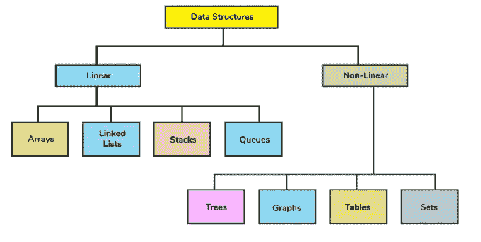

# 具有时间复杂性的线性数据结构——每个程序员都必须知道

> 原文：<https://medium.com/javarevisited/linear-data-structures-with-time-complexity-every-programmer-must-know-c58a446e06ac?source=collection_archive---------0----------------------->

图片来源:[https://cdn . discuse . board infinity . com/original/2X/d/debab 6838897d 45 c 790 FB b5 da 719 c 895483 e 5049 . png](https://cdn.discuss.boardinfinity.com/original/2X/d/debab6838897d45c790fbb5da719c895483e5049.png)

大家好。你可能已经多次遇到或读到过[数据结构](/javarevisited/50-data-structure-and-algorithms-interview-questions-for-programmers-b4b1ac61f5b0)。我正在写我自己的版本，用视觉来简化理解。在本文中，我们将详细讨论两种最流行的线性数据结构，即[数组](/javarevisited/20-array-coding-problems-and-questions-from-programming-interviews-869b475b9121)、[链表](/javarevisited/top-20-linked-list-coding-problems-from-technical-interviews-90b64d2df093)。