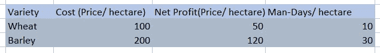

# Java 中的线性编程

> 原文：<https://medium.com/javarevisited/linear-programming-in-java-ab2289c72df9?source=collection_archive---------1----------------------->

网上有很多学习资料，也有很多博客描述什么是线性编程以及线性编程的应用。我在这里尝试的是用“ojalgo”JAVA 库来解释或讨论 JAVA 中的线性编程。

# 下面讨论的主题是:

1.  线性规划的简要基础
2.  问题描述示例
3.  java 编程解决方案
4.  估价
5.  摘要

# 线性规划的简要基础

线性规划是一种基本技术，我们使用线性函数来表示复杂的关系，以找到最佳点。详情见[链接](https://www.analyticsvidhya.com/blog/2017/02/lintroductory-guide-on-linear-programming-explained-in-simple-english/)。

线性规划中常用的术语有:

1.  决定变量:决定产出的实际变量。
2.  目标函数:做出决策的函数。
3.  约束:讨论变量的限制。
4.  非负限制:线性函数应该有非负值。

# 问题描述示例

让我们看一个例子，这个例子取自[链接](https://www.analyticsvidhya.com/blog/2017/02/lintroductory-guide-on-linear-programming-explained-in-simple-english/)。一个农民有 110 公顷土地。在那块土地上，他决定种植小麦和大麦。给定价格、净收入和劳动力需求，如下表所示。他想知道如何在 100 公顷的土地上种植每个品种，他也有 10，000 美元和 1200 人工日的可用性。他想知道最优解和最优值。



用数学(线性)形式表示它

**决策变量:**

1.  让种植小麦的总面积= *X 公顷*
2.  让种植大麦的总面积= Y 公顷

**目标函数**

农民每公顷小麦净赚 50 美元，每公顷大麦净赚 120 美元。农民的目标将是最大化他的全部作物的利润。

因此，目标函数为 *Max Z = 50X + 120Y*

**约束**

1.  农民的总体预算是 10，000 美元，因为我们从表中知道每公顷种植小麦和大麦的成本。我们必须限制开支。

可以表示为，*100 x+200y≤10000*

**2** 。总共有 1200 个人工日。表中给出了小麦和大麦每公顷的人工日。

可以表示为， *10X + 20Y ≤ 1200*

**3** 。可供使用的土地总面积为 110 公顷。

所以下面是等式: *X + Y ≤ 110*

**4** 。非负约束是，X≥ 0，Y ≥0

# java 编程解决方案

虽然有很多 java 库可以用 java 解决线性编程问题，但我只是展示了一个使用“ [Ojalgo](http://ojalgo.org/) ”库的例子。你可以免费查看下面显示的其他库。

*   【http://scpsolver.org/ 号
*   【http://javailp.sourceforge.net/ 
*   [http://www.joptimizer.com/linearProgramming.html](http://www.joptimizer.com/linearProgramming.html)
*   [http://www . win-vector . com/blog/2012/11/yet-another-Java-linear-programming-library/](http://www.win-vector.com/blog/2012/11/yet-another-java-linear-programming-library/)
*   [http://commons.apache.org/math/userguide/optimization.html](http://commons.apache.org/math/userguide/optimization.html)
*   [http://ojalgo.org/](http://ojalgo.org/)

“ojalgo”库需要一个“ExpressionBasedModel”对象来定义变量和约束。

```
ExpressionsBasedModel model = new ExpressionsBasedModel();
```

1.  定义变量

```
//*Max Z = 50X + 120Y*
Variable X = model.addVariable("Area for Wheat").weight(50);
Variable Y = model.addVariable("Area for barley").weight(120);
```

2.限制

```
//*100X + 200Y ≤ 10000*
Expression cost = model.addExpression("Cost")//
.upper(10000)//
.lower(0);
cost.set(X, 100).set(Y, 200);*//10X + 20Y ≤ 1200* Expression manDays = model.addExpression("ManDays")//
.upper(1200)//
.lower(0);
manDays.set(X, 10).set(Y, 30);*//X + Y ≤ 110*
Expression totalArea = model.addExpression("TotalArea")//
.upper(110)//
.lower(0);
totalArea.set(X, 1).set(Y, 1);
```

3.最大化 Z

关于[库](/javarevisited/20-essential-java-libraries-and-apis-every-programmer-should-learn-5ccd41812fc7)中使用的解算器类型的详细信息和文档可在[链接](http://ojalgo.org/)中找到。

```
Optimisation.Result result = model.maximise();OPTIMAL 5399.999999999999 @ { 60.00000000000001, 19.99999999999999 }############################################
Area for Wheat: 60 (50)
Area for barley: 20 (120)
0 <= TotalArea: 80.0 <= 110
0 <= ManDays: 1200.0 <= 1200
0 <= Cost: 10000.0 <= 10000
############################################
```

最优值是 5399.99 几乎等于 5400 美元；可行的方案是在 60 公顷土地上种植小麦，在 20 公顷土地上种植大麦

# 估价

求解线性规划有许多方法，其中一种方法是图解法。在[链接](https://www.analyticsvidhya.com/blog/2017/02/lintroductory-guide-on-linear-programming-explained-in-simple-english/)中用图解法解决了上述问题。通过比较图解法和 ojalgo java 库解法。两种方法的最优值是相似的。

# 摘要

正如我之前所说的，我正在试验用于线性编程的“ojalgo”Java 库。这也让我更容易学习线性编程。我需要进一步研究优化器和求解器。快乐阅读的家伙:) [github 链接](https://github.com/pooran-c/linearProgrammingJava)