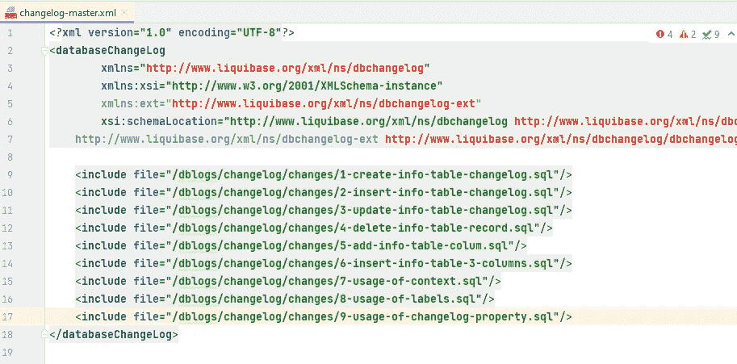
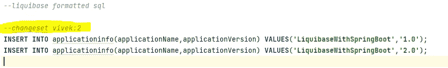
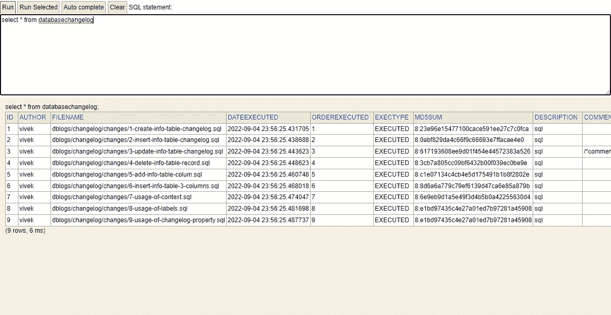
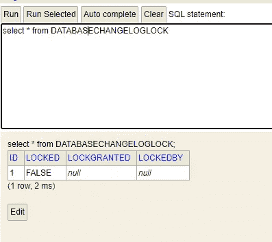
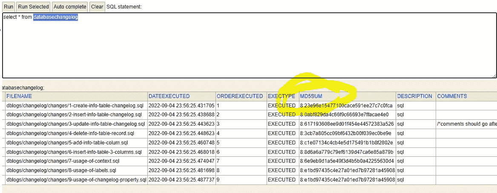
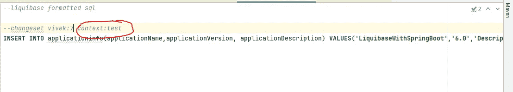
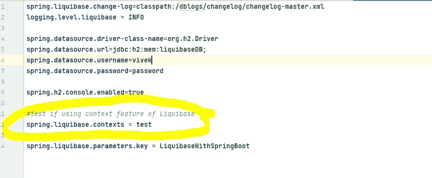

# 带跳趾的液基

> 原文：<https://medium.com/javarevisited/liquibase-with-springboot-d69e08e8bf56?source=collection_archive---------0----------------------->

## 我们将构建一个使用 Liquibase 作为数据迁移工具的应用程序。

***Git 代码链接****:*[*https://github.com/Viveksingh1313/liquibase-springboot*](https://github.com/Viveksingh1313/liquibase-springboot)

## 液态碱

Liquibase 用于发展数据库模式。数据库迁移工具有助于跨环境跟踪、版本控制和自动化数据库模式更改。随着完成持续集成和部署所需的[敏捷](/javarevisited/5-best-agile-and-scrum-books-for-programmers-and-software-developers-2bbff0a1c976)和[开发运维](/javarevisited/13-best-courses-to-learn-devops-for-senior-developers-in-2020-a2997ff7c33c)方法的兴起，将 [CI/CD](/javarevisited/7-best-courses-to-learn-jenkins-and-ci-cd-for-devops-engineers-and-software-developers-df2de8fe38f3) 应用于数据库变得前所未有的重要。

阅读更多关于进化数据库设计的信息[https://martinfowler.com/articles/evodb.html](https://martinfowler.com/articles/evodb.html)

## 项目中完成的用例:

1.创建表
2。插入一条记录
3。更新一条记录
4。删除一条记录
5。增加一列
6。插入记录
7。上下文的使用。可用于目标环境。8。标签的使用
9。反转

运行并检查应用程序(同时检查[自述文件](https://github.com/Viveksingh1313/liquibase-springboot/blob/dev/README.md)):

```
Requirement : Java18
You can change the version ac to your jdk. Just remember to change it on 
pom.xml inside java.version property.

Build the application : 
mvn clean install

Start the application : 
mvn spring-boot:run

Application link : 
localhost:8080

H2 DB Link to view all DB changes :  
http://localhost:8080/h2-console

Username/Password is vivek/password for h2 DB. You can 
change it inside application.properties.

To see changes done by this application : 
Run these sql queries :
select * from databasechangelog
select * from applicationinfo
```

您会在 src/main/Java/resources/dblogs/changelog/changes 中找到针对 DB 运行的所有脚本

[](https://javarevisited.blogspot.com/2022/02/how-to-fix-autowired-no-qualifying-bean.html)

# 关于 Liquibase 所有概念的理论解释:-

## ***Liquibase 特性:***

1.  灵活的数据库更改。 [SQL](/javarevisited/8-best-resources-to-learn-sql-online-for-free-b00506d88c91) ， [YAML](https://javarevisited.blogspot.com/2021/11/top-5-courses-to-learn-yaml-in-2022.html) ，JSON，XML 都可以。
2.  版本控制您的更改。
3.  控制何时何地部署。
4.  轻松回滚更改
5.  可以使用上下文(目标特定环境)和前提条件
6.  广泛的集成和数据库平台支持

## 关于 Liquibase 工作的信息

liquibase 的核心是一个 changelog 文件。在目录 resources/db/changelog/中创建一个名为“changelog-master.xml”的主文件。有了这个 Liquibase 将在应用程序启动时自动运行
。这个文件将引用您想要运行以更改数据库的所有脚本。下面截图中的示例:



***Changelog 格式:***

变更集由一个`author`和一个`id`属性(`author:id`)唯一地标记。`id`标记仅用作标识符，它不指示变更运行的顺序，也不必是整数。如果您不知道或不想保存实际的作者，请使用占位符值，如`UNKNOWN`。要执行变更集，您必须同时包含`author`和`id`。

以下截图为例:



在上面的变更集中，vivek 是作者，id 是 2。

***参与 Liquibase 的表:***

1.  数据库变更日志



Liquibase 使用 DATABASECHANGELOG 表来跟踪已经运行了哪些变更集。如果数据库中不存在该表，Liquibase 会自动创建一个。还提供了有关所有已运行的用于修改数据库的脚本的重要细节。

2.数据库变更锁



Liquibase 使用 DATABASECHANGELOGLOCK 表来确保一次只运行一个 Liquibase 实例。保持锁定，以便在任何时间点只能运行一个会话/实例。

> 还有一个 **Validchecksum** 的概念，用来确保你所有的旧脚本都是一样的，没有被修改过。如果您的旧脚本已经更改，那么它将具有不同的哈希值，该哈希值将与 databasechangelog 表中的列 md5sum 不匹配。

*来自官方文档:*为了检测当前 changelog 中的内容与针对数据库实际运行的内容之间的变化，Liquibase 将每个变更集条目的校验和存储在 DATABASECHANGELOG 跟踪表中。



*更改默认变更日志文件(application.yml):*

```
spring:
  liquibase:
    changeLog: "classpath:db/migration/my-master-change-log.json"
```

*禁用 liquibase :*

```
spring.liquibase.enabled=false
```

## 为什么 Liquibase 超过 Flyway

***以下是 Flyway 和 Liquibase 的共同点:***

*   使用基于迁移的方法进行数据库更改
*   在更新时，这两个工具都会检查是否已经部署了一个变更
*   从命令行或 Maven 运行
*   提供支持和增强功能，作为其开源产品的付费附件
*   使用基于 SQL 的迁移(两者都可以使用普通 SQL)
*   可重复迁移(两者都可以执行可重新运行的更改和不可重新运行的更改)

***区别 b/w Liquibase 和 Flyway***

*   Liquibase 支持广泛的数据库类型，包括 mongo、cassandra 和 redshift。相对来说比 Flyway 多。
*   Liquibase hub 是一个 UI 工具，用于团队轻松查看、组织和报告管道上的数据库开发运维指标。Flyway 没有任何这样的规定。
*   Liquibase 自 2006 年就已上市。大约有 7500 万次下载。Flway 自 2010 年以来一直在市场上拥有 5000 万次下载。
*   Flyway 使用 SQL 来定义变更。另一方面，Liquibase 可以灵活地指定不同格式的变更，包括 SQL、XML、YAML 和 JSON。
*   Flyway 需要一种特定的文件格式来跟踪变化。Liquibase 需要一个总账来跟踪变化。
*   Liquibase 和 Flyway 提供了一种回滚一切或撤消特定迁移的方法。Liquibase 是免费的，将为我们的目的服务，flyway 需要专业服务。
*   在 Liquibase 中管理跨 env 的更改看起来更容易
*   Flyway 提供基于 Java 文件的迁移。Flyway 有一个原生的 Java API。它旨在帮助我们进行更复杂的迁移，如 BLOB 和 CLOB 更改或高级批量数据更改。这个 API 在某些情况下非常有用，可能是选择 Flyway 而不是 Liquibase 的原因。
*   Liquibase 提供了一个叫做前置条件的附加功能。前提条件允许用户基于数据库的当前状态应用更改。变更集只有在通过这些先决条件后才会执行。
*   Liquibase 支持快照。Flyway 没有。使用快照，您可以比较旧的和新的模式更改。

## 标签和上下文

Liquibase 中的标签和上下文允许您在您想要定位的环境中运行脚本/变更集。在 dev、test、int、prod 之外，您可以运行您的脚本，以便在测试环境中运行。下面的例子:



然后在 application.yml 中提供一个属性:



## **最佳实践**

*   定义团队的变更集 ID 格式。(示例-vivek:1)
*   不要修改变更集
*   相反，如果现有变更集应用的变更需要
    修改，则添加新的变更集。
*   我们强烈建议每个变更集只有一个变更。这使得单个事务中的每个更改都是原子的。
*   一个变更集中的多个独立变更会产生一种风险，即一些变更被部署，而后面的变更会失败。这使得数据库处于部分部署状态，需要手动干预才能纠正。
*   如果您熟悉 SQL，并且不想学习指定数据库更改的新方法，请使用 SQL。
*   计划回滚策略。如果您使用 sql 作为 liquibase 的语言，回滚是不可能自动完成的。
*   使用 Liquibase 上下文。上下文帮助您锁定特定的环境。

***Git 代码链接****:*[*https://github.com/Viveksingh1313/liquibase-springboot*](https://github.com/Viveksingh1313/liquibase-springboot)

*希望本文对您有所帮助。您可以关注我获取更多此类内容。*

你也可以通过 [*LinkedIn*](https://www.linkedin.com/in/vivek-singh-a109b511a/) *或 vivek.sinless@gmail.com*联系我

## 参考

[https://reflectoring . io/database-migration-spring-boot-liqui base/](https://reflectoring.io/database-migration-spring-boot-liquibase/)
[https://www.codeusingjava.com/boot/liq](https://www.codeusingjava.com/boot/liq)
[https://docs . liqui base . com/concepts/changelogs/changelog-formats . html](https://docs.liquibase.com/concepts/changelogs/changelog-formats.html)
[https://docs . liqui base . com/workflows/liqui base-community/liqui base-auto-roll back . html](https://docs.liquibase.com/workflows/liquibase-community/liquibase-auto-rollback.html)
[https://docs . liqui base . com/https](https://docs.liquibase.com/concepts/changelogs/preconditions.html)