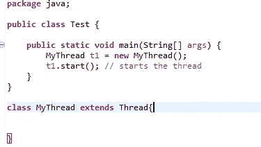

# 引擎盖下 java 的 Main 方法？

> 原文：<https://medium.com/javarevisited/main-method-of-java-under-the-hood-11ba58c7c3e8?source=collection_archive---------2----------------------->

Java 源代码

> 每当我试图通过指定类名(Java Test.java，其中 test 是类名)来执行我的 java.exe 时，它就会向操作系统请求一些内存。在这种情况下，如果请求的内存不可用，那么 [JVM](/javarevisited/7-best-courses-to-learn-jvm-garbage-collection-and-performance-tuning-for-experienced-java-331705180686) 将不会启动，错误消息将显示在屏幕上，显示为“[内存不足错误](https://javarevisited.blogspot.com/2011/09/javalangoutofmemoryerror-permgen-space.html)”。但是如果内存是可用的，那么 JVM 将被启动并执行下面提到的任务

1.  它创建线程组，如系统线程组、主线程组等等。
2.  它创建一些类似终结器的线程，并添加到相应的线程组中。终结器线程将被添加到系统线程组。

> 在这些步骤正确应用之后，现在是时候做一件叫做主线程的大事了。JVM 启动主线程，并允许它执行以下任务

1.  主线程检查指定的类文件是否可用，如果不可用，抛出错误，但如果可用，则使用字节码 verify 验证类文件格式。
2.  现在肯定有两种概率，第一类路径格式有效，第二类路径格式无效。如果无效，那么 jvm 再次抛出一个错误。
3.  如果类路径格式有效，则必须使用类加载器加载并初始化类，并且标准的 [main 方法](https://www.java67.com/2016/01/main-method-interview-questions-in-java-answers.html)“公共静态 void main(String [] args)”将被验证并加载到类文件中。
4.  现在，main 方法来完成代码逻辑的整个执行。它收集命令行参数并创建数组对象的字符串，将所有命令行参数存储到字符串数组中。
5.  通过将字符串数组作为参数传递来调用具有类名的 main 方法，并执行方法中编写的全部代码。在整个执行之后，main 方法将被销毁。