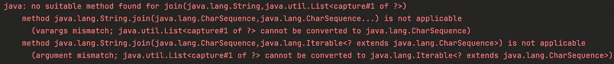

# 为我制作或追加一个字符串

> 原文：<https://medium.com/javarevisited/make-or-append-me-a-string-c654f247373a?source=collection_archive---------1----------------------->

了解如何在 Eclipse 集合中使用 makeString 和 appendString


照片由[拍摄那是她的事](https://unsplash.com/@thatsherbusiness?utm_source=medium&utm_medium=referral)在 [Unsplash](https://unsplash.com?utm_source=medium&utm_medium=referral)

# 学习形和形来学习

三年前，我为《每个 Java 程序员都应该知道的 97 件事》*这本书写了一篇文章，题目是《学会形和形要学会》。*

 *[## 学习形和形来学习

### 随着 Java 生态系统的不断发展，每个 Java 开发人员都需要不断学习新技能。Java……

medium.com](/97-things/learn-to-kata-and-kata-to-learn-73c98a69e44c)* 

*在本文中，我演示了如何用 Java 创建一个加入`Strings`的形练习。在本文中，我遍历了几个解决方案，并在此过程中进行了重构。我最终删除了我所有的解决方案，只留下了形，可以在以后解决。*

*今天就是那个日子。我现在将使用 [Eclipse 集合](https://github.com/eclipse/eclipse-collections)来解形。我会稍微修改一下这个形，让它在美国东部的秋天更有节日气氛。*

# *受秋天启发的合奏式*

*这是我将解决的形的修改测试。我用过一些让我想起秋天的表情符号。*

```
*public void joinStrings()
{
    List<String> fall = Arrays.asList("🎃", "🍎", "🍁", "🌽");
    // Join the names and separate them by ", "
    String joined = null;
    Assertions.assertEquals("🎃, 🍎, 🍁, 🌽", joined);
}*
```

*该测试目前失败。我已经使用了文章中描述的`StringJoiner`、Java Stream 和`String.join`解决方案来解决这个问题，但是我没有展示如何使用 Eclipse 集合`makeString`或`appendString`方法来解决这个问题。*

# *带 makeString 的形解*

*下面是使用`makeString`进行形练习的解决方案。*

```
*public void joinStrings()
{
    ImmutableList<?> fall = Lists.immutable.of("🎃", "🍎", "🍁", "🌽");
    // Join the names and separate them by ", "
    String joined = fall.makeString();
    Assertions.assertEquals("🎃, 🍎, 🍁, 🌽", joined);
}*
```

*`makeString`有四种重载形式。最简单的形式没有参数，并将使用`“, “`作为默认分隔符。这就是我在上面所使用的，因为这是用例所需要的。第二种形式将分隔符作为参数，我将在下面演示。*

```
*public void joinStrings()
{
    ImmutableList<?> fall = Lists.immutable.of("🎃", "🍎", "🍁", "🌽");
    // Join the names and separate them by ", "
    String joined = fall.makeString(", ");
    Assertions.assertEquals("🎃, 🍎, 🍁, 🌽", joined);
}*
```

*第三种形式的`makeString`以三个`Strings`为参数。第一个是开始`String`，第二个是分隔符，第三个是结束`String`。我将稍微修改测试以显示开始和结束`Strings`。*

```
*public void joinStrings()
{
    ImmutableList<?> fall = Lists.immutable.of("🎃", "🍎", "🍁", "🌽");
    // Join the names and separate them by ", "
    // Starting with an "[" and end with a "]"
    String joined = fall.makeString("[", ", ", "]");
    Assertions.assertEquals("[🎃, 🍎, 🍁, 🌽]", joined);
}*
```

*使用`makeString`有三种可能的解决方案。*

## *秋季融合*

*第四种重载形式的`makeString`实际上是将`collect`和`makeString`融合在一起。这种形式的`makeString`将一个`Function`作为第一个参数，它将应用于集合中的每个元素。剩下的三个参数是开始、分隔符和结束字符串。下面是第四种形式`makeString`的例子。*

```
*public void zipMakeString()
{
    var fall1 = Lists.mutable.with("🎃", "🍎", "🍁", "🌽");
    var fall2 = Lists.mutable.with("🥧", "🥧", "🍂", "🍞");
    var zipped = fall1.zip(fall2);
    String fusion = zipped.makeString(
            pair -> pair.getOne() + pair.getTwo(),
            "[",
            " + ",
            "] = Fall Fusion");
    Assertions.assertEquals(
            "[🎃🥧 + 🍎🥧 + 🍁🍂 + 🌽🍞] = Fall Fusion", 
            fusion);
}*
```

*在这个例子中，我将两个列表放在一起，然后使用指定为 lambda ( `pair -> pair.getOne() + pair.getTwo()`)的函数一起打印出元素对。*

# *带 appendString 的 Kata 解决方案*

*下面是使用`appendString`进行形练习的解决方案。*

```
*public void joinStrings()
{
    ImmutableList<?> fall = Lists.immutable.of("🎃", "🍎", "🍁", "🌽");
    // Join the names and separate them by ", "
    StringBuilder builder = new StringBuilder();
    fall.appendString(builder);
    Assertions.assertEquals("🎃, 🍎, 🍁, 🌽", builder.toString());
}*
```

*与`makeString`不同，`appendString`只有三种重载形式。它们与`makeString`的前三种形式相匹配，带有一个`Appendable`的额外必需参数。`Appendable`是 JDK 中的一个接口，有几个实现，包括`StringBuilder`。*

*我写了一篇关于 Eclipse 集合中异常处理的博客，其中包括一些使用`Appendable`接口的代码示例。*

*[](/javarevisited/exception-handling-in-eclipse-collections-9e37a68fc6a9) [## Eclipse 集合中的异常处理

### Java 8 之前和之后处理 Eclipse 集合异常的一些策略

medium.com](/javarevisited/exception-handling-in-eclipse-collections-9e37a68fc6a9) 

# 为什么用？而不是字符串

如果您注意到在 Eclipse 集合示例中，我使用了`ImmutableList<?>`而不是`ImmutableList<String>`。这是故意的。`makeString`和`appendString`都适用于任何类型，而不仅仅是`String`。您不必先将类型转换成`String`。对于我在原始文章中使用的 Java 流、`StringJoiner`和`String.join`，情况并非如此。比如我用`?`作为带`String.join`的类型，代码就不会编译。

```
public void joinStrings()
{
    List<?> fall = Arrays.asList("🎃", "🍎", "🍁", "🌽");
    // Join the names and separate them by ", "
    String joined = String.join(", ", fall);
    Assertions.assertEquals("🎃, 🍎, 🍁, 🌽", joined);
}
```

该代码将导致以下编译错误。



在 Eclipse 集合中,`makeString`和`appendString`都在集合中的每个对象上调用`toString`,所以如果`toString`是一个足够好的方法，你不必先转换它们。在 Java 中对`String`调用`toString`是一个 no op，简单地返回`this`。

# 秋天快乐！

我希望你喜欢这个博客，并对`makeString`和`appendString`有所了解。这两种方法在 Eclipse 集合中的`RichIterable`和`PrimitiveIterable`接口上都可用。这意味着 Eclipse 集合中包含的大多数类型都支持这些方法。

感谢阅读！享受余下的秋季吧！

*我是*[*Eclipse Collections*](https://github.com/eclipse/eclipse-collections)*OSS 项目的创建者和提交者，该项目由*[*Eclipse Foundation*](https://projects.eclipse.org/projects/technology.collections)*管理。Eclipse Collections 为* [*投稿*](https://github.com/eclipse/eclipse-collections/blob/master/CONTRIBUTING.md) *打开。**