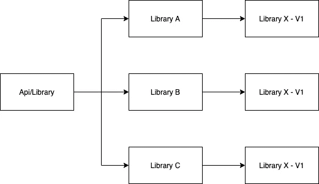
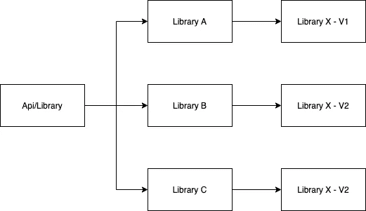
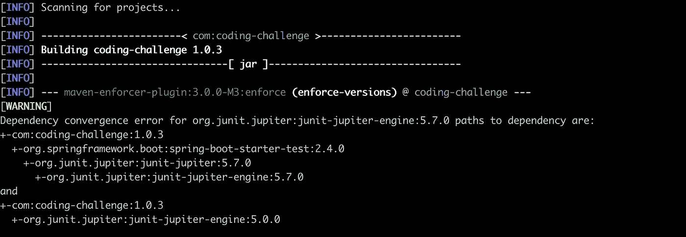

# 在 Java 中管理依赖关系

> 原文：<https://medium.com/javarevisited/manage-your-dependencies-in-java-48fee2ee5333?source=collection_archive---------2----------------------->

# 介绍

当我们处理使用 Java 的项目时，我们做的第一件事是添加我们需要使用的依赖项、库或框架。为了做到这一点，我们根据我们认为最好的项目的好处，使用依赖管理工具，如 Maven T1 或 T2 Gradle T3。

我们为项目添加的每个依赖项都包含其他依赖项；大多数开发人员都知道传递依赖这个概念。

在许多情况下，这种情况不会带来任何问题，因为我们的依赖性管理器以一种很好的方式解决了不同库之间的版本冲突。尽管如此，当我们使用我们的 API/库时，还有其他情况下这些冲突会产生一些错误。

请让我用下面的例子来阐明上述观点:

*图 1——我们的 API/library 导入了一些使用相同版本的特定库的库。*

*图 2——我们的 API/library 导入了一些使用不同版本的特定库的库。*

在图 1 的例子中，没有问题，因为所有的库都使用相同的版本，所以我们的依赖管理器不需要做任何事情来解决这个问题。

问题出现在图 2 中，因为这些库使用同一个库的不同版本，所以 [Maven/Gradle](https://javarevisited.blogspot.com/2020/06/maven-vs-gradle-beginners-introduction.html#axzz6dHZ7oEpK) 试图以最好的方式解决版本之间的冲突。在某些情况下，解决与版本的冲突会产生错误，最常见的是:"[***ClassNotFoundException***](https://javarevisited.blogspot.com/2015/06/org.postgresql.Driver-javalangclassnotfoundexception.html#axzz6v02HJQR0)"—"**MethodNotSupportedException**"—"[**NoClassDefNotFound**](https://javarevisited.blogspot.com/2018/02/how-to-fix-exception-in-thread-main.html)"，当我们的依赖管理工具采用一个没有这个特定类或方法的版本时，就会出现这种情况。

# 我该如何解决这个问题？

要解决这个问题，您有不同的方法来找到并修复它。以下是我寻找解决方案的步骤:

1.  我们需要找到哪个库产生了错误。在大多数情况下，控制台或 IDE 中的错误( [Eclipse](/javarevisited/6-free-best-eclipse-ide-courses-for-java-programmers-1229ee9e5d87) / [IntelliJ](/javarevisited/7-best-courses-to-learn-intellij-idea-for-beginners-and-experienced-java-programmers-2e9aa9bb0c05) )会显示该类的整个包，因此您可以找到包含该类的 jar。例如:
    `java.lang.NoClassDefFoundError: ch/qos/logback/core/status/WarnStatus`
2.  在错误与某个不存在的类有关的情况下，您可以使用整个包并使用 [Findjar](https://www.findjar.com/) 。这个在线搜索引擎帮助你找到一个包含一个特定类的库。
3.  根据包含该类的依赖项的名称，您可以找到该库的所有导入。要做到这一点，取决于您的依赖关系管理工具，有一些选项:
    -[**Maven**](https://javarevisited.blogspot.com/2017/06/10-maven-tips-java-developer-should-know.html)
    要查看我们项目中所有依赖关系的树， 您可以运行以下命令:***mvn dependency:tree***
    如果您想查找包含某个依赖项的库，您可以运行:***mvn dependency:tree
    -***[***grad le***](https://javarevisited.blogspot.com/2020/05/top-5-courses-and-books-to-learn-gradle.html#axzz6fk6WjYD0)要查看我们项目中所有依赖项的树，您可以运行以下命令:【T35
4.  当您发现哪些库包含导致问题的依赖项时，您需要从我们的依赖项管理文件(pom.xml 或 build.gradle)中排除所有包含不同版本依赖项的库。在某些情况下，产生错误的库不存在于依赖关系树中，因为您添加的一些库具有依赖关系标记为“ *provided* ”，所以您需要在 pom 中有这个库来修复这个问题。

当您运行您的应用程序/库并且问题出现时，您可以使用这个解决方案，但是您有另一种方法在问题发生之前检测到它。我们可以在依赖管理器中使用一个插件来检查依赖的问题。以下是每个依赖关系管理器的实现:

*   **Maven**[—https://Maven . Apache . org/enforcer/Maven-enforcer-plugin/index . html](https://maven.apache.org/enforcer/maven-enforcer-plugin/index.html)
*   格拉德勒——[https://kordamp.org/enforcer-gradle-plugin/](https://kordamp.org/enforcer-gradle-plugin/)

这些插件有很多可以使用的特性，但是在我们的例子中最重要的是 **DependencyConvergence，**它显示了库可能存在的所有问题。

当您在项目中添加这些插件之一并运行验证时，如果出现问题，控制台中会出现如下消息:

这个输出意味着这个项目有两个依赖项" *junit-jupiter-engine* "，但是版本不同。正如我之前提到的，你可以在“spring-boot-start-test”中排除依赖关系或者告诉依赖关系管理工具哪个版本需要使用它来解决这个问题。

# 结论

如果你有一个非常老的项目，并且添加了 enforce 插件，也许你会发现很多需要解决的冲突，在某些情况下，这些冲突不可能在很短的时间内解决，但是如果你创建了一个新的项目，你可以从头开始添加插件，防止将来可能出现的问题。

你可以看到有不同的选择来解决这个问题。现在由您来决定哪个解决方案是最好的。