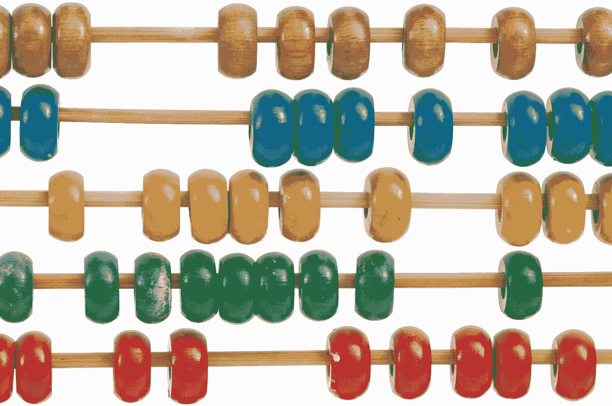
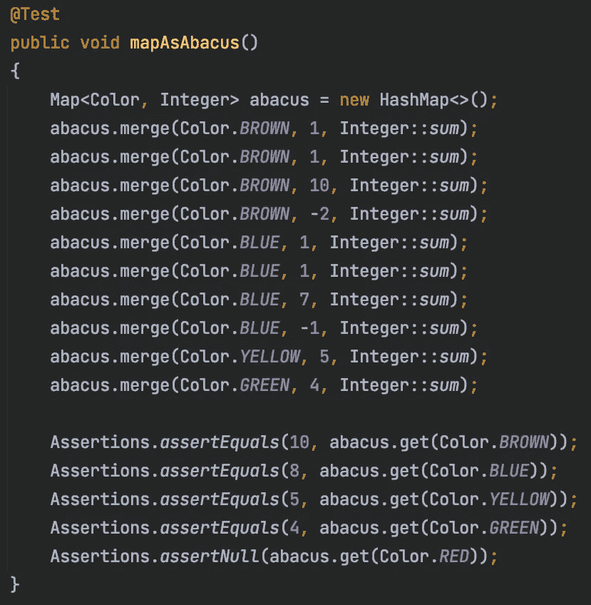
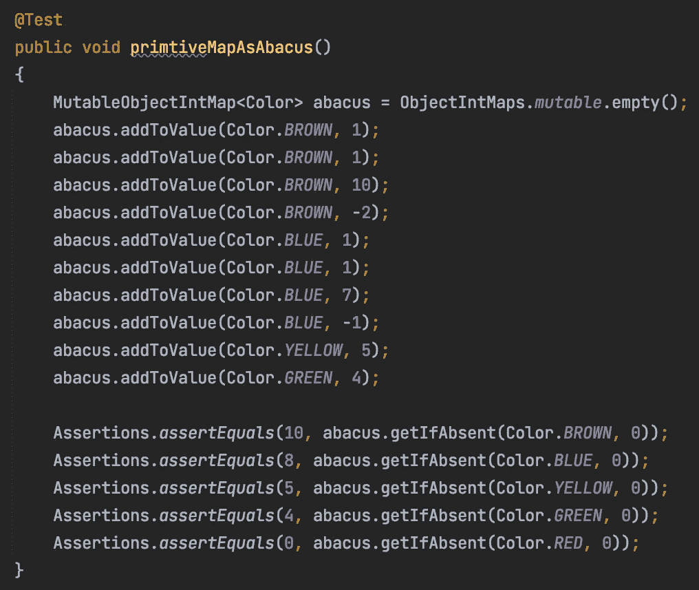
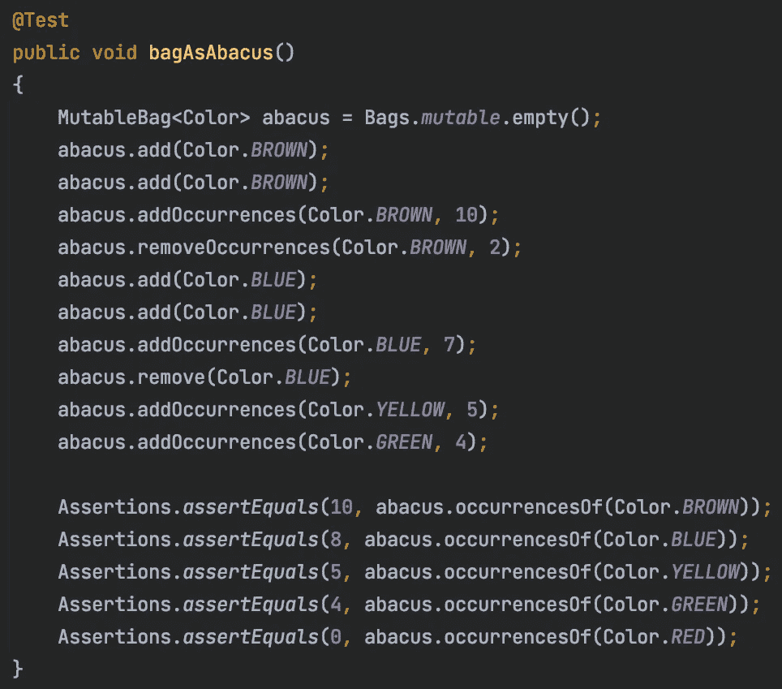

# 地图 vs .包

> 原文：<https://medium.com/javarevisited/map-vs-bag-f4120623a6e3?source=collection_archive---------1----------------------->

在 Java 中发现一种更好的计数方法。

照片由[克里斯·贾维斯](https://unsplash.com/@crissyjarvis?utm_source=medium&utm_medium=referral)在 [Unsplash](https://unsplash.com?utm_source=medium&utm_medium=referral) 上拍摄

# **用地图数算盘上的珠子**

这里有一个使用`Map`解决的简单问题。我们如何通过颜色来计算算盘上的珠子数量？首先，我将为`Color`定义一个`enum`。

算盘上不同颜色珠子的枚举

接下来，我将创建一个`HashMap<Color, Integer>`并使用`merge`方法来增加和减少特定颜色的值。我会从计数中去掉一个彩色珠子(`Color.RED`)。然后，我将断言使用`Map.get`查询`Map`的颜色计数的结果。

用地图当算盘

我用同样的`merge`运算做加减法。我用负的`Integer`值来减去。我将方法引用`Integer::sum`用于`BiFunction`参数，方法`merge`采用该参数来确定如何合并值。注意，尽管我在这里使用的是原始的文字值`int`，但是它们被自动装箱为`Map`中的`Integer`对象。，而`Integer::sum`调用将导致更多的`Integer`对象的拆箱和装箱。

在测试的最后一个断言中，用`Color.RED`实例调用`get`会返回`null`。当调用`get`时，我必须显式地将值设置为`0`，以便它返回为`0`。用`get`解决`null`返回问题的一种方法是使用`getOrDefault`代替。这将允许您在`Map`中不存在密钥的情况下返回默认值。

将地图用作算盘，使用 getOrDefault 处理空情况

`merge`和`getOrDefault`方法都是在 Java 8 中添加的，是开发人员在`Map`上理解的有用方法。

# 使用原始地图而不是地图

在 [Eclipse 集合](https://github.com/eclipse/eclipse-collections)中，有对原始地图的支持。有一个`ObjectIntMap`类型和相应的实现可以用来计数珠子。我将使用一个`MutableObjectIntMap`,这样我就可以使用`ObjectIntMaps`工厂类改变映射并创建实现。

使用可变对象图作为算盘

一个`MutableObjectIntMap`有一个`addToValue`方法，可以用来在 map 中放入一个新值，或者添加到 map 中的一个现有值。方法`getIfAbsent`可用于查找数值。`0`值是一个`int`，而不是一个`Integer`对象，并且对`addToValue`的任何调用都不会导致任何装箱。

**注意** : Eclipse 集合`HashBag`类利用了一个`MutableObjectIntMap`。

# 用袋子数算盘上的珠子

那么我如何使用来自 [Eclipse 集合](https://github.com/eclipse/eclipse-collections)的`MutableBag`来解决这个问题呢？一个`MutableBag`是一个`Collection`，不是一个`Map`。它有`add`和`remove`方法，我可以用它们来添加单个项目。`MutableBag`也有`addOccurrences`和`removeOccurrences`方法，允许一次添加特定数量的项目。

用包当算盘

对于这个用例来说，`Bag`上单独命名的方法比命名为`merge`的单个方法更能揭示意图。注意，在`Color.RED`的情况下，包将从对`occurrencesOf`的调用中返回`0`。`Bag`不会遭受`Map.get`所遭受的`null`问题。如果一个值在`Bag`中不存在，`occurrencesOf`方法总是返回`0`。

# 更多信息

还有一些博客提供了关于 Eclipse 集合中的`Bag`类型和支持方法(如`countBy`)的更多细节。以下博客由 Nikhil Nanivadekar 撰写。它描述了 Eclipse 集合中`Bag`类型的许多实现细节，这可以带来内存和性能方面的好处。

 [## 包——柜台

### 我经常遇到计算物体数量的需要。我体验到了数数的必要性…

medium.com](/oracledevs/bag-the-counter-2689e901aadb) 

我还写了一篇单独的博客，描述 Eclipse 集合中的`countBy`方法，它提供了`Bag`作为其返回类型。

 [## EC 示例:CountBy

### 了解如何在 Eclipse 集合中使用 countBy 方法。

medium.com](/oracledevs/ec-by-example-countby-a2d6411e95e1) 

我希望你喜欢阅读这篇博客，并在这个过程中学到了一些关于`Map`和`Bag`类型的有用知识！

*我是*[*Eclipse Collections*](https://github.com/eclipse/eclipse-collections)*OSS 项目在*[*Eclipse Foundation*](https://projects.eclipse.org/projects/technology.collections)*的项目负责人。* [*月食收藏*](https://github.com/eclipse/eclipse-collections) *为* [*投稿*](https://github.com/eclipse/eclipse-collections/blob/master/CONTRIBUTING.md) *。如果你喜欢这个库，你可以在 GitHub 上让我们知道。*

你可能喜欢的其他 Java 文章

 [## 2022 年 Java 程序员路线图

### 2022 年成为 Java 开发人员的图解指南，包含相关课程的链接

medium.com](/javarevisited/the-java-programmer-roadmap-f9db163ef2c2)  [## 2022 年免费在线学习 Java 的 10 个最佳地点

### 我最喜欢的免费在线学习 Java 的网站，适合初学者和想学习 Java 编码的人…

medium.com](/javarevisited/10-best-places-to-learn-java-online-for-free-ce5e713ab5b2)  [## 你应该为 2022 年的下一次 Spring Boot 面试准备的 13 个话题

### 你应该为下一次 Java 和 Spring Boot 面试准备的 13 个基本主题的列表和学习资源…

medium.com](/javarevisited/13-topics-you-should-prepare-for-your-next-spring-boot-interview-5f2993a04ff5)