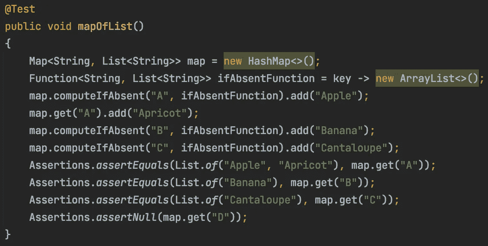
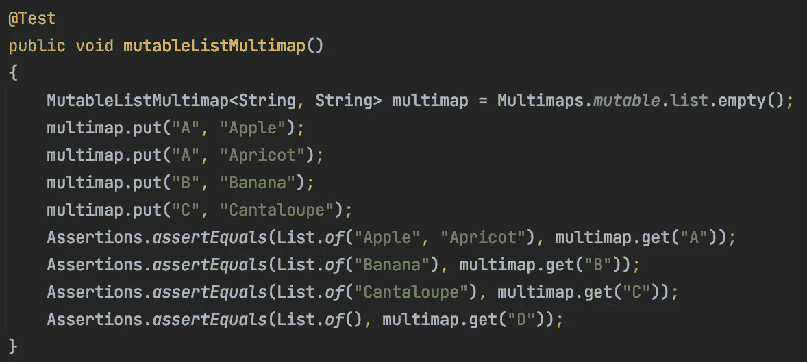
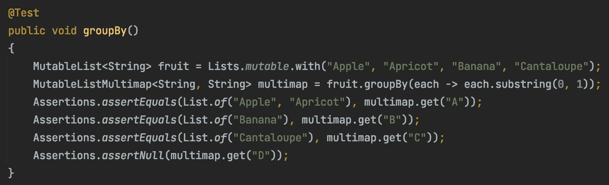

# 地图与多地图

> 原文：<https://medium.com/javarevisited/map-vs-multimap-6ea2b1b79de5?source=collection_archive---------0----------------------->

发现一种更安全的方法来代替在 Java 中将键映射到多个值。

[Mulyadi](https://unsplash.com/@mullyadii?utm_source=medium&utm_medium=referral) 在 [Unsplash](https://unsplash.com?utm_source=medium&utm_medium=referral) 上拍摄的照片

# 我需要一个有多个值的地图

在你用 Java 编码的几年中，你可能需要一个`Map<K, Collection<V>>`。如果你还不需要，给它一些时间…你会需要的。从 Java 8 开始，有更方便的方法来管理`Map`的`Collection`部分。如果你以前没有用过`computeIfAbsent`，这是一个非常值得学习的方法。下面是一个使用`computeIfAbsent`创建`Map<String, List<String>>`的例子。

使用 computeIfAbsent 动态创建映射中的值

`computeIfAbsent`的工作方式很简单。首先，它在映射中查找指定的键(例如“A”)。如果在键上没有找到值，它就评估指定的`Function`，并将结果存储在`Map`中。然后，它返回找到的值或者创建并存储在`Map`中的值。所以基本上，`computeIfAbsent`是一个带有`put`的`get`，其中`put`到`Map`的值由方法返回。这种方法将保证对于任何被查找的键总是存在一个值，但是作为`get`的替代可能是浪费的，因为在你查找一个不存在的键的情况下，它将总是导致一个`put`。

# 地图有空问题

使用`Map`的一个问题是像`HashMap`这样的实现允许`null`键、值和返回值。如果我们暂时忽略空键，那么`null`值和返回的问题是，如果你在`Map`中查找一个不存在的键，你将得到一个`null`返回。您可以尝试保护您的代码，防止在调用`get`时检查到`Map`返回 null，或者使用更安全的方法，如`getOrDefault`，在多值`Map`的默认情况下，它可能返回一个空集合。真正的解决方案是创建一个`Map`类型，它知道当调用`get`时，一个丢失的键将导致一个空的`Collection`被返回。这就是 a `Multimap`的作用。

# 不要拿多值地图开玩笑

如果你需要多值的`Map`支持，那么考虑使用来自库的`Multimap`类型，比如 [Eclipse Collections](https://github.com/donraab/eclipse-collections) 、 [Google Guava](https://github.com/google/guava) 或[Apache Commons Collections](https://commons.apache.org/proper/commons-collections/)。`Multimap`上的方法`put`将知道值是多值的，并且应该自动调用值容器上的`add`。`Multimap`上的方法`get`知道什么时候一个键不包含在`Multimap`中，应该返回一个空的`Collection`。重点是 a `Multimap`对它管理的值类型有更深入的了解。可以通过泛型向`Map`提供值类型，但是它不知道值类型必须是`Collection`的类型。

# 在 Eclipse 集合中使用多重映射

下面的代码使用来自 [Eclipse Collections](https://github.com/eclipse/eclipse-collections) 的`Multimap`类型展示了上面地图代码的等价解决方案。

首先，我创建了一个特定类型的`Multimap`，在本例中是一个`MutableListMultimap`。然后我可以简单地用每个键和值调用 put。`Multimap`知道为每个新键创建一个后备`Collection`容器(在本例中是一个`MutableList`)。最后，对`multimap.get(“D”)` 的调用返回空的`List`。这个`List`没有存储在`Multimap`中，所以 Multimap 将保持稀疏，只包含具有实际值的键。

# Eclipse 集合中的多映射类型

Eclipse 集合中有几种具体的多映射类型。有`Readable`、`Mutable`和`Immutable`接口。`Multimap`是父接口。`MutableListMultimap`是一个叶子接口。以下是可通过使用`Multimaps`工厂创建的基本具体`Multimap`类型的示例。

通过 Eclipse 集合中的多映射工厂创建多映射类型

对于`Multimap`，根据值容器有具体的类型(如`List`、`Set`、`Bag`)。对于这些类型，可能存在专门化和优化。

# GroupBy 应该返回一个 Multimap

Eclipse Collections 是目前我所知道的唯一一个 Java 库，它从每个基本的`Collection`类型的`groupBy`方法中返回一个`Multimap`。每个特定的类型，如`MutableList`或`MutableSet`，将根据其类型在其`groupBy`方法中返回适当的`Multimap`类型。`MutableList`从其`groupBy`方法中返回一个`MutableListMultimap`，`MutableSet`返回一个`MutableSetMultimap`。下面是一个在 Eclipse 集合中使用`groupBy`的例子。

在 Eclipse 集合中对可变列表使用 groupBy 会返回一个可变列表多映射

更多`groupBy`的例子，可以参考下面的博客。

</oracledevs/ec-by-example-groupby-7ca219358c3b>  

# 关于 Eclipse 集合 Multimap 的更多信息

几年前，Nikhil Nanivadekar 写了一篇关于 Eclipse 集合中多地图的博客。他对实现做了更深入的解释。

</oracledevs/multimap-how-it-works-a3430f549d35>  

# 摘要

您需要一个支持键和多值的映射吗？考虑使用 Eclipse 集合中的`Multimap`。如果您已经在使用 Eclipse 集合中的其他`Collection`类型，那么`groupBy`方法将让您轻松地创建合适的`Multimap`类型。

*我是*[*Eclipse Collections*](https://github.com/eclipse/eclipse-collections)*OSS 项目在*[*Eclipse Foundation*](https://projects.eclipse.org/projects/technology.collections)*的项目负责人。* [*月食收藏*](https://github.com/eclipse/eclipse-collections) *是开投* [*投稿*](https://github.com/eclipse/eclipse-collections/blob/master/CONTRIBUTING.md) *。如果你喜欢这个库，你可以在 GitHub 上让我们知道。*

## 您可能喜欢的其他 Java 文章

</javarevisited/the-java-programmer-roadmap-f9db163ef2c2>  </javarevisited/20-essential-java-libraries-and-apis-every-programmer-should-learn-5ccd41812fc7>  </javarevisited/21-spring-mvc-rest-interview-questions-answers-for-beginners-and-experienced-developers-21ad3d4c9b82> 